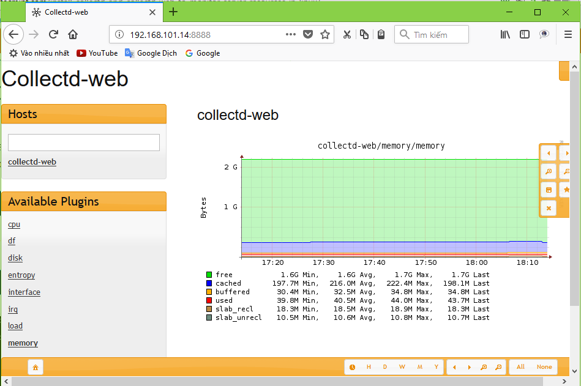
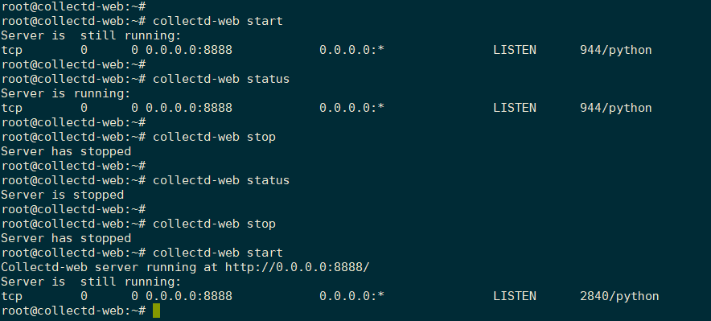
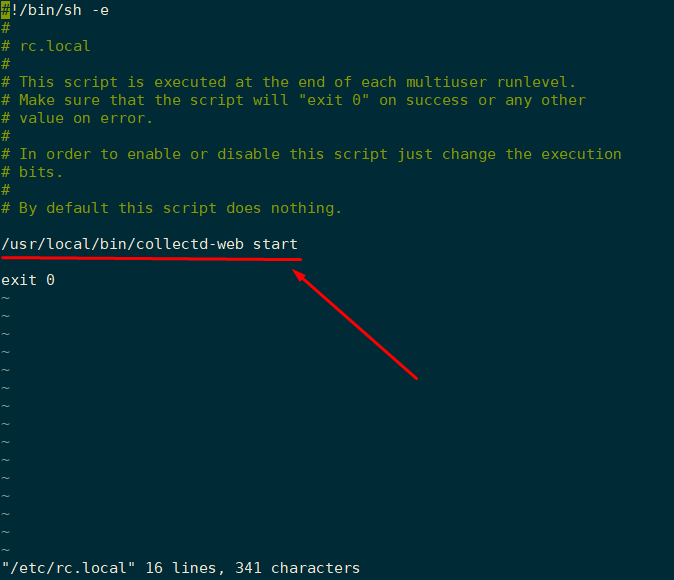
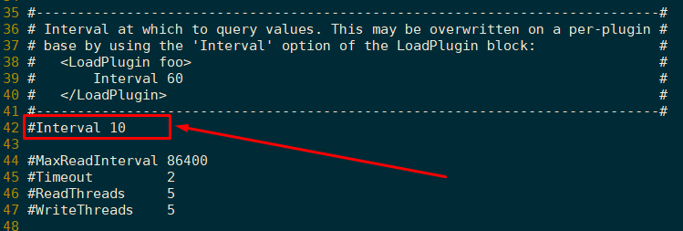

# Cài đặt Collectd và giao diện Collectd-web 

**Collectd-web** là một công cụ giám sát web front-end dựa trên RRDtool ( thông dịch và hiển thị đồ thị từ dữ liệu được thu thập bởi collectd trên các hệ thống linux).

Collecd: dịch vụ với một bộ khổng lồ các plugin đã hỗ trợ sẵn để thu thập thông số hệ thống. 

Collectd-web CGI script thông dịch và tạo ra trang thống kê đồ thị html có thể đơn giản xử lý bởi Apache CGI với chút cấu hình trên Apache server web .

Phần này thực hiện cài đặt collectd và front-end collectd-web trên Ubuntu server 16.04 với quyền của người dùng sudo hoặc người dùng root.

## Cài đặt collectd

- Cài đặt dịch vụ collectd: 

	```
	apt-get install collectd -y
	```

- Mặc định cấu hình của collectd khi mới cài đặt xong đã kích hoạt plugin `rrdtool` ghi lại metric vào các file rrd trong thư mục `/var/collectd/rrd/` nên chưa cần cấu hình gì thêm. 

## Cài đặt collectd-web 

- Cài đặt **collectd-web** và các gói phụ thuộc

	```
	apt-get install git
	apt-get install librrds-perl libjson-perl libhtml-parser-perl libcgi-session-perl –y
	cd /usr/local/
	git clone https://github.com/httpdss/collectd-web.git
	```

- Sau khi đã download reposity git về hệ thống, tới thư mục `collectd-wed` vừa tải, cấp quyền xử lý cho file `graphdefs.cgi`

	```
	cd /usr/local/collectd-web/
	ls
	chmod +x cgi-bin/graphdefs.cgi
	```

- Script chạy máy chủ Python Collectd-web được cấu hình trong file `runserver.py`, và mặc định được bind tới địa chỉ loopback (127.0.0.1)

- Để có thể truy cập giao diện Collectd-web từ một trình duyệt từ xa, cần chỉnh sửa file `runserver.py` đổi từ địa chỉ 127.0.0.1 thành 0.0.0.0 để bind tới tất cả interface của máy collectd-web:

	

 
- Nếu muốn bind tới một interface cụ thể, thay thế địa chỉ của Interface đó. 

- Mặc định collectd-web sử dụng port 8888. Giá trị này có thể thay đổi.

- Chạy thử script tạo server web và kiểm tra trên giao diện:

	```
	python runserver.py
	```

- Kiểm tra trên giao diện web: 
	
	

- Giao diện collectd-web được tạo nên bởi scripts `runserver.py`. Khi dừng tiến trình chạy scripts này thì dịch vụ collectd-web cũng ngừng hoạt động. Để tiến trình chạy như một dịch vụ ngầm trên hệ thống, thực hiện lưu lại script vào thư mục chứa file bin của hệ thống, để có thể khởi chạy dịch vụ sử dụng câu lệnh.

	- Tạo file bash script collectd-web :
		
		```
		vi /usr/local/bin/collectd-web 
		```
	
		có nội dung như sau:

		```
		#!/bin/bash
		PORT="8888"
		case $1 in
		start)
		cd /usr/local/collectd-web/
		python runserver.py 2> /tmp/collectd.log &
		sleep 1
		stat=`netstat -tlpn 2>/dev/null | grep $PORT | grep "python"| cut -d":" -f2 | cut -d" " -f1`
		if [[ $PORT -eq $stat ]]; then
		sock=`netstat -tlpn 2>/dev/null | grep $PORT | grep "python"`
		echo -e "Server is  still running:\n$sock"
		else
		echo -e "Server has stopped"
		fi
		;;
		stop)
		pid=`ps -x | grep "python runserver.py" | grep -v "color"`
		kill -9 $pid 2>/dev/null
		stat=`netstat -tlpn 2>/dev/null | grep $PORT | grep "python"| cut -d":" -f2 | cut -d" -f1`
		if [[ $PORT -eq $stat ]]; then
		sock=`netstat -tlpn 2>/dev/null | grep $PORT | grep "python"`
		echo -e "Server is  still running:\n$sock"
		else
		echo -e "Server has stopped"
		fi
		;;
		status)
		stat=`netstat -tlpn 2>/dev/null |grep $PORT| grep "python" | cut -d":" -f2 | cut -d" " -f1`
		if [[ $PORT -eq $stat ]]; then
		sock=`netstat -tlpn 2>/dev/null | grep $PORT | grep "python"`
		echo -e "Server is running:\n$sock"
		else
		echo -e "Server is stopped"
		fi
		;;
		*)
		echo "Use $0 start|stop|status"
		;;
		esac
		```

		Sau khi đã tạo script collectd-web, thêm quyền xử lý để có thể chạy file script này. Sau đó, bạn có thể sử dụng lệnh collectd-web để khởi động, ngừng và xem trạng thái hoạt động của collectd-web:

		``` 
		# chmod +x /usr/local/bin/collectd-web 
		# collectd-web start 
		# collectd-web status
		# collectd-web stop
		```

		

		Để khởi động dịch vụ web collectd-web cùng hệ thống, mở file /etc/rc.local và chỉnh sửa thêm dòng lệnh chạy collectd-web: 

		

		Khi đó, sau khi hệ thống khởi động, dòng lệnh trên sẽ được thực hiện và dịch vụ collectd-web cũng được khởi động luôn. 

## Cấu hình collectd

Cấu hình collectd trong file cấu hình: `/etc/collectd/collectd.conf`

-	Cấu hình chu kì thời gian collectd thu thập metrics. 

	

## Tham khảo

[1] https://collectd.org/ 

[2] https://www.tecmint.com/install-collectd-and-collectd-web-to-monitor-server-resources-in-linux/