# Cài đặt Graphite kết hợp Collectd

### ***Mục lục***

[1.	Cài graphite server](#1)

- [1.1.	Cài đặt các thành phần của graphite](#1.1)

- [1.2.	Cài đặt và cấu hình PostgreSQL](#1.2)

- [1.3	Cấu hình Graphite-web](#1.3)

- [1.4.	Cấu hình Carbon](#1.4)

- [1.5.	Cấu hình Apache](#1.5)

[2.	Cài đặt và cấu hình collectd](#2)

[3.	Sử dụng Graphite-web](#3)

- [3.1.	Giao diện Graphite](#3.1)

- [3.2.	Thêm user vào Graphite](#3.2)

- [3.3. Tạo đồ thị và lưu lại](#3.3)

- [3.4.	Tạo giao diện dashboards kết hợp nhiều đồ thị](#3.4)

[4.	Một số hàm của graphite](#4)

[5. Tham khảo](#5)

---

Hướng dẫn cài đặt graphite và collectd trên Ubuntu 16.04

Mô hình thực hiện như sau:

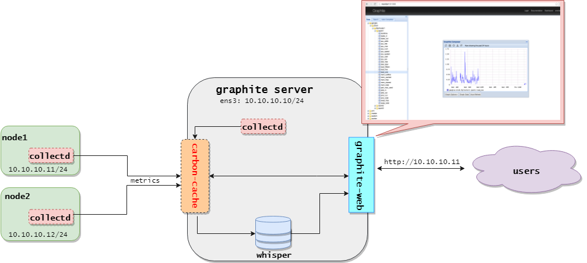

<a name = '1'></a>
## 1.	Cài graphite server 

<a name = '1.1'></a>
### 1.1.	Cài đặt các thành phần của graphite

- Graphite bao gồm nhiều thành phần: ứng dụng graphite web, backend lưu trữ carbon và thư viện cơ sở dữ liệu whisper. Các thành phần đều có sẵn trên kho phần mềm của Ubuntu. Cài đặt các thành phần của graphite server dễ dàng sử dụng câu lệnh sau:

	```
	apt-get install graphite-web graphite-carbon -y
	```

<a name = '1.2'></a>
### 1.2.	Cài đặt và cấu hình PostgreSQL

- Ứng dụng graphite web là ứng dụng python cần PostgreSQL để lưu dữ liệu của nó. Cài đặt PostgreSQL và các gói phụ trợ bằng lệnh sau:

	```
	apt-get install postgresql libpq-dev python-psycopg2 -y
	```

- Sau khi cài đặt PostgreSQL, tạo người dùng và cơ sở dữ liệu cho Graphite sử dụng:

	- Đầu tiên, đăng nhập vào PostgreSQL shell:

		```
		sudo -u postgres psql
		```

	- Tạo người dùng `graphite_user` và bảo mật với password:

		```
		postgres=# CREATE USER graphite_user WITH PASSWORD 'password123'; #nhap password cua ban vao vi tri 'password123'
		```

	- Tiếp theo, tạo database `graphite_db` với chủ là người dùng `graphite_user` vừa tạo:

		```
		postgres=# CREATE DATABASE graphite_db WITH OWNER graphite_user;
		```

- Kiểm tra lại:

	```
	postgres=# \l
	                                List of databases
	    Name     |     Owner     | Encoding | Collate | Ctype |   Access privileges
	-------------+---------------+----------+---------+-------+-----------------------
	 graphite_db | graphite_user | LATIN1   | en_US   | en_US |
	 postgres    | postgres      | LATIN1   | en_US   | en_US |
	 template0   | postgres      | LATIN1   | en_US   | en_US | =c/postgres          +
	             |               |          |         |       | postgres=CTc/postgres
	 template1   | postgres      | LATIN1   | en_US   | en_US | =c/postgres          +
	             |               |          |         |       | postgres=CTc/postgres
	```

- Thoát khỏi shell PostgreSQL:


	```
	postgres=# \q
	```

<a name = '1.3'></a>
### 1.3.	Cấu hình Graphite-web

- Sau khi đã thiết lập cơ sở dữ liệu PostgresSQL  để lưu các thông tin và quyền của user, group và cấu hình dashboard và các sự kiện dữ liệu cho Graphite-web. Để sử dụng database vừa tạo, cần cấu hình graphite trong file cấu hình: `/etc/graphite/local_settings.py` như sau:

	- Cấu hình bảo mật: bỏ comment dòng `SECRET_KEY` và thay thế bằng giá trị khóa bất kì của bạn (giá trị tùy ý):

		```
		SECRET_KEY = 'my_very_long_and_difficult_key'
		```

	- Tiếp theo cấu hình timezone phù hợp với vị trí của bạn:

		```
		TIME_ZONE = 'Asia/Ho_Chi_Minh'
		```

	- Cấu hình xác thực cho phép lưu trữ đồ thị dữ liệu, bỏ command dòng sau:

		```
		USE_REMOTE_USER_AUTHENTICATION = True
		```
	
	- Sửa thông tin cấu hình DATABASE sử dụng database PostgresSQL vừa tạo:

		```
		DATABASES = {
		'default': {
		   'NAME': 'graphite_db',
		   'ENGINE': 'django.db.backends.postgresql_psycopg2',
		   'USER': 'graphite_user',
		   'PASSWORD': 'graphite_user_password', #truong hop nay la: password123
		   'HOST': 'localhost',
		   'PORT': ''
		   }
		}
		```

	- Lưu lại file. 

- Tiếp theo, chạy các lệnh sau để đồng bộ database :

	```
	graphite-manage migrate auth
	graphite-manage syncdb
	```

- Trong quá trình đồng bộ, bạn sẽ được yêu cầu tạo tài khoản superuser cho database như sau:

	```
	You have installed Django's auth system, and don't have any superusers defined.
	Would you like to create one now? (yes/no): yes
	Username (leave blank to use 'root'):
	Email address: ttp@gmail.com
	Password:
	Password (again):
	Superuser created successfully.
	```

<a name = '1.4'></a>
### 1.4.	Cấu hình Carbon

#### Cấu hình graphite-carbon 

- Cấu hình cho Carbon là thành phần storage backend của Graphite, sửa trong file cấu hình dịch vụ `/etc/default/graphite-carbon`

- Thiết lập kích hoạt carbon-cache khởi động cùng hệ thống:

	```
	CARBON_CACHE_ENABLED=true
	```

- Kích hoạt ghi log hàng ngày, nếu carbon bị vô hiệu hóa thì sau khi hoạt động trở lại nó sẽ tự đọng mở lại file cũ và ghi tiếp dữ liệu vào đó bằng cách sửa dòng sau thành True trong file `/etc/carbon/carbon.conf`:

	```
	ENABLE_LOGROTATION = True
	```

- Lưu lại file sau khi thay đổi.

#### Cấu hình carbon-schemas.conf

- Cấu hình file storage schema để Carbon biết cách tổng hợp các giá trị metric và cách lưu các giá trị đó trong file:  	`/etc/carbon/storage-schemas.conf ` (File này điểu khiển các chính sách lưu trữ cho tất cả các metric. Mỗi section đều chứa một pattern và một hoặc nhiều retentions để quy định khoảng thời gian lấy dữ liệu của carbon.)

- Phần pattern mô tả các mẫu dể khớp với tên metric. Phần retention mô tả độ chính xác và khoảng thời gian để lưu mỗi điểm dữ liệu. Các giá trị này có thể được biểu diễn dưới dạng số nguyên hoặc mô tả thời gian bằng các đơn vị: giây (s-seconds), phút (m-minutes), giờ (h-hours), ngày (d-days), tuần (w-weeks) và năm (y-years). Mô tả theo từng tháng không được hỗ trợ bởi nó chứa số ngày không đều nhau. Các biểu thức sau đây là tương đương nhau:

	10:604800  
	10s:7d  
	10seconds:1week  

- Carbon sẽ dùng thông tin trong này để so sánh cá metric với pattern và nói với whisper tần suất lưu các điểm dữ liệu 

- Ví dụ cách cấu hình section : 

	```
	[garbage_collection]
	pattern = garbageCollections$
	retentions = 10s:14d
	```

	- Tên section là : `garbage_collection`

	- Phần pattern dùng để match với bất kì metric nào mà kết thúc với `garbageCollections` (khớp với phần postfix của metric được gửi đến từ collectd). Ví dụ:
		
		`com.acmeCorp.instance01.jvm.memory.garbageCollections` sẽ khớp với pattern này còn   
		`com.acmeCorp.instance01.jvm.memory.garbageCollections.full` sẽ không khớp.

	- Dòng retention mô tả cách lấy các điểm dữ liệu đại diện trong vòng 10s, và giữ các điểm dữ liệu đó trong vòng 14 ngày. 

- Một cách mô tả retentions khác là: `seconds-per-datapoint:count-of-datapoints` (số giây để lấy một điểm dữ liệu:số điểm dữ liệu)

	```
	retentions = 60:1440
	```

	60 tương ứng với số giây lấy mỗi điểm dữ liệu, và 1440 tương ứng với số điểm dữ liệu tối đa lưu trữ. Cách mô tả này yêu cầu những phép toán phức tạp không cần thiết nên nếu có thể thì nó không được khuyên dùng.

- Mặc định, trong file cấu hình `carbon-schemas.conf` đã có các section mặc định sau:

	```
	[carbon]
	pattern = ^carbon\.
	retentions = 60:90d

	[default_1min_for_1day]
	pattern = .*
	retentions = 60s:1d
	```

	section `[default_1min_for_1day]` sẽ được match với tất cả các metric mà không khớp với section nào cả.

- Thêm section node1 để xử lý các metric sẽ đến từ node 1 trong mô hình triển khai như sau:

	```
	[node_1]
	pattern = ^node1
	retentions = 1s:1h,10s:1d,1h:1d
	```

	Lưu lại và đóng file.

####  Cấu hình storage-aggregation 

- Việc tích hợp (Aggregation) xảy ra khi Graphite tạo ra một bản ít chi tiết hơn của một metric và hành vi của nó được tính theo mặc định là lấy trung bình các điểm dữ liệu thu thập được. Để sửa các mà Carbon tích hợp các điểm, sửa trong file `storage-aggregation.conf`:

- Coppy file cấu hình mẫu:

	```
	cp /usr/share/doc/graphite-carbon/examples/storage-aggregation.conf.example /etc/carbon/storage-aggregation.conf
	```

- Cuối cùng khởi động lại dịch vụ Carbon bằng lệnh sau:

	```
	systemctl start carbon-cache
	```

<a name = '1.5'></a>
###  1.5.	Cấu hình Apache 

- Cài đặt Apace web server để sử dụng giao diện của Graphite web. Bạn có thể cài đặt Apache bằng lệnh sau:

	```
	apt-get install apache2 libapache2-mod-wsgi -y
	```

- Copy file cấu hình graphite mẫu vào thư mục cấu hình của Apache:

	```
	cp /usr/share/graphite-web/apache2-graphite.conf /etc/apache2/sites-available/
	```

- Sau khi cài đặt hoàn tất, vô hiệu hóa file cấu hình web mặc định của Apache và kích hoạt cho graphite như sau:

	```
	a2dissite 000-default
	a2ensite apache2-graphite
	```

- Cuối cùng, khởi động lại dịch vụ Apache để áp dụng các thay đổi trên:

	```
	systemctl restart apache2
	```

Vậy là hoàn thành cài đặt và cấu hình Graphite server, kiểm tra trên trình duyệt tại URL : http://10.10.10.10/

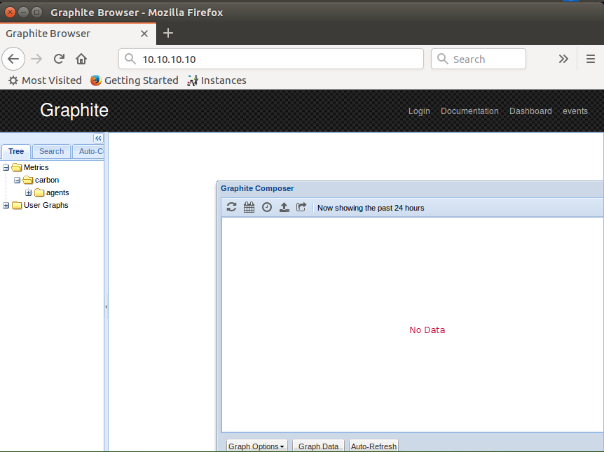


<a name = '2'></a>
## 2.	Cài đặt và cấu hình collectd

- Collectd là một daemon thu thập các thông số metric hoạt động của hệ thống và các ứng dụng theo chu kì và cung cấp các cơ chế lưu trữ các giá trị đó theo nhiều cách khác nhau.

- Lý do chọn Collectd là công cụ thu thập metric gửi về cho Graphite hiển thị là do: Collectd được viết bằng C để có được hiệu suất và tính di động, cho phép nó có thể chạy được trên các hệ thống mà không có script hoặc daemon cron, như các hệ thống nhúng. Đồng thời, nó có các tính năng tối ưu hóa và xử lý hàng trang ngàn metric. Có tới hơn 100 plugin khác nhau, từ các trường hợp chuẩn thông thường tới các trường hợp chuyên biệt và cao cấp hơn. Collectd cung cấp các tính năng mạng mạnh mẽ và có thể mở rộng theo nhiều cách. Và không kém phần quan trọng là collectd được phát triển rất nhanh có hỗ trợ ghi chép đầy đủ. 

- Nhưng cũng có hạn chế đó là: Nó không thể tạo ra đồ thị từ metric thu thập được. Do đó, collectd được kết hợp với các công cụ dùng để xử lý các metric đó và sinh ra đồ thị biểu diễn cho người dùng từ các metric mà collectd cung cấp.

- Các bước cài đặt và cấu hình Collectd:

- Cài đặt:

	```
	apt-get install collectd collectd-utils -y
	```

- Cấu hình:

	- File cấu hình Collectd là file: `/etc/collectd/collectd.conf`

	- Collectd ban đầu mặc định đã bỏ comment và hỗ trợ thu thập các thông số sau:

		```
		LoadPlugin battery
		LoadPlugin cpu
		LoadPlugin df
		LoadPlugin disk
		LoadPlugin entropy
		LoadPlugin interface
		LoadPlugin irq
		LoadPlugin load
		LoadPlugin memory
		LoadPlugin processes
		LoadPlugin rrdtool
		LoadPlugin swap
		LoadPlugin users
		```

	- Một số plugin khác cần phải được bỏ comment tại các dòng LoadPlugin và cấu hình ở các section Plugin tương ứng của chúng để hỗ trợ thu thập thông số mà người dùng muốn.

	- Ví dụ: kích hoạt Plugin Ping, thực hiện bỏ comment dòng: 	`LoadPlugin ping` và sửa các yêu cầu trong section Plugin ping tương ứng như sau:

		```
		<Plugin ping>
		Host "192.168.3.11"
		Host "10.10.10.1"
		Interval 1.0
		Timeout 0.9
		TTL 255
		MaxMissed -1
		</Plugin>
		```

		Plugin này sẽ theo dõi độ trễ, lượng gói mất và độ lệch khi hệ thống ping tới IP  192.168.3.11 (nhiều dòng "Host" có thể được thêm để theo dõi nhiều đích IP hoặc tên miền khác), gửi bản tin ICMP echo mỗi giây. (Interval)

- Sau khi chỉnh một số Plugin mong muốn, để đẩy các metric mà collectd thu thập được lên Graphite server xử lý và hiển thị, cần kích hoạt Loadplugin `write_graphite` bằng cách bỏ comment trong file `/etc/collectd/collectd.conf`:

	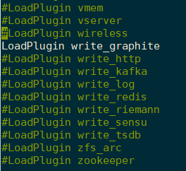

- Plugin `write_graphite` là một project thu thập metric nguồn mở, kết nối tới Carbon, lớp dữ liệu của Graphite, thông qua kết nối TCP hoặc UDP và gửi dữ liệu thông qua giao thức "line based" (thường là sử dụng cổng 2003). Dữ liệu sẽ được gửi theo khối tối đa là 1428 byte để giảm thiểu số lượng gói tin mạng.

- Và chỉnh sửa section Plugin `write_graphite` tương ứng như sau:

	```
	<Plugin write_graphite>
			<Node "Graphite-server">
					Host "10.10.10.10"
					Port "2003"
					Protocol "tcp"
					LogSendErrors true
					Prefix "node1"
	#               Postfix "collectd"
					StoreRates true
					AlwaysAppendDS false
					EscapeCharacter "_"
			</Node>
	</Plugin>
	```
	
	Trong đó:  
	
	- `<Node "Graphite-server">`: Mô tả tên node Graphite server mà Collectd kết nối tới. Có thể kết nối tới nhiều Graphite server khác nhau bằng cách thêm nhiều khối `<Node "Name">`. Bên trong các khối Node, yêu cầu các tùy chọn như sau:

		
	-	`Host`: địa chỉ của Graphite server mà Collectd muốn gửi metric tới. (mặc định là localhost)

	-	`Port 2003` và `Protocol` sử dụng `tcp`.

	-	`LogSendErrors true`: thiết lập true để gửi log khi có lỗi xảy ra tới Graphite server. Nếu thiết lập false, nó sẽ không gửi các log error.

	-	`Prefix "collectd"` : thiết lập prefix. Khi thiết lập là "node1", tất cả data đẩy từ node này sẽ có tên bắt đầu là "node1"
	
	-	`Postfix "collectd"`
		
		Khi thiết lập Prefix và Postfix thì trên Graphite server, metric từ node này sẽ hiển thị tên dạng như sau:
		
		```
		[prefix]{hostname}[postfix].{collectd_plugin}.{check}
		```

		Đồng thời, trong file lưu trữ các thông số metric này trong thư mục lưu trữ của Whisper cũng được đặt tên tương tự.
		
	-	`StoreRates true|false` : Nếu thiết lập true (mặc định) chuyển giá trị đếm sang thành tỉ lệ. Nếu thiết lập false bộ đếm giá trị sẽ được lưu theo số nguyên.
		
	-	`AlwaysAppendDS false|true` : Nếu thiết lập true sẽ thêm Data Source (DS) vào định danh của metric. Nếu false thì bỏ qua. Thiết lập này thực hiện khi có nhiều hơn một DS. 
		
	-	`EscapeCharacter "_"` : Carbon sử dụng dấu chấm (.) để phân tách các chữ cái và không cho phép dấu trắng. Tùy chọn này quyết định dấu để phân tách giữa các chữ cái. Mặc định là dấu gạch dưới "_"

- Sau khi cấu hình xong, lưu lại file và restart lại dịch vụ Collectd:

	```
	systemctl restart collectd.service
	```

- Kiểm tra trên giao diện của Graphite server ta được như sau:

	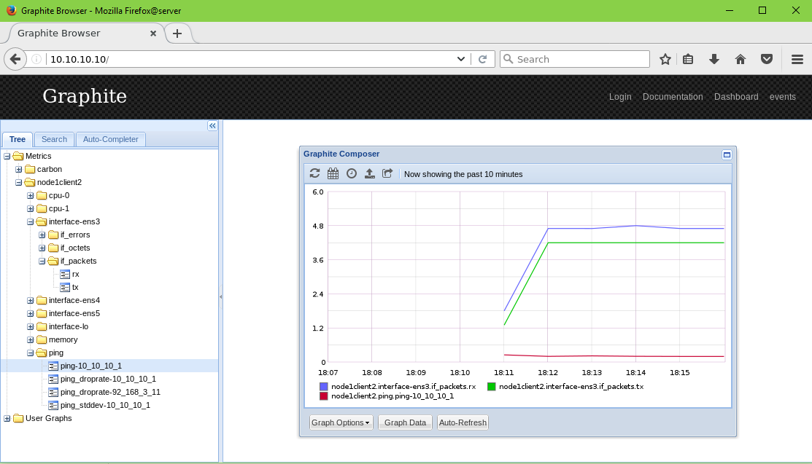

<a name = '3'></a>
## 3.	Sử dụng Graphite-web 

<a name = '3.1'></a>
### 3.1.	Giao diện Graphite

- Lần đầu tiên khi bạn mở giao diện web của Graphite, bạn thấy hiện lên giao diện như sau:

	

- Giao diện chính gồm một Navigation tree ở phía bên trái, màn hình chính chứa cửa sổ Composer và một hàng titler trên cùng chứa các links (Login, Documentration, Dashboard, …)

- Với navigation tree, bạn sẽ thấy được các thư mục đại diện cho các metric xuất hiện phân cấp đại diện cho các thư mục và các file dữ liệu whisper được lưu trên máy chủ Graphite.

	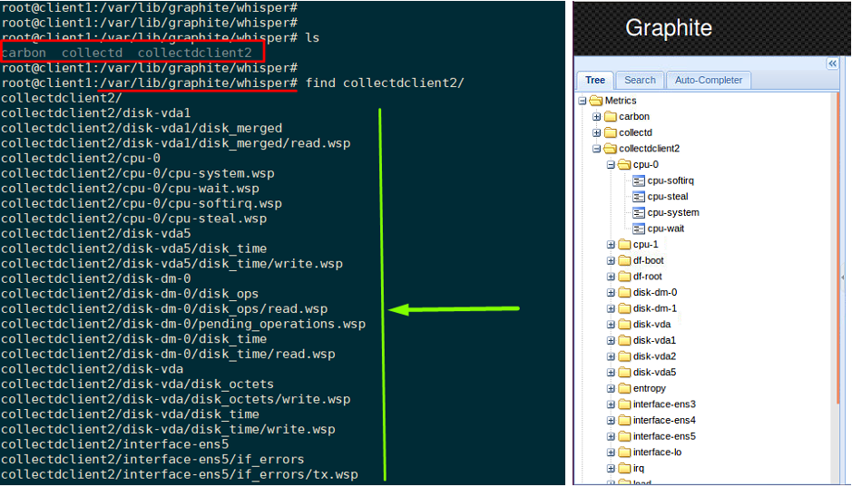

- Thêm metric và đồ thị

	- Click vào bất kì node metric nào trong cây Metrics sẽ thêm vào trong đồ thị ở cửa sổ Composer màn hình chính. Nếu metric đó đã biểu diễn trên đồ thị (và không được chỉnh sửa với các hàm render), click lần nữa vào metric sẽ xóa nó khỏi đồ thị.

	- Cửa sổ Composer sẽ giúp bạn không thêm các metric giống nhau vào đồ thị một cách không cần thiết. 

	- Ví dụ: thêm 2 metric vào đồ thị:

		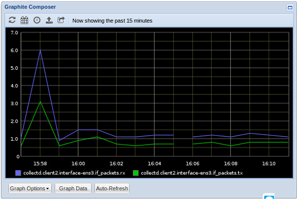

<a name = '3.2'></a>
### 3.2.	Thêm user vào Graphite

Sau khi đã phân tán dữ liệu vào Graphite database, các user có thể thấy dữ liệu trên giao diện của Graphite và có thể tạo các đồ thị tùy ý để thấy các dữ liệu thời gian thực. Khi các đồ thị được tạo, các user muốn lưu các đồ thị đó để sử dụng trong tương lai và muốn tạo một dashboard với tất các đồ thị đã tạo. Cách đơn giản (nhưng không thân thiện với người dùng) để thực hiện việc này là lưu các URL của đồ thị đã tạo và các user có thể sử dụng nó để hiện thị chúng khi cần.

Một cách khác là sử dụng tùy chọn lưu đồ thị trên Graphite web, cung cấp khả năng tạo và lưu lại dashboard. Những tùy chọn này đều yêu cầu đăng nhập vào web – yêu cầu cần có user-id/password để đăng nhập.

Sau đây là cách để tạo user trên graphite web: 

-	Đăng nhập vào Graphite server.

-	Tìm file scripts `manage.py` trong thư mục gói thư viện python cài đặt của graphite:

	```
	root@graphite:~# find / -name manage.py
	/usr/lib/python2.7/dist-packages/graphite/manage.py
	/usr/lib/python2.7/dist-packages/django/conf/project_template/manage.py
	root@graphite:~# vi /usr/lib/python2.7/dist-packages/graphite/manage.py
	```
-	Chính là thư mục `/usr/lib/python2.7/dist-packages/graphite/`

-	Di chuyển ( `cd` ) vào thư mục đó và chạy script `manage.py` để tạo user mới như sau:

	```
	python manage.py createsuperuser --username=client1 --email=client1@localhost.com
	```

-	Nhập password khi được yêu cầu. Vậy là hoàn thành. Khi bạn truy cập vào giao diện Graphite, thực hiện login với user vừa tạo là có thể lưu lại các đồ thị theo ý muốn của mình. 

- Chỉnh sửa password của user đã tạo:

	```
	root@graphite:/usr/lib/python2.7/dist-packages/graphite# python manage.py changepassword client1
	Changing password for user 'client1'
	Password:
	Password (again):
	Password changed successfully for user 'client1'
	```

<a name = '3.3'></a>
### 3.3.	Tạo đồ thị và lưu lại

- Đăng nhập vào giao diện web với user vừa tạo:

	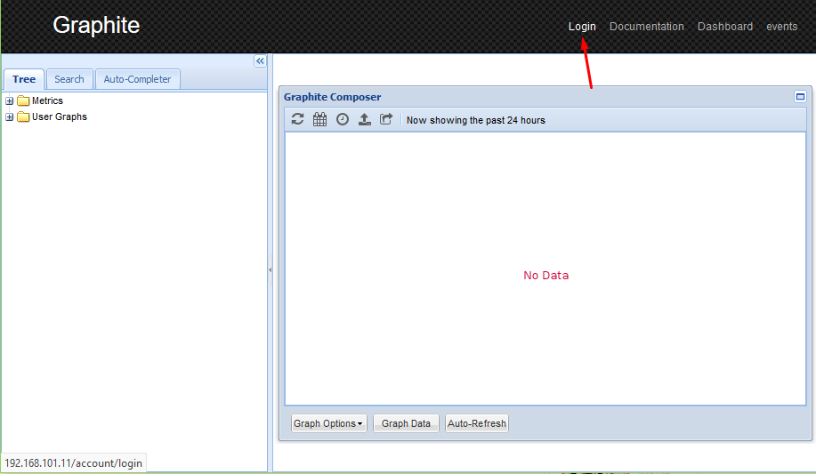

	Nhập username và password:

	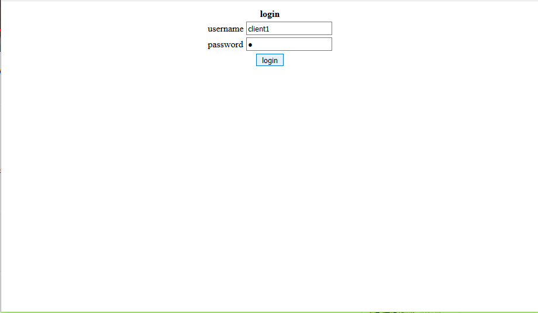

	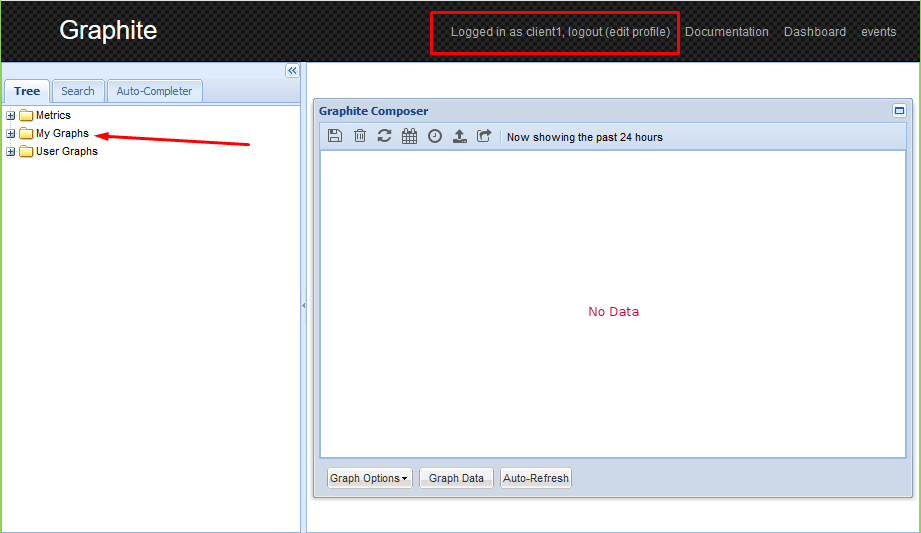

- Tạo đồ thị mới: chọn các thông số muốn hiển thị lên:

	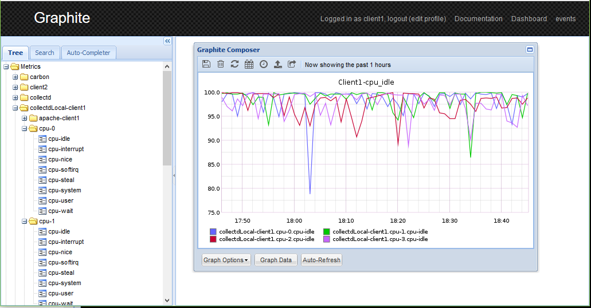

- Đặt tiêu đề cho đồ thị và click vào biểu tượng save để lưu lại đồ thị:

	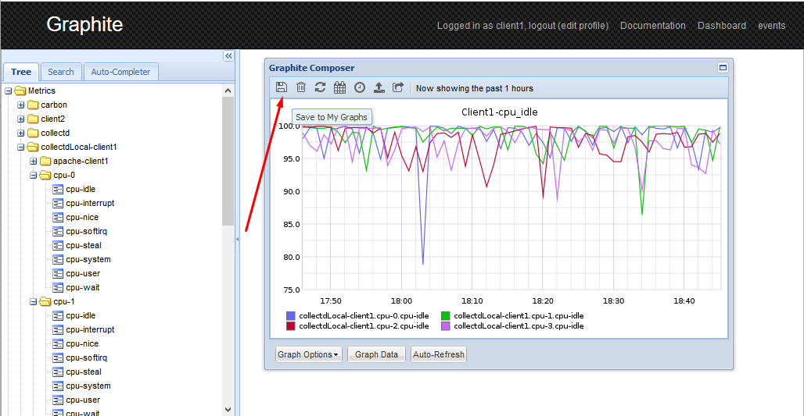

- Nhập tên đồ thị và lưu:

	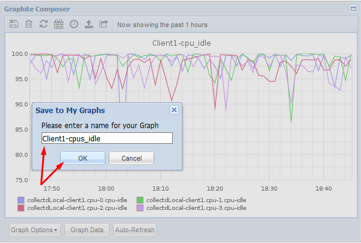

- Kiểm tra trên giao diện ta thấy như sau:

	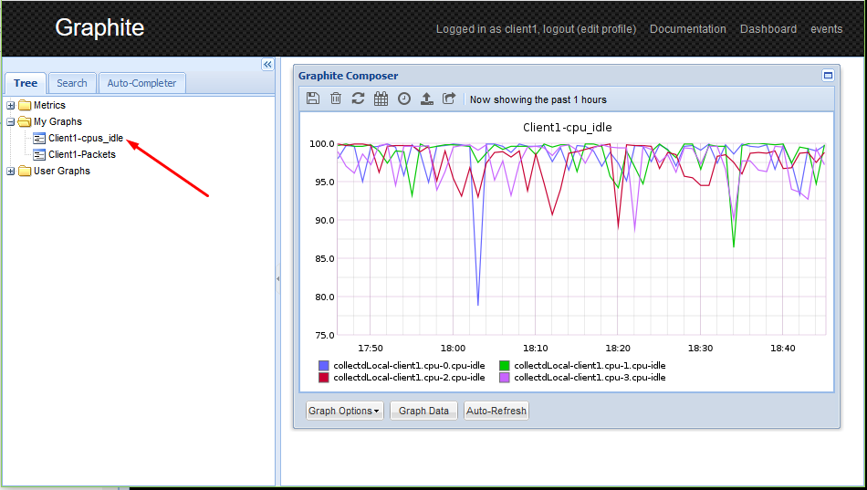

<a name = '3.4'></a>
### 3.4.	Tạo giao diện dashboards kết hợp nhiều đồ thị

- Để tạo giao diện dashboards theo dõi nhiều thông số kết hợp từ các đồ thị : Click vào Dashboards trên phần trên cùng màn hình phía bên phải.

- Thêm đồ thị vào giao diện dashboards:

	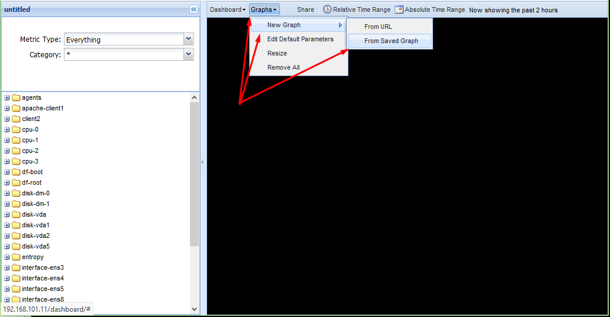

	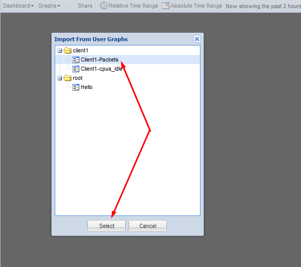

- Kết quả được giao diện dashboards theo dõi theo ý muốn như sau:

	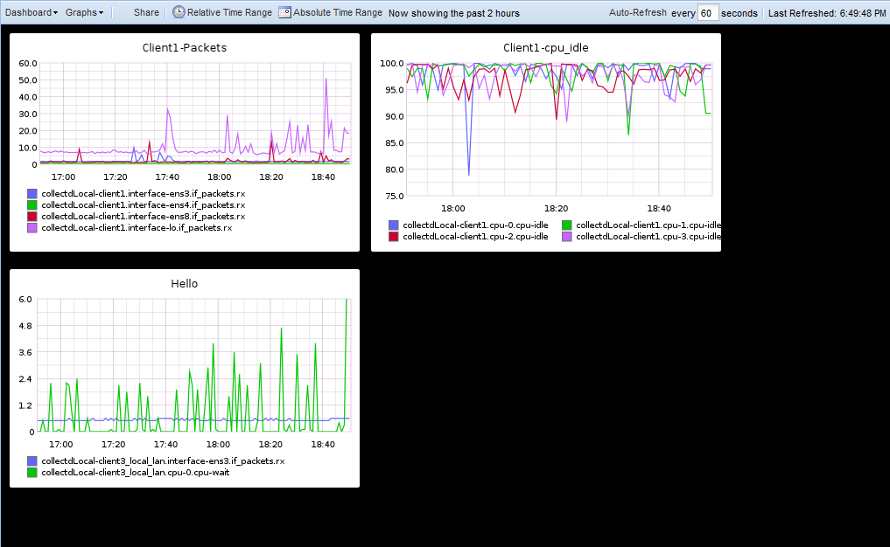

- Thực hiện lưu giao diện dashboards vừa tạo:

	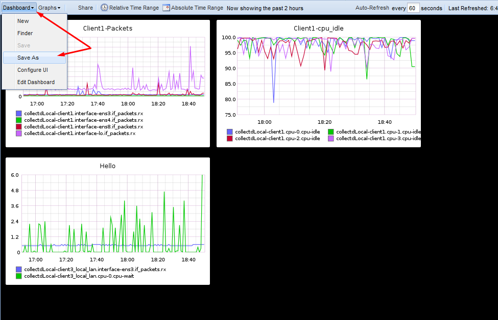

- Thực hiện mở giao diện dashboards đã lưu:

	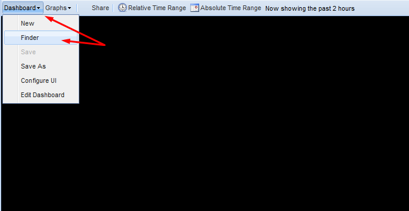

	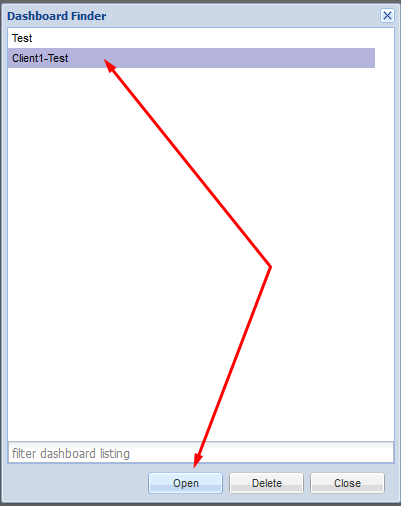

- Tham khảo thêm tại: https://www.hostedgraphite.com/docs/dashboardguide.html

<a name = '4'></a>
## 4.	Một số hàm của graphite

Tham khảo: https://github.com/hocchudong/ghichep-collectd/blob/master/Graphite/Graphite%20Functions.md

<a name = '5'></a>
## 5. Tham khảo

[1] https://community.rackspace.com/products/f/public-cloud-forum/6800/how-to-set-up-monitoring-stack-using-collectd-graphite-grafana-and-seyren-on-ubuntu-14-04

[2] https://www.unixmen.com/full-monitoring-system-graphite-collectd-statsd-part-1/ 

[3] https://www.vultr.com/docs/how-to-install-and-configure-graphite-on-ubuntu-16-04 

[4] Plugin write_graphite: https://collectd.org/documentation/manpages/collectd.conf.5.shtml#plugin_write_graphite 

[5] Thay đổi user: http://blog.asquareb.com/blog/2014/11/19/adding-users-to-graphite/
