# Một số plugin của Collectd

Phần này tìm hiểu một số plugin cơ bản của collectd.

### ***Mục lục***

[1.	Plugin write_graphite](#1)  
[2.	Plugin network](#2)  
[3.	Plugin rrdtool](#3)  
[4.	Plugin cpu](#4)  
[5.	Plugin memory](#5)  
[6.	Plugin interface](#6)  
[7.	Plugin df](#7)  
[8.	Plugin load](#8)  
[9.	Plugin TCPconns](#9)  
[10.	Plugin ping](#10)  
[11.	Plugin notify_ email](#11)  
[12. Tham khảo](#12)

---

<a name = '1'></a>
## 1.	Plugin write_graphite

- Plugin `write_graphite` là một project thu thập metric nguồn mở, kết nối tới Carbon, lớp dữ liệu của Graphite, thông qua kết nối TCP hoặc UDP và gửi dữ liệu thông qua giao thức "line based" (thường là sử dụng cổng 2003). Dữ liệu sẽ được gửi theo khối tối đa là 1428 byte để giảm thiểu số lượng gói tin mạng.

- Và chỉnh sửa section Plugin `write_graphite` tương ứng như sau:

    ```
    <Plugin write_graphite>
            <Node "Graphite-server">
                    Host "10.10.10.10"
                    Port "2003"
                    Protocol "tcp"
                    LogSendErrors true
                    Prefix "node1"
    #               Postfix "collectd"
                    StoreRates true
                    AlwaysAppendDS false
                    EscapeCharacter "_"
            </Node>
    </Plugin>
    ```
- Trong đó:  

    - `<Node "Graphite-server">`: Mô tả tên node Graphite server mà Collectd kết nối tới. Có thể kết nối tới nhiều Graphite server khác nhau bằng cách thêm nhiều khối <Node "Name">. Bên trong các khối Node, yêu cầu các tùy chọn như sau:

    -	`Host`: địa chỉ của Graphite server mà Collectd muốn gửi metric tới. (mặc định là localhost)

    -	`Port 2003` và `Protocol` sử dụng `tcp`.

    -	`LogSendErrors true`: thiết lập true để gửi log khi có lỗi xảy ra tới Graphite server. Nếu thiết lập false, nó sẽ không gửi các log error.

    -	`Prefix "collectd"` : thiết lập prefix. Khi thiết lập là "node1", tất cả data đẩy từ node này sẽ có tên bắt đầu là "node1"

    -	`Postfix "collectd"`
        
        Khi thiết lập Prefix và Postfix thì trên Graphite server, metric từ node này sẽ hiển thị tên dạng như sau:
        
        ```
        [prefix]{hostname}[postfix].{collectd_plugin}.{check}
        ```

        Đồng thời, trong file lưu trữ các thông số metric này trong thư mục lưu trữ của Whisper cũng được đặt tên tương tự.

    -	`StoreRates true|false` : Nếu thiết lập true (mặc định) chuyển giá trị đếm sang thành tỉ lệ. Nếu thiết lập false bộ đếm giá trị sẽ được lưu theo số nguyên.

    -	`AlwaysAppendDS false|true` : Nếu thiết lập true sẽ thêm Data Source (DS) vào định danh của metric. Nếu false thì bỏ qua. Thiết lập này thực hiện khi có nhiều hơn một DS. 

    -	`EscapeCharacter "_"` : Carbon sử dụng dấu chấm (.) để phân tách các chữ cái và không cho phép dấu trắng. Tùy chọn này quyết định dấu để phân tách giữa các chữ cái. Mặc định là dấu gạch dưới "_"


<a name = '2'></a>
## 2.	Plugin network

- Có 2 cách để thực hiển đẩy metric về phía Graphite server để hiển thị. Cách thứ nhất là dùng plugin `write_graphite` giới thiệu ở trên, và cách thứ 2 là sử dụng plugin `network` để đẩy metric từ các collectd client tới collectd server thiết lập trên graphite server. Từ đó hiển thị trên giao diện web của graphite. 

    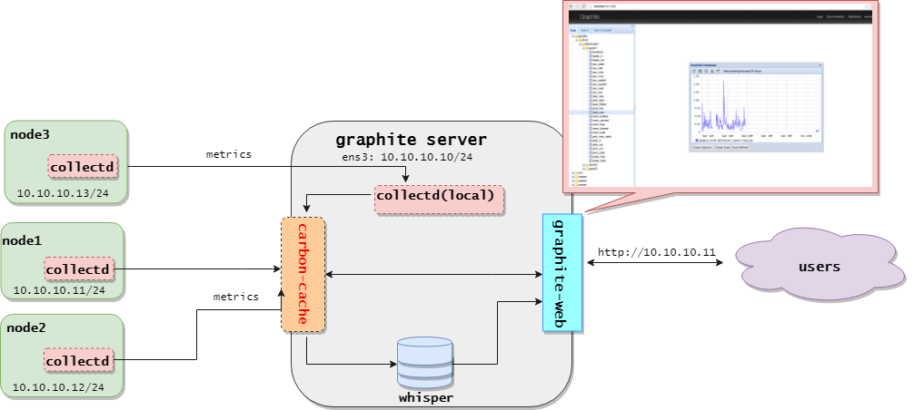

- Để sử dụng plugin này, cần kích hoạt nó trên cả 2 bên collectd client và server bằng cách bỏ comment ở dòng LoadPlugin network trong file `/etc/collectd/collectd.conf`.

- Cấu hình trong section Plugin network (dòng 685) ở 2 bên:

- Trên **Collectd client**: Thực hiện cấu hình như sau:

    ```
    <Plugin network>
    #       # client setup:
    #       Server "ff18::efc0:4a42" "25826"
        <Server "10.10.10.11" "25826">
    #               SecurityLevel None
    #               Username "user"
    #               Password "secret"
    #               Interface "eth0"
    #               ResolveInterval 14400
        </Server>
    </Plugin>
    ```

    Trong đó: 
    - `<Server Host [Port]>` : Khối Server thiết lập thông tin về Collectd server. Có thể cấu hình nhiều khối này để thực hiện gửi metric tới nhiều server khác nhau.

        Host có thể là hostname hoặc địa chỉ IP (4 hoặc 6). Tùy chọn thứ 2 Port xác định cổng dịch vụ của Collectd server. Mặc định là 25826.

    Và một số tùy chọn theo sau:

    - `SecurityLevel Encrypt|Sign|None`

        Thiết lập bảo mật khi truyền metric trong mạng. Khi mức bảo mật thiết lập là `Encrypt`, dữ liệu gửi qua mạng sẽ được mã hóa sử dụng AES-256. Sự toàn vẹn gói tin được đảm bảo sử dụng SHA-1. Khi thiết lập là `Sign`, dữ liệu truyền đi được kí sử dụng mã xác thực HMAC-SHA-256. Khi thiết lập là `None`, dữ liệu truyền đi mà không có bất kì sự bảo mật nào.
        
        Tính năng này có hiệu lực nếu plugin network được liên kết với libgcrypt.
    
    - `Username <username>`
    
        Thiết lập username để truyền. Được sử dụng để server tìm mật khẩu khớp tương ứng. Tất cả mức bảo mật trừ None yêu cầu phải cấu hình phần này.
    
        Tính năng này có hiệu lực nếu plugin network được liên kết với libgcrypt.
    
    - `Password <password>`
    
        Thiết lập password (pasword dùng chung giữa client và server). Tất cả mức bảo mật trừ None yêu cầu phải cấu hình phần này.
    
        Tính năng này có hiệu lực nếu plugin network được liên kết với libgcrypt.
    
    - `Interface <interface_name>`
    
        Thiết lập interface đi ra cho các gói tin. Mặc định, kernel sẽ tự chọn interface thích hợp. Các cấu hình thủ công này chỉ sử dụng trong một vài trường hợp cần thiết phải cấu hình.
    
    - `ResolveInterval <seconds>`
        
        Thiết lập chu kì phân giải lại địa chỉ DNS cho Host. Cấu hình này hữu ích khi bắt phải phân giải DNS đều đặn để hỗ trợ tính sẵn sàng cao của dịch vụ. Nếu không thiết lập, việc phân giải lại địa chỉ sẽ không bao giờ được thực hiện.

- Cấu hình trên Collectd server: Cấu hình như sau:

    ```
    </Plugin>

    #       # server setup:
    #       Listen "ff18::efc0:4a42" "25826"
            <Listen "0.0.0.0" "25826">
    #               SecurityLevel Sign
    #               AuthFile "/etc/collectd/passwd"
    #               Interface "eth0"
            </Listen>
    </Plugin>
    ```
    
    Trong đó:
    
    - `<Listen Host [Port]>`
    
        Listen thiết lập các interface lắng nghe metric từ client gửi tới. Có thể thiết lập nhiều interface. (Thiết lập 0.0.0.0 cho phép lắng nghe trên tất cả các interface)
    
        `Port` dịch vụ mặc định là 25826
    
        Một số tùy chọn theo sau:
        
        - `SecurityLevel Encrypt|Sign|None`
            
            Thiết lập bảo mật. Nếu thiết lập là `Encrypt`, chi các dữ liệu đã mã hóa mới được chấp nhận. Sự toàn vẹn dữ liệu được đảm bảo sử dụng SHA-1. Khi thiết lập `Sign`, chỉ các dữ liệu đã kí và được mã hóa mới được chấp nhận. Nếu thiết lập là `None` thì tất cả dữ liệu đều được chấp nhận. 
        
            Nếu có tùy chọn `Authfile`, dữ liệu mã hóa được giải mã nếu có thể. Để sử dụng được thiết lập mức bảo mật, cần cấu hình cụ thể địa chỉ interface (chứ không sử dụng 0.0.0.0)
            
            Tính năng này có hiệu lực nếu plugin network được liên kết với libgcrypt.
        
        - `AuthFile <filename>`
        
            Thiết lập file mà tên username được ánh xạ với password. Những password này được sử dụng để kí và giải mã các gói tin đã mã hóa. Nếu SecurityLevel được thiết lập là None, phần này là tùy chọn. Dữ liệu đã kí được xác nhận và các gói tin mã hóa được giải mã. Nếu không, dữ liệu đã kí được chấp nhận mà không kiểm tra và dữ liệu mã hóa không thể được giải mã. Với các mức bảo mật khác, tùy chọn này là bắt buộc.
        
            Định dạng file khá đơn giản: mỗi dòng gồm một username theo sau là dấu hai chấm (“:”) phân tách username với password. Tương tự như sau:

            ```
            user0: foo
            user1: bar
            ```

        - `Interface <interface_name>`
            
            Thiết lập interface nhận gói tin đến server. Mặc định, việc này sẽ do kernel tự chọn interface thích hợp. Nếu thiết lập, lưu lượng sẽ chỉ được chấp nhận đến trên interface được cấu hình.

- Một số tùy chọn khác:
    
    - `TimeToLive 1-255`
    
        Thiết lập thời gian sống TTL cho gói tin gửi đi. Áp dụng cho tất cả các gói tin: unicast, multicast, … Mặc định là không thay đổi giá trị này (128). Nghĩa là các gói tin multicast sẽ được gửi đi với TTP 1 trên tất cả các hệ điều hành.
    
    - `MaxPacketSize 1024-65535`
    
        Thiết lập giá trị lớn nhất cho datagram được phép nhận. Các gói tin lớn hơn sẽ bị bỏ. Mặc định là 1452 byte, kích thước payload lớn nhát có thể truyền trong một Ethernet frame sử dụng Ipv6 / UDP.
    
        Bên phía server, hạn chế này nên được thiết lập giá trị  lớn nhất sử dụng trên bất kì client nào. Tương tự, giá trị trên Client phải không lớn hơn giá trị trên server, nếu không dữ liệu sẽ bị mất.
    
    - `Forward true|false`
    
        Nếu thiết lập true, ghi các gói tin nhận được thông qua plugin network tới socket gửi. Chỉ nên được kích hoạt khi các  cấu hình trên Listen và Server khác nhau. Nếu không gói tin có thể được gửi nhiều lần đến cùng một nhóm multicast. Mặc dù điều này dẫn đến nhiều lưu lượng truy cập mạng hơn mức cần thiết nhưng nó không phải là một vấn đề lớn vì plugin có một bản phát hiện trùng lặp, vì vậy các giá trị sẽ không lặp lại.
    
    - `ReportStats true|false`
    
        Plugin network không thể chỉ nhận và gửi số liệu thống kê, nó có thể tạo các số liệu của chính nó. Dữ liệu Collectd bao gồm số octet và gói tin gửi và nhận, độ dài hàng đợi nhận và số lượng xử lý. Nếu thiết lập true, plugin network sẽ tạo các thống kê này. Mặc định là false. 

<a name = '3'></a>
## 3.	Plugin rrdtool

- **RRDtool** là plugin thuộc kiểu write và được sử dụng để chi lại các giá trị metrics thu thập được vào các file RRD sử dụng thư viện librrd. Collectd sử dụng plugin này để lưu lại các giá trị metric, và giá trị đó có thể được sử dụng đển rend ra đồ thị nhờ các front-end phù hợp với collectd. 

- Là plugin có trước plugin `write_graphite`, sau khi có graphite ra đời với ưu điểm hỗ trợ kết hợp sử dụng linh hoạt các hàm kết hợp metric, thì plugin này ít phổ biến hơn so với graphite. 

- Plugin này mặc định đã được kích hoạt.

- Cách cấu hình plugin rrdtool:

    ```
    <Plugin rrdtool>
            DataDir "/var/lib/collectd/rrd"
    #       CacheTimeout 120
    #       CacheFlush 900
    #       WritesPerSecond 30
    #       CreateFilesAsync false
    #       RandomTimeout 0
    #
    # The following settings are rather advanced
    # and should usually not be touched:
    #       StepSize 10
    #       HeartBeat 20
    #       RRARows 1200
    #       RRATimespan 158112000
    #       XFF 0.1
    </Plugin>
    ```

    - `DataDir`: Thiết lập vị trí thư mục lưu trữ các file rrd. Mặc định, các file rrd được tạo trong thư mục làm việc của daemon collectd (thư mục BaseDir)

    - `CacheTimeout <Seconds>`: Nếu tùy chọn này được thiết lập lớn hơn 0, plugin rrdtool sẽ lưu các giá trị vào trong cache sau `<seconds>` giây. Việc ghi lại nhiều giá trị cùng lúc làm giảm hoạt động IP và dẫn tới giảm tải bằng cách cập nhật các file. 

    - `CacheFlush <Seconds>`: Khi rrdtool sử dụng cache (khi thiết lập timeout), nó sẽ ghi lại tất cả các giá trị vào một file rrd nhất định nếu các giá trị cũ nhất cũ hơn (hoặc bằng) số giây được xác định trong CacheTimeout. Nếu vì một vài lý do nào đó mà các file rrd không được cập nhật nữa (máy tắt, hoặc mất mạng, ...) các giá trị metric vẫn được lưu trong cache. Nếu thiết lập CacheFlush thì sau khoảng thời gian Seconds giây, toàn bộ các giá trị đã lưu trong khoảng thời gian lớn hơn CacheTimeout và RandomTimeout sẽ được ghi vào ổ cứng. 
    
        Giá trị này không nên thiết lập quá nhỏ. Giá trị 900 là một giá trị ổn. 
    
        Mặc định thì khoảng thời gian này nên lớn hơn khoảng 10 lần so với CacheTimeout. CacheFlush phải lớn hơn hoặc bằng CacheTimeout. 

    - `WritesPerSecond <seconds>` : 

    - `CreateFilesAsync false|true` : khi được kích hoạt, các file RRD mới được kích hoạt không đồng bộ, sử dụng các luồng tách biệt chạy ở chế độ ngầm. Việc này ngăn chặn ghi dữ liệu thành khối, đây là vấn đề đặc biệt khi có hàng trăm file cần được tạo. Tuy nhiên, bởi mục đích tạo các file không đồng bộ là ngăn ghi dữ liệu thành khối cho đến khi file có sẵn, các gái trị trước đó trong file sẽ bị bỏ đi. Nếu vô hiệu hóa (mặc định), các file được tạo đồng bộ, theo khối trong một thời gian ngắn, khi các file được viết vào.

    - `RandomTimeout <seconds>` : Khi được thiết lập, giá trị thời gian thực giữa các giá trị được chọn ngẫu nhiên giữa khoảng CacheTimeout - RandomTimeout và CacheTimeout + RandomTimeout. Mục đích là để tránh các tình huống tải cao xảy ra khi có nhiều giá trị timeout cùng lúc. Đây đặc biệt là vấn đề ngay sau khi daemon khởi động, bởi tất cả các giá trị được thêm vào cache nội bộ vào cùng lúc. 

- Chi tiết tham khảo: https://collectd.org/documentation/manpages/collectd.conf.5.shtml#plugin_rrdtool 

<a name = '4'></a>
## 4.	Plugin cpu

- Plugin CPU thu thập thông số sử dụng CPU. Thông số CPU sẽ được hiển thi mặc định theo số phần trăm sử dụng. Có thể yêu cầu hiển thị thông số từng CPU, từng trạng thái của các CPU trong hệ thống.

- Cấu hình plugin cpu:

    - Tính tổng, theo trạng thái, của tất cả CPU trên hệ thống.

    - Tính tổng, theo từng CPU, trên tất cả trạng thái nghỉ của CPU, tạo một trạng thái "active".

- 2 phương thức kết tập trên có thể kết hợp. Miễn là một trong những phương thức kết tập (hoặc cả hai) được kích hoạt, cpu plugin sẽ báo cáo phần trăm sử dụng, hơn là Jiffy. Hơn nữa, có thể request riêng biệt, theo từng trạng thái, theo từng metric CPU được báo cáo theo phần trăm.

- Các tùy chọn cấu hình như sau: 

    - `ReportByState true|false`
    
        Khi thiết lập true (mặc định), báo cáo metric theo trạng thái, ví dụ: "system", "user" và "idle"
    
        Khi thiết lập false, kết tập (tính tổng) trên tất cả trạng thái non-idel vào một metric "active"
    
    - `ReportByCpu true|false`
    
        Khi thiết lập true (mặc định), metric được thu thập theo từng core CPU. Khi thiết lập false, thay vì báo cáo metric theo từng CPU, chỉ một tổng toàn cục của các trạng thái CPU được hiển thị.
    
    - `ValuesPercentage false|true`
    
        Tùy chọn này được sử dụng khi cả 2 thiết lập trên được đặt là true. Trong trường hợp này, mặc định các thông số sẽ được báo cáo theo jiffy. Thiết lập này set thành true, bạn cũng có thể yêu cầu các giá trị phần trăm ở chế độ chưa được tổng hợp (cho mỗi CPU, mỗi trạng thái).

    - `ReportNumCpu false|true`
        
        Khi thiết lập thành true, báo cáo số lượng CPU sẵn có. Mặc định là false.
    
    - `ReportGuestState false|true`
    
        Khi thiết lập thành true, báo cáo về trạng thái "guest" và "guest_nice" của CPU. Mặc định là false.
    
    -  `SubtractGuestState false|true`
    
        Tùy chọn này chỉ được dùng khi tùy chọn ReportGuestState được thiết lập là true. "guest" và "guest_nice"  tương ứng "user" và "nice". Nếu thiết lập true, "guest" sẽ loại bỏ "user" và "guest_nice" sẽ bỏ "nice". Mặc định là true. 

- Sau khi cấu hình, các thông số được thu thập gồm có: 

    -	**idle**: Thời gian CPU ở trạng thái idle (rảnh rỗi, và sẵn sàng được sử dụng)

    -	**nice**: Thời gian CPU dùng để chạy các tiến trình người dùng được đánh dấu là niced. Mức ưu tiên một tiến trình user space có thể được tinh chỉnh bằng các điều chỉnh thông số nice. 

    -	**interrupt**: Thời gian CPU dành để phục vụ các tiến trình ngắt.

    -	**softirq**	(apparently) : Time spent handling interrupts that are synthesized, and almost as important as Hardware interrupts (above). "In current kernels there are ten softirq vectors defined; two for tasklet processing, two for networking, two for the block layer, two for timers, and one each for the scheduler and read-copy-update processing. The kernel maintains a per-CPU bitmask indicating which softirqs need processing at any given time." 

    -	**steal**: Là sự đo lường về phần thời gian mà trong trạng thái “involuntary wait.”  Là khoảng thời gian mà kernel không thể đặt trong các trạng thái cơ bản như user, system, hay idle. 

    -	**system**: Thời gian mà CPU dành để chạy trong kernel. 

    -	**user**: Thời gian CPU dành để chạy các tiến trình user space mà không phải các tiến trình nice.

    -	**wait**: Thời gian CPU dành để chời một hoạt động I/O được hoàn thành.

    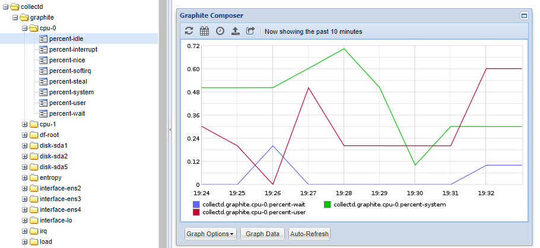

- Để kiểm chứng hoạt động của plugin cpu sử dụng `stress` với tùy chọn `--cpu` 

<a name = '5'></a>
## 5.	Plugin memory

- Plugin memory thuộc loại read để đo đạc lượng bộ nhớ RAM sử dụng trong hệ thống. 

- Các giá trị được báo cáo theo mức sử dụng của hệ điều hành. Gồm các loại sau:
    
    -	**Used**: Lượng bộ nhớ đã được sử dụng: mem_used = mem_total - (mem_free + mem_buffered + mem_cached + mem_slab_total);

    -	**Buffered**: Lượng (theo KB) bộ nhớ tạm lưu trữ cho các khối lưu trữ thô. 

    -	**Cached**: Lượng bộ nhớ RAM vật lý (theo KB), sử dụng để cache.

    -	**Free**: Lượng bộ nhớ RAM vật lý (theo KB) có sẵn mà không được hệ thống sử dụng. 

    -	**Total**: Tổng lượng RAM có thể sử dụng (theo KB) đó là lượng RAM vật lý không tính lượng dữ trữ.

    -	**slab_recl**:	The part of Slab that can be reclaimed, such as caches.

    -	**slab_unrecl**: The part of Slab that cannot be reclaimed even when lacking memory

        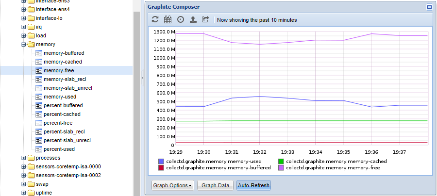

- Các tùy chọn cấu hình plugin memory:
    
    - `ValuesAbsolute true|false`:     Kích hoạt hoặc vô hiệu hóa việc thu thập lượng bộ nhớ sử dụng theo số nguyên, ví dụ: byte. Mặc định là true.
    
    - `ValuesPercentage false|true`:     Kích hoạt hoặc vô hiệu hóa thu thập lượng bộ nhớ sử dụng theo phần trăm, ví dụ: phân trăm bộ nhớ vật lý đã sử dụng. Mặc định là false.
    
        Tùy chọn này hữu ích khi triển khai collectd trong môi trường không đồng nhất về kích thước bộ nhớ.

        

- Để kiểm chứng hoạt động của plugin cpu sử dụng   `stress` với tùy chọn `--vm`

<a name = '6'></a>
## 6.	Plugin interface

- Plugin interface hỗ trợ thu thập thông tin về lưu lượng (số lượng octet hoặc gói tin truyền qua interface trong mỗi giây), hoặc  số gói lượng lỗi xảy ra mỗi giây. 

- Cấu hình:

    ```
    <Plugin "interface">
    Interface "lo"
    Interface "ens4"
    IgnoreSelected true
    </Plugin>
    ```

    - `Interface`: xác định interface muốn theo dõi.

    - `IgnoreSelectd` : nếu cấu hình true thì sẽ theo dõi metric từ tất cả các interface trong hệ thống trừ interface được cấu hình trong Interface ở trên. Nếu cấu hình false thì sẽ chỉ theo dõi metric từ interface đã cấu hình.

- Minh họa:
        
    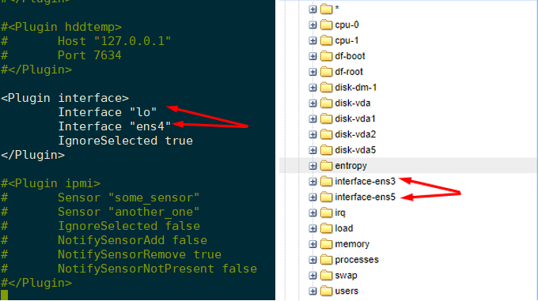

    Ping thử tới interface ens3: 

    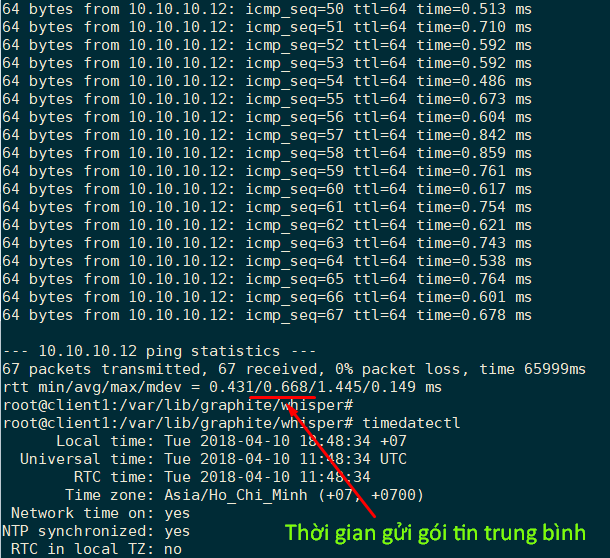

    => Lượng packet gửi qua trong 1s là: 1/0.668 ~ 1.5 . Kết quả trên giao diện graphite web :

    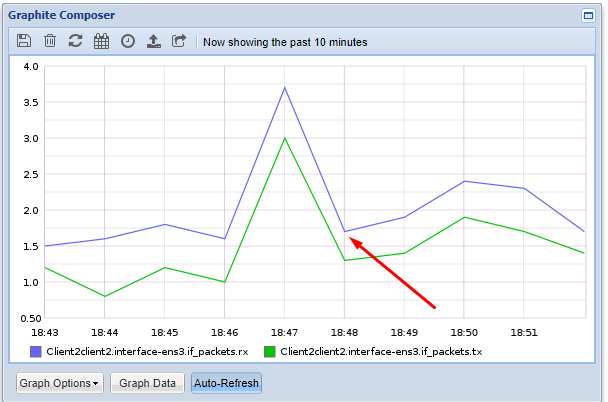

- Tham khảo thêm tại: https://collectd.org/wiki/index.php/Plugin:Interface 

<a name = '7'></a>
## 7.	Plugin df

- Plugin df là loại plugin read để thu thập thông tin về sử dụng hệ thống file, ví dụ: đơn giản như việc phân chia phân vùng mount được sử dụng và sẵn có như nào. Nó được đặt tên giống với lệnh df.

- Tuy nhiên, không phải tất cả các phân vùng được quan tâm thu thập thông tin. Ví dụ: /proc và /dev thường không được làm đầy là kích thước của chúng không có ý nghĩa nhiều. Đó là lý do tại sao plugin DF cung cấp để chỉ chọn các thiết bị cụ thể, các điểm mount hoặc các loại hệ thống tập tin.

- Các tùy chọn cấu hình: 

    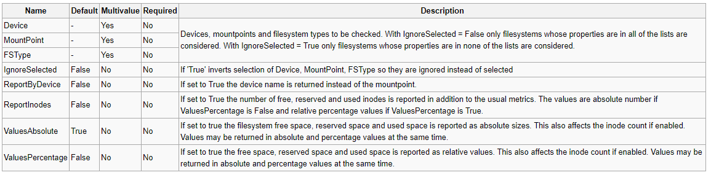

- Các thông số thu thập hiển thị trên giao diện giám sát (theo dõi phân vùng root `/` ) : 

    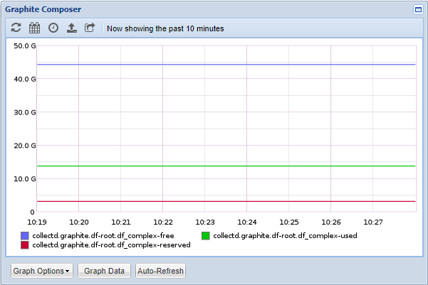

- Kiểm chứng sử dụng lệnh `df –h` :

    

<a name = '8'></a>
## 8.	Plugin load

- Plugin load là loại read, sử dụng để thu thập tải hệ thống. Những con số đưa ra một cái nhìn tổng quan về việc sử dụng máy.

- Tải hệ thống là số lượng tác vụ chạy được trong hàng đợi và được cung cấp bởi nhiều hệ điều hành trung bình trong khoảng thời gian một, năm hoặc mười lăm phút.

- Khi được kích hoạt, plugin load sẽ thu thập các thông số như sau:

    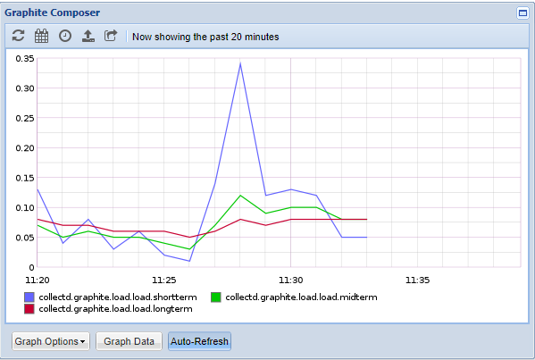

- Trong đó, shortterm là tải trung bình trong 1’, midterm là 5’ là longterm la 15’.

- Kiểm chứng sự hoạt động của plugin load, sử dụng lệnh `uptime`, `sar`, `top`, … để xem thống số load hệ thống trên terminal.

<a name = '9'></a>
## 9.	Plugin TCPconns

- Plugin TCPConns là loại plugin read được sử dụng để đếm số kết nối TCP đến hoặc ra từ một port cụ thể. Thông thường, các kết nối mà đã xác định cổng nội bộ (local port) là các kết nối đến và các kết nối xác định remote port là các kết nối ra khỏi máy.

- Vì có thể có nhiều kết nối, mặc định đếm tất cả các kết nối với local port - các socket đã được mở và trong trạng thái listening. Tuy nhiên, có thể sử dụng các tùy chọn sau trong cấu hình plugin TCPConns để theo dõi chỉ các port mà bạn quan tâm:

    - `ListeningPorts true|false`
    
        Nếu thiết lập true, thống kê trên tất cả các port nội bộ đang mở socket lắng nghe sẽ được thu thập. Mặc định phụ thuộc vào LocalPort và RemotePort được cấu hình sau. Nếu không có port cụ thể, mặc định sẽ thu thập trên các port đang lắng nghe. Nếu các port cụ thể được xác định (có thể là local hoặc remote port) được chọn, tùy chọn này mặc định thành false. 
    
    - `LocalPort Port`
    
        Đếm các kết nối trên cổng local này. Có thể được sử dụng để xem có bao nhiêu kết nối được xử lý bởi một daemon cụ thể, ví dụ: mail server. Bạn phải cấu hình số cổng, giả sử với mail server thì thiết lập port 25.
    
    - `RemotePort Port`
    
        Đếm số kết nối tới một remote port cụ thể. Sử dụng để xem có bao nhiêu dịch vụ từ xa đã được sử dụng. Thiết lập này hữu ích nhất khi muốn biết có bao nhiêu kết nối từ một dịch vụ nội bộ đã được mở với một dịch vụ tư xa, ví dụ: có bao nhiêu kết nối tới mail server hoặc news server tới mail hoặc news server khác, hoặc có bao nhiêu kết nối một web proxy đang giữ tới các web server. 
    
    - `AllPortsSummary true|false`
    
        Nếu tùy chọn này được thiết lập thành true, một tóm tắt số liệu từ tất cả các kết nối được thu thập. Mặc định là false.

- Ví dụ: Cấu hình theo dõi các kết nối SSH đến máy mình, và kết nối collectd ghi lên graphite server: 

    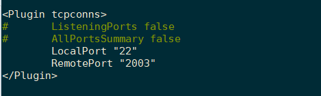

- Theo dõi trên giao diện graphite có kết quả như sau:

    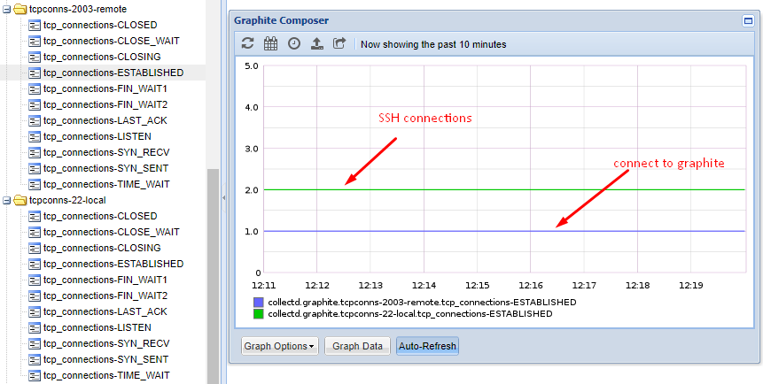

- Tham khảo: https://collectd.org/wiki/index.php/Plugin:TCPConns

<a name = '10'></a>
## 10.	Plugin ping

- Plugin ping được sử dụng để đo độ trễ của mạng sử dụng các bản tin ICMP "echo requests", hay còn gọi là "ping". Độ trễ mạng là đo đạc như thời gian round trip. Một  bản tin ICMP "echo requests" được gửi tới một host và thời gian cần thiết để bản tin echo reply cua nó quay về được đo đạc. Nếu bản tin reply mà không được nhận trong vòng 1s, plugin sẽ không chờ đợi reply nữa. Và có thể suy ra có vấn đề : có thể là gói bị mất, host bị down, hoặc router đã bỏ lỡ gói tin ...

- Để sử dụng plugin ping, cần phải cấu hình một số tùy chọn sau:
    
    - `Host <IP-address/hostname>`
    Host để ping tới theo chu kì. Tùy chọn này có thể được lặp lại nhiều lần để đo độ trễ tới nhiều host.
        
    - `Interval Seconds`
        
        Thiết lập thời gian Interval để gửi bản tin ICMP echo tới host đã được cấu hình. Thời gian này nên nhỏ hơn hoặc bằng khoảng thời gian 
        
        Interval mà collectd thu thập metric.
    
        Mặc định là 1.0 (tức 1s)
        
    - `Timeout <Seconds>`
        
        Thiết lập thời gian chờ phản hồi cho bản tin ICMP đã gửi. Nếu không nhận được reply sau khoảng thời gian này, host sẽ được suy ra là bị down hoặc gói tin đã bị drop. Thời gian này phải nhỏ hơn Interval ở trên để plugin hoạt động đúng. 
    
        Mặc định là 0.9 (0.9s)
 
    - `TTL 0-255`
    
        Thiết lập TTL cho gói tin ICMP được sinh ra.
        
    - `Size <size>`
    
        Thiết lập kích thước payload cho gói tin ICMP. Nếu không thiết lập, mặc định là 56 byte, để gói tin ICMPv4 có kích thước chính xác là 64 byte - giống với gói tin ping thông thường khi sử dụng lệnh ping. 
        
    - `SourceAddress host`
        
        Thiết lập địa chỉ nguồn sử dụng. Host có thể là địa chỉ mạng hoặc hostname của một mạng.
        
    - `Device name`
    
        Thiết lập interface cho gói tin đi ra. (ví dụ : eth0).
        
    - `MaxMissed Packets`
    
        Tạo một DNS resolve sau khi host không reply bản tin. Thiết lập này kích hoạt sử dụng DNS động với plugin png.
    
        Mặc định là -1 (vô hiệu hóa)

- Ví dụ: cấu hình theo dõi độ trễ mạng từ máy mình tới máy host “google.com” và máy host IP: 10.10.10.100:

    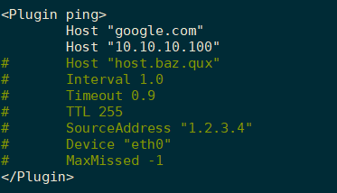

- Giám sát trên giao diện thấy như sau:

    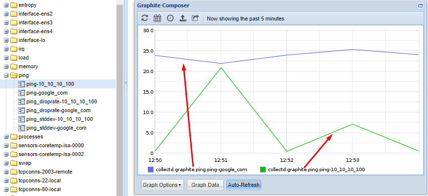

- Trong đó, các thông số:

    -	**ping**: Độ trễ mạng được đo bằng thời gian round trip time theo ms: Một bản tin ICMP echo request được gửi tới host và thơi gian cần thiết để nhận được lại bản tin echo-reply.

    -	**ping_droprate**: tỉ lệ mất gói, được tính như sau:

        ```
        droprate = ((double) (pkg_sent - pkg_recv)) / ((double) pkg_sent)
        ```

    -	**ping_stddev**: 
    
        ```
        if pkg_recv > 1
        latency_stddev = sqrt (((((double) pkg_recv) * latency_squared) - (latency_total * latency_total)) / ((double) (pkg_recv * (pkg_recv - 1))));
        ```

<a name = '11'></a>
## 11.	Plugin notify_ email

- Plugin cảnh báo qua email: Notify Email sử dụng thư viện ESMTP để gửi cảnh báo tới địa chỉ mail đã được cấu hình trước. 

- Để sử dụng plugin này cần enable plugin syslog để ghi log lại việc đã gửi cảnh báo qua mail, và cấu hình plugin threshold trong file `/etc/collectd/collectd.conf.d/thresholds.conf` (với Ubuntu 16.04).

- Các tùy chọn cấu hình plugin notify_email trong file `/etc/collectd/collectd.conf`: 

    - `From <Address>`
    
        Địa chỉ email gửi cảnh báo.
    
        Mặc định là root@localhost.
    
        Để gửi được cảnh báo ra một email ngoài mạng cục bộ, cần sử dụng một email có thể gửi ra Internet. 

    - `Recipient <Address>`
        
        Cấu hình địa chỉ email nhận cảnh báo. Có thể lặp lại cấu hình này để gửi tới nhiều email. Tuy nhiên cần có ít nhất một email để plugin làm việc chính xác.
    
    - `SMTPServer <Hostname>`
        
        Tên hostname của SMTP server kết nối tới. Mặc định là localhost.

    - `SMTPPort <Port>`
    
        TCP port kết nối tới. Mặc định là cổng 25.
    
    - `SMTPUser <Username>`
    
        Username cho xác thực ASMTP. Tùy chọn.

    - `SMTPPassword <Password>`
    
        Mật khẩu để xác thực. Tùy chọn. Phải cấu hình khi đã cấu hình User. 
    
    - `Subject <Subject>`
    
        Mẫu tiêu đề sử dụng khi gửi mail. Mặc định là %s@%s(%s đầu tiên thể hiện mức độ cảnh báo, %s thứ hai thay thế cho hostname có dấu hiệu vượt ngưỡng)

- Ví dụ: cấu hình gửi mail cảnh báo khi máy sử dụng RAM vượt ngưỡng cho phép 500MB:

    - Cấu hình plugin threshold (file `/etc/collectd/collectd.conf.d/thresholds.conf` ):

        ```
        # Threshold configuration for collectd(1).
        #
        # See the collectd-threshold(5) manual page for details.

        LoadPlugin "threshold"
        <Plugin "threshold">
                        <Plugin "memory">
                                <Type "memory">
                                        Instance "used"
                                        WarningMax 500000000
                                        WarningMin 10000000
                                </Type>
                        </Plugin>
                </Host>
        </Plugin>
        ```

    - Cấu hình Plugin notify_email  (`/etc/collectd/collectd.conf`) :

        ***Lưu ý: Hiện collectd chỉ gửi mail được với các SMTP Server sử dụng port 25, không sử dụng được với Gmail SMTP Server dùng port 587.*** 

        Ở đây mình sử dụng một mail  với SMTP server port 25 như sau:

        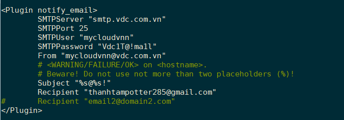
    
    - Lưu lại và restart lại dịch vụ collectd. Đẩy RAM lên (sử dụng lệnh `stress`, … ) và kiểm tra thấy đã gửi mail. Kiểm tra trong     `/var/log/syslog`:

        ```
        Apr 28 08:28:26 graphite collectd[1089]: Notification: severity = WARNING, host = graphite, plugin = memory, type = memory, type_instance = used, message = Host graphite, plugin memory type memory (instance used): Data source "value" is currently 524824576.000000. That is above the warning threshold of 500000000.000000.
        ```

    - Kiểm tra email cảnh báo: 

        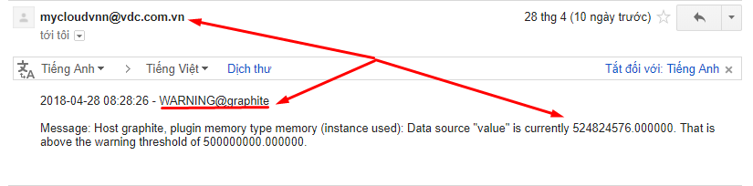

<a name = '12'></a>
## 12. Tham khảo

[1] Cấu hình plugin: https://collectd.org/documentation/manpages/collectd.conf.5.shtml 

[2] Các plugin collectd: https://collectd.org/wiki/index.php/Table_of_Plugins 

[3] Chú thích một số plugin: https://wiki.opnfv.org/display/fastpath/Collectd+Metrics+and+Events

[4] Cấu hình cảnh báo qua mail: https://github.com/hocchudong/ghichep-collectd/blob/master/CollectD/huongdan_canhbao_email.md

