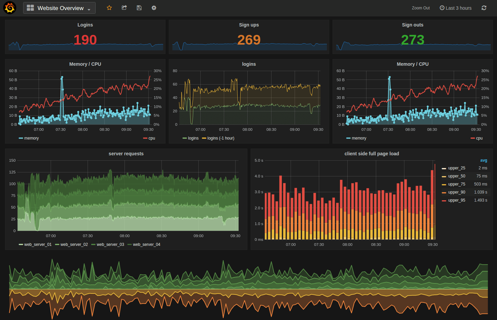
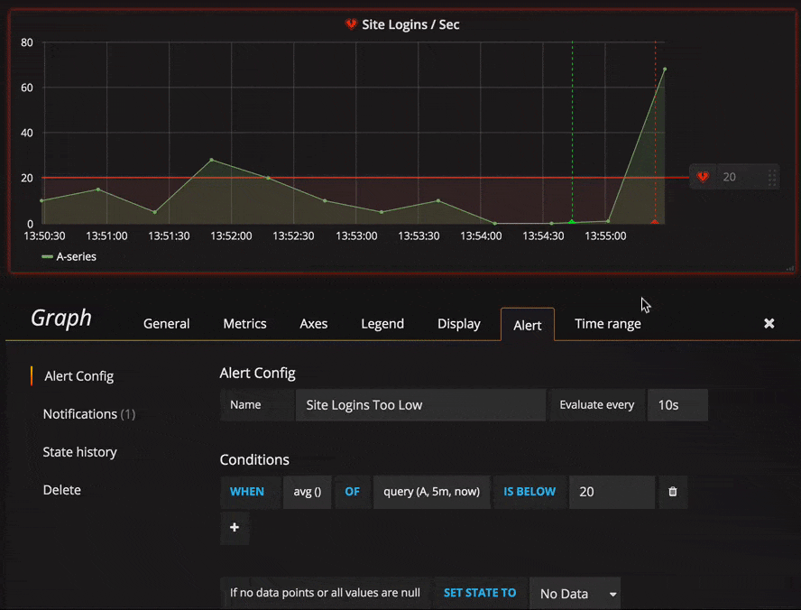
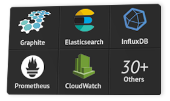
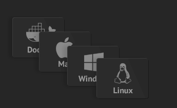
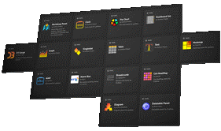
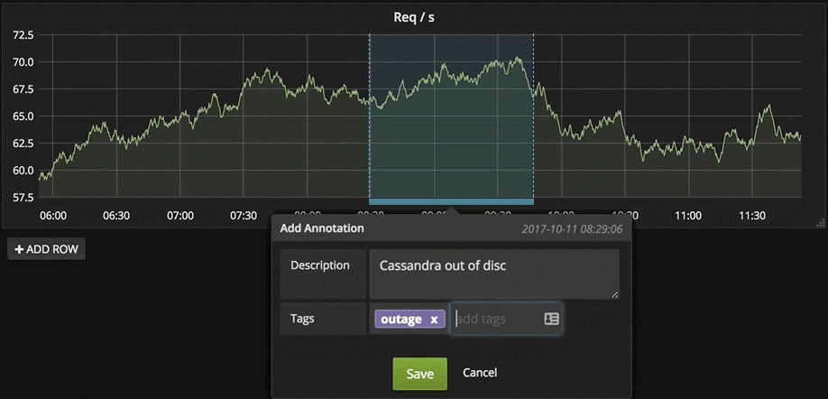

# Grafana - Nền tảng mở giám sát và phân tích dữ liệu tuyệt vời

Grafana là công cụ được tin tưởng và yêu thích bởi cộng đồng, là nền tảng phân tích tất cả các loại metric.

Grafana cho phép truy vấn, visualize (hiển thị), cảnh báo và giúp bạn hiểu metric dù chúng được lưu ở bất kì đâu. Tạo, khám phá và chia sẻ dashboard với nhóm của bạn và thúc đẩy văn hóa luồng dữ liệu.

Các tính năng:

- ***Visualize (trực quan hóa)*** : Vẽ biểu đồ từ metric được cung cấp. Grafana có rất nhiều tùy chọn visualize giúp người dùng vẽ biểu đồ một cách nhanh chóng và linh hoạt. Các panel plugin với nhiều cách khác nhau để trực quan hóa các metric và log hệ thống.

    

- ***Alerting - Cảnh báo*** : Giúp người dùng xác định các ngưỡng metric, hiển thị ngưỡng metric cảnh báo và định nghĩa các quy tắc cảnh báo. Grafana liên tục đánh giá metric và gửi cảnh báo khi metric vượt quá ngưỡng cho phép. Cảnh báo có thể được gửi qua Slack, Mail, PagerDuty, Telegram, ...
    
    

- ***Unify – Hợp nhất*** : Kết hợp dữ liệu để có cái nhìn toàn cảnh tốt hơn. Grafana hỗ trợ hàng chục loại database một cách tự nhiên, kết hợp chúng với nhau trong cùng một giao diện dashboard.

    

- ***Open - Mở***: Grafana đưa bạn nhiều tùy chọn. Nó hoàn toàn là nguồn mở, được hỗ trợ bởi cộng đồng sôi động. Có thể dễ dàng cài đặt Grafana hoặc sử dụng Hosted Grafana trên bất kì nền tảng nào.

    

- ***Extend***: Khám phá hàng trăm daaashboard và plugin trong thư viện chính thức. Nhờ đam mê và động lực của cộng đồng, một dashboard hoặc plugin mới được thêm vào mỗi tuần.

    

- ***Collaborate - Cộng tác***: mang mọi người lại với nhau, chia sẻ dữ liệu và các dashboard với các nhóm. Grafana trao quyền cho người dùng và giúp nuôi dưỡng một nền văn hóa hướng dữ liệu.

- ***Dynamic Dashboards***: Tạo và sử dụng lại các dashboards với các biến template xuất hiện ở phần đầu của dashboard

- ***Annotations - Chú thích*** : Biểu đồ chú thích có sự kiện phong phú từ các nguồn dữ liệu khác nhau. Di chuột qua các sự kiện cho bạn thấy siêu dữ liệu sự kiện đầy đủ và các thẻ tag.

    
    
=> Tóm lại: Grafana là công cụ được sử dụng với nhiệm vụ chính là trực quan hóa và phần tích dữ liệu thời gian thực – tức là nó không phải đi thu thập metric từ hệ thống cân giám sát mà chỉ công cụ để hiển thị và phân tích dữ liệu. Với giao diện đẹp mắt và nhiều tính năng tuyệt vời, Grafana được cộng đồng tin tưởng và yêu thích sử dụng. Có hơn 150000 hệ thống grafana đang hoạt động trên toàn thế giới với nhiều usecase sử dụng phong phú.

Tham khảo: Tham khao: https://grafana.com/grafana