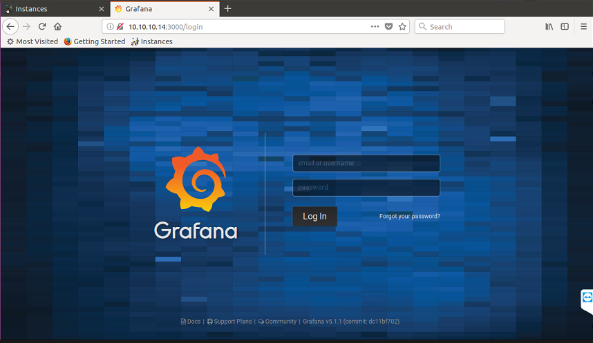
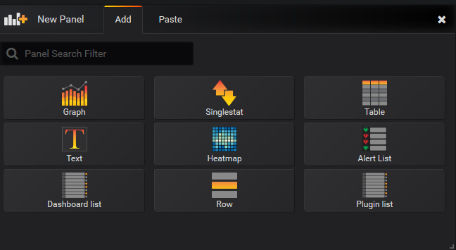
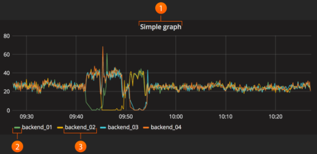
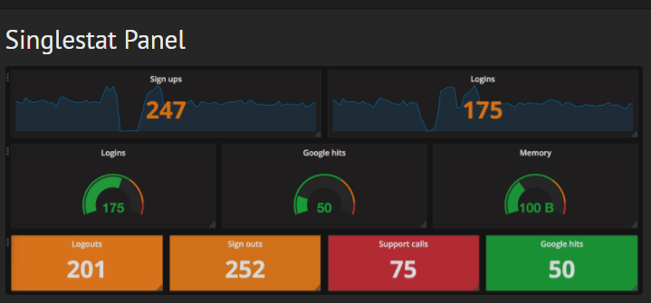
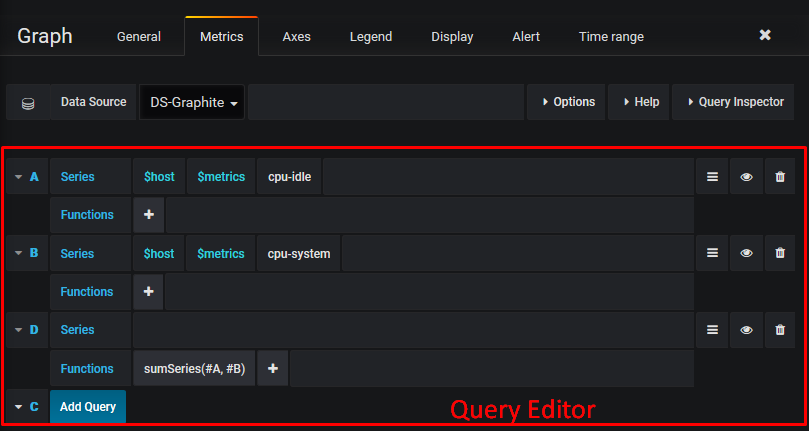

# Hướng dẫn cài đặt Grafana và một số khái niệm cơ bản trong Grafana

### ***Mục lục***

[1. Cài đặt trên Ubuntu 16.04](#1)

[2. Một số khái niệm cơ bản trong Grafana](#2)

- [Data Source](#2.1)

- [Organization](#2.2)

- [User](#2.3)

- [Panel](#2.4)

- [Query Editor](#2.5)

- [Dashboard](#2.6)

[3. Tham khảo](#3)

---

<a name = '1'></a>
## 1. Cài đặt Grafana trên Ubuntu 16.04

Phần tiếp theo hướng dẫn cài đặt Grafana trên Ubuntu 16.04. Sử dụng quyền người dùng sudo hoặc người dùng root.

- Cài đặt Grafana từ kho APT repository : 

- Thêm dòng sau vào file `/etc/apt/sources.list`:

    ```
    deb https://packagecloud.io/grafana/stable/debian/ stretch main
    ```

- Thêm Package Cloud key, cho phép bạn cài đặt các gói đã kí: 

    ```
    curl https://packagecloud.io/gpg.key | sudo apt-key add -
    ```

- Update repository trên máy và cài đặt Grafana: 

    ```
    apt-get update -y
    apt-get install grafana -y
    ```
- Thông tin các gói cài đặt:

    -	File bin: `/usr/sbin/grafana-server`

    -	Cài đặt script init.d:  `/etc/init.d/grafana-server`

    -	Tạo file biến môi trường mặc định: `/etc/default/grafana-server`

    -	File cấu hình cài đặt: `/etc/grafana/grafana.ini`

    -	Dịch vụ có tên:  grafana-server.service

    -	Cấu hình mặc định thiết lập ghi log vào file: `/var/log/grafana/grafana.log`

    -	Cấu hình mặc định xác định file sqlite3 db trong file: `/var/lib/grafana/grafana.db`  lưu các thông tin về cấu hình của giao diện của grafana.

    -	Cài đặt các file HTML/JS/CSS và các file grafana khác tại thư mục: `/usr/share/grafana/`

- Sau khi cài đặt xong, khởi động dịch vụ grafana :

    ```
    systemctl daemon-reload
    systemctl start grafana-server
    systemctl status grafana-server
    ```

- Chạy lệnh sau để khởi động grafana cùng hệ thống:

    ```
    systemctl enable grafana-server.service
    ```
- Kiểm tra trên trình duyệt dịch vụ Grafana trên cổng 3000: 

    

- Đăng nhập vào sử dụng username và password mặc định đều là **admin**. 

    

<a name = '2'></a>
## 2.	Một số khái niệm cơ bản trong Grafana:

<a name = '2.1'></a>
### Data Source

- Grafana hỗ trợ nhiều storage backend khác nhau cho các dữ liệu thời gian thực. Các DS sau được hỗ trợ chính thức: Graphite, InfluxDB, OpenTSDB, Prometheus, Elasticsearch, CloudWatch.

- Ngôn ngữ truy vấn và khả năng của mỗi DS là khác nhau. Tuy nhiên, bạn có thể kết hợp dữ liệu từ nhiều DS khác nhau trong cùng một Dashboard, nhưng mỗi Panel thuộc về một DS cụ thể thuộc về một tổ chức xác định

<a name = '2.2'></a>
### Organization

- Grafana hỗ trợ nhiều tổ chức để hỗ trợ nhiều loại mô hình triển khai, bao gồm sử dụng một máy Grafana để cung cấp dịch vụ cho các tổ chức có tiềm năng không đáng tin cậy. 

- Trong nhiều trường hợp, Grafana sẽ được triển khai với một tổ chức. 

- Mỗi tổ chức có thể có một hoặc nhiều DS. 

- Tất của các Dashboard được làm chủ bởi một tổ chức xác định. 

<a name = '2.3'></a>
### User 

- User là tên người dùng trong Grafana. Một user có thể thuộc về một hoặc nhiều tổ chức, và có thể được gán với các mức quyenf khác nhau thông qua các role. 

<a name = '2.4'></a>
### Panel
- Panel là khối trực quan hóa cơ bản trong Grafana. Mỗi Panel cung cấp một Query Editor (phụ thuộc vào DS được lựa chọn trong panel) cho phép bạn trích xuất trực quan hóa hoàn hảo để hiển thị trên Dashboard bằng cách sử dụng Query Editor. 

- Có nhiều tùy chọn để tạo kiểu và định dạng mà mỗi Panel hiển thị để cho phép tạo ra các hình ảnh hoàn hảo. 

- Các panel sau khi tạo có thể kéo, thả và sắp xếp lại trên Dashboard, và tùy chỉnh kích cỡ một cách dễ dàng thông qua sử dụng chuột. 

- Hiện có các kiểu panel: Graph, Singlestat, Dashlist, Table và Text, …

    

- Graph panel cho phép tạo đồ thị từ nhiều loại metric. 

    

- Các panel khác như singlestat yêu cầu giảm một truy vấn đơn giản thành một số duy nhất 

    

- Dashlist và Text là các panel đặc biệt mà không kết nối với bất kì DS nào. 

- Các panel cũng có thể được tạo một cách tự động hơn bằng cách sử dụng các biến Dashboard Templating trong cấu hình của panel. Phần này mình sẽ hướng dẫn sau. 

<a name = '2.5'></a>
### Query Editor 

- Query Editor cho thấy khả năng của DS và cho phép truy vấn các metric mà nó chứa. Sử dụng Query Editor để dựng lên một hoặc nhiều truy vấn (cho một hoặc nhiều chuỗi dữ liệu) trong cơ sở dữ liệu thời gian thực. Panel sẽ liên tục cập nhật cho phép khám phá hiệu quả dữ liệu thời gian thực và tạo nên truy vấn hoàn hảo.

- Ngoài ra, bạn có thể sử dụng  [Template variables](http://docs.grafana.org/reference/templating/#utilizing-template-variables-with-repeating-panels-and-repeating-rows) trong Query Editor để tự truy vấn chúng. Điều này cung cấp một cách mạnh mẽ để khám phá dữ liệu tự động dựa trên các biến Templating được chọn từ Dashboard. (Phần này sẽ hướng dẫn thêm)

- Grafana cho phép tham chiếu các truy vấn trong Queery Editor tại các dòng. Nếu bạn thêm truy vấn thứ 2 vào đồ thị, bạn có thể tham chiếu tới truy vấn thứ nhất bằng cách gõ #A. Đây là cách cung cấp sự hiệu quả và dễ dàng để xây dựng nên các truy vấn phức tạp.

    

<a name = '2.6'></a>
### Dashboard 

- Dashboard là nơi mọi thứ kết hợp với nhau. Dashboard có thể được xem như là tập hợp của một hoặc nhiều Panel được tổ chức và sắp xếp thành một hoặc nhiều hàng. 

- Trên giao diện Dashboard, bạn có thể điều khiển chu kì thời gian cập nhật metric, sử dụng các Templating tương tác một cách tự động, sử dụng Annotations để tạo chú thích cho các sự kiện trên panel. 

- Dashboard (hoặc một panel cụ thể) có thể được chia sẻ dễ dàng  bằng nhiều cách. Bạn có thể gửi link tới những người có thể đăng nhập được vào grafana. 

<a name = '3'></a>
## 3. Tham khảo

[1] Cài đặt: http://docs.grafana.org/installation/debian/

[2] Một số khái niệm: http://docs.grafana.org/guides/basic_concepts/ 
