Sau khi đã cài đặt Grafana như hướng dẫn [tại đây](./8.Cai_dat_Grafana.md#1), tiếp theo thực hiện cấu hình để Grafana hiển thị các metrics từ Graphite. 

### ***Mục lục***

[1. Thêm Data Source từ Graphite](#1)

[2. Thêm Dashboard mới](#2)

[3. Thêm Panel vào Dashboard ](#3)

[4. Cấu hình Grafana](#4)

[5. Tham khảo](#5)

---

## 1.	Thêm Data Source từ Graphite

- Grafana hỗ trợ nhiều DS khác nhau như: Graphite, InfluxDB, Promethus, OpenTSDB, ... Phần này mình hướng dẫn add thêm Datasource từ Graphite theo mô hình như sau:

    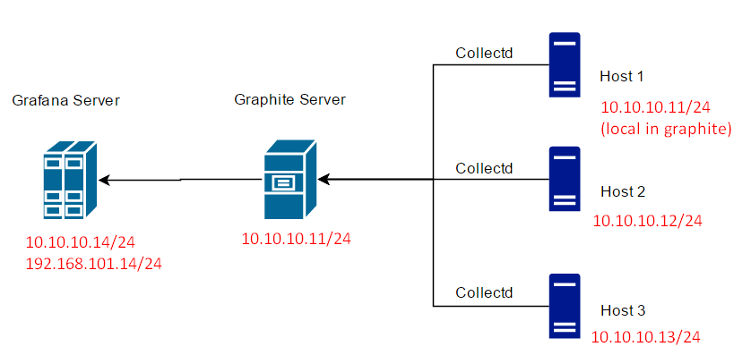

- Sau khi đăng nhập vào giao diện Grafana, click vào icon Grafana ở trên cùng để trở về giao diện home. 

- Bên dưới menu Home Dashboards, click vào **Add data source** :

    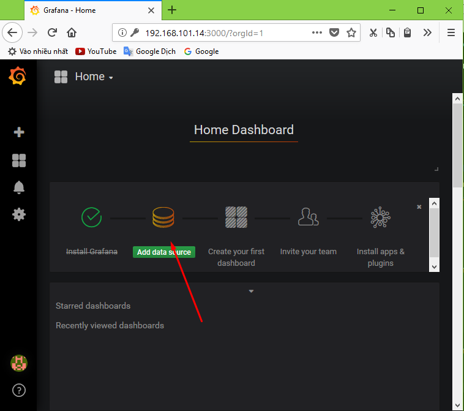

- Chọn Graphite ở thanh kéo xuống Type. (Lưu ý: nếu bước này bạn không thấy bất kì Data source nào thì nghĩa là người dùng hiện tại của bạn không có quyền Admin với tổ chức hiện tại)

- Điền các thông tin về server graphite (tên, địa chỉ, và version thích hợp):

    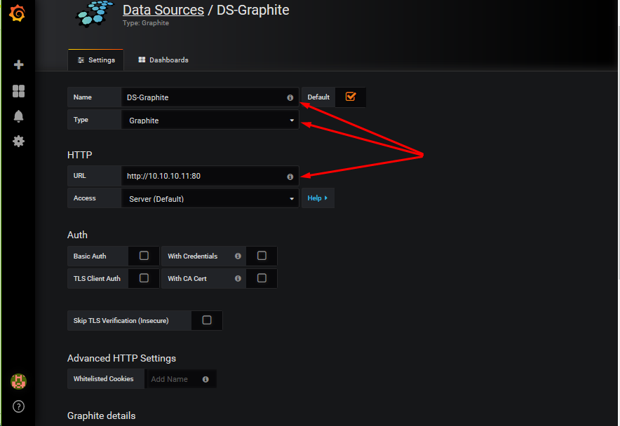
    
- Ấn **Save&Test** để lưu lại thông tin về Data Source, sau đó thấy xuất hiện thông báo add thành công là ok. 

## 2.	Thêm Dashboard mới
    
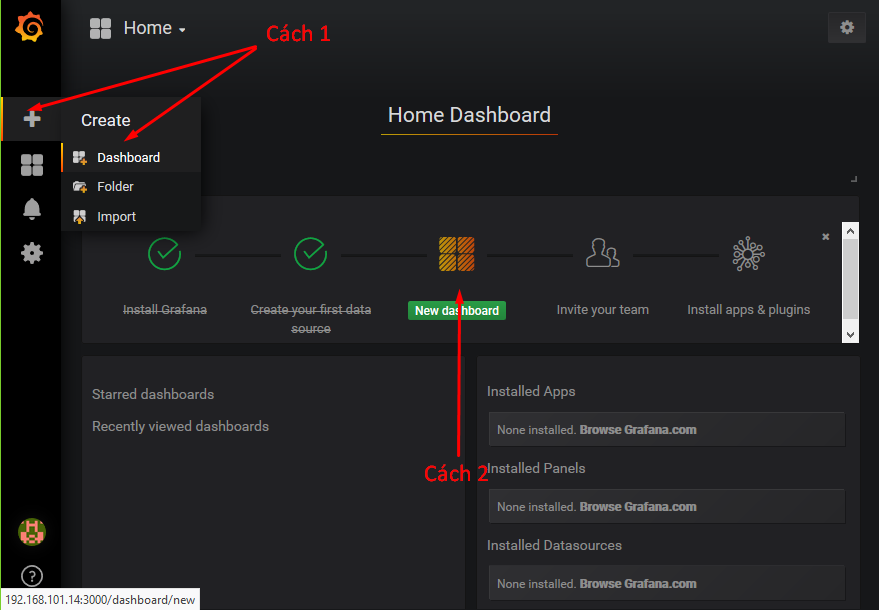

Sau khi thêm dashboard: click vào biểu tượng setting để chỉnh sửa thông tin về dashboard: 
    
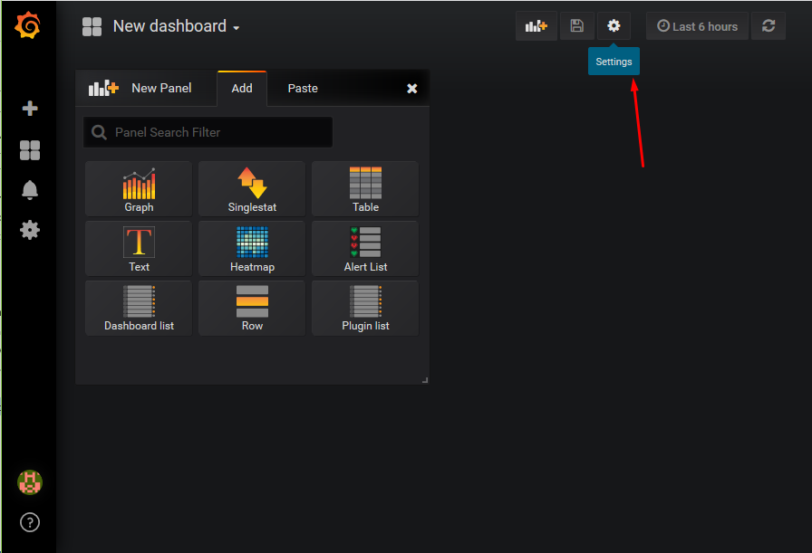

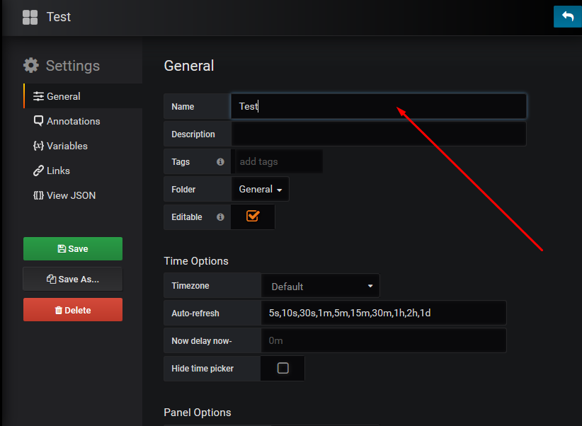

Sau khi chỉnh sửa xong, click vào Save để lưu lại dashboard. 

## 3.	Thêm panel vào dashboard 

- Trên bộ chọn Dashboard (Dashboard picker – phần trên cùng của dashboard), click vào Add panel và chọn loại panel muốn thêm theo ý, ở đây chọn graph:

    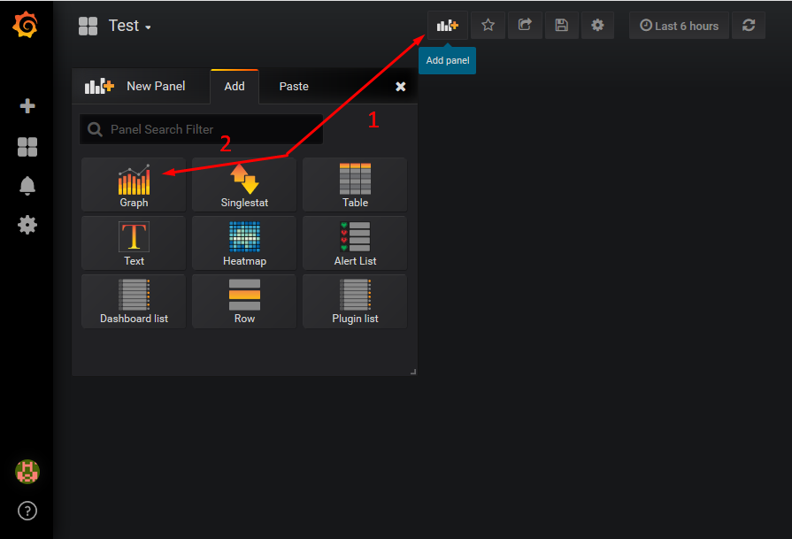

- Sau khi chọn xong sẽ hiện ra một bảng đồ thị chưa có thông tin gì cả, click vào Panel Title và chọn Edit để chỉnh sửa chọn metric muốn show: 

    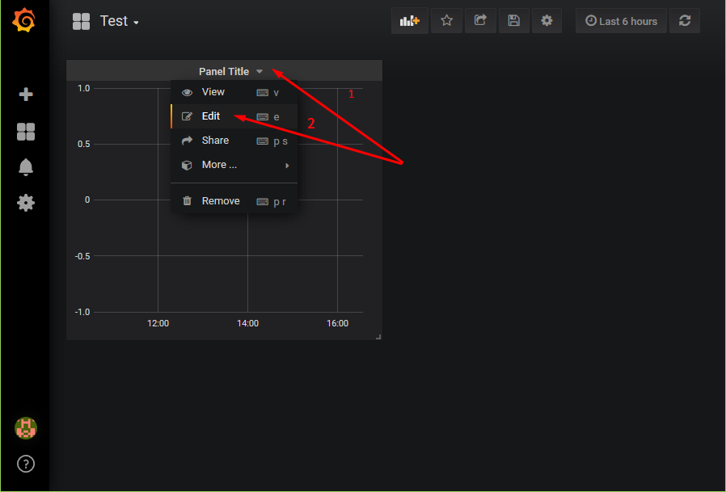

    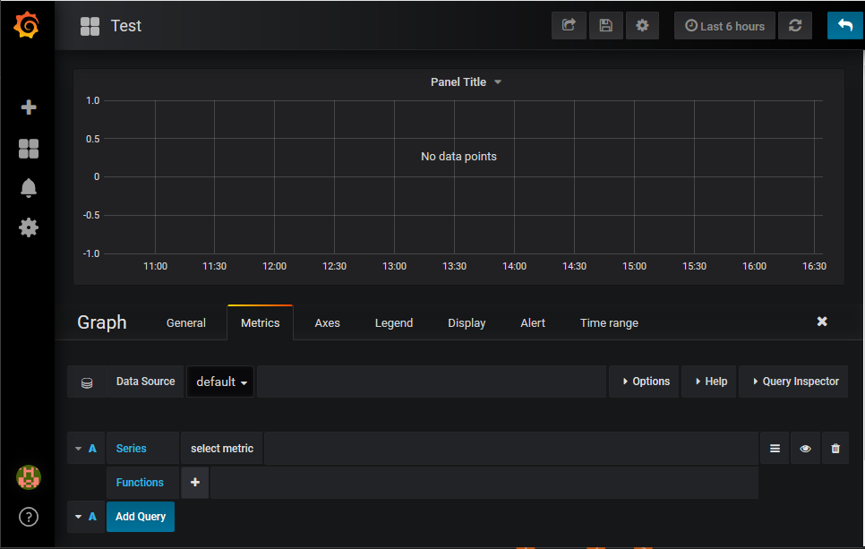

- Để cấu hình thông tin cho Graph tham khảo tại đây: http://docs.grafana.org/features/panels/graph/

- Giả sửa lưu tên đồ thị là Client3-CPU (thể hiện lượng CPU sử dụng của client3), hiển thị các thông số cpu-idle, cpu-system, cpu-user: 

    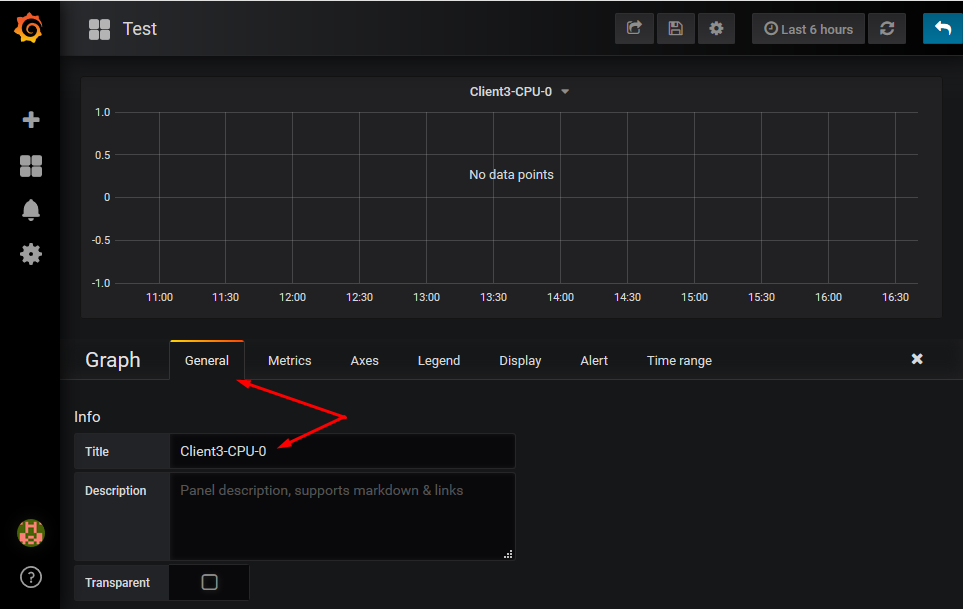

- Thêm metric của CPU-0 và add chú thích (Cách thêm chú thích tham khảo: http://docs.grafana.org/reference/annotations)  

    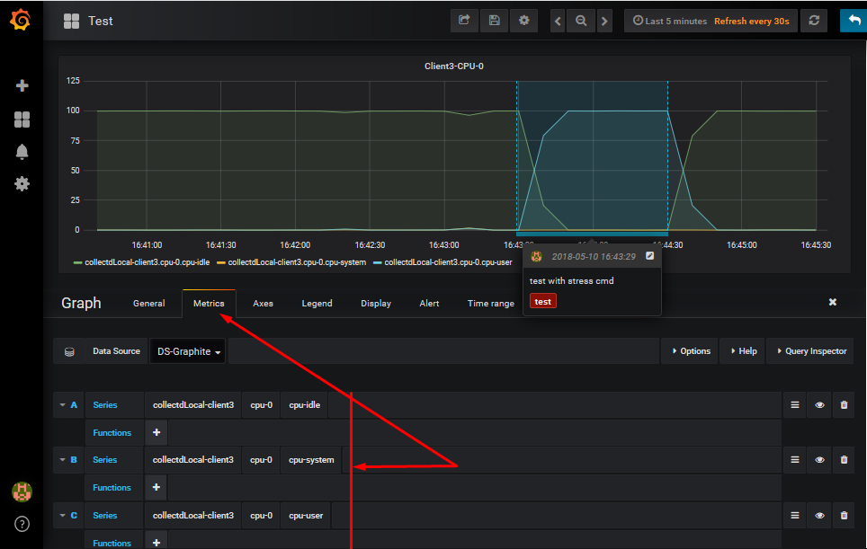

- Có thể thêm nhiều panel vào dasboard này, và lưu lại dashboard để có thể sử dụng trong những lần tiếp theo.

    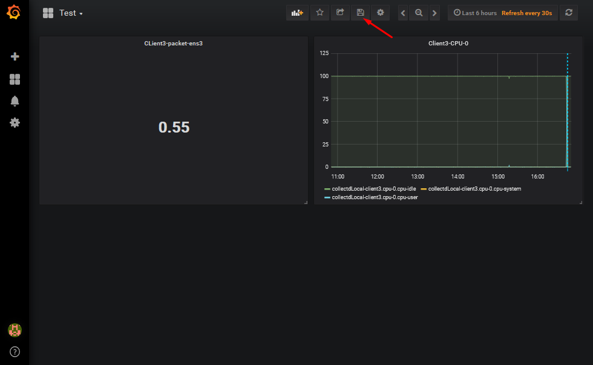

    Các hàm kết hợp và xử lý metric giống như các hàm trong Graphite. 

## 5.3.4.	Cấu hình grafana

Tham khảo cấu hình file `/etc/grafana/grafana.ini` tại đây: http://docs.grafana.org/installation/configuration/ 

## 5. Tham khảo

[1] http://docs.grafana.org/guides/getting_started/

[2] http://docs.grafana.org/features/datasources/graphite/

[3] http://docs.grafana.org/features/panels/graph/

[4] http://docs.grafana.org/installation/configuration/