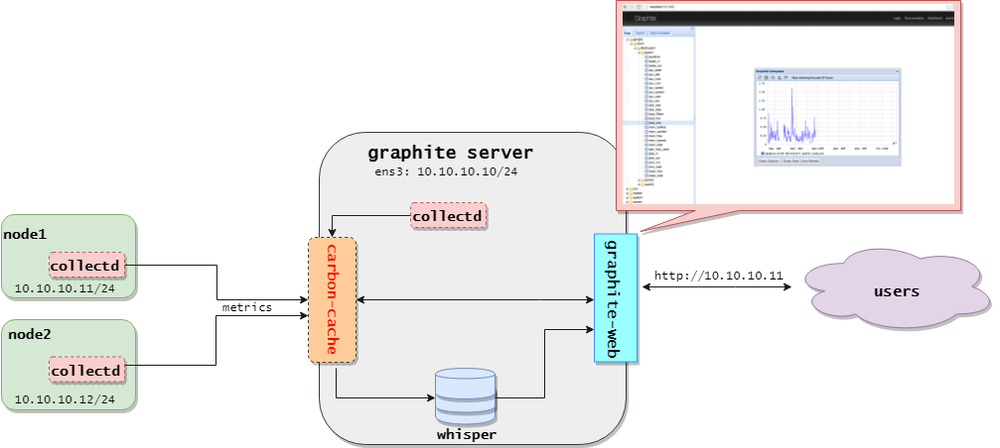

# Hướng dẫn thực thi script

## 1. Scripts cài đặt Graphite và Collectd:

Mô hình:



**Cài đặt và cấu hình Graphite server:**

- Download scripts:

    ```
    apt-get install curl -y
    curl -O https://raw.githubusercontent.com/ThanhTamPotter/thuctap012017/master/TamNT/Graphite-Collectd/scripts/graphite-install.sh
    ```

- Chỉnh sửa lại các thông số biến phần đầu scripts thích hợp với mô hình triển khai

- Chạy file script để thực hiện cài đặt:

    ```
    chmod a+x graphite-install.sh
    . graphite-install.sh

**Cài đặt và cấu hình Collectd:**

- Download scripts:

    ```
    apt-get install curl -y
    curl -O https://raw.githubusercontent.com/ThanhTamPotter/thuctap012017/master/TamNT/Graphite-Collectd/scripts/collectd-install.sh
    ```

- Sửa lại biến `ip_graphite` phù hợp với địa chỉ IP của Graphite server.

- Chạy file script để thực hiện cài đặt:

    ```
    chmod a+x collectd-install.sh
    . collectd-install.sh
