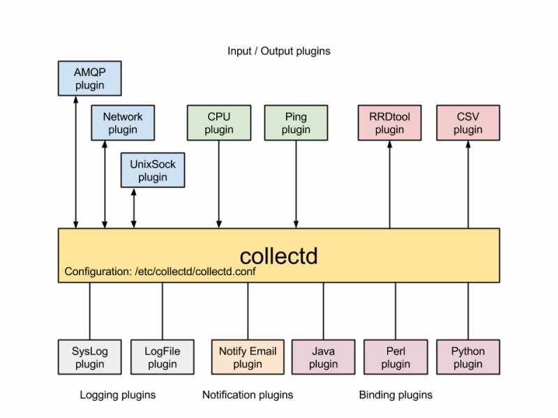

# Collectd

### ***Mục lục***

[1. Giới thiệu Collectd](#1)

[2.	Các thành phần trong collectd](#2)

[3. Các loại plugin trong collectd](#3)

- [3.1.	Các plugin lấy metric](#3.1)

- [3.2.	Các plugin ghi metric](#3.2)

- [3.3.	Các plugin ghi log](#3.3)

- [3.4.	Các plugin cảnh báo và ngưỡng](#3.4)

- [3.5.	Render đồ thị](#3.5)

[4. Tham khảo](#4)

---

## 1. Giới thiệu Collectd

- **Collectd** là một công cụ giám sát hệ thống hoàn chỉnh toàn diện với kiến trúc các plugin có thể lắp ghép tách biệt.

- Collectd trở nên quen thuộc trên các hệ thống Linux và Unix.  Các nhà phát triển collectd gọi công cụ này là : *“the system statistics collection daemon”* (Daemon thu thập các số liệu thống kê của hệ thống) – nghĩa là nó giống như nhiều công cụ giám sát hệ thống khác đã có trước đó.  Tuy nhiên, sự đơn giản, linh hoạt và tính linh động của collectd khiến nó trở thành công cụ được lựa chọn cho nhiều môi trường.

- Với nhiều người, tính năng ấn tượng của collectd là thiết kế của nó mà sự module các thành phần của collectd. Mọi thứ có thể được từ các chức năng giám sát của các plugin mà collectd core tải lên. Collectd được viết bằng C và không chứa code cụ thể cho bất kì hệ điều hành nào, do đó nó có thể hoạt động trên hầu hết các hệ thống Unix. Hơn nữa, nó còn cực kì nhẹ: bởi công cụ này yêu cầu rất ít tài nguyên, có thể chạy trên các phần cứng nhỏ (Linksys WRT54G or a Raspberry Pi)

- Collectd là daemon cực nhẹ thu thập các dữ liệu giám sát thời gian thực từ hệ thống (CPU, ổ cứng, bộ nhớ, nhiều loại cảm biến, bộ đếm OS, … ) và ghi lại thông tin đó vào vị trí mà nó được chỉ định. Collectd làm việc trên các hệ thống Unix, like Unix. Không như các công cụ giám sát khác, sức mạnh của collectd đến từ các plugin của nó, và tất cả các công việc được thực hiện nhờ vào các plugin đó.

- Chức năng của collectd đơn giản là tập hợp các số liệu thống kê về hệ thống và lưu lại các thông tin đó. 

## 2.	Các thành phần trong collectd

3 thành phần chính của Collectd là loại plugin sau:

-	Loại 1: để lấy (đọc) dữ liệu (metrics) (type: read)

-	Loại 2: ghi lại dữ liệu (type: write)

-	Loại 3: ghi log (type: logging)

-	Loại: plugin thông báo (type: notification) 

Ngoài ra còn một số loại plugin khác. Ví dụ: network plugin kết nối các dịch vụ collectd với nhau. Hay một số plugin thông báo như `notify_email`

Collectd là công cụ dễ cài đặt, làm việc theo mô hình client – server. Tuy nhiên, collectd cũng có thể tự chạy trên các máy host muốn giám sát.

***Luồng làm việc***: Số liệu thống kê (metrics) trao đổi giữa các collectd client và server. Các plugin đọc dữ liệu thu thập các dữ liệu giám sát trên các hệ thống cần theo dõi, và sau đó các plugin ghi sẽ gửi tới các collecd server thông qua một giao thức riêng biệt. Server sẽ đánh giá và xử lý dữ liệu, biểu diễn kết quả lên giao diện web. Giao diện web chủ yếu biểu diễn các đồ thị RRD mà từ đó có thể kiểm tra trạng thái các dịch vụ theo thời gian.

## 3. Các loại plugin trong collectd

### 3.1.	Các plugin lấy metric

- Là các plugin mà collectd sử dụng để thu thập các metric từ hệ thống. Như: CPU, memory, disk, apache, nhiệt độ, interface mạng,ping, process, …

- Mặc định nhiều plugin đó bị vô hiệu hóa, nhưng việc kích hoạt các plugin này khá dễ dàng.

- Các plugin của collectd có thể xem tại đây: https://collectd.org/wiki/index.php/Table_of_Plugins 

### 3.2.	Các plugin ghi metric

- Là các plugin là đích đến cho các dữ liệu mà collectd thu thập được. Bạn có thể viết dữ liệu vào các file `CSV`, `RDDtoool`, `AMQP` (`RabbitMQ`), `Kafka`, `Carbon và Graphite`, `http`, `mongo`, `redis` và một vài công cụ khác. (sử dụng các plugin tương ứng để thực hiện việc này)

- **RRDtool** là plugin ghi các giá trị mà các plugin lấy metric thu thập được vào các file RRD sử dụng thư viện `librrd`. Các metric sau khi được thu thập, để lưu trữ lại cần các plugin write để lưu trữ thông tin đó. Rrdtool là plugin lưu trữ các metric tại nội bộ máy thu thập collectd.

- Các plugin này ngoài việc ghi lại metric thu thập được và lưu trữ trên máy, một số plugin có thể hỗ trợ đẩy dữ liệu đó từ các máy collectd phân tán tới các máy chủ tập trung. 
	Một số plugin tùy chọn như:
	
	-	Plugin network (https://collectd.org/wiki/index.php/Networking_introduction), cho phép một collectd daemon thu thập metric và đẩy tới cho một collectd daemon khác.

	-	Đẩy metric tới AMQP message broker, như RabbitMQ hoặc ActiveMQ. Không chỉ collectd có thể ghi vào hàng đợi message, nó cũng có thể đọc dữ liệu từ đó, nên nhiều daemon có thể đẩy dữ liệu đến các máy chủ riêng biệt.

	-	Đẩy tới Carbon (trên Graphite): plugin `write_graphite`.

### 3.3.	Các plugin ghi log

-Là các plugin sử dụng để ghi log lại các sự kiện hoặc cảnh báo được gửi tới collectd. 

- Một số plugin: `syslog`, `logfile`, …

- Kích hoạt các plugin này là việc làm cần thiết ngay từ ban đầu khi cấu hình collectd, để các plugin khác khi hoạt động có thể gửi báo cáo về các lỗi hoặc gửi cảnh báo trong quá trình hoạt động. Từ đó, người dùng sẽ theo dõi và xử lý nếu có vấn đề xảy ra.

### 3.4.	Các plugin cảnh báo và ngưỡng

- Từ phiên bản 4.3, collectd có thêm các plugin về cảnh báo. 

- Các cảnh báo là một đoạn tin nhắn text về mức độ nghiêm trọng và thời gian xảy ra sự cố. Chúng được sử dụng để thông báo cho người dùng khi có các sự kiện cần chú ý, chẳng hạn như tải CPU cao bất thường hoặc thực hiện kiếm tra tình trạng máy chủ không thành công. Đoạn text cảnh báo này không tuân theo bất kì giao thức hoặc thông số kĩ thuật cụ thể nào và đoạn text thông báo được tạo bởi collectd có thể thay đổi mà không có thông báo giữa các phiên bản. Nếu việc giải thích đoạn text trở nên cần thiết, ta sẽ thêm vào một trường hoặc flag cho mục đích đó. Mức độ nghiêm trọng có thể là: `OKAY`, `WARNING`, hoặc `FAILURE` với ý nghĩa tương ứng. 

- Các cảnh báo được gửi đi cùng cách mà dữ liệu được gửi đi. Có loại “producers”  - là các plugin tạo ra thông báo, và “consumer”  - các plugin nhận thông báo và xử lý chúng. 

- Một số plugin cảnh báo: `exec`, `logfile`, `network`, `perl`, `syslog`, `unixsock`, … 

### 3.5.	Render đồ thị

- Dữ liệu thu thập được lưu dưới file text hoặc file nhị phân, nhưng cũng vô ích vì chúng chưa nói lên điều gì với người dùng. Khi nhìn vào các thông số trong cột của CPU thì chúng ta cũng không rõ được hệ thống đang hoạt động tốt hay không. Bởi collectd chưa có cơ chế render ra đồ thị - dạng dễ nhìn hơn cho người dùng.  Nó chỉ đơn thuần là thu thập lại dữ liệu.

- Tuy nhiên, có một vài cách để render đồ thị từ các metrics mà collectd thu thập được và lưu lại:

	- Các front-end `collection3` và `collectd-web` cho phép render ra đồ thị từ các file RRD mà collectd đã tạo.  Sử dụng rrdtool và các file rrd đầu ra mà dữ liệu ghi vào. 

	- Carbon và graphite-web là các giao diện web lắng nghe dữ liệu thời gian thực và render đồ thị từ đó. Collectd có một plugin dùng để ghi metric vào dịch vụ Carbon, mà từ đó graphite dùng dữ liệu đó để render ra đồ thị.

- Một số front-end hỗ trợ render dữ liệu từ collectd tham khảo tại: https://collectd.org/wiki/index.php/List_of_front-ends

## 4. Tham khảo

[1] Các thành phần collectd: https://codeblog.dotsandbrackets.com/host-monitoring-with-collectd/ 

[2] http://www.admin-magazine.com/Archive/2014/21/Monitoring-with-collectd-4.3

[3] plugin notification: https://collectd.org/wiki/index.php/Notifications_and_thresholds 
