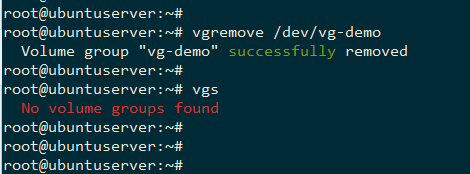
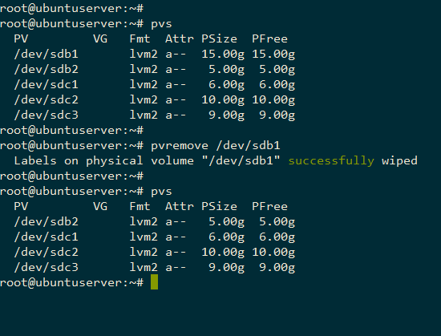

TÌM HIỂU LVM

## ***Mục lục***

[1. Tìm hiểu tổng quan LVM](#1)

- [1.1. LVM là gì?](#1.1)

- [1.2. Vai trò của LVM](#1.2)

- [1.3. Các thành phần của LVM](#1.3)

[2. Lab minh họa tính năng LVM](#2)

- [2.1. Chuẩn bị](#2.1)

- [2.2. Các bước tạo Logical volume sử dụng LVM](#2.2)

- [2.3. Một số thay đổi kích thước volume group và logical volume](#2.3)

	- [2.3.1. Một số câu lệnh với LVM](#2.3.1)

	- [2.3.2. Thay đổi kích thước logical volume](#2.3.2)

	- [2.3.3. Thay đổi kích thước volume group](#2.3.3)

- [2.4. Xóa logical volume, volume group và physical volume](#2.4)

[3. Tham khảo](#3)


---

<a name = '1'></a>
# 1. Tìm hiểu tổng quan LVM

<a name = '1.1'></a>
# 1.1. LVM là gì?

***Logical Volume Manager (LVM)***


- Là phương pháp cho phép ấn định không gian đĩa cứng thành những logical Volume khiến cho việc thay đổi kích thước trở nên dễ dàng hơn (so với partition). 

- Với kỹ thuật Logical Volume Manager (LVM) bạn có thể thay đổi kích thước mà không cần phải sửa lại table của OS. 

- Điều này thật hữu ich với những trường hợp bạn đã sử dụng hết phần bộ nhớ còn trống của partition và muốn mở rộng dung lượng của nó


<a name = '1.2'></a>
# 1.2. Vai trò của LVM

- LVM là kỹ thuật quản lý việc thay đổi kích thước lưu trữ của ổ cứng

- Không để hệ thống bị gián đoạn hoạt động

- Không làm hỏng dịch vụ

- Có thể kết hợp Hot Swapping (thao tác thay thế nóng các thành phần bên trong máy tính)

<a name = '1.3'></a>
# 1.3. Các thành phần của LVM


- **Hard drives - Drives**: Thiết bị lưu trữ dữ liệu, ví dụ như là các loại ổ cứng HDD, SSD, USB... 

- **Partition**: Partitions là các phân vùng của Hard drives, mỗi Hard drives thường có 4 partition, trong đó partition bao gồm 2 loại là **primary partition** và **extended partition**

	- Primary partition:
		
		- Phân vùng chính, có thể khởi động

		- Mỗi đĩa cứng có thể có tối đa 4 phân vùng này

	- Extended partition: Phân vùng mở rộng, có thể tạo những vùng luận lý (vùng logic).

- **Physical Volumes**: 

	- Là những đại vật lý hoặc phân vùng đĩa của bạn chẳng hạn như /dev/hda hoặc /dev/sdb1. Khi muốn sử dụng chỉ cần mount vào là được

	- Là một cách gọi khác của partition trong kỹ thuật LVM, nó là những thành phần cơ bản được sử dụng bởi LVM. Một Physical Volume không thể mở rộng ra ngoài phạm vi một ổ đĩa.

	- Chúng ta có thể kết hợp nhiều Physical Volume lại thành Volume Groups để dễ dàng trong việc quản lý và phân chia.

- **Volume Group**: Là một nhóm bao gồm nhiều Physical Volume trên những ổ đĩa khác nhau được kết hợp lại thành một Volume Group


Volume Group được sử dụng để tạo ra các Logical Volume, trong đó người dùng có thể tạo, thay đổi kích thước, lưu trữ, gỡ bỏ và sử dụng.

Một điểm cần lưu ý là boot loader không thể đọc `/boot` khi nó nằm trên Logical Volume Group. Do đó không thể sử dụng kỹ thuật LVM với /boot mount point

- **Logical Volume**: Volume Group được chia nhỏ thành nhiều Logical Volume, mỗi Logical Volume có ý nghĩa tương tự như partition. Nó được dùng cho các mount point và được format với những định dạng khác nhau như ext2, ext3, ext4, … 


	- Khi dung lượng của Logical Volume được sử dụng hết ta có thể đưa thêm ổ đĩa mới bổ sung cho Volume Group và do đó tăng được dung lượng của Logical Volume

	- Ví dụ bạn có 4 ổ đĩa mỗi ổ 5GB khi bạn kết hợp nó lại thành 1 volume group 20GB, và bạn có thể tạo ra 2 logical volumes mỗi disk 10GB.

- **File Systems**:

	- Tổ chức và kiểm soát các tập tin.

	-  Được lưu trữ trên ổ đĩa cho phép truy cập nhanh chóng và an toàn.

	- Sắp xếp dữ liệu trên đĩa cứng máy tính.

	- Quản lý vị trí vật lý của mọi thành phần dữ liệu.

<a name = '2'></a>
# 2. Lab minh họa tính năng LVM


<a name = '2.1'></a>
# 2.1. Chuẩn bị

- Sử dụng máy ảo Ubuntu 16.04 cài trên VMware, cấu hình thêm 3 ổ cứng như hình: 


Như vậy, ta có tông cộng 3 ổ cứng, một ổ đầu tiên cài HĐH, còn lại 2 ổ tổng cộng 45GB để cấu hình LVM.

- Bật máy và cài đặt gói phần mềm lvm:

	`sudo apt-get install lvm2 -y`

<a name = '2.2'></a>
# 2.2. Các bước tạo Logical volume sử dụng LVM

## Bước 1: Kiểm tra các Hard Drives có trên hệ thống

Sử dụng lệnh `lsblk` để kiểm tra như sau: 


Có thể thấy, ổ cứng /dev/sda đã được phân vùng và cài HĐH, còn 2 ổ cứng sdb và sdc sẽ dùng để tạo LVM.

## Bước 2: Phân vùng - Tạo các partition cho Hard drive

Sử dụng lệnh `fdisk` để tạo phân vùng như sau (dùng tùy chọn 	`m` để xem hướng dẫn):

`fdisk /dev/sdb`


- `n` tạo phân vùng mới.
 
- `t` thay đổi kiểu phân vùng, chuyển sang LVM (code: 8e)

- `w` lưu lại thay đổi. 


Tương tự, tạo thêm các phân vùng còn lại và cho cả sdc. 

Ví dụ như sau: 


## Bước 3: Tạo Physical Volume

Tạo các Physical Volume là /dev/sdb1, /dev/sdb2 , /dev/sdc1 , /dev/sdc2 và /dev/sdc3 bằng các lệnh sau

```
pvcreate /dev/sdb1
pvcreate /dev/sdb2
pvcreate /dev/sdc1
pvcreate /dev/sdc2
pvcreate /dev/sdc3
```

Kiểm tra các Physical Volume bằng câu lệnh `pvs` hoặc có thể sử dụng lệnh `pvdisplay`


## Bước 4: Tạo Volume Group

Tiếp theo, nhóm các Physical Volume thành 1 Volume Group bằng cách sử dụng câu lệnh sau:

`vgcreate vg-demo /dev/sdb1 /dev/sdb2 /dev/sdc1 /dev/sdc2 /dev/sdc3`

Trong đó vg-demo là tên của Volume Group.

Có thể sử dụng câu lệnh `vgs` hoặc `vgdisplay` để kiểm tra lại các Volume Group đã tạo


## Bước 5: Tạo Logical Volume

Từ một Volume Group, chúng ta có thể tạo ra các Logical Volume bằng cách sử dụng lệnh sau:

`lvcreate -L 22G -n lv-demo1 vg-demo`

Trong đó:

	-L: Chỉ ra dung lượng của logical volume

	-n: Chỉ ra tên của logical volume

**lv-demo1** là tên Logical Volume, **vg-demo** là Volume Group mà mình vừa tạo ở bước trước.

Lưu ý là chúng ta có thể tạo nhiều Logical Volume từ 1 Volume Group

Kiểm tra lại các Logical Volume đã tạo sử dụng `lvs` hoặc `lvdisplay`


## Bước 6: Định dạng Logical Volume 

Để format các Logical Volume thành các định dạng như ext2, ext3, ext4, ta có thể làm như sau:

`mkfs -t ext4 /dev/vg-demo/lv-demo1`


Kiểm tra lại dùng `fdisk -f`: 


## Bước 7: Mount và sử dụng

- Tạo thư mục demo1

	`mkdir demo1`

- Tiến hành mount logical volume lv-demo1 vào thư mục demo1 như sau:

	`mount /dev/vg-demo/lv-demo1 demo1`

- Kiểm tra lại dung lượng của thư mục đã được mount:

	`df -h`


Vậy là đã hoàn thành các bước cấu hình cơ bản và sử dụng LVM.

<a name = '2.3'></a>
## 2.3. Một số thay đổi kích thước volume group và logical volume

<a name = '2.3.1'></a>
### 2.3.1. Một số câu lệnh của LVM:


<a name = '2.3.2'></a>
### 2.3.2. Thay đổi kích thước Logical volume

#### Tăng kích thước Logical volume

Giả sử cần tăng dung lượng Logical Volume lv-demo1 vừa tạo do Logical Volume này dung lượng đã đầy .

Logical Volume này thuộc Volume Group `vg-demo`, để tăng kích thước, bước đầu tiên phải kiểm tra xem Volume Group còn dư dung lượng để kéo giãn Logical Volume không. Logical Volume thuộc 1 Volume Group nhất định, Volume Group đã cấp phát hết thì Logical Volume cũng không thể tăng dung lượng được. Để kiểm tra, ta dùng lệnh sau:


Volume Group ở đây vẫn còn dung lượng để cấp phát, ta có thể nhận thấy điều này qua 2 trường thông tin là VG Status: resizable và  Free  PE/Size: 5883/22.98 GiB với dung lượng Free là 5883*4 = 23532 MB ~ 22.9GB

=> Tăng kích thước volume

Để tăng kích thước Logical Volume ta sử dụng câu lệnh sau:

`lvextend –L [+]<size> <logic-volumn>`

Ví dụ:

`lvextend -L +5G /dev/vg-demo/lv-demo1`

Với -L là tùy chọn để tăng kích thước. Nếu không có dấu + thì sẽ đưa kích thước Loical Volume lv-demo1 thành 5G.


Tuy nhiên, sau khi tăng kích thước cho Logical Volume thì Logical Volume đã được tăng nhưng file system trên volume này vẫn chưa thay đổi, bạn phải sử dụng lệnh sau để thay đổi:

`resize2fs /dev/vg-demo/lv-demo1`


#### Giảm kích thước logical volume

- Để giảm kích thước của Logical Volume, trước hết các bạn phải umount Logical Volume mà mình muốn giảm:

`umount /dev/vg-demo/lv-demo1`

- Tiến hành giảm kích thước của Logical Volume

`lvreduce -L -1G /dev/vg-demo/lv-demo1`

Trong ví dụ này, ta giảm lv-demo1 đi 1GB (nếu không có dấu trừ sẽ giảm kích thước volume xuống còn 1G)


- Sau đó tiến hành format lại Logical Volume:

	`mkfs.ext4 /dev/vg-demo/lv-demo1`

- Cuối cùng là mount lại Logical Volume:

	`mount /dev/vg-demo/lv-demo1 demo1`
	
- Kiểm tra kết quả ta được như sau:


<a name = '2.3.3'></a>
### 2.3.3. Thay đổi dung lượng Volume Group trên LVM

Việc thay đổi kích thước của Volume Group chính là việc nhóm thêm Physical Volume hay thu hồi Physical Volume ra khỏi Volume Group.

Thực hiện tương tự như logical volume. Sử dụng lệnh `vgextended` để tăng thêm physical volume và `vgreduce` để cắt bớt physical volume.

<a name = '2.4'></a>
## 2.4. Xóa logical volume, volume group và physical volume.

- Xóa Logical Volumes

	- Trước tiên ta phải Umount Logical Volume:

		`umount /dev/vg-demo/lv-demo1`

	- Sau đó tiến hành xóa Logical Volume bằng câu lệnh sau:

		`lvremove /dev/vg-demo/lv-demo1`

	Ta kiểm tra lại kết quả:

	```
	root@ubuntuserver:~#
	root@ubuntuserver:~# umount /dev/vg-demo/lv-demo1
	root@ubuntuserver:~#
	root@ubuntuserver:~# lvremove /dev/vg-demo/lv-demo1
	Do you really want to remove and DISCARD active logical volume lv-demo1? [y/n]: y
	  Logical volume "lv-demo1" successfully removed
	root@ubuntuserver:~#
	root@ubuntuserver:~# lsblk
	NAME   MAJ:MIN RM   SIZE RO TYPE MOUNTPOINT
	sda      8:0    0    20G  0 disk
	├─sda1   8:1    0    19G  0 part /
	├─sda2   8:2    0     1K  0 part
	└─sda5   8:5    0  1022M  0 part [SWAP]
	sdb      8:16   0    20G  0 disk
	├─sdb1   8:17   0    15G  0 part
	└─sdb2   8:18   0     5G  0 part
	sdc      8:32   0    25G  0 disk
	├─sdc1   8:33   0     6G  0 part
	├─sdc2   8:34   0    10G  0 part
	└─sdc3   8:35   0     9G  0 part
	sr0     11:0    1   579M  0 rom
	root@ubuntuserver:~#
	```

- Xóa Volume Group: Trước khi xóa Volume Group, chúng ta phải xóa Logical Volume

	Xóa Volume Group bằng cách sử dụng lệnh sau:

	`vgremove /dev/vg-demo`

	

- Xóa Physical Volume: Cuối cùng là xóa Physical Volume:

	`pvremove /dev/sdb1`

	

<a name = '3'></a>
# 3. Tham khảo

[1] http://kenhgiaiphap.vn/Detail/1041/Quan-ly-dia-tren-linux-dung-ky-thuat-LVM-(Phan-1).html

[2] https://github.com/hocchudong/Logical-Volume-Manager-LVM-/blob/master/T%C3%ADnh%20n%C4%83ng%20c%E1%BB%A7a%20LVM.md

[3] https://github.com/meditechopen/meditech-thuctap/blob/master/ThaoNV/Tim%20hieu%20LVM/Lab-LVM.md
