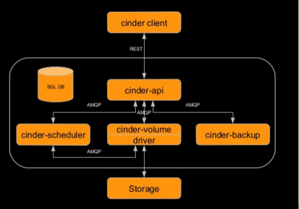

# Tổng quan Cinder

## ***Mục lục***

[1. Giới thiệu Cinder](#1)

- [1.1. Giới thiệu ](#1.1)

- [1.2. Các đặc điểm](#1.2)

- [Kiến trúc Cinder](#1.3)

[2. Các thành phần](#2)

[3. Tham khảo](#3)

---

# 1. Giới thiệu Cinder

## 1.1. Giới thiệu

- Dịch vụ **block storage** cung cấp các tài nguyên lưu trữ dạng block theo kiểu persistent mà máy ảo compute có thể sử dụng. Đây là dịch vụ lưu trữ thứ cấp giống với dịch vụ lưu trữ Amazone Elastic Block Storage (EBS). Ngoài ra, bạn có thể ghi image vào một thiết bị lưu trữ Block storage cho Compute để sử dụng như là boot một máy ảo.

- Dịch vụ Block storage khác với Amazon EBS. Dịch vụ Block storage không cung cấp giải pháp lưu trữ dùng chung như NFS. Với dịch vụ Block Storage, bạn có thể gán một thiết bị chỉ với một máy ảo. 

	

- Trong Openstack, dịch vụ này được triển khai dưới tên gọi là **Cinder**.

## 1.2. Các chức năng

-	Cung cấp và quản lý các tài nguyên lưu trữ dạng  persistent block storage  (volume) cho các máy ảo.

-	Các volume này có thể được tách từ máy ảo này và gán lại vào một máy ảo khác, mà dữ liệu được giữ nguyên không bị thay đổi.

-	Hiện tại, một volume chỉ có thể được gán (attached) và một máy ảo tại một thời điểm.

-	Các volume tồn tại độc lập với các máy ảo (tức là khi máy ảo bị xóa thì volume không bị xóa).

-	Phân chia tài nguyên lưu trữ thành các khối gọi là Cinder volume.

-	Cung cấp các API như là tạo, xóa, backup, restore, tạo snapshot, clone volume và nhiều hơn nữa. Những API này thực hiện bởi các backend lưu trữ mà được cinder hỗ trợ.

-	Các kiến trúc plugin drive cho phép nhiều lựa chọn làm backend storage.

## 1.3. Kiến trúc Cinder

Các dịch vụ mà Block Storage - Cinder cung cấp là:

-	**cinder-api** - một ứng dụng WSGI dùng để xác thực và định tuyến các request yêu cầu trong dịch vụ Block Storage. Nó chỉ hỗ trợ các API của OpenStack, mặc dù có một translation có thể được thực hiện thông qua giao diện EC2 của Compute, mà sẽ gọi đến Block storage client. 

-	**cinder-scheduler** - lập lịch trình và định tuyến  các request yêu cầu tới một volume thích hợp. Tùy thuộc vào cấu hình của bạn, việc này có thể là lập lịch trình kiểu round-robin đơn giản cho các dịch vụ volume đang chạy, hoặc nó có thể phức tạp hơn thông qua việc sử dụng Filter Scheduler. Bộ lọc Filter Scheduler là cấu hình mặc định và cho phép bộ lọc về những thứ như Dung lượng - Capacity, Availability Zone, Volume Types, và Capabilities vcũng như các bộ lọc tùy chỉnh. 

-	**cinder-volume** : quản lý các thiết bị Block Storage, cụ thể là các thiết bị back-end của chính chúng. 

-	**cinder-backup**: cung cấp một phương tiện để sao lưu một Bloack storage volume tới khối lưu trữ OpenStack Object storage (Switf).

	

-	**cinder-client**: CLI/UI để tạo request

-	**drive**: chứa các backend xác định để liên kết với nhiều loại storage khác nhau

-	**Storage**: Các nhà cung cấp thiết bị lưu trữ backend khác nhau

-	**SQL DB**: theo dõi các volume đang được sử dụng

# 2.	Các thành phần Cinder

Dịch vụ Block Storage chứa các thành phần sau: 

- **Back-end Storage Devices**: dịch vụ Block Storage yêu cầu một số dạng lưu trữ back-end là nền tảng để triển khai. Việc triển khai mặc định là sử dụng LVM trên một logical volume group tên là `'cinder-volumes'`. Ngoài việc triển khai trên drive mặc định, dịch vụ Block Storage còn cung cấp phương tiện để hỗ trợ các thiết bị lưu trữ khác được sử dụng như Raid Array hoặc các thiết bị lưu trữ khác. Các back-end này có thể tùy chỉnh kích thước block khi sử dụng KVM hoặc QEMU làm hypervisor.

- **Users và Tenants (Projects)**: dịch vụ Block Storage có thể được sử dụng bởi nhiều khách hàng hoặc khách hàng điện toán đám mây khác nhau (những tenant trên một hệ thống shared system), sử dụng gán quyền truy cập theo role. Các role điểu khiển các hành động mà người dùng được phép thực hiện. Trong cấu hình mặc định, hầu hết các hành động không yêu cầu role cụ thể, nhưng điều này có thể được cấu hình bởi quản trị viên hệ thống trong tệp `policy.json` thích hợp để duy trì các quy tắc. Quyền truy cập vào một volume cụ thể của người dùng bị giới hạn bởi tenant (project), nhưng tên người dùng và mật khẩu được chỉ định cho mỗi người dùng. Các cặp khóa key-pairs cho phép truy cập vào một volume được kích hoạt cho mỗi người dùng, nhưng hạn ngạch quotas để kiểm soát tài nguyên sử dụng trên các thiết bị phần cứng có sẵn là cho mỗi tenant.
Với các tenant, kiểm soát quota có thể hạn chế:

	-	Số volume có thể tạo.

	-	Số snapshot có thể tạo.

	-	Tổng dung lượng (GB) cho phép mỗi tenant (được chia sẻ giữa các bản snapshot và volume).

	Bạn có thể điều chỉnh được lượng quota mặc định với Block storage CLI, nhưng lượng quota đó vẫn có thể điều chỉnh bởi người dùng admin.

- **Volume, Snapshots và Backups** - các tài nguyên cơ bản được cung cấp bởi dịch vụ Block Storage là các volume và snapshots có nguồn gốc từ volume và volume backup: 

	-	***Volumes***- cấp phát tài nguyên lưu trữ block  storage có thể gắn với các instance như secondary storage hoặc chúng có thể được sử dụng như là root store để boot máy ảo. Volume là thiết bị lưu trữ dạng block R/W persistent được gắn với node compute thông qua giao thức iSCSI.

	-	***Snapshot***: bản copy tại một thời điểm của volume. Snapshot có thể được tạo ra từ một volume hiện đang được sử dụng (thông qua sử dụng tùy chọn --force True) hoặc ở trạng thái available. Snapshot sau đó có thể được sử dụng để tạo một volume mới thông qua việc tạo từ Snapshot.

	-	***Backups***: một bản copy lấy được từ volume hiện tại được lưu trữ trong Object storage (Swift).

***Trên đây chỉ là một vài thông tin sơ bộ, chi tiết về Cinder tìm hiểu kĩ hơn [tại đây.](https://github.com/hocchudong/ghichep-OpenStack/tree/master/05-Cinder)***

# 3. Tham khảo

[1] https://docs.openstack.org/ocata/config-reference/block-storage/block-storage-overview.html

[2] https://www.slideshare.net/dpkshetty/gluster-meetup-openstackdeepakcs
