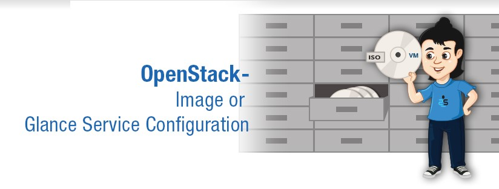
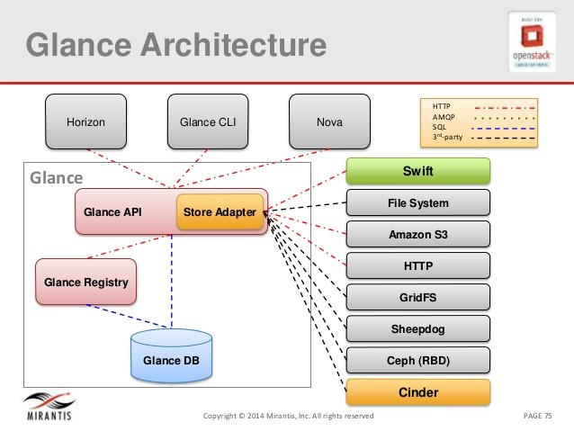
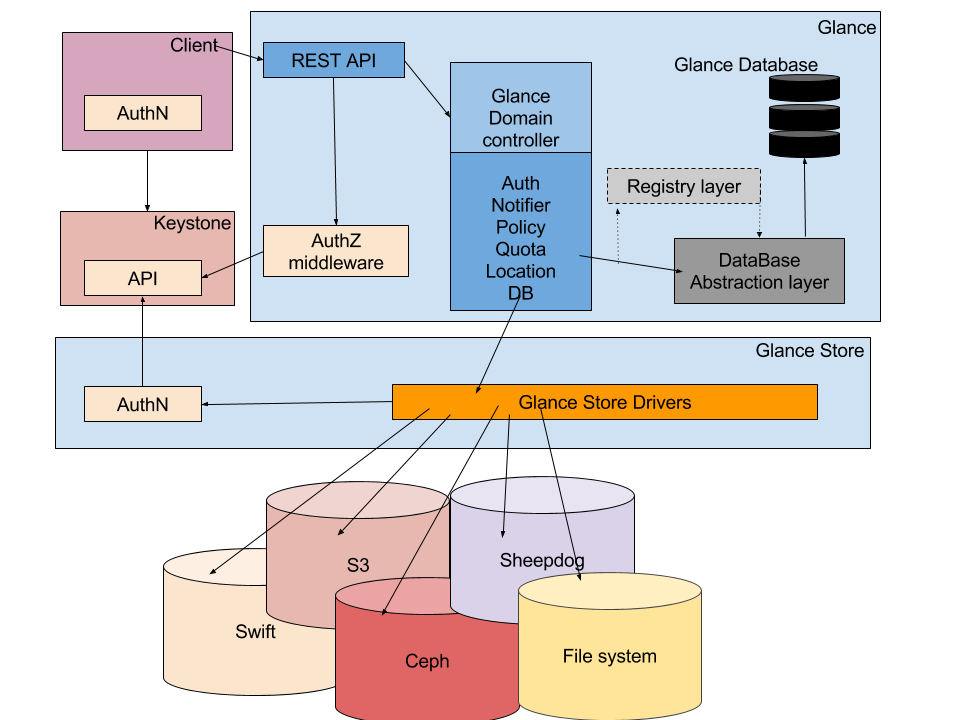
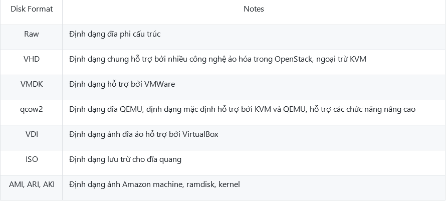
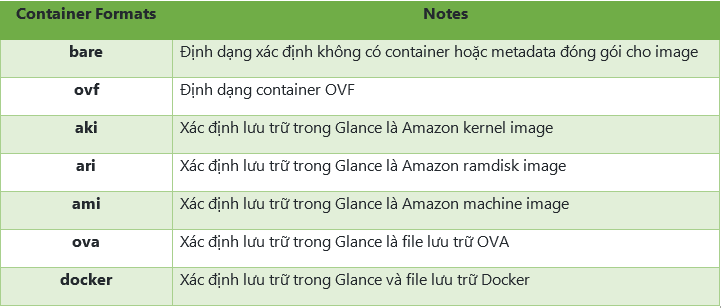
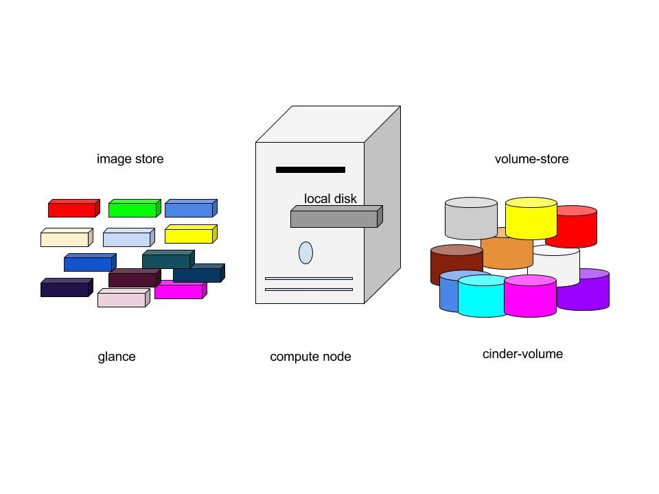
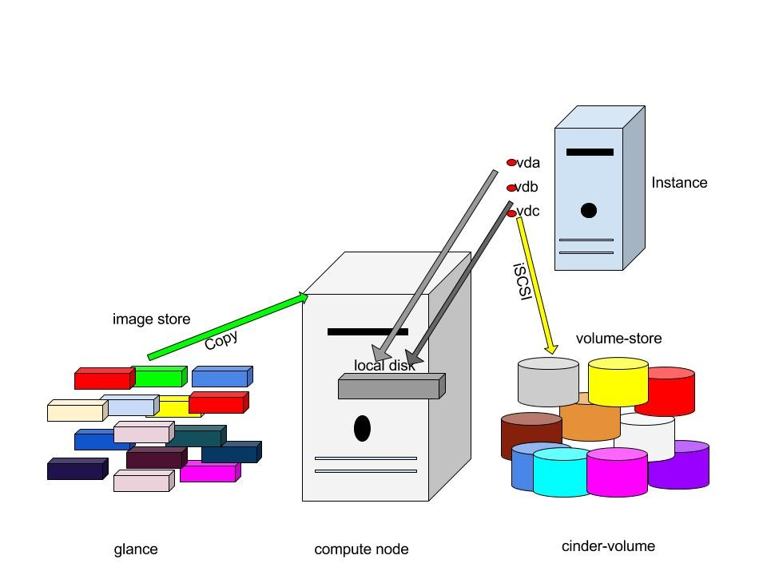
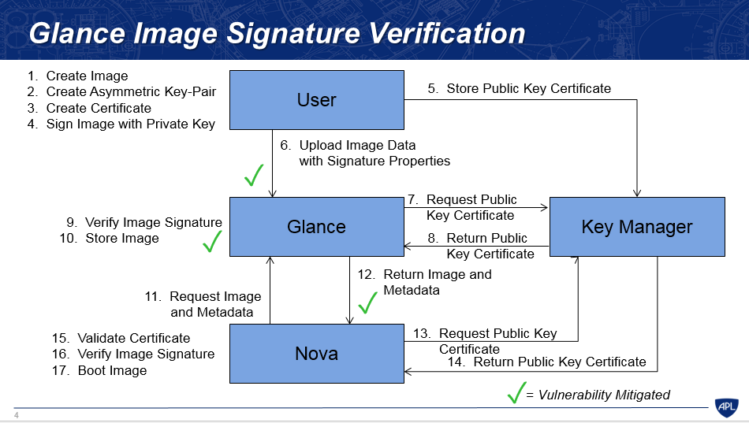
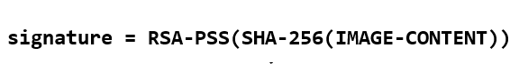

# TÌM HIỂU PROJECT GLANCE TRONG OPENSTACK

## ***Mục lục***

[1.	Giới thiệu Glance](#1)

[2.	Các thành phần của Glance](#2)

[3.	Kiến trúc Glance](#3)

[4.	Glance image format](#4)

- [4.1.	Disk Formats](#4.1)

- [4.2.	Container Formats](#4.2)

[5.	Luồng trạng thái của image trong Glance](#5)

[6.	Image và Instance](#6)

[7.	Glance image cache](#7)

[8. Glance Image Signing and Verification](#8)

- [8.1. Đặt vấn đề về xác thực và toàn vẹn dữ liệu Image](#8.1)

- [8.2. Quá trình xác thực chữ ký image trong Glance ](#8.2)

- [8.3. Một số giải pháp thay thế khác](#8.3)

[9.	Tham khảo](#9)

---

# 1. Giới thiệu Glance

-	Glance là **Image services** của Openstack bao gồm việc ***tìm kiếm***, ***đăng ký***, ***thu thập*** các images của các máy ảo. Glance là một ***reposity tập trung các image ảo***.

-	Glance cung cấp RESTful API cho phép truy vấn metadata của image máy ảo cũng như thu thập các image thực sự.

-	Images của máy ảo thông qua Glance có thể lưu trữ ở nhiều vị trí khác nhau từ hệ thống file thông thường cho tới hệ thống object-storage như project Swift trong OpenStack.

-	Trong Glance, các images được lưu trữ giống như các template. Các Template này sử dụng để vận hành máy ảo mới. Glance là giải pháp để quản lý các disk image trên cloud. 

-	Glance được thiết kế để có thể là dịch vụ hoạt động độc lập cho sự cần thiết các tổ chức lớn lưu trữ và quản lý các dish image ảo. 

-	Nó cũng có thể tạo các bản snapshots từ các máy ảo đang chạy để thực hiện dự phòng cho các VM và trạng thái các máy ảo đó.

# 2.	Các thành phần của Glance

-  Glance bao gồm các thành phần sau:

   -	**glance-api**: tiếp nhận lời gọi API để tìm kiếm, thu thập và lưu trữ image

   -	**glance-registry**: thực hiện tác vụ lưu trữ, xử lý và thu thập metadata của images

   -	**database**: cơ sở dữ liệu lưu trữ metadata của image

   -	**storage repository**: được tích hợp với nhiều thành phần khác trong OpenStack như hệ thống file thông thường, Amazon và HTTP phục vụ cho chức năng lưu trữ images

   

- Glance tiếp nhận các API request yêu cầu images từ người dùng cuối hoặc các nova component và costheer lưu trữ các file images trong hệ thống object storage Swift hoặc các storage repos khác.

- Glance hỗ trợ các hệ thống backend lưu trữ sau:
  
  -	***File system***: Glance lưu trữ images của các máy ảo trong hệ thống tệp tin thông thường theo mặc định, hỗ trợ đọc ghi các image files dễ dàng vào hệ thống tệp tin

  -	***Object Storage***: 
    
      - Là hệ thống lưu trữ do OpenStack Swift cung cấp - dịch vụ lưu trữ có tính sẵn sàng cao , lưu trữ các image dưới dạng các object.

      - BlockStorage Hệ thống lưu trữ có tính sẵn sàng cao do OpenStack Cinder cung cấp, lưu trữ các image dưới dạng khối

  -	***VMWare***

  -	***Amazon S3***

  -	***HTTP***: Glance có thể đọc các images của các máy ảo sẵn sàng trên Internet thông qua HTTP. Hệ thống lưu trữ này chỉ cho phép đọc.

  -	***RADOS Block Device(RBD)*** : Lưu trữ các images trong cụm lưu trữ Ceph sử dụng giao diện RBD của Ceph

  -	***Sheepdog***: Hệ thống lưu trữ phân tán dành cho QEMU/KVM

  -	***GridFS***: Lưu trữ các image sử dụng MongoDB

# 3.	Kiến trúc Glance

- Glance có kiến trúc **client-server** và ***cung cấp REST API*** thông qua đó yêu cầu tới server được thực hiện. 

- Yêu cầu từ client được tiếp nhận thông qua REST API và đợi sự xác thực của Keystone. Keystone Domain controller quản lý tất cả các tác vụ vận hành bên trong. Các tác vụ này chia thành các lớp, mỗi lớp triển khai nhiệm vụ vụ riêng của chúng.

- Glance store driver là lớp giao tiếp giữa glane và các hệ thống backend bên ngoài hoặc hệ thống tệp tin cục bộ, cung cấp giao diện chung để truy cập. Glance sử dụng SQL Database làm điểm truy cập cho các thành phần khác trong hệ thống.

- Kiến trúc Glance bao gồm các thành phần sau:

  -	***Client***: ứng dụng sử dụng Glance server.

  -	***REST API***: gửi yêu cầu tới Glance thông qua REST.

  -	***Database Abstraction Layer (DAL)*** : là một API thống nhất việc giao tiếp giữa Glance và databases.

  -	***Glance Domain Controller***: là middleware triển khai các chức năng chính của Glance: ủy quyền, thông báo, các chính sách, kết nối cơ sở dữ liệu.

  -	***Glance Store***: tổ chức việc tương tác giữa Glance và các hệ thống lưu trữ dữ liệu.

  -	***Registry Layer***: lớp tùy chọn tổ chức việc giao tiếp một cách bảo mật giữa domain và DAL nhờ việc sử dụng một dịch vụ riêng biệt

# 4.	Glance image format

Khi upload một image lên Glance, ta cần xác định định dạng của image máy ảo VM. Glance hỗ trợ nhiều loại định dạng đĩa (Disk format) và định dạng container (Container format). Virtual disk giống với các driver boot máy vật lý, chỉ khác là tất cả gộp lại trong một file. Các nền tảng ảo hóa khác nhau cũng hỗ trợ các định dạng disk format khác nhau.

## 4.1.	Disk Formats

- Định dạng đĩa – disk format của một image máy ảo là định dạng nằm dưới disk image. 

- Hiểu như là định dạng xác định các quy định cách thức tổ chức các phân vùng, cấu trúc phần cứng đĩa và cách mà các hypervisor làm việc với image.

- Những định dạng disk format sau được hỗ trợ bởi Glance: 

  

## 4.2.	Container Formats

- Container format mô tả định dạng file và chứa các thông tin metadata của máy ảo. 

- Glance hỗ trợ những container format sau:

***Lưu ý***: Các container format hiện không được sử dụng bởi Glance hay các  thành phần khác của Openstack. Vì vậy, định dạng ***“bare”*** được đưa ra như một container format khi chúng ta upload một image trong glance, bare nghĩa là không có container. (???)

**Cấu hình image format tham khảo [tại đây.](./2.Mot_so_cau_hinh_Glance.md#9)**

# 5.	Luồng trạng thái của image trong Glance

Luồng trạng thái của Glance cho biết trạng thái của image trong quá trình tải lên. Khi tạo một image, bước đầu tiên là queing, image được đưa vào hàng đợi trong một khoảng thời gian ngắn, được bảo vệ và sẵn sàng để tải lên. Sau khi queuing, image chuyển sang trạng thái saving nghĩa là quá trình tải lên chưa hoàn thành. Một khi image được tải lên hoàn toàn, trạng thái image chuyển sang Active. Khi quá trình tải lên thất bại nó sẽ chuyển sang trạng thái bị hủy hoặc bị xóa. Ta có thể deactive và reactive các image đã upload thành công bằng cách sử dụng command. 
Luồng trạng thái của flow được mô tả theo hình sau:

Các trạng thái của image:

\- **queued**

   Định danh của image được bảo vệ trong Glance registry. Không có dữ liệu nào của image được tải lên Glance và kích thước của image không được thiết lập rõ ràng sẽ được thiết lập về zero khi khởi tạo.

\- **saving**
   Trạng thái này biểu thị rằng dữ liệu thô của image đang upload lên Glance. Khi image được đăng ký với lời gọi POST /images và có một header đại diện x-image-meta-location, image đó sẽ không bao giờ được đưa và trạng thái "saving" (bởi vì dữ liệu của image đã có sẵn ở một nơi nào đó)

\- **active**

   Biểu thị rằng một image đã sẵn sàng trong Glance. Trạng thái này được thiết lập khi dữ liệu của image được tải lên hoàn toàn.

\- **deactivated**

   Trạng thái biểu thị việc không được phép truy cập vào dữ liệu của image với tài khoản không phải admin. Khi image ở trạng thái này, ta không thể tải xuống cũng như export hay clone image.

\- **killed**

   Trạng thái biểu thị rằng có vấn đề xảy ra trong quá trình tải dữ liệu của image lên và image đó không thể đọc được

\- **deleted**
  
   Trạng thái này biểu thị việc Glance vẫn giữ thông tin về image nhưng nó không còn sẵn sàng để sử dụng nữa. Image ở trạng thái này sẽ tự động bị gỡ bỏ vào ngày hôm sau.
   
\- **pending_delete**: Tương tự như trạng thái deleted, tuy nhiên Glance chưa gỡ bỏ dữ liệu của image ngay. Một image khi đã rơi vào trạng thái này sẽ không có khả năng khôi phục.

# 6.	Image và Instance

- Như đã đề cập, disk images được lưu trữ giống như các template. Image service kiểm soát việc lưu trữ và quản lý của các images. Instance là một máy ảo riêng biệt chạy trên compute node, compute node quản lý các instances. User có thể vận hành bao nhiêu máy ảo tùy ý với cùng một image. Mỗi máy ảo đã được vận hành được tạo nên bởi một bản sao của image gốc, bởi vậy bất kỳ chỉnh sửa nào trên instance cũng không ảnh hưởng tới image gốc. Ta có thể tạo bản snapshot của các máy ảo đang chạy nhằm mục đích dự phòng hoặc vận hành một máy ảo khác. 

- Khi ta vận hành một máy ảo, ta cần phải chỉ ra flavor của máy ảo đó. Flavor đại diện cho tài nguyên ảo hóa cung cấp cho máy ảo, định nghĩa số lượng CPU ảo, tổng dung lượng RAM cấp cho máy ảo và kích thước ổ đĩa không bền vững cấp cho máy ảo. OpenStack cung cấp một số flavors đã định nghĩa sẵn, ta có thể tạo và chỉnh sửa các flavors theo ý mình. 

- Sơ đồ dưới đây chỉ ra trạng thái của hệ thống trước khi vận hành máy ảo. Trong đó image store chỉ số lượng các images đã được định nghĩa trước, compute node chứa các vcpu có sẵn, tài nguyên bộ nhớ và tài nguyên đĩa cục bộ, cinder-volume chứa số lượng volumes đã định nghĩa trước đó.

- Trước khi vận hành 1 máy ảo, ta phải chọn một image, flavor và các thuộc tính tùy chọn. Lựa chọn flavor nào cung cấp root volume, có nhãn là vda và một ổ lưu trữ tùy chọn được đánh nhãn vdb (ephemeral - không bền vững) và cinder-volumen được map với ổ đĩa ảo thứ ba, có thể gọi tên là vdc.

- Theo mô tả trên hình, image gốc được copy vào ổ lưu trữ cục bộ từ image store. Ổ vda là ổ đầu tiên mà máy ảo truy cập. Ổ vdb là ổ tạm thời (không bền vững - *ephemeral*) và rỗng, được tạo nên cùng với máy ảo, nó sẽ bị xóa khi ngắt hoạt động của máy ảo. Ổ vdc kết nối với cinder-volume sử dụng giao thức iSCSI. Sau khi compute node dự phòng vCPU và tài nguyên bộ nhớ, máy ảo sẽ boot từ root volume là vda. Máy ảo chạy và thay đổi dữ liệu trên các ổ đĩa. Nếu volume store được đặt trên hệ thống mạng khác, tùy chọn `"my_block_storage_ip"` phải được dặc tả chính xác trong tệp cấu hình storage node chỉ ra lưu lượng image đi tới compute node. 

- Khi máy ảo bị xóa, ephemeral storage (khối lưu trữ không bền vững) bị xóa; tài nguyên vCPU và bộ nhớ được giải phóng. Image không bị thay đổi sau tiến trình này.

# 7.	Glance image cache

- Việc kích hoạt Glance cache thường được khuyên khi sử dụng hệ thống lưu trữ mặc định là file, tuy nhiên nếu sử dụng Ceph RBD backend sẽ có một số khác biệt.

- Kích hoạt glance cache dẫn tới việc tạo ra cached của image đó trong thư mục /var/lib/glance/image-cache mỗi lần boot máy ảo lên. Giả sử ta có một máy ảo với kích thước VM image là cỡ 50GB, nếu như mỗi lần boot mà lại tạo cached như vây, hệ thống lưu trữ sẽ sớm bị cạn kiệt, trừ khi ta mount thư mục /var vào một ổ lưu trữ lớn.

- Glance API server có thể được cấu hình để có thư mục lưu trữ image cache local. Một thưc mục local image cache lưu trữ một bản copy của các image, về cơ bản điều này cho phép nhiều API server phục vụ cùng các file image giống nhau, để mở rộng khả năng phục vụ của Glance.

- Local image cache là trong suốt với người dùng. Người dùng cuối không biết được Glance API đang chuyển các file image từ local cache hay từ hệ thống backend lưu trữ thực sự.

- Thực hiện cấu hình glance-api hỗ trợ local image cache  và sử dụng local image cache [tại đây.](./2.Mot_so_cau_hinh_Glance.md#6) 

# 8. Glance Image Signing and Verification

## 8.1. Đặt vấn đề về bảo mật và toàn vẹn Image

- Trước bản phát hành Liberty, không hề có phương thức nào cho các user để xác nhận rằng image họ tải lên có bị thay đổi hay không. Một image bị thay đổi có thể xảy ra trong quá trình upload từ user lên Glance hoặc Glance chuyển image tới Nova, hoặc cũng có thể do chính Glance tự mình thay đổi mà không có tác động từ phía người dùng. Một image bị thay đổi có thể chứa mã độc. Bởi vậy việc cung cấp cơ chế chữ ký số cho image và xác nhận chữ ký số cho phép user xác nhận xem image có bị thay đổi không trước khi boot image tạo máy ảo. 

- Tính năng này hỗ trợ một số trường hợp như sau:

  - Một image được kí bởi end user, sử dụng private key (hiểu là mã hóa bởi private key). Sau đó, user upload image lên Glance, cùng với chữ kí vưa tạo và public key certificate của user. Glance sử dụng thông tin này để xác thực chữ ký, và thông báo tới user nếu chữ ký có bị  không xác thực.
  
  - Một image được tạo trong Nova, và Nova ký lên image  tại request của end user. Khi image được upload lên Glance, chữ ký và public key certificate cũng được cung cấp. Glance xác nhận chữ ký trước khi lưu trữ image, và thông báo với Nova nếu sự xác thực xảy ra lỗi.

  - Một image đã được ký  được yêu cầu bởi Nova, và Glance cung cấp chữ ký va public key certificate tới Nova cùng image để Nova có thể xác thực chữ ký trước khi booting image. 

## 8.2. Quá trình xác thực chữ ký image trong Glance

- Những phiên bản triển khai đầu tiên trong Liberty, thay đổi này sử dụng tính năng của Glance để lưu trữ metadate cân thiết cho việc ký và xác nhận image. Những thông tin này bao gồm: 1 public key certificate, và chữ ký.

- Những tính năng này được cung cấp khi image được tạo và có thể truy cập được khi image được upload. Lưu ý rằng tính năng này chỉ hỗ trợ upload image với Glance APIv2 (và không hỗ trợ Glance APIv1); và nhiều định dạng của key và chữ ký được hỗ trợ, định dạng chữ ký cũng được lưu trữ như là một thuộc tính của image.
Certificate tham chiếu được sử dụng để truy cập tới certificate từ một key manager, nới mà các certificate được lưu trữ. Certificate này được thêm vào trong key manager bởi end user trước khi upload image. Lưu ý là chữ kí được thực hiện offline.

- Sau đây là luồng thực hiện ký và xác nhận image trong các trường hợp đề cập ở trên (Bước 1 tới Bước 10 là trường hợp user upload image lên Glance, từ Bước 11 là trường hợp Nova request image từ Glance để boot máy ảo): 

  

  - **Bước 1**: User tạo image để upload lên Glance. 

  - **Bước 2**: User tạo cặp key theo thuật toán mã hóa khóa công khai (khóa bất đối xứng).

  - **Bước 3**: User sử dụng các thông tin của mình để  tạo certificate xác minh bản thân.

  - **Bước 4**: Ký lên image sử dụng Private Key (mã hóa image) . Chú ý bước này có sự khác biệt giữa Liberty và các bản từ Mitaka về sau:

    - ***Liberty***: Trước khi ký lên image, dữ liệu của image sẽ được băm sử dụng thuật toán MD5. Dữ liệu của image sẽ được chia thành từng phần nhỏ rồi băm. Cuối cùng ta sẽ thu lại được một mã băm **checksum_hash** của dữ liệu image. Tiếp đó mã này sẽ được sử dụng vào thuật toán băm thứ hai là SHA-256.

      

    - ***Mitaka và các phiên bản về sau***: Không sử dụng thuật toán MD5 để băm dữ liệu của image. Tuy nhiên dữ liệu của image sẽ bị băm một lần sử dụng thuật toán SHA-256.

      

    Tiếp đó sử dụng Private Key đã tạo ở bước 2 để ký lên image đã bị băm.

  - **Bước 5**: Gửi Public Key certificate lên Key Manager để lưu trữ sử dụng giao diện Castellan (gửi thông tin certificate và public key), đồng thời thu lại giá trị `signature_certificate_uuid` sử dụng cho quá trình upload image và các đối tượng khác thu thập Public Key certificate sử dụng để xác thực sau này.

  - **Bước 6**: Upload Image lên Glance kèm theo các thuộc tính liên quan tới chữ ký số (các Signature metadata). Các thuộc tính này bao gồm:

    - `signature`: chính là chữ ký số ta thu được. Tùy thuộc phiên bản Liberty hay từ phiên bản Mitaka mà chữ ký số này sẽ được tạo ra khác nhau(theo giải thích ở bước 4). Với Liberty: `signature = RSA-PSS(SHA-256(MD5(IMAGE-CONTENT)))`. Với các phiên bản từ  Mitaka trở đi: `signature = RSA-PSS(SHA-256(IMAGE-CONTENT))`
    
    - `signature_key_type`: là loại key được sử dụng để tạo chữ ký số. Ví dụ: RSA-PSS
    
    - `signature_hash_method`: là phương thức băm được sử dụng để tạo chữ kỹ. Ví dụ: SHA-256
    
    - `signature_certificate_uuid`: chính là cert_uuid thu được ở bước 5 khi tiến hành lưu trữ certificate.
    
    - `mask_gen_algorithm`: giá trị này chỉ ra thuật toán tạo mặt nạ được sử dụng trong quá trình tạo ra chữ ký số.   
      Ví dụ: MGF1. Giá trị này chỉ sử dụng cho mô hình RSA-PSS.
    
    - `pss_salt_length`: định nghĩa **sal length** sử dụng trong quá trình tạo chữ ký và chỉ áp dụng cho mô hình RSA-PSS. Giá trị mặc định là `PSS.MAX_LENGTH`.

  - **Bước 7** : Glance gửi request “Public key certificate” từ Key-manager để xác nhận lại chữ ký được upload lên cùng image. (public key được dùng để giải mã chữ ký). Để làm điều này Glance phải sử dụng `signature_certificate_uuid` thu được trong quá trình tải image lên của người dùng. 

  - **Bước 8** : Key-manager trả lại “Public key certificate” cho Glance.

  - **Bước 9** : Xác nhận lại chữ kí của Image: sử dụng public key thu được cùng với các signature metadata khi image được upload lên. Việc xác thực này được thực hiện bởi module `signature_utils`.

  - **Bước 10**: Lưu lại image nếu chứng thực thành công. Nếu chứng thực thất bại, Glance sẽ đưa image đó vào trạng thái `killed` và gửi thông báo lại cho người dùng kèm theo lý do tại sao image upload bị lỗi.

  - **Bước 11**: Nova gửi yêu cầu tới Glance để lấy Image và metadata để boot máy ảo.
  
  - **Bước 12**: Glance gửi lại Nova image kèm theo metadata để chứng thực.

  - **Bước 13**: Nova yêu cầu Public Key Certificate từ Key Manager bằng việc sử dụng `cert_uuid` tương tác với giao diện Castellan

  - **Bước 14**: Key Manager trả về Public Key Certificate lại cho Nova

  - **Bước 15**: Nova xác nhận chứng chỉ. Chức năng này được thực hiện nếu chỉnh sửa module `signature_utils` của Nova để kết hợp việc xác nhận chứng chỉ (certificate validation) vào workflow của tiến trình xác thực chữ ký(signature verification).

  - **Bước 16**: Xác thực chữ ký của image. Để làm điều này, ta phải cấu hình trong file `nova.conf` của nova, thiết lập giá trị `verify_glance_signatures = true`. Như vậy, Nova sẽ sử dụng các thuộc tính của image, bao gồm các thuộc tính cần thiết cho quá trình xác thực chữ ký image(signature metadata). Nova sẽ đưa dữ liệu của image và các thuộc tính của nó tới module `signature_utils` để xác thực chữ ký.
  
  - **Bước 17**: Nếu việc xác thực chữ ký thành công, nova sẽ tiến hành boot máy ảo sử dụng image đó và ghi vào log chỉ ra rằng việc xác thực chữ ký thành công kèm theo các thông tin về **signing certificate**. Ngược lại nếu xác nhận thất bại, Nova sẽ không boot image đó và lưu lại lỗi vào log.

## 8.3. Một số giải pháp thay thế khác

- Sử dụng cách tiếp cận **"sign-the-data"** (từ phiên bản Mitaka về sau) thay cho **"sign-the-hash"** (Liberty). Bởi MD5 về nguyên thủy thì không được sử dụng để xác thực mà là một hàm băm, nên nó không cung cấp giải pháp bảo vệ chống lại những thay đổi có hại cũng như mã độc. Việc sử dụng hàm băm MD5 do đó gây ra sự phức tạp không cần thiết.

- Một giải pháp thay thế để lưu trữ public key certificate là sử dụng chính Glance. Tuy nhiên, hướng tiếp cận này không an toàn so với việc sử dụng Key Manager, vì chính Glance cũng tiềm ẩn nguy cơ không tin cậy trong nhiều trường hợp, không sinh ra để lưu trữ key và các chứng chỉ gốc.

- Giải pháp thay vì sử dụng mã hóa khóa bất đối xứng là sử dụng mã hóa khóa đối xứng. Tuy nhiên cách này không an toàn vì như vậy, nếu Glance muốn xác thực image, nó cần có quyền truy cập vào key đã được sử dụng để tạo chữ ký. Việc truy cập này cho phép Glance chỉnh sửa image và tạo ra chữ ký mới mà không có tác động của người dùng. Sử dụng mã hóa khóa bất đối xứng cho phép Glance xác thực chữ ký mà không cần phải được cấp quyền chỉnh sửa image hay signature. Và vì buộc phải sử dụng Public Key Certificate từ Key Manager để xác thực nên việc chỉnh sửa của Glance sẽ là không hợp lệ nếu như chỉnh sửa lại chữ ký.

- Một giải pháp đặt ra là sử dụng các thuộc tính của Glance để lưu trữ và thu thập signature metadata thông qua việc tạo các API mở rộng hỗ trợ chữ ký. Nghĩa là thay vì người dùng phải thiết lập metadata sử dụng các cặp key-value, các API mở rộng sẽ được sử dụng. Hiện tại, nếu một user được phép sử dụng metadata keys(cho các chứng chỉ và chữ ký) vì mục đích khác thì việc tải image lên sẽ gặp thất bại. Do đó các API mở rộng phải được phép quản lý nhiều chữ ký trên mỗi image một cách rõ ràng, nhưng điều này là không khả thi với hướng tiếp cận các thuộc tính. Tuy nhiên Image API cũng không hỗ trợ các API mở rộng, nên hướng tiếp cận này không phù hợp.

- Có một giải pháp khác để lưu trữ và thu thập signature metadata là sử dụng cú pháp thông điệp mật mã CMS(cryptographic message syntax) định nghĩa trong chuẩn RFC 5652 mục 5. Tuy nhiên, kích thước của định dạng sử dụng cho chuẩn này là biến số, không cố định và không thể sử dụng các thuộc tính hiện tại của Glance, điều này dẫn tới yêu cầu phải chỉnh sửa lại API. Việc chuyển sang sử dụng CMS trong tương lai sẽ được triển khai để đáp ứng nhu cầu tăng tính linh hoạt.

- Hướng mở rộng trong tương lại là hỗ trợ triển khai trên hệ thống multi-clouds thay thì single-cloud, để nếu như phát sinh nhu cầu trao đổi image giữa các cloud khác nhau, tiến trình xác thực chữ ký cũng có thể xác nhận các images có bị chỉnh sửa hay không.

# 9.	Tham khảo

[1] https://github.com/thaihust/Thuc-tap-thang-03-2016/blob/master/ThaiPH/OpenStack/Glance/ThaiPH_baocaotimhieuglance.md#manage_image

[2] http://www.sparkmycloud.com/blog/openstack-glance/ 

[3] Glance Image Signing and Verification

- https://github.com/hocchudong/thuctap032016/blob/master/ThaiPH/OpenStack/Glance/ThaiPH_glance_image_signing_and_verification.md

- https://specs.openstack.org/openstack/glance-specs/specs/mitaka/approved/image-signing-and-verification-support.html#alternatives

- https://specs.openstack.org/openstack/nova-specs/specs/mitaka/implemented/image-verification.html

