# CÁC THAO TÁC SỬ DỤNG GLANCE

##	***Mục lục***


[1.	Sử dụng glance command line	](#1)

- [1.1.	List image](#1.1)

- [1.2.	Tạo image mới](#1.2)

- [1.3.	Show image](#1.3)

- [1.4.	Upload image](#1.4)

- [1.5.	Thiết lập trạng thái của image](#1.5)

- [1.6.	Xóa image](#1.6)

- [1.7.	Tổng kết](#1.7)

[2.	Sử dụng Openstack client](#2)

- [2.1.	List image](#2.1)

- [2.2. Tạo image mới](#2.2)

- [2.3.	Show thông tin image](#2.3)

- [2.4.	Thiết lập cho image](#2.4)

- [2.5.	Xóa image](#2.5)

- [2.6.	Tổng kết](#2.6)

[3.	Sử dụng cURL gửi request tới API](#3)

- [3.1.	List images](#3.1)

- [3.2.	Lọc thông tin image được list ra](#3.2)

- [3.3.	Tạo một image mới (chưa upload dữ liệu)](#3.3)

- [3.4.	Cập nhật các thuộc tính của image](#3.4)

- [3.5.	Upload dữ liệu lên image](#3.5)

- [3.6.	Xóa image](#3.6)

- [3.7.	Sử dụng REST client](#3.7)

[4. Tham khảo](#4)

---

<a name = "1"></a>
# 1. Sử dụng glance command line

<a name = "1.1"></a>
## 1.1.	List image

Sử dụng để list các image mà user được phép truy cập.

- Ví dụ:

  `$ glance image-list`

  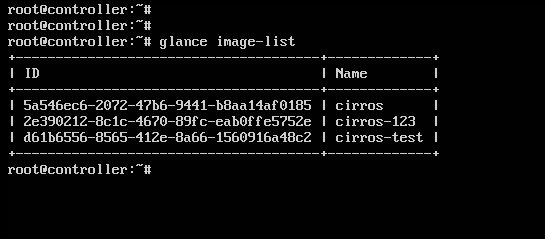

<a name = "1.2"></a>
## 1.2.	Tạo image mới

-	Cú pháp:

	```
	usage: glance image-create [--architecture <ARCHITECTURE>]
                           [--protected [True|False]] [--name <NAME>]
                           [--instance-uuid <INSTANCE_UUID>]
                           [--min-disk <MIN_DISK>] [--visibility <VISIBILITY>]
                           [--kernel-id <KERNEL_ID>]
                           [--tags <TAGS> [<TAGS> ...]]
                           [--os-version <OS_VERSION>]
                           [--disk-format <DISK_FORMAT>]
                           [--os-distro <OS_DISTRO>] [--id <ID>]
                           [--owner <OWNER>] [--ramdisk-id <RAMDISK_ID>]
                           [--min-ram <MIN_RAM>]
                           [--container-format <CONTAINER_FORMAT>]
                           [--property <key=value>] [--file <FILE>]
                           [--progress]
	```

-	Ví dụ: 

	`$ glance image-create --disk-format qcow2 --container-format bare --file cirros-0.3.5-x86_64-disk.img --name cirros-glance`

	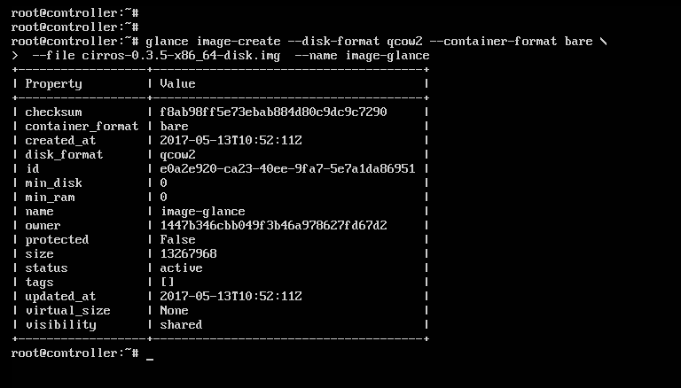

<a name = "1.3"></a>
## 1.3.	Show image

Xem thông tin image:

-	Cú pháp:

	`usage: glance image-show [--human-readable] [--max-column-width <integer>] <IMAGE_ID>`

-	Ví dụ: show thông tin image vừa tạo: có id như hình trên là: `e0a2e920-ca23-40ee-9fa7-5e7a1da86951`

	`$ glance image-show e0a2e920-ca23-40ee-9fa7-5e7a1da86951`

	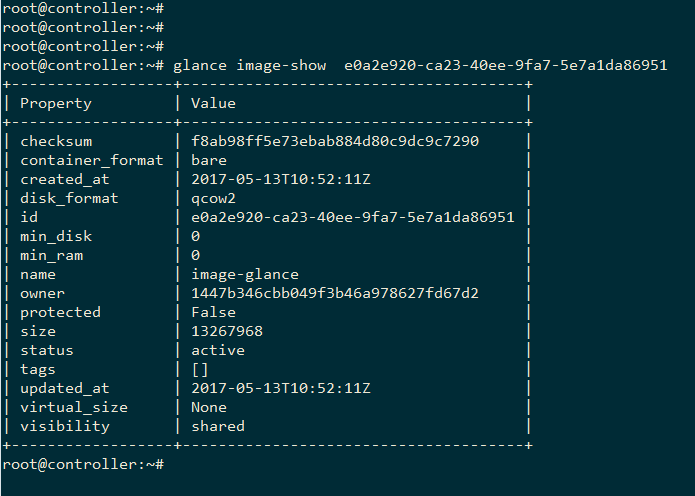

<a name = "1.4"></a>
## 1.4.	Upload image

Sử dụng để upload dữ liệu vào một image đã tạo trước đó. 

-	Cú pháp:

	`glance image-upload [--file <FILE>] [--size <IMAGE_SIZE>] [--progress]  <IMAGE_ID>`

-	Ví dụ: Tạo ra một image rỗng chưa có dữ liệu gì và upload data từ một image cirros có sẵn: 

	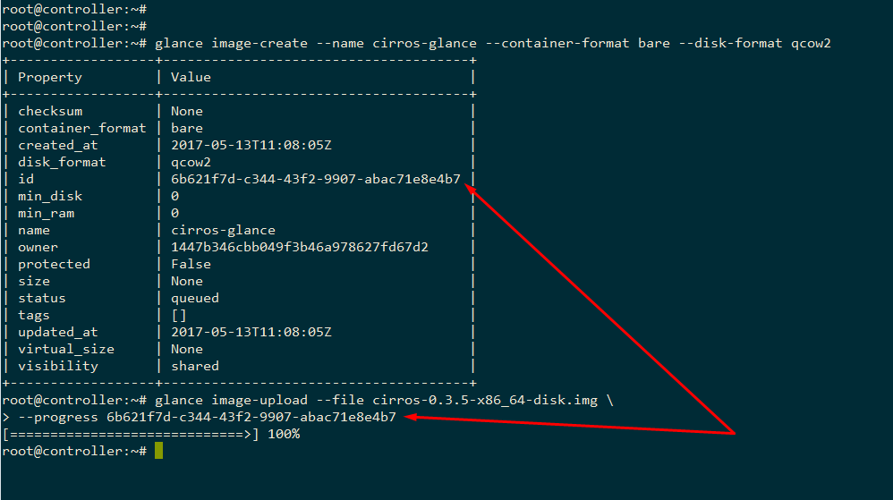

	*(Lưu ý: file cirros-0.3.6-x86_64-disk.img đang có trong thư mục hiện tại đang thao tác)*

<a name = "1.5"></a>
## 1.5.	Thiết lập trạng thái của image

-	Đưa một image về trạng thái **deactive**: 

	`$ glance image-deactivate <IMAGE_ID>`

	ví dụ:

	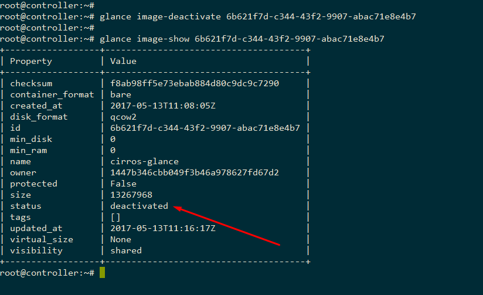

-	Đưa image từ trạng thái deactive về trạng thái active trở lại: 

	` $ glance image-reactivate <IMAGE_ID>`

	Ví dụ: 

	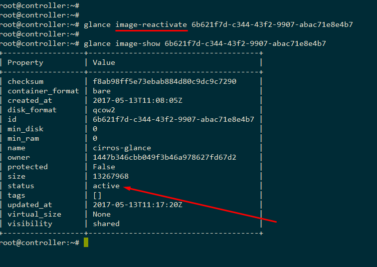

<a name = "1.6"></a>
## 1.6.	Xóa image
- Cú pháp: 

	`$ glance image-delete <IMAGE_ID> [<IMAGE_ID> ...]`

- Ví dụ: Xóa image **cirros-glance** vừa tạo:

	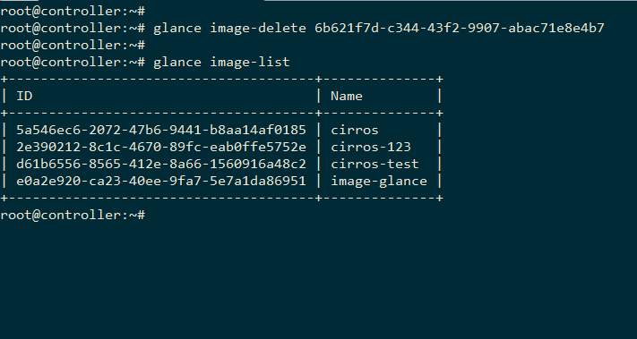

<a name = "1.7"></a>
## 1.7.	Tổng kết: 

\-	Là câu lệnh tương tác với glance từ những ngày ban đầu.

\-	Còn nhiều hạn chế so với bộ câu lệnh tương tác của Openstack client. 

\-	Các tùy chọn còn lại tham khảo thêm tại: https://docs.openstack.org/cli-reference/glance.html 

<a name = "2"></a>
# 2.	Sử dụng Openstack client

<a name = "2.1"></a>
## 2.1.	List image

`$ openstack image list`

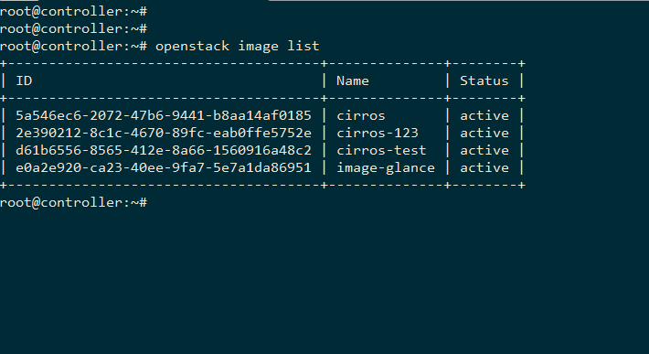

<a name = "2.2"></a>
## 2.2.	Tạo image mới

`$ openstack image create --disk-format qcow2 --container-format bare --name cirros-glance`

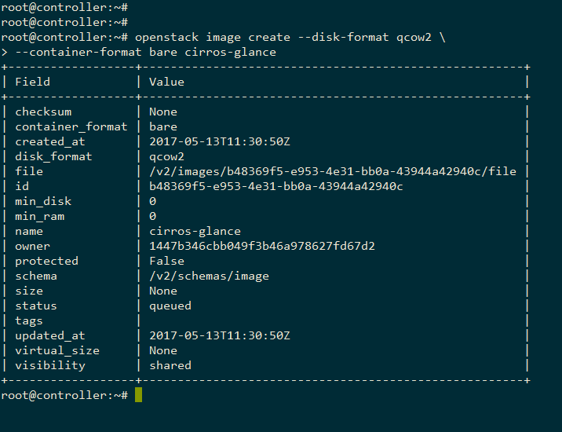

***(Lưu ý: do image này chưa có dữ liệu nên đang ở trạng thái là queued)***

<a name = "2.3"></a>
## 2.3.	Show thông tin image

`$ openstack image show <image_name> `

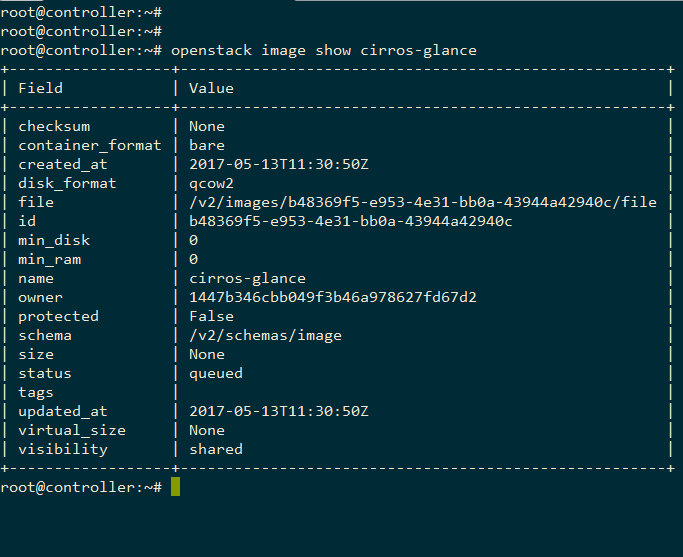

<a name = "2.4"></a>
## 2.4.	Thiết lập cho image
Sử dụng câu lệnh `openstack image set` để thiết lập các thông số cho image:

-	Thiết lập trạng thái deactive cho image **image-glance** :

	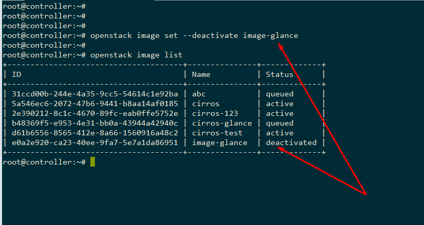

-	Thiết lập cho image trên active trở lại: 

	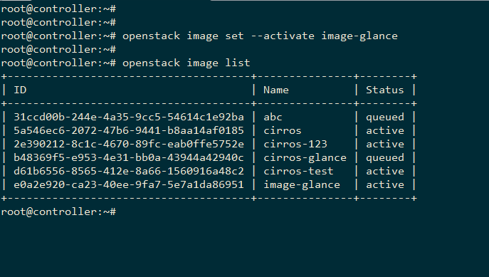

-	Thiết lập cho image image-glance ở chế độ public: 

	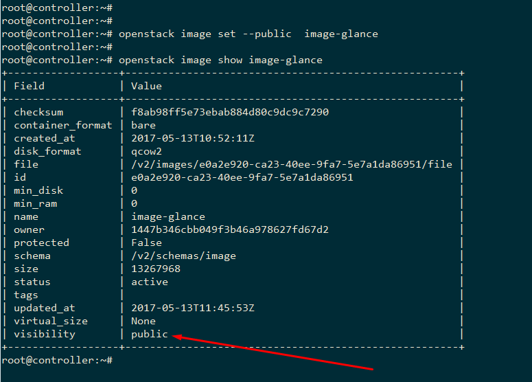

<a name = "2.5"></a>
## 2.5.	Xóa image

Để xóa image sử dụng câu lệnh sau:

`$ openstack image delete <image_name>`

Ví dụ:

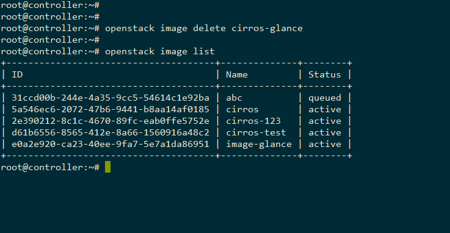

<a name = "2.6"></a>
## 2.6.	Tổng kết

\- Câu lệnh `openstack client` có nhiều ưu điểm hơn câu lệnh `glance`. Hỗ trợ sử dụng tên của image thay vì id nếu tên đó là duy nhất. 

\- Mapping giữa câu lệnh glance và openstack client: 

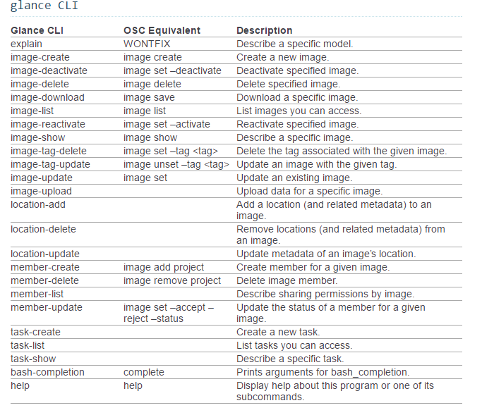

\-	Tham khảo thêm về câu lệnh openstack client cho glance tại: https://docs.openstack.org/developer/python-openstackclient/command-objects/image.html


<a name = "3"></a>
# 3.	Sử dụng cURL gửi request tới API của Glance

- Trước hết, để sử dụng curl lấy các dữ liệu từ các API dịch vụ của glance, cần xin cấp phát token từ Keystone để xác thực với Glance:

	```
	curl -i http://10.10.10.10:5000/v3/auth/tokens \
	-X POST -H "Content-Type: application/json" \
	-d '
	{ "auth": {
	     "identity": {
	       "methods": ["password"],
	       "password": {
	         "user": {
	           "domain": {
	              "id": "default"
	            },
	           "name": "admin",
	           "password": "welcome123"
	         }
	         
	       }
	     },
	     "scope": {
	       "project": {
	         "name": "admin",
	         "domain": {
	              "id": "default"
	            }
	       }

	     }
	   }
	}'
	```

  Thay tên người dùng **user name**, **password**, **project** và **domain** tương ứng để xin cấp phát token. (Có thể thay controller bằng địa chỉ IP của node controller)

  - Kết quả trả về được như sau: 

    	```
    	HTTP/1.1 201 Created
		Date: Fri, 19 May 2017 10:34:03 GMT
		Server: Apache/2.4.18 (Ubuntu)
		X-Subject-Token: gAAAAABZHsobyfff5iJdAzpMoV54We7vrXdOjXGT-K4bSIJXOJoRZu_8gfQUQs_Meto54c8TAu7WhNjB4YO3eG_WiEOh0dwFrPYPUvnBcs0brhESutwHYYWfIuCf0uSX2j9-cPUC1HBa5Y0NXex73AG3ggehXRiVl5_BBYCoZ6vXgbCpgtOrEzg
		Vary: X-Auth-Token
		X-Distribution: Ubuntu
		x-openstack-request-id: req-89104f1a-9174-4231-8e42-433b45e44b81
		Content-Length: 1639
		Content-Type: application/json

		{"token": {"is_domain": false, "methods": ["password"], "roles": [{"id": "6c011f0e546d4dad8404025e70b7ac2a", "name": "admin"}], "expires_at": "2017-05-19T11:34:03.000000Z", "project": {"domain": {"id": "default", "name": "Default"}, "id": "282d130a03034e098c30d355e71d1cf1", "name": "admin"}, "catalog": [{"endpoints": [{"region_id": "RegionOne", "url": "http://controller:5000/v3/", "region": "RegionOne", "interface": "internal", "id": "52b0dce530884a9f814b6ba66e546329"}, {"region_id": "RegionOne", "url": "http://controller:35357/v3/", "region": "RegionOne", "interface": "admin", "id": "bf9916e70b934aed8e4045cda784d1ea"}, {"region_id": "RegionOne", "url": "http://controller:5000/v3/", "region": "RegionOne", "interface": "public", "id": "fa57ef74cdc54501b062a9e69392d09e"}], "type": "identity", "id": "82b754b726a0496c9ca518f46c0f9baa", "name": "keystone"}, {"endpoints": [{"region_id": "RegionOne", "url": "http://controller:9292", "region": "RegionOne", "interface": "admin", "id": "9f4917f2dde646d59bf1731427eda45f"}, {"region_id": "RegionOne", "url": "http://controller:9292", "region": "RegionOne", "interface": "public", "id": "e96cf112d3b548c3936bd0c22a647d6d"}, {"region_id": "RegionOne", "url": "http://controller:9292", "region": "RegionOne", "interface": "internal", "id": "fa3bef17ca0d4035a3353a27edfbca05"}], "type": "image", "id": "5db7fb55a2c64e8cb23004a1e14cc354", "name": "glance"}], "user": {"password_expires_at": null, "domain": {"id": "default", "name": "Default"}, "id": "f416d7b6a44740c8ae0fe365681e7d6d", "name": "admin"}, "audit_ids": ["8qGQ66rJSw6V46lKSnlAdA"], "issued_at": "2017-05-19T10:34:03.000000Z"}}
		```

	-	Trong đó, token trả về trong phần X-Subject-Token như sau:  

		```
		X-Subject-Token: gAAAAABZHsobyfff5iJdAzpMoV54We7vrXdOjXGT-K4bSIJXOJoRZu_8gfQUQs_Meto54c8TAu7WhNjB4YO3eG_WiEOh0dwFrPYPUvnBcs0brhESutwHYYWfIuCf0uSX2j9-cPUC1HBa5Y0NXex73AG3ggehXRiVl5_BBYCoZ6vXgbCpgtOrEzg
		```

-	Để sử dụng token xác thực với Glance, lưu lại token vừa nhận được vào hệ thống với tên biến môi trường là `OS_AUTH_TOKEN `:

	```
	$ export OS_AUTH_TOKEN=gAAAAABZHsobyfff5iJdAzpMoV54We7vrXdOjXGT-K4bSIJXOJoRZu_8gfQUQs_Meto54c8TAu7WhNjB4YO3eG_WiEOh0dwFrPYPUvnBcs0brhESutwHYYWfIuCf0uSX2j9-cPUC1HBa5Y0NXex73AG3ggehXRiVl5_BBYCoZ6vXgbCpgtOrEzg
	```

<a name = "3.1"></a>
## 3.1.	List images

- Để liệt kê tất cả các image: Sử dụng phương thức GET truy cập tới endpoint: http://controller:9292/v2/images/ 

	```
	curl -i   http://controller:9292/v2/images \
	-X GET \
	-H "X-Auth-Token: $OS_AUTH_TOKEN"
	```

-	Kết quả trả về như sau: 
	
	```
	HTTP/1.1 200 OK
	Content-Length: 1767
	Content-Type: application/json; charset=UTF-8
	X-Openstack-Request-Id: req-d563a6c5-991e-4d00-abf1-87417387a6c5
	Date: Fri, 19 May 2017 10:44:00 GMT

	{
	"images": [
	 {
		"status": "queued",
		"name": "cirros-curl",
		"tags": [],
		"container_format": "bare",
		"created_at": "2017-05-17T18:30:05Z",
		"size": null,
		"disk_format": "qcow2",
		"updated_at": "2017-05-17T18:31:33Z",
		"visibility": "shared",
		"self": "/v2/images/bd7879f6-ea2a-43f5-ab40-92b0dd9cd557",
		"min_disk": 0,
		"protected": false,
		"id": "bd7879f6-ea2a-43f5-ab40-92b0dd9cd557",
		"file": "/v2/images/bd7879f6-ea2a-43f5-ab40-92b0dd9cd557/file",
		"checksum": null,
		"owner": "282d130a03034e098c30d355e71d1cf1",
		"virtual_size": null,
		"min_ram": 0,
		"schema": "/v2/schemas/image"
	},
	{
		"status": "queued",
		"name": "cirros-test",
		"tags": [],
		"container_format": "bare",
		"created_at": "2017-05-17T18:22:32Z",
		"size": null,
		"disk_format": "qcow2",
		"updated_at": "2017-05-17T18:23:17Z",
		"visibility": "shared",
		"self": "/v2/images/c33deaae-7cce-4a04-9d9f-553a172bb38e",
		"min_disk": 0,
		"protected": false,
		"id": "c33deaae-7cce-4a04-9d9f-553a172bb38e",
		"file": "/v2/images/c33deaae-7cce-4a04-9d9f-553a172bb38e/file",
		"checksum": null,
		"owner": "282d130a03034e098c30d355e71d1cf1",
		"virtual_size": null,
		"min_ram": 0,
		"schema": "/v2/schemas/image"
	},
	{
		"status": "active",
		"name": "cirros",
		"tags": [],
		"container_format": "bare",
		"created_at": "2017-05-16T11:17:35Z",
		"size": 13267968,
		"disk_format": "qcow2",
		"updated_at": "2017-05-16T11:17:36Z",
		"visibility": "public",
		"self": "/v2/images/73fd0a2f-48fc-4d88-9d43-e57a7dd80eef",
		"min_disk": 0,
		"protected": false,
		"id": "73fd0a2f-48fc-4d88-9d43-e57a7dd80eef",
		"file": "/v2/images/73fd0a2f-48fc-4d88-9d43-e57a7dd80eef/file",
		"checksum": "f8ab98ff5e73ebab884d80c9dc9c7290",
		"owner": "282d130a03034e098c30d355e71d1cf1",
		"virtual_size": null,
		"min_ram": 0,
		"schema": "/v2/schemas/image"
	}
	],
	"schema": "/v2/schemas/images",
	"first": "/v2/images"
	}
	```

	***(Lưu ý: dữ liệu đầu ra đã được sắp xếp lại theo kiểu viết của file JSON)***

<a name = "3.2"></a>
## 3.2.	Lọc thông tin image được list ra

-	Các trường thông tin image dùng để lọc thông tin tham khảo [tại đây.](https://docs.openstack.org/developer/glance/glanceapi.html#filtering-images-lists)

-	Để lọc thông tin dữ liệu ở đầu ra: ví dụ show ra thông tin các image có tên là **cirros**, thêm phần query lọc image có trường **name** là cirros như sau: 
	
	```
	curl -i   http://controller:9292/v2/images?name=cirros \
	  -X GET \
	  -H "X-Auth-Token: $OS_AUTH_TOKEN"
	```

- Kết quả trả về như sau:

	``` 
	HTTP/1.1 200 OK
	Content-Length: 665
	Content-Type: application/json; charset=UTF-8
	X-Openstack-Request-Id: req-b5a3c2ef-7720-4e07-bb61-7e62984be89a
	Date: Fri, 19 May 2017 11:11:25 GMT

	{
	"images": [
	  {
		"status": "active",
		"name": "cirros",
		"tags": [],
		"container_format": "bare",
		"created_at": "2017-05-16T11:17:35Z",
		"size": 13267968,
		"disk_format": "qcow2",
		"updated_at": "2017-05-16T11:17:36Z",
		"visibility": "public",
		"self": "/v2/images/73fd0a2f-48fc-4d88-9d43-e57a7dd80eef",
		"min_disk": 0,
		"protected": false,
		"id": "73fd0a2f-48fc-4d88-9d43-e57a7dd80eef",
		"file": "/v2/images/73fd0a2f-48fc-4d88-9d43-e57a7dd80eef/file",
		"checksum": "f8ab98ff5e73ebab884d80c9dc9c7290",
		"owner": "282d130a03034e098c30d355e71d1cf1",
		"virtual_size": null,
		"min_ram": 0,
		"schema": "/v2/schemas/image"
	  }
	],
	"schema": "/v2/schemas/images",
	"first": "/v2/images?name=cirros"
	}
	```

<a name = "3.3"></a>
## 3.3.	Tạo một image mới (chưa upload dữ liệu)

-	Để tạo một image mới, ta sử dụng phương thức POST gửi request tới API của Glance như sau:

	```
	curl -i -X POST -H "X-Auth-Token: $OS_AUTH_TOKEN" \
	    -H "Content-Type: application/json" \
	    -d '{"name": "curl-test", "tags": ["cirros"]}' \
	    http://controller:9292/v2/images
	```


-	Kết quả trả về như sau: 
	
	```
	HTTP/1.1 201 Created
	Content-Length: 556
	Content-Type: application/json; charset=UTF-8
	Location: http://controller:9292/v2/images/413a2910-4439-481e-8dcc-626ca69a85ab
	X-Openstack-Request-Id: req-4623cd04-675d-4aba-9b16-ee9425c13e95
	Date: Fri, 19 May 2017 11:50:38 GMT

	{
		"status": "queued",
		"name": "curl-test",
		"tags": [
		  "cirros"
			],
		"container_format": null,
		"created_at": "2017-05-19T11:52:42Z",
		"size": null,
		"disk_format": null,
		"updated_at": "2017-05-19T11:52:42Z",
		"visibility": "shared",
		"self": "/v2/images/2c57442a-f3c0-41fd-bb02-ea434f54d379",
		"min_disk": 0,
		"protected": false,
		"id": "2c57442a-f3c0-41fd-bb02-ea434f54d379",
		"file": "/v2/images/2c57442a-f3c0-41fd-bb02-ea434f54d379/file",
		"checksum": null,
		"owner": "282d130a03034e098c30d355e71d1cf1",
		"virtual_size": null,
		"min_ram": 0,
		"schema": "/v2/schemas/image"
	}
	```

-	Do image này mới tạo chưa được upload dữ liệu nên sẽ trong trạng thái **“queued”**

<a name = "3.4"></a>
## 3.4.	Cập nhật các thuộc tính của image

-	Để cập nhật các thuộc tính của image, ta sử dụng phương thức PATCH gửi tới API dành riêng cho từng image (Mỗi image được tự động tạo ra một API riêng theo form sau: `http://controller:9292/v2/images/<IMAGE_ID>` )

-	Ví dụ: cập nhật thuộc tính `container_format` và `disk_format` của image vừa tạo ta làm như sau:

	```
	curl -i -X PATCH -H "X-Auth-Token: $OS_AUTH_TOKEN" \
	-H "Content-Type: application/openstack-images-v2.1-json-patch" \
	-d '
	[
	    {
	        "op": "add",
	        "path": "/disk_format",
	        "value": "qcow2"
	    },
	    {
	        "op": "add",
	        "path": "/container_format",
	        "value": "bare"
	    }
	]' http://controller:9292/v2/images/2c57442a-f3c0-41fd-bb02-ea434f54d379
	```

-	Kết quả trả về :

	```
	HTTP/1.1 200 OK
	Content-Length: 561
	Content-Type: application/json; charset=UTF-8
	X-Openstack-Request-Id: req-e7c85abc-afec-48ae-a7fd-1b2b809abef5
	Date: Fri, 19 May 2017 12:02:05 GMT

	{
		"status": "queued", 
		"name": "curl-test", 
		"tags": ["cirros"], 
		"container_format": "bare", 
		"created_at": "2017-05-19T11:52:42Z", 
		"size": null, 
		"disk_format": "qcow2", 
		"updated_at": "2017-05-19T12:02:05Z", 
		"visibility": "shared", 
		"self": "/v2/images/2c57442a-f3c0-41fd-bb02-ea434f54d379", 
		"min_disk": 0, 
		"protected": false, 
		"id": "2c57442a-f3c0-41fd-bb02-ea434f54d379", 
		"file": "/v2/images/2c57442a-f3c0-41fd-bb02-ea434f54d379/file", 
		"checksum": null, 
		"owner": "282d130a03034e098c30d355e71d1cf1", 
		"virtual_size": null, 
		"min_ram": 0, "schema": 
		"/v2/schemas/image"
	}
	```

-	Cập nhật các thuộc tính khác tương tự.

<a name = "3.5"></a>
## 3.5.	Upload dữ liệu lên image

-	Để upload dữ liệu cho image, sử dụng phương thức PUT tới API của từng image.

-	Ví dụ: upload file .img lên image vừa tạo:

	```
	curl -i -X PUT -H "X-Auth-Token: $OS_AUTH_TOKEN" \
		-H "Content-Type: application/octet-stream" \
		-d @/root/cirros-0.3.4-x86_64-disk.img \
		http://controller:9292/v2/images/2c57442a-f3c0-41fd-bb02-ea434f54d379 /file
	```

-	Kết quả trả về:

	```
	HTTP/1.1 204 No Content
	Content-Type: text/html; charset=UTF-8
	Content-Length: 0
	X-Openstack-Request-Id: req-8b1283e2-5cf8-404b-ba57-862ab30ef5eb
	Date: Fri, 19 May 2017 12:13:49 GMT
	```

-	Khi đó, image sẽ chuyển sang trạng thái **“active”** do đã có dữ liệu. 

	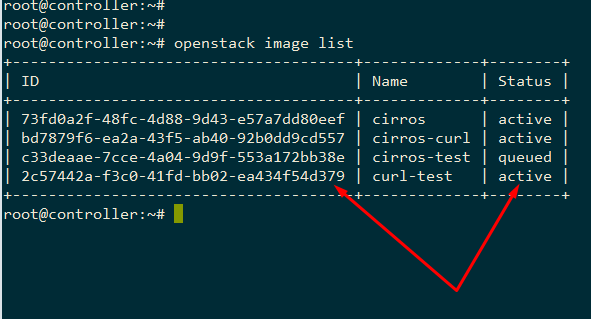

<a name = "3.6"></a>
## 3.6.	Xóa image

-	Để xóa image vừa tạo, sử dụng phương thức DELETE gửi request tới API của image đó. 

-	VÍ dụ: xóa image curl-test vừa tạo: 

	```
	curl -i -X DELETE -H "X-Auth-Token: $OS_AUTH_TOKEN" \
		-H "Content-Type: application/octet-stream" \
		http://controller:9292/v2/images/2c57442a-f3c0-41fd-bb02-ea434f54d379
	```

-	Kết quả như sau:

	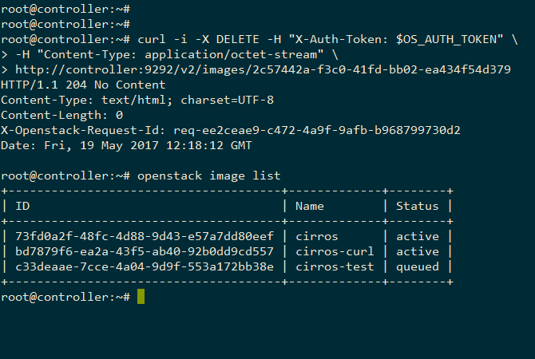

<a name = "3.7"></a>
## 3.7.	Sử dụng REST client

Ngoài ra, để kiểm tra các API của Glance, cả 2 trình duyệt phổ thông là Chrome và Firefox đều có hỗ trợ các  tiện ích như  [Restlet Client – REST API Testing](https://chrome.google.com/webstore/detail/restlet-client-rest-api-t/aejoelaoggembcahagimdiliamlcdmfm?utm_source=chrome-app-launcher-info-dialog) hoặc [Advance REST client ](https://chrome.google.com/webstore/detail/advanced-rest-client/hgmloofddffdnphfgcellkdfbfbjeloo?utm_source=chrome-app-launcher-info-dialog) có giao diện dễ sử dụng. 


Ví dụ sử dụng Restlet Client - REST API Testing như sau: 

-	Lấy token: 

	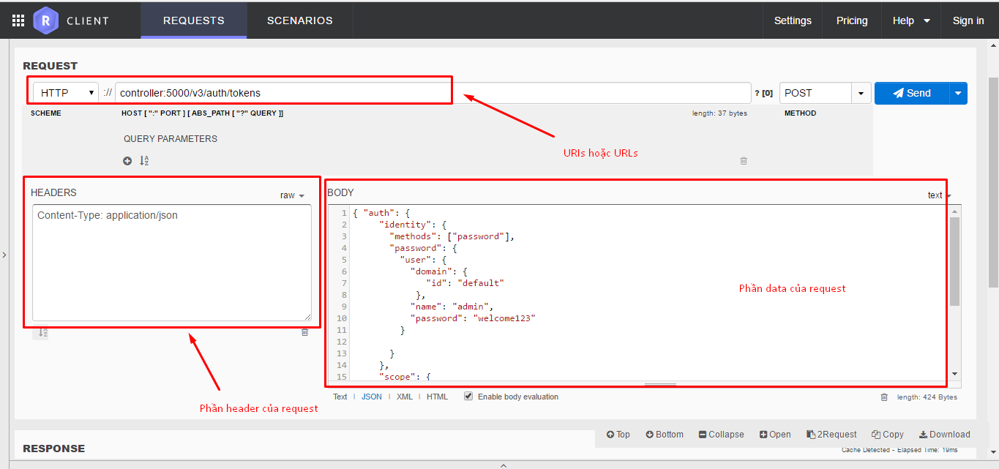

	Trả về token như sau: 

	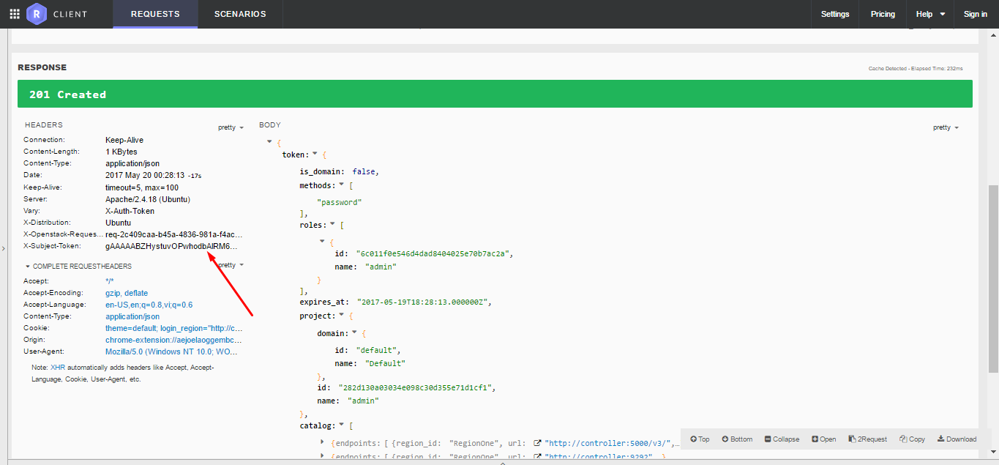

-	Lấy id của token trả về, và thực hiện thao tác list image đến API của glance:

	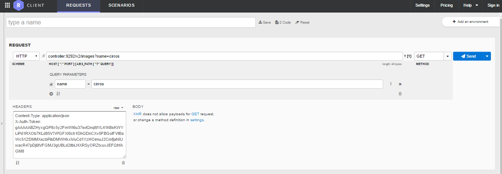

	Được kết quả trả về như sau: 

	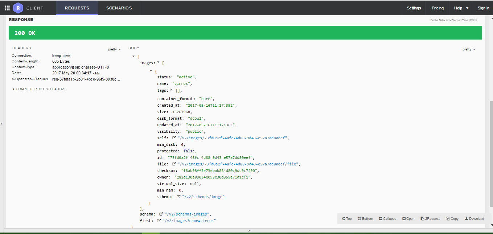

- Các thao tác khác thực hiện tương tự. (Chú ý các tham số của URI, method, header và payload của request ! ) 

- **Lưu ý**: Sử dụng Restlet Client - REST API Testing có thể thực hiện nhiều thao tác và hỗ trợ nhiều loại `Content-Type` ở phần header của request hơn là sử dụng Advanced REST client. 

- Tham khảo thêm một số API khác của Glance tại: https://developer.openstack.org/api-ref/image/v2/index.html

<a name = "4"></a>
# 4. Tham khảo

[1] glance cli: https://docs.openstack.org/cli-reference/glance.html

[2] openstack client image: https://docs.openstack.org/developer/python-openstackclient/command-objects/image.html

Gửi request tới Glance API: 

[3] https://docs.openstack.org/developer/glance/glanceapi.html 

[4] https://github.com/thaihust/Thuc-tap-thang-03-2016/blob/master/ThaiPH/OpenStack/Glance/ThaiPH_baocaotimhieuglance.md#cURL

[5] https://developer.openstack.org/api-ref/image/v2/index.html


