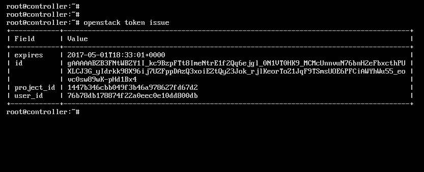
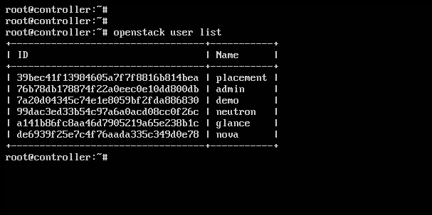
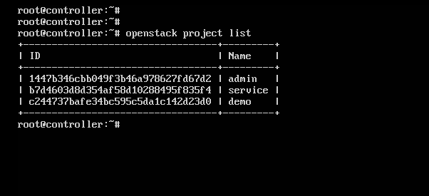
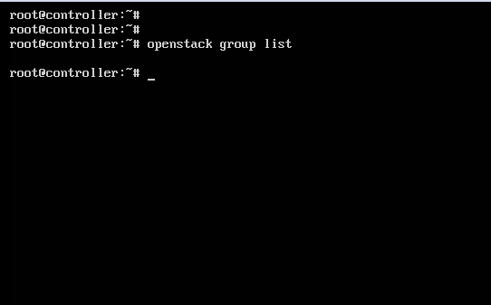
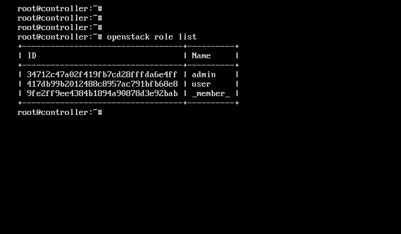
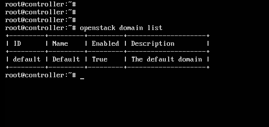
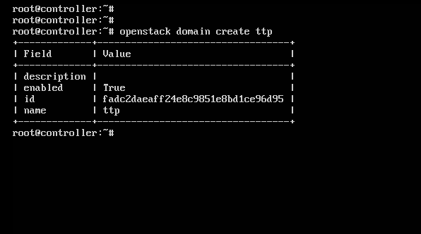
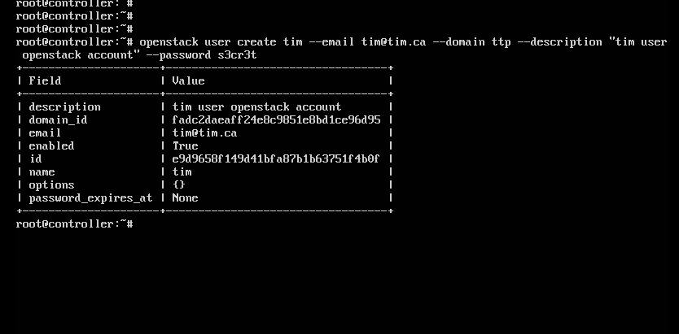
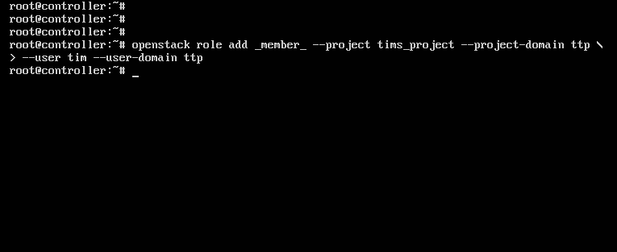
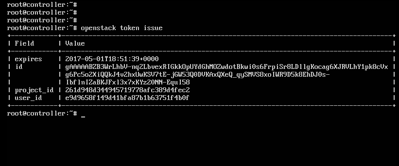

# SỬ DỤNG KEYSTONE

## ***Mục lục***


[1.	Sử dụng Keystone với OPS client – giao diện dòng lệnh và cURL](#1)

- [1.1.	Get a token](#1.1)

- [1.2.	Listing Users](#1.2)

- [1.3.	Listing projects](#1.3)

- [1.4.	Listing group](#1.4)

- [1.5.	Listing Roles](#1.5)

- [1.6.	Listing domains](#1.6)

- [1.7.	Creating Another domain	](#1.7)

- [1.8.	Creating a Project within the Domain](#1.8)

- [1.9.	Create a User within the Domain](#1.9)

- [1.10. Assigning a role to user for a project	](#1.10)

- [1.11. Authenticating as the new user](#1.11)

[2.	Sử dụng Keystone với Horizon](#2)

- [2.1.	Truy cập vào OPS](#2.1)

- [2.2.	List, Set, Delete, Create, and View a Project](#2.2)

- [2.3.	List, Set, Delete, Create, and View a User](#2.3)

[3.	Tham khảo](#3)

---

Sau đây sẽ trình bày một số thao tác làm việc với Keystone trên Openstack. Yêu cầu đã cài đặt sẵn Openstack hoặc Devstack. Thử nghiệm trên node Controller.

<a name = "1"></a>
# 1. Sử dụng Keystone với OPS client – giao diện dòng lệnh

- Phần này sẽ sử dụng OPS client để thực hiện một số hoạt động cơ bản của Keystone như xác thực, liệt kê, tạo người dùng, tạo project, domain, group và role. 

- Trước khi bắt đầu thực hiện các lệnh với keystone, cần tạo biến môi trường cho hệ thống dùng để xác thực với Keystone dễ dàng hơn. 

  ```
  export OS_IDENTITY_API_VERSION=3
  export OS_AUTH_URL=http://controller:5000/v3
  export OS_USERNAME=admin
  export OS_PROJECT_NAME=admin
  export OS_USER_DOMAIN_NAME=Default
  export OS_PASSWORD=openstack
  export OS_PROJECT_DOMAIN_NAME=Default
  ```

- Để kiếm tra sự thiết lập biến môi trường, thực hiện lệnh sau 

  `env| grep OS`
 
- Kết quả trả về như sau là đã thành công: 

  ```
  OS_IDENTITY_API_VERSION=3
  OS_AUTH_URL=http://controller:5000/v3
  OS_USERNAME=admin
  OS_PROJECT_NAME=admin
  OS_USER_DOMAIN_NAME=Default
  OS_PASSWORD=openstack
  OS_PROJECT_DOMAIN_NAME=Default
  ```

<a name = "1.1"></a>
## 1.1.	Get a token

- **Sử dụng Openstack Client**

  - Vì đã thiết lập dữ liệu xác thực như biến môi trường cho hệ thống nên chúng ta có thể đơn giản xin cấp phát token như sau:

    `openstack token issue`

  - Kết quả trả về như sau là hoàn thành: 

    


- **Sử dụng cURL**:

  - Khi sử dụng cURL để lấy token, payload cho yêu cầu xác thực phải được bao gồm các thông tin về người dùng và project: 

     ```
    curl -i -H "Content-Type: application/json" -d '
    { "auth": {
    	"identity": {
    		"methods": ["password"],
    			"password": {
    				"user": {
    				"name": "admin",
    				"domain": { "name": "Default" },
    				"password": "welcome123"
    				}
    			}
    	},
    	"scope": {
    		"project": {
    			"name": "admin",
    			"domain": { "name": "Default" }
                		}
            	}
            }
    }' http://localhost:5000/v3/auth/tokens
    ```

  - Kết quả trả về như sau:

    ```
    HTTP/1.1 201 Created
    Date: Mon, 01 May 2017 16:00:53 GMT
    Server: Apache/2.4.18 (Ubuntu)
    X-Subject-Token: gAAAAABZB1u679P0pn6_PSaYXczeshnuKXcfENkAkHD9G0GdqqRrR4T3FzhxWkL-peP3q1RM74xDzTvUrJzCT94DicIedWm9ZMeeeQLvbBPDycu4A0HO3yC3M5Tm2VUo2S9X8m_tL-sHEYQP80n9YsJb8ThqoxStl9Sz1bpfi-eTOYjhL8A4dP8
    Vary: X-Auth-Token
    X-Distribution: Ubuntu
    x-openstack-request-id: req-ebdbbcd9-f101-495f-ba1b-9cc14d18d0f5
    Content-Length: 3305
    Content-Type: application/json

    {"token": {"is_domain": false, "methods": ["password"], "roles": [{"id": "34712c47a02f419fb7cd28fffda6e4ff", "name": "admin"}], "expires_at": "2017-05-01T17:00:57.000000Z", "project": {"domain": {"id": "default", "name": "Default"}, "id": "1447b346cbb049f3b46a978627fd67d2", "name": "admin"}, "catalog": [{"endpoints": [{"region_id": "RegionOne", "url": "http://controller:9292", "region": "RegionOne", "interface": "admin", "id": "5b8cd7cca79f4ac5843b152686de805a"}, {"region_id": "RegionOne", "url": "http://controller:9292", "region": "RegionOne", "interface": "public", "id": "5ba5f481a7db481eace81d97d6ab0acd"}, {"region_id": "RegionOne", "url": "http://controller:9292", "region": "RegionOne", "interface": "internal", "id": "f514bd1a15104bde92577d80af96400c"}], "type": "image", "id": "3b90a7629301464d87efaad444833c53", "name": "glance"}, {"endpoints": [{"region_id": "RegionOne", "url": "http://controller:8774/v2.1", "region": "RegionOne", "interface": "admin", "id": "23b30fe9cbe54f86af153f010432dd92"}, {"region_id": "RegionOne", "url": "http://controller:8774/v2.1", "region": "RegionOne", "interface": "public", "id": "87c4912f13464d48b0467f94e53a5588"}, {"region_id": "RegionOne", "url": "http://controller:8774/v2.1", "region": "RegionOne", "interface": "internal", "id": "e9f0ddafc65d4d23bf37ae7eda53b873"}], "type": "compute", "id": "5a02beae32d947ba9e788b223132abb1", "name": "nova"}, {"endpoints": [{"region_id": "RegionOne", "url": "http://controller:9696", "region": "RegionOne", "interface": "public", "id": "25567ef43ea24795853f9372247fd1a7"}, {"region_id": "RegionOne", "url": "http://controller:9696", "region": "RegionOne", "interface": "internal", "id": "2898c88933084843b4a50d5ddd9d8cc9"}, {"region_id": "RegionOne", "url": "http://controller:9696", "region": "RegionOne", "interface": "admin", "id": "52e0dc60c82e47f093552dc7707c5f86"}], "type": "network", "id": "6105ce11142b4bc7a0825a4ded96144c", "name": "neutron"}, {"endpoints": [{"region_id": "RegionOne", "url": "http://controller/placement", "region": "RegionOne", "interface": "public", "id": "32fbd59dc57c47aa959d7732831fc961"}, {"region_id": "RegionOne", "url": "http://controller/placement", "region": "RegionOne", "interface": "internal", "id": "60f562e943d6469a8534e88936e912b7"}, {"region_id": "RegionOne", "url": "http://controller/placement", "region": "RegionOne", "interface": "admin", "id": "948487508ebf4c079c645dc92e10c7da"}], "type": "placement", "id": "d2344b9e756746a49723fc13b173d2eb", "name": "placement"}, {"endpoints": [{"region_id": "RegionOne", "url": "http://controller:5000/v3/", "region": "RegionOne", "interface": "public", "id": "61d1295cfcb945eb9eb97871742bca8c"}, {"region_id": "RegionOne", "url": "http://controller:5000/v3/", "region": "RegionOne", "interface": "internal", "id": "957202fb92ad47c2a142ff9486f8edb8"}, {"region_id": "RegionOne", "url": "http://controller:35357/v3/", "region": "RegionOne", "interface": "admin", "id": "ca94965b7334459b96bdba0f5c9a8732"}], "type": "identity", "id": "da3d535586ae4b59ade7c2a3f69baa40", "name": "keystone"}], "user": {"password_expires_at": null, "domain": {"id": "default", "name": "Default"}, "id": "76b78db178874f22a0eec0e10dd800db", "name": "admin"}, "audit_ids": ["qDTIdgR5RYG5ytWksBhEjA"], "issued_at": "2017-05-01T16:00:58.000000Z"}}
    ```


  - ID của token được đặt trong trường X-Subject-Token, để sử dụng token này cho các thao tác tiếp theo thực hiện với giao diện dòng lệnh cURL được dễ dàng hơn, ta thiết lập biến môi trường OS_TOKEN để lưu lại token này:

    `export OS_TOKEN=gAAAAABZB1u679P0pn6_PSaYXczeshnuKXcfENkAkHD9G0GdqqRrR4T3FzhxWkL-peP3q1RM74xDzTvUrJzCT94DicIedWm9ZMeeeQLvbBPDycu4A0HO3yC3M5Tm2VUo2S9X8m_tL-sHEYQP80n9YsJb8ThqoxStl9Sz1bpfi-eTOYjhL8A4dP8 `


<a name = "1.2"></a>
## 1.2.	Listing Users 

- **Sử dụng Openstack client**:

  - Sau khi chạy OPS, một số người dùng có thể tự động được tạo, thông thường đó là những tài khoản dịch vụ của OPS (Cinder, Glance và Nova), một tài khoản quản trị (admin)  và tài khoản người dùng demo đại diện cho khách hàng.

    `openstack user list`

  - Kết quả trả về:

    


- **Sử dụng cURL**:

  `curl -s -H "X-Auth-Token: $OS_TOKEN" http://localhost:5000/v3/users | python -mjson.tool`

  Kết quả trả về như sau:
  
  ```
  {
    "links": {
        "next": null,
        "previous": null,
        "self": "http://localhost:5000/v3/users"
    },
    "users": [
        {
            "domain_id": "default",
            "enabled": true,
            "id": "39bec41f13984605a7f7f8816b814bea",
            "links": {
                "self": "http://localhost:5000/v3/users/39bec41f13984605a7f7f8816b814bea"
            },
            "name": "placement",
            "options": {},
            "password_expires_at": null
        },
        {
            "domain_id": "default",
            "enabled": true,
            "id": "76b78db178874f22a0eec0e10dd800db",
            "links": {
                "self": "http://localhost:5000/v3/users/76b78db178874f22a0eec0e10dd800db"
            },
            "name": "admin",
            "options": {},
            "password_expires_at": null
        },
        {
            "domain_id": "default",
            "enabled": true,
            "id": "7a20d04345c74e1e8059bf2fda886830",
            "links": {
                "self": "http://localhost:5000/v3/users/7a20d04345c74e1e8059bf2fda886830"
            },
            "name": "demo",
            "options": {},
            "password_expires_at": null
        },
        {
            "domain_id": "default",
            "enabled": true,
            "id": "99dac3ed33b54c97a6a0acd08cc0f26c",
            "links": {
                "self": "http://localhost:5000/v3/users/99dac3ed33b54c97a6a0acd08cc0f26c"
            },
            "name": "neutron",
            "options": {},
            "password_expires_at": null
        },
        {
            "domain_id": "default",
            "enabled": true,
            "id": "a141b86fc8aa46d7905219a65e238b1c",
            "links": {
                "self": "http://localhost:5000/v3/users/a141b86fc8aa46d7905219a65e238b1c"
            },
            "name": "glance",
            "options": {},
            "password_expires_at": null
        },
        {
            "domain_id": "default",
            "enabled": true,
            "id": "de6939f25e7c4f76aada335c349d0e78",
            "links": {
                "self": "http://localhost:5000/v3/users/de6939f25e7c4f76aada335c349d0e78"
            },
            "name": "nova",
            "options": {},
            "password_expires_at": null
        }
    ]
  }
  ```

<a name = "1.3"></a>
## 1.3.	Listing projects

- **Sử dụng Openstack client**:

  - Giống như user, OPS cũng mặc định tạo một số project. Chúng có thể liệt kê sử dụng câu lệnh sau: 

    `openstack project list`

  - Kết quả trả về: 

    


- **Sử dụng cURL**:

  `curl -s -H "X-Auth-Token: $OS_TOKEN" http://localhost:5000/v3/projects | python -mjson.tool`

  Kết quả trả về:
  
   ```
  {
    "links": {
        "next": null,
        "previous": null,
        "self": "http://localhost:5000/v3/projects"
    },
    "projects": [
        {
            "description": "Bootstrap project for initializing the cloud.",
            "domain_id": "default",
            "enabled": true,
            "id": "1447b346cbb049f3b46a978627fd67d2",
            "is_domain": false,
            "links": {
                "self": "http://localhost:5000/v3/projects/1447b346cbb049f3b46a978627fd67d2"
            },
            "name": "admin",
            "parent_id": "default"
        },
        {
            "description": "Service Project",
            "domain_id": "default",
            "enabled": true,
            "id": "b7d4603d8d354af58d10288495f835f4",
            "is_domain": false,
            "links": {
                "self": "http://localhost:5000/v3/projects/b7d4603d8d354af58d10288495f835f4"
            },
            "name": "service",
            "parent_id": "default"
        },
        {
            "description": "Demo Project",
            "domain_id": "default",
            "enabled": true,
            "id": "c244737bafe34bc595c5da1c142d23d0",
            "is_domain": false,
            "links": {
                "self": "http://localhost:5000/v3/projects/c244737bafe34bc595c5da1c142d23d0"
            },
            "name": "demo",
            "parent_id": "default"
        }
    ]
  }
  ```

<a name = "1.4"></a>
## 1.4.	Listing group

- **Sử dụng Openstack client**:

  - Giống như user, OPS cũng mặc định tạo một số group. Lưu ý là các user có thể là thành phần của group hoặc không. 

    `openstack group list`

  - Kết quả trả về: 

    


- **Sử dụng cURL**:

  `curl -s -H "X-Auth-Token: $OS_TOKEN" http://localhost:5000/v3/groups | python -mjson.tool`

  Kết quả trả về:
  
  ```
  {
    "groups": [],
    "links": {
        "next": null,
        "previous": null,
        "self": "http://localhost:5000/v3/groups"
    }
  }
  ```

- ***Do chưa có group nào nên kết quả trả về là null.***

<a name = "1.5"></a>
## 1.5.	Listing Roles

- **Sử dụng Openstack client**:

  - Cũng giống như các câu lệnh trên, OPS cũng tạo một số role mặc định và gán chúng với một số user trên project

    `openstack role list`

  - Kết quả:

    


- **Sử dụng cURL**:

  `curl -s -H "X-Auth-Token: $OS_TOKEN" http://localhost:5000/v3/roles | python -mjson.tool`

  Kết quả trả về:
  
  ```
  {
    "links": {
        "next": null,
        "previous": null,
        "self": "http://localhost:5000/v3/roles"
    },
    "roles": [
        {
            "domain_id": null,
            "id": "34712c47a02f419fb7cd28fffda6e4ff",
            "links": {
                "self": "http://localhost:5000/v3/roles/34712c47a02f419fb7cd28fffda6e4ff"
            },
            "name": "admin"
        },
        {
            "domain_id": null,
            "id": "417db99b2012488c8957ac791bfb68e8",
            "links": {
                "self": "http://localhost:5000/v3/roles/417db99b2012488c8957ac791bfb68e8"
            },
            "name": "user"
        },
        {
            "domain_id": null,
            "id": "9fe2ff9ee4384b1894a90878d3e92bab",
            "links": {
                "self": "http://localhost:5000/v3/roles/9fe2ff9ee4384b1894a90878d3e92bab"
            },
            "name": "_member_"
        }
    ]
  }
  ```


<a name = "1.6"></a>
## 1.6.	Listing domains

- **Sử dụng Openstack client**:

  - Keystone tự động có một domain luôn trong trạng thái up, để xử lý các khả năng tương thích ngược giữa các versions Identity API

    `openstack domain list`

  - Kết quả trả về như sau:

    


- **Sử dụng cURL**:

  `curl -s -H "X-Auth-Token: $OS_TOKEN" http://localhost:5000/v3/domains | python -mjson.tool`

  Kết quả trả về:

  ```
  {
    "domains": [
        {
            "description": "The default domain",
            "enabled": true,
            "id": "default",
            "links": {
                "self": "http://localhost:5000/v3/domains/default"
            },
            "name": "Default"
        }
    ],
    "links": {
        "next": null,
        "previous": null,
        "self": "http://localhost:5000/v3/domains"
    }
  }
  ```


<a name = "1.7"></a>
## 1.7.	Creating Another domain

- **Sử dụng Openstack client**:

  `openstack domain create ttp`

  - Kết quả trả về:

    


- **Sử dụng cURL**:

  `curl -s -H "X-Auth-Token: $OS_TOKEN" -H "Content-Type: application/json" -d '{ "domain": { "name": "ttp"}}' http://localhost:5000/v3/domains | python -mjson.tool`

  Kết quả trả về:
  
  ```
  {
    "domain": {
        "description": "",
        "enabled": true,
        "id": " f3afc063c8d5428d9596504ef88ce4bc",
        "links": {
            "self": "http://localhost:5000/v3/domains/081e5f14a3f642f7bb63bf3278e035ea"
        },
        "name": "ttp"
    }
  }
  ```


<a name = "1.8"></a>
## 1.8.	Creating a Project within the Domain

- **Sử dụng Openstack client**:

  - Để tạo một project trong Domain, cần xác định domain và chúng ta đã tạo ở bước trước và có thể thêm mô tả để phân biệt.

    `openstack project create tims_project --domain ttp --description "tims dev project"`

  - Kết quả trả về như sau:

    


- **Sử dụng cURL**:

  ```
  curl -s -H "X-Auth-Token: $OS_TOKEN" \
  -H "Content-Type: application/json" \
  -d '
  { 
  "project": 
	{ 
	"name": "tims_project", 
	"domain_id": "f3afc063c8d5428d9596504ef88ce4bc", 
	"description": "tims dev project"
	}
  }' http://localhost:5000/v3/projects | python -mjson.tool
  ```

  Kết quả trả về:

  ```
  {
    "project": {
        "description": "tims dev project",
        "domain_id": "f3afc063c8d5428d9596504ef88ce4bc",
        "enabled": true,
        "id": "9c0749c08dcd42a480d68e07c11e9eaa",
        "is_domain": false,
        "links": {
            "self": "http://localhost:35357/v3/projects/9c0749c08dcd42a480d68e07c11e9eaa"
        },
        "name": "tims_project",
        "parent_id": "f3afc063c8d5428d9596504ef88ce4bc"
    }
  }
  ```


<a name = "1.9"></a>
## 1.9.	Create a User within the Domain

- **Sử dụng Openstack client**:

  - Tạo user trong domain, cần xác định domain đã tạo trước, thiết lập password và email cho user là nên tùy chọn, nhưng nên làm.

    ```
    openstack user create tim --email tim@tim.ca \
    --domain ttp --description "tims openstack user account" \
    --password s3cr3t
    ```

  - Kết quả trả về như sau:

    


- **Sử dụng cURL**:

  ```
  curl -s -H "X-Auth-Token: $OS_TOKEN" -H "Content-Type: application/json" \
  -d '
  { "user": 
	{ 	"name": "tim",
		"password": "s3cr3t", 
		"email": "tim@tim.ca", 
		"domain_id": "05a0fcbf796142bfbeb30d0fd3dfa67a",
		"description": "tims openstack user account"
	}
  }' http://localhost:5000/v3/users | python -mjson.tool
  ```

  Kết quả trả về:

  ```
  {
    "user": {
        "description": "tims openstack user account",
        "domain_id": "f3afc063c8d5428d9596504ef88ce4bc",
        "email": "tim@tim.ca",
        "enabled": true,
        "id": "964e015383274d9a8116c0f6282387f7",
        "links": {
            "self": "http://localhost:5000/v3/users/964e015383274d9a8116c0f6282387f7"
        },
        "name": "tim",
        "options": {},
        "password_expires_at": null
    }
  }
  ```


<a name = "1.10"></a>
## 1.10.	Assigning a role to user for a project

- **Sử dụng Openstack client**:

  - Để gán một role tới user mới trên project mới có thể dùng lệnh, nhưng tất cả user và project phải được xác định trong cùng domain, hoặc Openstack client sẽ sử dụng domain default nếu không xác định thông số domain.

    `openstack role add member --project tims_project --project-domain ttp --user tim --user-domain ttp`

  - Kết quả:

    


- **Sử dụng cURL**:
  
  ```
  curl -s -X PUT -H "X-Auth-Token: $OS_TOKEN" \
  http://localhost:5000/v3/projects/9c0749c08dcd42a480d68e07c11e9eaa/users/964e015383274d9a8116c0f6282387f7/roles/9fe2ff9ee4384b1894a90878d3e92bab
  ```

  ***Gán user tims trên project tims_project với role _member_***


<a name = "1.11"></a>
## 1.11.	Authenticating as the new user 

- **Sử dụng Openstack client**:

  - Để xác thực như một user mới tạo, tốt nhất là dùng terminal và thiết lập lại biến môi trường. trong trường hợp này, thông tin user name, pasword, project và domain phải được đặt như dưới đây

    ```
    $ export OS_PASSWORD=s3cr3t
    $ export OS_IDENTITY_API_VERSION=3
    $ export OS_AUTH_URL=http://controller:5000/v3
    $ export OS_USERNAME=tim
    $ export OS_PROJECT_NAME=tims_project
    $ export OS_USER_DOMAIN_NAME=ttp
    $ export OS_PROJECT_DOMAIN_NAME=ttp
    ```

  - Một lần thiết lập, chúng ta có thẻ lấy token để đảm bảo user đã được xác thực

    `openstack token issue`

  - Kết quả như sau: 

    


- **Sử dụng cURL**:

  ```
  curl -i -H "Content-Type: application/json" -d '
  { "auth":
	{
	"identity": 
		{
		"methods": ["password"],
		"password": 
			{
			"user": 
				{
				"name": "tim",
				"domain": { "name": "ttp" },
				"password": "s3cr3t"
				}
			}
		},
	"scope":
		{
		"project": 
			{
			"name": "tims_project",
			"domain": { "name": "ttp" }
			}
		}
	}
  }' http://localhost:5000/v3/auth/tokens
  ```

  Kết quả trả về lấy được token là thành công:

  ```
  HTTP/1.1 201 Created
  Date: Mon, 01 May 2017 17:27:40 GMT
  Server: Apache/2.4.18 (Ubuntu)
  X-Subject-Token: gAAAAABZB3AMRhbI487pmtSz-S_1_i_Su6xFjeevtmN191lzFFWh-UhMi8-mDdBF9N1l7jbtyf1RXhKeeATGdviMHH33_qsv-rTqJGBiHGj-Z6sFYRxaq9EaBuVS7RybqMC7VRMC4OLNrIMrSeDa2g9WOdOL8Pwx6NOED_ekm1TO1Ny7l9dbpag
  Vary: X-Auth-Token
  X-Distribution: Ubuntu
  x-openstack-request-id: req-22a09df3-10ec-4acc-b7d5-7c0f2b8f03c4
  Content-Length: 3355
  Content-Type: application/json

  {"token": {"is_domain": false, "methods": ["password"], "roles": [{"id": "9fe2ff9ee4384b1894a90878d3e92bab", "name": "_member_"}], "expires_at": "2017-05-01T18:27:40.000000Z", "project": {"domain": {"id": "f3afc063c8d5428d9596504ef88ce4bc", "name": "ttp"}, "id": "9c0749c08dcd42a480d68e07c11e9eaa", "name": "tims_project"}, "catalog": [{"endpoints": [{"region_id": "RegionOne", "url": "http://controller:9292", "region": "RegionOne", "interface": "admin", "id": "5b8cd7cca79f4ac5843b152686de805a"}, {"region_id": "RegionOne", "url": "http://controller:9292", "region": "RegionOne", "interface": "public", "id": "5ba5f481a7db481eace81d97d6ab0acd"}, {"region_id": "RegionOne", "url": "http://controller:9292", "region": "RegionOne", "interface": "internal", "id": "f514bd1a15104bde92577d80af96400c"}], "type": "image", "id": "3b90a7629301464d87efaad444833c53", "name": "glance"}, {"endpoints": [{"region_id": "RegionOne", "url": "http://controller:8774/v2.1", "region": "RegionOne", "interface": "admin", "id": "23b30fe9cbe54f86af153f010432dd92"}, {"region_id": "RegionOne", "url": "http://controller:8774/v2.1", "region": "RegionOne", "interface": "public", "id": "87c4912f13464d48b0467f94e53a5588"}, {"region_id": "RegionOne", "url": "http://controller:8774/v2.1", "region": "RegionOne", "interface": "internal", "id": "e9f0ddafc65d4d23bf37ae7eda53b873"}], "type": "compute", "id": "5a02beae32d947ba9e788b223132abb1", "name": "nova"}, {"endpoints": [{"region_id": "RegionOne", "url": "http://controller:9696", "region": "RegionOne", "interface": "public", "id": "25567ef43ea24795853f9372247fd1a7"}, {"region_id": "RegionOne", "url": "http://controller:9696", "region": "RegionOne", "interface": "internal", "id": "2898c88933084843b4a50d5ddd9d8cc9"}, {"region_id": "RegionOne", "url": "http://controller:9696", "region": "RegionOne", "interface": "admin", "id": "52e0dc60c82e47f093552dc7707c5f86"}], "type": "network", "id": "6105ce11142b4bc7a0825a4ded96144c", "name": "neutron"}, {"endpoints": [{"region_id": "RegionOne", "url": "http://controller/placement", "region": "RegionOne", "interface": "public", "id": "32fbd59dc57c47aa959d7732831fc961"}, {"region_id": "RegionOne", "url": "http://controller/placement", "region": "RegionOne", "interface": "internal", "id": "60f562e943d6469a8534e88936e912b7"}, {"region_id": "RegionOne", "url": "http://controller/placement", "region": "RegionOne", "interface": "admin", "id": "948487508ebf4c079c645dc92e10c7da"}], "type": "placement", "id": "d2344b9e756746a49723fc13b173d2eb", "name": "placement"}, {"endpoints": [{"region_id": "RegionOne", "url": "http://controller:5000/v3/", "region": "RegionOne", "interface": "public", "id": "61d1295cfcb945eb9eb97871742bca8c"}, {"region_id": "RegionOne", "url": "http://controller:5000/v3/", "region": "RegionOne", "interface": "internal", "id": "957202fb92ad47c2a142ff9486f8edb8"}, {"region_id": "RegionOne", "url": "http://controller:35357/v3/", "region": "RegionOne", "interface": "admin", "id": "ca94965b7334459b96bdba0f5c9a8732"}], "type": "identity", "id": "da3d535586ae4b59ade7c2a3f69baa40", "name": "keystone"}], "user": {"password_expires_at": null, "domain": {"id": "f3afc063c8d5428d9596504ef88ce4bc", "name": "ttp"}, "id": "964e015383274d9a8116c0f6282387f7", "name": "tim"}, "audit_ids": ["1GH_4goYTAi27Wm6dIylYQ"], "issued_at": "2017-05-01T17:27:40.000000Z"}}
  ```

---


***=> Còn có rất nhiều các câu lệnh dành cho người dùng admin hoặc người dùng thông thường, để hiểu thêm có thể sử dụng `openstack –help` để có thêm các thông tin về các câu lệnh khác hoặc xem tại [Openstack-Client documentation.](https://docs.openstack.org/developer/python-openstackclient/)***

***=>	Tham khảo thêm các câu lệnh tương tác Keystone dùng cURL : https://docs.openstack.org/developer/keystone/devref/api_curl_examples.html***.

<a name = "2"></a>
# 2.	Sử dụng Keystone với Horizon 

- Nhiều hoạt động của Keystone được hỗ trợ thông qua Horizon – Dashboard của OPS. 

- Tuy nhiên, phụ thuộc vào phiên bản cấu hình Horizon mà có thể có chút khác biệt:

  - Nếu v2 của Identity được kích hoạt, thì chỉ User và Project CRUD hỗ trợ được, và các user sẽ chi có thể xác thực thông qua một domain.

  - Nếu v3 của Identity API được kích hoạt, thì User, Group, Project, Domain và Role CRUD hỗ trỡ có thể sử dụng được, và user có thể được xác thực với nhiều domain. 

<a name = "2.1"></a>
## 2.1.	Truy cập vào OPS

Ban đầu, trên giao diện Horizon (1 domain) hiện thông tin để người dùng đăng nhập username và password. Bước này có thể coi như xin cấp phát token từ Keystone


Sau đó, khi đã được quyền truy cập với hệ thống với role của mình, thì giao diện quản lý thông qua dashboard sẽ hiện ra như sau: 


<a name = "2.2"></a>
## 2.2.	List, Set, Delete, Create, and View a Project

Từ giao diện Horizon, một user có thể thực hiện các thao tác như thực hiện câu lệnh openstack project …


<a name = "2.3"></a>
## 2.3.	List, Set, Delete, Create, and View a User


<a name = "3"></a>
# 3. Tham khảo

[1] Book: Identity, Authentication, and Access Management in OpenStack – Author: Steve Martinelli, Henry Nash, and Brad Topol - Copyright © 2016 Steve Martinelli, Henry Nash, and Brad Topol. All rights reserved.

[2] https://github.com/thaihust/Thuc-tap-thang-03-2016/blob/master/ThaiPH/OpenStack/Keystone/Identity_Authentication_Access-Management_in_OpenStack/ThaiPH_Chap-2-Using-KeyStone.md

[3] https://docs.openstack.org/developer/keystone/devref/api_curl_examples.html