# TOKEN FORMAT

## ***Mục lục***

[1.	Lịch sử các loại format của token](#1)

[2.	UUID token](#2)

- [2.1.	Giới thiệu](#2.1)

- [2.2.	Token Generation Workflow](#2.2)

- [2.3.	Quá trình xác thực token](#2.3)

- [2.4.	Quá trình thu hồi token](#2.4)

- [2.5.	UUID - Multiple Data Centers](#2.5)

[3.	PKI token](#3)

- [3.1.	Giới thiệu](#3.1)

- [3.2.	Quá trình tạo token](#3.2)

- [3.3.	Quá trình xác thực token](#3.3)

- [3.4.	Token Revocation Workflow](#3.4)

- [3.5.	PKI/PKIZ - Multiple Data Centers](#3.5)

[4.	Fernet token](#4)

- [4.1.	Giới thiệu](#4.1)

- [4.2.	Fernet key rotation](#4.2)

- [4.3.	Kế hoạch cho vấn đề rotated keys](#4.3)

- [4.4.	Token generation workflow](#4.4)

- [4.5.	Token validation workflow](#4.5)

- [4.6.	Token revocation workflow](#4.6)

- [4.7.	Fernet – Multiple data center](#4.7)

[5.	Tham khảo](#5)

---

<a name = "1"></a>
# 1. Lịch sử các loại format của token

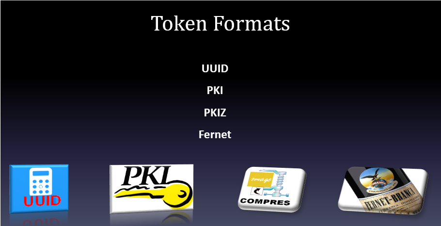

Keystone cho phép một vài loại token, và những user có thể băn khoăn tại sao lại có nhiều loại đến như vậy. Để giúp hiểu sâu hơn vấn đề này, sau đây sẽ cung cấp một cách vắn tắt về lịch sử làm thế nào các loại token của Keystone được phát triển. 

- Trong những ngày đầu, Keystone hỗ trợ token **UUID**. Đây là loại token dài 32 kí tự và được sử dụng để xác thực và ủy quyền. 

  - **Ưu điểm** của loại token này là kích thước nhỏ và dễ dàng sử dụng, đồng thời cũng dễ dàng để thêm vào một câu lệnh cURL.

  - **Nhược điểm** của loại token này là nó không thể mang đủ thông tin để xác thực. các dịch vụ của OPS sẽ luon gửi lại token này tới Keystone server để kiểm tra xác thực. Điều này dẫn tới là bát kì hoạt động nào của OPS đều phải hỏi lại về Keystone và nó dẫn tới Keystone trở thành nút thắt cổ chai của OPS.

- Để giải quyết các vấn đề với token UUID,  đội ngũ Keystone đã tạo ra loại token mới là **PKI token**. Loại này chứa đủ thông tin để thực hiện xác thực và cũng chứa cả những catalog dịch vụ. 

  - Thêm vào đó, nó còn được đánh dấu và các dịch vụ có thể cache lại token và sử dụng nó cho đến khi hết hạn hoặc bị thu hồi. 

  - Sử dụng token PKI làm giảm lưu lượng trên Keystone server, nhưng vẫn có bất lợi là token này thì kích thước lớn. PKI token có thể lên tới 8KB và nó làm cho khó khớp với HTTP header. Rất nhiều tweb server không thể xử lý nỗi những bản tin với dung lượng HTTP header lên tới 8KB mà không được cấu hình trước. 

  - Hơn nữa, những token này khó để sử dụng với câu lệnh cURL .

  - Đội ngũ Keystone đã cải tiến PKI thành PKIz – nén lại của PKI (được khoảng 10%). Tuy nhiên, phản hồi từ cộng động OPS cho rằng loại token này kích thước vẫn còn quá lớn. 

- Đội ngũ Keystone sau đó đã lại tạo thêm loại token mới gọi là **Fernet token**. 

  - Token Fernet thì có kích thước nhỏ (255 kí tự) nhưng lại chứa đủ thông tin để có thể xác thực tại các service local.  Token này còn có nhiều lợi ích. 

  - Chứa đủ thông tin mà Keystone không cần phải lưu trữ dữ liệu token trong database. Một trong những khía cạnh không hài lòng nhất của các loại token trước đó là cần phải được lưu trong database. Điều này làm dẫn tới database có thể bị đầy và làm giảm hiệu suất hoạt động của Keystone. 

<a name = "2"></a>
# 2. UUID token

<a name = "2.1"></a>
## 2.1. Giới thiệu

- Là loại token đầu tiên của Keystone.

- UUID token đơn giản là một chuỗi 32 kí tự được sinh ra ngẫu nhiên. Được cấp phát và được xác nhận bởi dịch vụ Identity. 

- Sử dụng phương pháp sinh chuỗi sử dụng các chữ số hệ hexa. Điều này làm UUID token trở nên thân thiện và an toàn cho việc truyền giữa các môi trường non-binary. 

- Một token UUID phải được lưu trữ lâu dài trong backend (thông thường là lưu trong database) để có thể có thể xác nhận sau đó.  

- Token UUID có thể thu hồi bằng cách sử dụng một request DELETE với token ID. Khi đó, token không hẳn là bị xóa khỏi hệ thống backend mà chỉ đơn giản là làm cho nó bị thu hồi không còn hiệu lực. 

- Do token dài 32 kí tự nên kích thước trong HTTP header là 32 byte. 

- Một UUID token thông thường có thể trông như sau: 

`468da447bd1c4821bbc5def0498fd441`

- Loại này có kích thước nhỏ và dễ dàng sử dụng khi truy cập Keystone thông qua câu lệnh cURL. 

- Nhược điểm: Keystone có thể trở thành nút cổ chai do số lượng thông tin liên lạc rất lớn xảy ra khi Keystone cần để xác nhận token giữa các dịch vụ.

- Để sử dụng UUID token trong OPS, cấu hình Keystone trong file keystone.conf tại section token như sau: 

>`provider = keystone.token.providers.uuid.Provider`

<a name = "2.2"></a>
## 2.2.	Token Generation Workflow

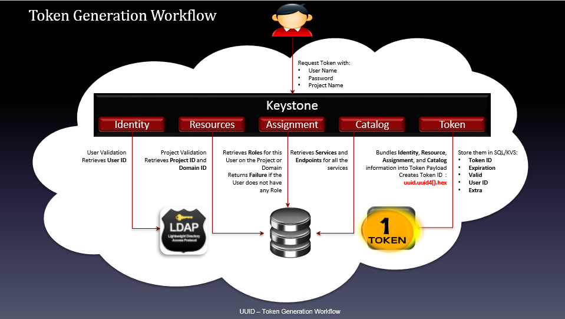


\- User request tới keystone tạo token với các thông tin: user name, password, project name (và domain name nếu cài multiple domain)

\- Chứng thực user, sau đó lấy User ID từ backend LDAP (dịch vụ Identity)

\- Chứng thực project, thu thập thông tin Project ID và Domain ID (Resource)

\- Lấy ra Roles từ Backend trên Project hoặc Domain tương ứng trả về cho user, nếu user không có bất kỳ roles nào thì trả về Failure(dịch vụ Assignment)

\- Thu thập các Services và các Endpoints của các service đó (Catalog)

\- Tổng hợp các thông tin về Identity, Resources, Assignment, Catalog ở trên đưa vào Token payload, tạo ra token sử dụng hàm uuid.uuid4().hex

\- Lưu thông tin của Token và SQL/KVS backend với các thông tin: TokenID, Expiration, Valid, UserID, Extra

<a name = "2.3"></a>
## 2.3.	Quá trình xác thực token - Token Validation Workflow 


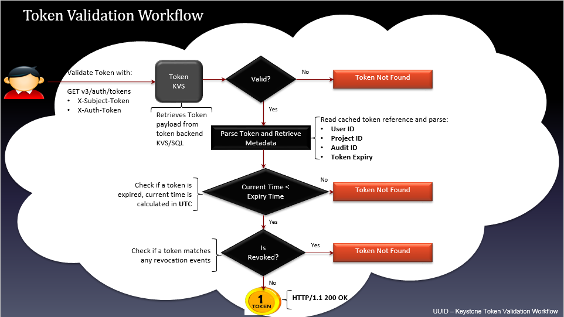

- User gửi yêu cầu chứng thực token sử dụng GET v3/auth/tokens

- Thu thập token payloads từ token backend KVS/SQL kiểm tra trường valid:

  -	Nếu không hợp lệ trả về thông báo Token Not Found. 

  -	Nếu tìm thấy chuyển sang bước tiếp theo

- Phân tích token và thu thập metadata: User ID, Project ID, Audit ID, Token Expire

- Kiểm tra token đã expired chưa: Nếu thời điểm hiện tại < "expired time" theo UTC thì token chưa expired, chuyển sang bước tiếp theo, ngược lại trả về thông báo token not found.

- Kiểm tra xem token đã bị thu hồi chưa (kiểm tra trong bảng revocation_event của database keystone):  Nếu token đã bị thu hồi (tương ứng với 1 event trong bảng revocation_event) trả về thông báo Token Not Found. Nếu chưa bị thu hồi trả về token (truy vấn HTTP thành công HTTP/1.1 200 OK )

<a name = "2.4"></a>
## 2.4.	Quá trình thu hồi token

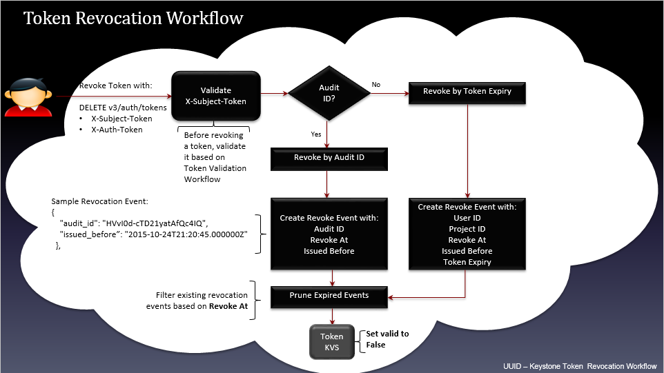

- Gửi yêu cầu thu hồi token với API request DELETE v3/auth/tokens. Trước khi thực hiện sự kiện thu hồi token thì phải chứng thực token nhờ vào tiến trình Token Validation Workflow đã trình bày ở trên.

- Kiểm tra trường Audit ID. Nếu có, tạo sự kiện thu hồi với **audit id**. Nếu không có audit id, tạo sự kiện thu hồi với **token expired**

- Nếu tạo sự kiện thu hồi token với audit ID, các thông tin cần cập nhật vào **revocation_event table** của keystone database gồm: **audit_id**, **revoke_at**, **issued_before**. 

- Nếu tạo sự kiện thu hồi token với **token expired**, các thông tin cần thiết cập nhật vào **revocation_event table** của keystone database gồm: **user_id**, **project_id**, **revoke_at**, **issued_before**, **token_expired**.

- Loại bỏ các sự kiện của các token đã expired từ bảng revocation_event của database "keystone"

- Cập nhật vào token database, thiết lập lại trường **"valid"** thành **false (0)**


<a name = "2.5"></a>
## 2.5.	UUID - Multiple Data Centers

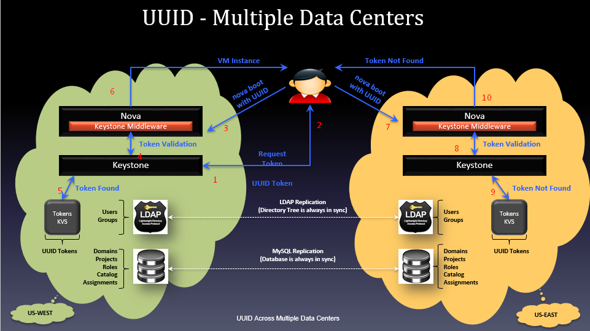

\- UUID Token không hỗ trợ xác thực và ủy quyền trong trường hợp multiple data centers.

\- Như ví dụ mô tả ở hình vẽ, một hệ thống cloud triển khai trên hai datacenter ở hai nơi khác nhau. Khi xác thực với keystone trên datacenter US-West và sử dụng token trả về để request tạo một máy ảo với Nova, yêu cầu hoàn toàn hợp lệ và khởi tạo máy ảo thành công. Trong khi nếu mang token đó sang datacenter US-East yêu cầu tạo máy ảo thì sẽ không được xác nhận do token trong backend database US-West không có bản sao bên US-East.

<a name = "3"></a>
# 3. PKI token

<a name = "3.1"></a>
## 3.1.	Giới thiệu

- PKI token chứa toàn bộ thông tin xác thực nhận được từ Keystone. Điều này có nghĩa là token chứa lượng lớn các thông tin: như là thời gian cấp phát, thời gian hết hạn, định danh user, thông tin project, domain và role cho user, catalog dịch vụ, và nhiều thông tin khác. 

- Các thông tin trả cề được biểu diễn dưới dạng payload định dạng json. Và payload được đánh dấu sử dụng mã hóa. 

- Với định dạng PKIz, việc đánh dấu payload được nén lại sử dụng thư viện nén zlib.

- Kích thước tương đối lớn - 8KB

- Chứa nhiều thông tin: thời điểm khởi tạo, thời điểm hết hạn, user id, project, domain, role gán cho user, danh mục dịch vụ nằm trong payload.

- Muốn gửi token qua HTTP, JSON token payload phải được mã hóa base64 với 1 số chỉnh sửa nhỏ. Cụ thể, Format=CMS+[zlib] + base64. Ban đầu JSON payload phải được ký sử dụng một khóa bất đối xứng(private key), sau đó được đóng gói trong CMS (cryptographic message syntax - cú pháp thông điệp mật mã). Với PKIz format, sau khi đóng dấu, payload được nén lại sử dụng trình nén zlib. Tiếp đó PKI token được mã hóa base64 và tạo ra một URL an toàn để gửi token đi.

- Các OpenStack services cache lại token này để đưa ra quyết định ủy quyền mà không phải liên hệ lại keystone mỗi lần có yêu cầu ủy quyền dịch vụ cho user.

- Kích thước của 1 token cơ bản với single endpoint trong catalog lên tới 1700 bytes. Với các hệ thống triển khai lớn nhiều endpoint và dịch vụ, kích thước của PKI token có thể vượt quá kích thước giới hạn cho phép của HTTP header trên hầu hết các webserver(8KB). Thực tế khi sử dụng chuẩn token PKIz đã nén lại nhưng kích thước giảm không đáng kể (khoảng 10%).

- PKI và PKIz tokens tuy rằng có thể cached nhưng chúng có nhiều **hạn chế**

  - Khó cấu hình để sử dụng

  - Kích thước quá lớn làm giảm hiệu suất web

  - Khó khăn khi sử dụng trong cURL command.

  - Keystone phải lưu các token với rất nhiều thông tin trong backend database với nhiều mục đích, chẳng hạn như tạo danh sách các token đã bị thu hồi. Hệ quả là người dùng phải lo về việc phải flush Keystone token database định kì tránh ảnh hưởng hiệu suất.

- Việc cấu hình cho PKI/PKIZ token phải sử dụng ba chứng chỉ:

  - Signing Key tạo ra private key dưới định dạng PEM

  - Signing Certificates

  - Sử dụng Signing Key để tạo ra CSR (Certificate Signing Request)

  - Submit CSR tới CA (Certificate Authority)

  - Nhận lại chứng chỉ xác thực (cetificate) từ CA (certificate authority)

- Certificate Authority

- Cấu hình OPS sử dụng token trong keystone.conf như sau: 

```
[token]
      provider = keystone.token.providers.[pki|pkiz].Provider
[signing]
      certfile = /etc/keystone/ssl/certs/signing_cert.pem
      keyfile = /etc/keystone/ssl/private/signing_key.pem
      ca_certs = /etc/keystone/ssl/certs/ca.pem
```

<a name = "3.2"></a>
## 3.2.	Quá trình tạo token

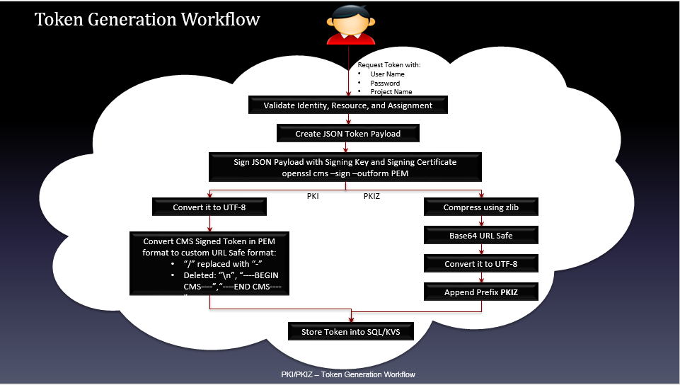

Tiến trình tạo ra PKI token:

\- Người dùng gửi yêu cầu tạo token với các thông tin: User Name, Password, Project Name

\- Keystone sẽ chứng thực các thông tin về Identity, Resource và Asssignment (định danh, tài nguyên, assignment)

\- Tạo token payload định dạng JSON

\- "Ký" lên JSON payload với Signing Key và Signing Certificate , sau đó được đóng gói lại dưới định dang CMS (cryptographic message syntax - cú pháp thông điệp mật mã)

\- Bước tiếp theo, nếu muốn đóng gói token định dạng PKI thì convert payload sang UTF-8, convert token sang một URL định dạng an toàn. Nếu muốn token đóng gói dưới định dang PKIz, thì phải nén token sử dụng zlib, tiến hành mã hóa base64 token tạo ra URL an toàn, convert sang UTF-8 và chèn thêm tiếp đầu ngữ "PKIZ"

\- Lưu thông tin token vào Backend (SQL/KVS).

<a name = "3.3"></a>
## 3.3.	Quá trình xác thực token 

Tương tự như tiến trình chứng thực UUID token, chỉ khác giai đoạn đầu khi gửi yêu cầu chứng thực token tới keystone, keystone sẽ băm lại pki token với thuật toán băm đã cấu hình trước đó rồi mới kiểm tra trong backend database thu thập payload của token. Các bước chứng thực sau đó hoàn toàn tương tự như UUID token.

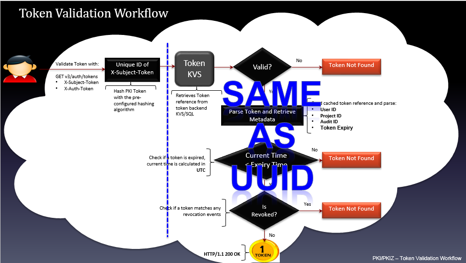

<a name = "3.4"></a>
## 3.4.	Token Revocation Workflow

Hoàn toàn tương tự như tiến trình thu hồi UUID token

<a name = "3.5"></a>
## 3.5.	PKI/PKIZ - Multiple Data Centers 

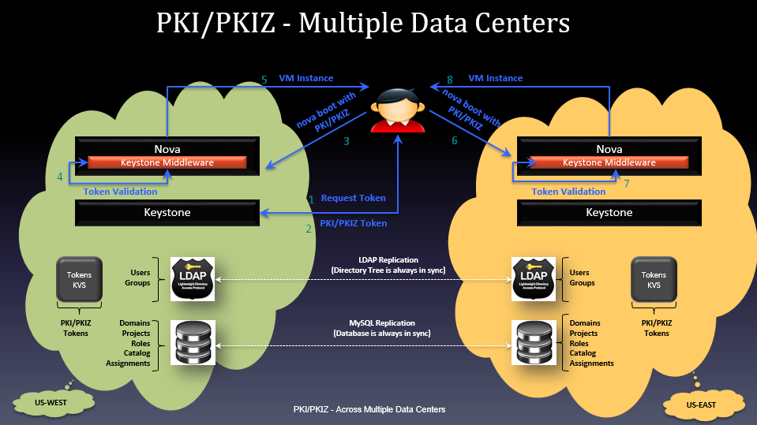

- Cùng kịch bản tương tự như mutiple data centers với UUID, tuy nhiên khi yêu cầu keystone cấp một PKI token và sử dụng key đó để thực hiện yêu cầu tạo máy ảo thì trên cả 2 data center US-West và US-East, keystone middle cấu hình trên nova đều xác thực và ủy quyền thành công, tạo ra máy ảo theo đúng yêu cầu. 

- Điều này trông có vẻ như PKI/PKIz token hỗ trợ multiple data centers, nhưng thực tế thì các backend database ở hai datacenter phải có quá trình đồng bộ hoặc tạo bản sao các PKI/PKIZ token thì mới thực hiện xác thực và ủy quyền được.

<a name = "4"></a>
# 4.	Fernet token 

<a name = "4.1"></a>
## 4.1.	Giới thiệu

- Là định dạng token mới nhất của Keystone. 

- Đã cải thiện được nhược điểm của các token trước đó: có kích thước khá là nhỏ - thông thường xung quanh khoảng 255 kí tự, và chỉ lớn hơn kích thước của UUID một chút, nhưng việc đánh dấu token lại nhỏ hơn PKI. 

- Token chứa đủ thông tin để token không phải lưu lâu dài trong Keystone database. Thay vào đó, token cũng đủ thông tin để phần còn lại của thông tin cần thiết như là các role của người dùng trên project có thể tự sinh ra.

- Trong mô hình mở rộng triển khai OPS, việc lưu trữ số lượng lón dữ liệu token đã được định danh sẽ làm giảm hiệu suất hoạt động của hệ thống. 

- Fernet token chứa lượng nhỏ thông tin, như là định danh user, định danh project, thông tin hết hạn của token, và các thông tin auditing. 

- Sử dụng cơ chế mã hóa khóa đối xứng, và các khóa này được phân phối trên các region của OPS. Hơn nữa,những key này cần được sử dụng theo kiểu xoay vòng.

- Fernet Keys lưu trữ trong `/etc/keystone/fernet-keys`:

  - Mã hóa với Primary Fernet Key

  - Giải mã với danh sách các Fernet Key


- Cấu hình Keystone sử dụng fernet token trong file  `keystone.conf` :

```
[token]
   provider = keystone.token.providers.fernet.Provider
[fernet_tokens]
	key_repository = /etc/keystone/fernet-keys/
	max_active_keys = <number of keys> # default is 3
```

- Có ba loại file key:

  - **Loại 1 - Primary Key**: sử dụng cho cả 2 mục đích mã hóa và giải mã fernet tokens. Các key được đặt tên theo số nguyên bắt đầu từ 0. Trong đó Primary Key có chỉ số cao nhất.
  
  - **Loại 2 - Secondary Key**: chỉ dùng để giải mã. -> Lowest Index < Secondary Key Index < Highest Index
  
  - **Loại 3 - Stagged Key**: - tương tự như secondary key trong trường hợp nó sử dụng để giải mã token. Tuy nhiên nó sẽ trở thành Primary Key trong lần luân chuyển khóa tiếp theo. Stagged Key có chỉ số 0.

<a name = "4.2"></a>
## 4.2.	Fernet key rotation

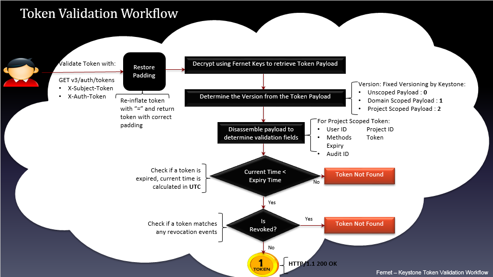

\- Giả sử triển khai hệ thống cloud với keystone ở hai bên ***us-west*** và ***us-east***. Cả hai repo này đều được thiết lập với 3 fernet key như sau:

```
$ ls /etc/keystone/fernet-keys
0 1 2
```

\- Ở đây 2 sẽ trở thành Primary Key để mã hóa fernet token. Fernet tokens có thể được mã hóa sử dụng một trong 3 key theo thứ tự là 2, 1, 0. Giờ ta quay vòng fernet key bên us-west, repo bên này sẽ đươc thiết lập như sau:

```
$ ls /etc/keystone/fernet-keys
0 1 2 3
```

\- Với cấu hình như trên, bên us-west, 3 trở thành Primary Key để mã hóa fernet token. Khi keystone bên us-west nhận token từ us-east (mã hóa bằng key 2), us-west sẽ xác thực token này, giải mã bằng 4 key theo thứ tự 3, 2, 1, 0. Keystone bên us-east nhận fernet token từ us-west (mã hóa bằng key 3), us-east xác thực token này vì key 3 bên us-west lúc này trở thành secondary key bên us-east, keystone us-east giải mã token với 3 key theo thứ tự 2, 1, 0. 

- Có thể cấu hình giá trị `max_active_keys` trong file `/etc/keystone.conf` để quy định tối đa số key tồn tại trong keystone. Nếu số key vượt giá trị này thì key cũ sẽ bị xóa.

<a name = "4.3"></a>
## 4.3.	Kế hoạch cho vấn đề rotated keys

- Khi sử dụng fernet tokens yêu cầu chú ý về thời hạn của token và vòng đời của khóa. Vấn đề nảy sinh khi secondary keys bị remove khỏi key repos trong khi vẫn cần dùng key đó để giải mã một token chưa hết hạn (token này được mã hóa bởi key đã bị remove). 

- Để giải quyết vấn đề này, trước hết cần lên kế hoạch xoay khóa. Ví dụ bạn muốn token hợp lệ trong vòng 24 giờ và muốn xoay khóa cứ mỗi 6 giờ. Như vậy để giữ 1 key tồn tại trong 24h cho mục đích decrypt thì cần thiết lập `max_active_keys=6` trong `file keytone.conf` (do tính thêm 2 key đặc biệt là primary key và staged key ). Điều này giúp cho việc giữ tất cả các key cần thiết nhằm mục đích xác thực token mà vẫn giới hạn được số lượng key trong `key_reposity (/etc/keystone/fernet-keys/)`.

```
token_expiration = 24
rotation_frequency = 6
max_active_keys = (token_expiration / rotation_frequency) + 2
```
<a name = "4.4"></a>
## 4.4.	Token generation workflow

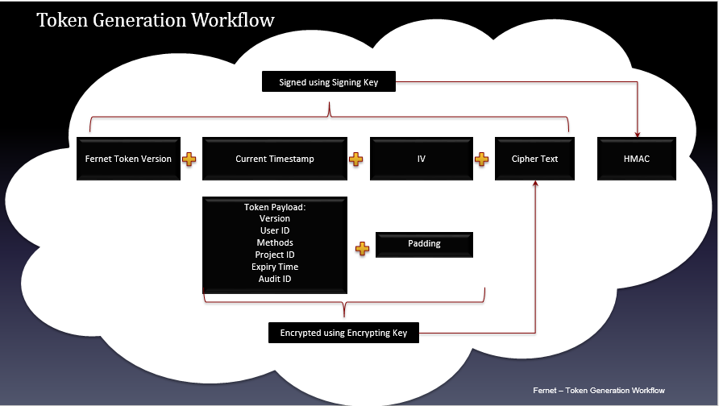

Tạo token

Với key và message nhận được, quá trình tạo fernet token như sau:

1. Ghi thời gian hiện tại vào trường timestamp.

2. Lựa chọn một IV duy nhất.

3. Xây dựng ciphertext:

\-	Padd message với bội số là 16 bytes (thao tác bổ sung một số bit cho văn bản trong mã hóa khối AES).

\-	Mã hóa padded message sử dụng thuật toán AES 128 trong chế độ CBC với IV đã chọn và encryption-key được cung cấp.

4. Tính toán trường HMAC theo mô tả trên sử dụng signing-key mà người dùng được cung cấp.

5. Kết nối các trường theo đúng format token ở trên.

6. Mã hóa base64 toàn bộ token.

<a name = "4.5"></a>
## 4.5.	Token validation workflow


-	Gửi yêu cầu xác thực token với phương thức: GET v3/auth/tokens.

-	Khôi phục lại padding, trả lại token với padding chính xác.

-	Decrypt sử dụng Fernet Keys để thu lại token payload.

-	Xác định phiên bản của token payload. (Unscoped token: 1, token trong tầm vực domain: 1, token trong tầm vực project: 2 ).

-	Tách các trường của payload để chứng thực. Ví dụ với token trong tầm vực project gồm các trường sau: user id, project id, method, expiry, audit id.

-	Kiểm tra xem token đã hết hạn chưa. Nếu thời điểm hiện tại lớn hơn so với thời điểm hết hạn thì trả về thông báo "Token not found". Nếu token chưa hết hạn thì chuyển sang bước tiếp theo.

-	Kiểm tra xem token đã bị thu hồi chưa. Nếu token đã bị thu hồi (tương ứng với 1 sự kiện thu hồi trong bảng revocation_event của database keystone) thì trả về thông báo "Token not found". Nếu chưa bị thu hồi thì trả lại token (thông điệp phản hồi thành công HTTP/1.1 200 OK ).

<a name = "4.6"></a>
## 4.6.	Token revocation workflow 

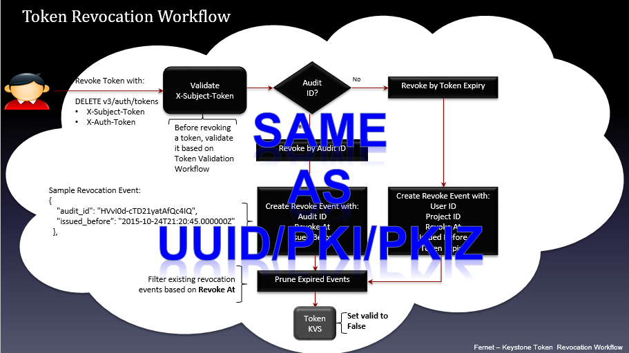

Sau khi đã được xác thực, quá trình revoke hoàn toàn giống với UUID và PKI/PKIz token.

<a name = "4.7"></a>
## 4.7.	Fernet – Multiple data center


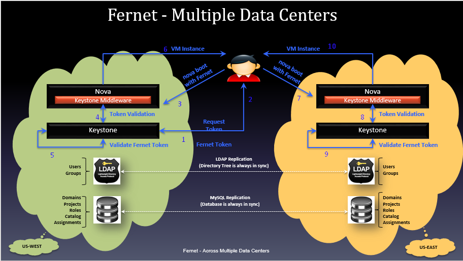

\- Với token Fernet, thì nó không nhỏ như UUID nhưng cũng không hề có kích cỡ lớn như PKI và PKIz. Nhưng quan trọng hơn là nó non-persistent (hiểu đơn giản là nó không cần lưu trữ lại trong database). Do đó, khi sử dụng Fernet token, không cần phải cache lại nó. Thay vào đó, Keystone xây dựng lại Fernet token dựa trên metadata của token dựa trên việc mã hóa và giải mã thông qua các  fernet key được đồng bộ từ các region. 

\- Khi xác thực thông qua multiple region, có thể sử dụng cùng một token ở cả 2 miền region là US-West và US-East. 

\- Do fernet token có thể được tái tạo lại dựa trên phần còn lại của backend data nên nó làm giảm đáng kể lưu lượng.

<a name = "5"></a>
# 5.	Tham khảo
[1] https://www.openstack.org/videos/tokyo-2015/deep-dive-into-keystone-tokens-and-lessons-learned

[2] Fernet token: https://www.youtube.com/watch?v=702SRZHdNW8

[3] https://docs.openstack.org/admin-guide/identity-fernet-token-faq.html

[4] https://github.com/thaihust/Thuc-tap-thang-03-2016/blob/master/ThaiPH/OpenStack/Keystone/Identity_Authentication_Access-Management_in_OpenStack/ThaiPH_Chap-3-Token-formats.md

[5] Book: Identity, Authentication, and Access Management in OpenStack – Author: Steve Martinelli, Henry Nash, and Brad Topol - Copyright © 2016 Steve Martinelli, Henry Nash, and Brad Topol. All rights reserved.
