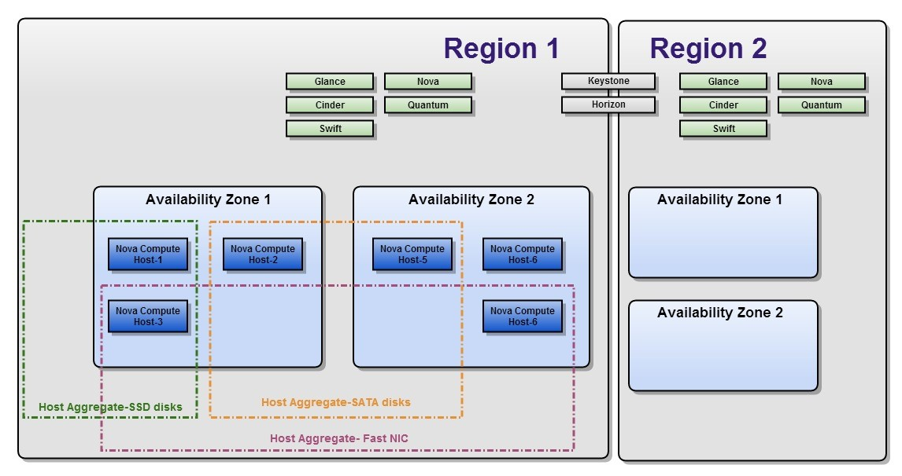
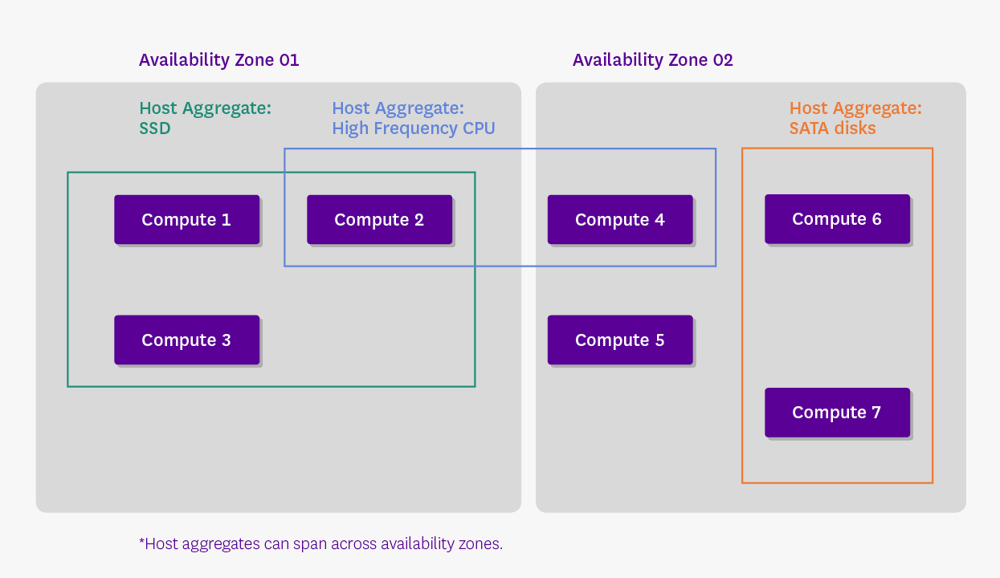

# Tìm hiểu về Region - Domain - Role

## ***Mục lục***

[1. Region](#1)

- [1.1.	Khái niệm về Region](#1.1)

- [1.2.	Availability Zone](#1.2)

- [1.3.	Host Aggregates](#1.3)

- [1.4.	Một số câu lệnh quản trị region](#1.4)

[2.	Domain](#2)

- [2.1.	Giới thiệu](#2.1)

- [2.2.	Một số lợi ích](#2.2)

- [2.3.	Một số câu lệnh quản trị domain](#2.3)

[3.	Role](#3)

- [3.1.	Giới thiệu cách định nghĩa role](#3.1)

- [3.2.	Cấu trúc file policy.json](#3.2)

- [3.3.	Ví dụ](#3.3)

- [3.4. Thực hành định nghĩa role](#3.4)

[4. Tham khảo](#4)

---

<a name = "1"></a>
# 1. Region

Openstack được tạo thành từ việc kết hợp mở rộng của hàng ngàn node và trải rộng ra nhiều trung tâm dữ liệu khác nhau và các miền địa lý (region) khác nhau. Vì lý do này, hệ thống OPS có thể chia ra 3 khái niệm chính về việc phân chia thành 3 khái niệm phân cấp về zone như sau: Regions, Availability Zones và Host Aggregates.



<a name = "1.1"></a>
## 1.1.	Khái niệm về Region

- Mỗi region đều triển khai hệ thống full OPS, bao gồm các API endpoint, network và các tài nguyên compute của chính nó.

- Các Region khác nhau chia sẻ thiết lập chung dịch vụ Keystone và Horizon, để cung cấp khả năng truy cập điều khiển và giao diện web tương tác với hệ thống.

- Khái niệm Region thì giống như là một nhóm các tài nguyên vật lý được gộp nhóm theo khu vực địa lý trong môi trường OPS. Nếu bạn có 2 trung tâm dữ liệu khác nhau, bạn nên đặt một khu vực và region A trong môi trường OPS và khu vực còn lại vào region B. 

- Khái niệm region ngày các trở nên hữu dụng nhanh chóng, đặc biệt là khi đi cùng với khái niệm cell và domain.
Region được sử dung khi triển khai mô hình cloud lớn, trải dài ra trên nhiều trung tâm dữ liệu trên các vùng địa lý cách biệt khác nhau. 

<a name = "1.2"></a>
## 1.2.	Availability Zone

- Bên trong một Region, các node compute có thể được nhóm logic vào các Availability Zones (AZ): khi launching một máy ảo VM chúng ta có thể xác định AZ mà muốn cài đặt máy ảo tại đó, hoặc thậm chí một node xác định trong một AZ khi chạy một VM. 

- Việc gộp nhóm các nhóm logic các host dựa trên các yếu tố tùy ý như:
  -	Location (country, data center, rack, … )

  -	Network layout

  -	Power source 

- Một trong những phức tạp trong việc sử dụng AZ là mỗi project trong OPS thực hiện các dịch vụ theo các của riêng nó (không phải tất cả). Nếu bạn có kế hoạch sử dụng AZ, bạn nên đánh giá các project OPS mà bạn sẽ hỗ trợ chúng. 

<a name = "1.3"></a>
## 1.3.	Host Aggregates

- Bên cạnh AZ, các node compute cũng có thể gộp nhóm vào các Host Aggregates.

- Là khái niệm dùng để gộp chung thành nhóm các host dựa trên meta-data.

- Host Aggregates có meta-data được gán vào các nhóm của các node compute (ví dụ:  các node với ổ cứng SSD có thể thuộc về một Host Aggregate, trong khi một Host Aggregatge có thể bao gồm tất cả các node với 10GB NICs).

- Một node compute có thể được đặt trong cả một Host Aggregate và một Availability zone cùng lúc, chúng sẽ không bị xung đột. Hơn nữa, một node compute có thể thuộc về một hoặc nhiều hơn một Host Aggregate. Các Host Aggregate chỉ có thể được xem bởi admin và cũng có thể được sử dụng đẻ mix các hypervisor trong cùng một AZ, ví dụ để tiết kiệm chi phí giấy phép: các nhà cung cấp cung cấp các guets free hypervisor của chúng. 



<a name = "1.4"></a>
## 1.4.	Một số câu lệnh quản trị region

Phần này tham khảo [tại đây](./8.Quan_ly_Keystone_bang_OpenstackClient.md#1)

<a name = "2"></a>
# 2.	Domain

<a name = "2.1"></a>
## 2.1.	Giới thiệu

-	Domain trong Keystone là khái niệm về các tài nguyên mà được giới thiệu trong Keystone API version 3.

-	Một domain là một tập hợp các user và project tồn tại trong môi trường OPS. 

-	Theo truyền thống, nguồn tài nguyên mapping có thể được tóm tắt bằng cách nói rằng :”Một user có một role trên một project” (“a user has a role in a project”). Một user thường là một cá nhân mà giao tiếp với các dịch vụ của cloud, gửi các request để tạo và hủy các nền tảng theo yêu cầu. Một project là một container được sử dụng để gộp nhóm và cô lập các tài nguyên từ các phần còn lại khác. Với mô hình mapping thông thường này, khi một role admin được gán cho một user, user sẽ trở thành một nhà quản trị cloud, chứ không chỉ đơn giản là quản trị project mà user đó được gán vào như dự định. 

-	Với khái niệm domain, các tài nguyên được mapping có thể được hiểu theo các nói là: “Domain được tạo thành từ các user và các project, trong đó, các user có các role tại project và ở mức level domain” (“domain is made up of users and projects, wherein users can have roles at the project and domain level”). Với mô hình này, một user admin trên một domain, cho phép user đó quản lý các tài nguyên như user và project trên một domain xác định, nhưng một user cũng có role của họ trên project cụ thể, giống như mô hình ban đầu trước đó.

- Khái niệm domain mà Keystone cung cấp triển khai OPS với khả năng linh hoạt khi chia môi trường của chúng vào các phân vùng logic mà sẽ được sử dụng bởi các thành viên của các phòng ban khác nhau của một tổ chức hoặc các tổ chức khác nhau hoàn toàn. Kết quả  của mô hình này là cho phép cung cấp sự kết hợp tuyệt với khả năng tự phục vụ trong khi vẫn đảm bảo sự phân lập giữa các user và project của họ.

<a name = "2.2"></a>
## 2.2.	Một số lợi ích
-	Có khả năng định nghĩa và gán các quyền điều khiển truy cập (RBAC -  Role Based Access Control) mạnh mẽ.

-	Tạo người dùng quản trị cloud với khả năng ủy nhiệm các khả năng cho user khác.

-	Hỗ trợ thiết lập các tài nguyên (project) với tên giống nhau trong các domain khác nhau.

-	Khả năng phân chia cho các tổ chức khác nhau tận dụng các backend khác nhau. Ví dụ, một bên sử dụng dựa trên SQL trong khi bên khác sử dụng dựa trên LDAP.

<a name = "2.3"></a>
## 2.3. Một số câu lệnh quản trị domain

Tham khảo [tại đây.](./8.Quan_ly_Keystone_bang_OpenstackClient.md#2)

<a name = "3"></a>
# 3.	Role

<a name = "3.1"></a>
## 3.1.	Giới thiệu cách định nghĩa role

- Mỗi dịch vụ của Openstack như Identity, Compute, Networking, .. đều có các quy tắc truy cập dựa trên role. Chúng quyết định xem các user nào được phép truy cập tới project nào theo cách nào đó, và được định nghĩa trong các file **policy.json** của các dịch vụ.

- Bất cứ khi nào một lời gọi API tới dịch vụ của OPS được tạo ra, các cơ chế policy của dịch vụ sẽ sử dụng các định nghĩa trong file policy để quyết định xem các lời gọi nào được chấp nhận. 

- Bất kỳ thay đổi nào trong file `policy.json` đều có hiệu lực ngay lập tức, nó cho phép các quy tắc mới được thực hiện trong khi dịch vụ vẫn đang chạy 

- Đường dẫn của file policy trong từng dịch vụ của OPS thường là `/etc/”project”/policy.json`, với project là tên từng dịch vụ như: **keystone**, **nova**, **neutron**, **glance**, …

- File `policy.json` là một file text định dạng JSON (Javascript Object Notation). Mỗi policy (quy tắc) được định nghĩa trên một dòng theo định dạng `"<target>" : "<rule>"`.

- Policy target, cũng được gọi là `“action”`, đại diện cho một lời gọi API như là “Bật máy ảo” hay “gán vào một volume”, …

- Tên các action thông thường sẽ đủ ý nghĩa để hiểu action đó làm gì. Ví dụ, các lời gọi API đặc trưng của dịch vụ Copmute là liệt kê các máy ảo, volumn, và network. Trong file `/etc/nova/policy.json`, những API đó được đại diện cho bởi : `compute:get_all`, `volume:get_all`, và `network:get_all`, và tương tự.

- Các policy rule quyết định các trường hợp lời gọi API nào được chấp nhận. Thông thường, việc này liên quan tới user tạo nên lời gọi API đó (gọi là API user ) và đôi khi là đối tượng mà API hoạt động. Một rule thông thường kiểm tra nếu API user là chủ của nó hay không.

<a name = "3.2"></a>
## 3.2.	Cấu trúc file policy.json

- Một file `policy.json` bao gồm các policies và các alias theo form như sau: `target:rule` hoặc `alias:definition`, phân cách bởi dấu `: `và đặt trong dấu ngoặc nhọn `{}` như sau:

  ```
  {
       "alias 1" : "definition 1",
       "alias 2" : "definition 2",
       ...
       "target 1" : "rule 1",
       "target 2" : "rule 2",
       ....
  }
  ```

- Các target là các API và được viết như sau: `"service:API"` hoặc đơn giản là `"API"`. 

  Ví dụ: `"compute:create"` hoặc `"add_image"`.

- Các rule quyết định xem các API nào được phép thực hiện. 

- Các rule có thể là: 

  -	always true (luôn đúng): các action thì luôn luôn được chấp nhận. Có thể được viết như sau: "" (chuỗi trống), [], hoặc "@".

  -	always false  (luôn sai): Các action không bao giờ được chấp nhận. Được viết như sau: "!".

  -	a special check

  -	a comparison of two values

  -	boolean expressions based on simpler rules

  Trong đó: 

    - Special checks là:
    
      `<role>:<role name>`:  a test whether the API credentials contain this role.

      `<rule>:<rule name>`: the definition of an alias.

      `http:<target URL>`: which delegates the check to a remote server. The API is authorized when the server returns True.

      Có thể tự định nghĩa thêm các special checks.

    - 2 giá trị được so sánh theo cách sau:

      "value1 : value2"

      Các value có thể là:
    
      -	constants: Strings, numbers, true, false

      -	API attributes : có thể là `project_id`, `user_id` hoặc `domain_id`.
    
      -	target object attributes: là các trường mô tả object được lưu trong database. Ví dụ trong trường hợp API `“compute:start”`, object là máy ảo được bật. Policy cho việc bật máy ảo có thể sử dụng thông số `%(project_id)s`, đó là project mà là chủ của máy ảo. Ký tự “s” sau đó cho thấy đó là kiểu string.

      -	the flag **is_admin** : cho thấy là quyền admin được gán thong qua token admin. Token admin cho phép khởi tạo Identity database trước khi role admin tồn tại. 

- Cấu trúc alias cho phép nhiều thuận lợi. Alias là cách đặt tên ngắn hơn cho các rule phức tạp hoặc khó để hiểu. nó được định nghĩa giống như cách định nghĩa policy:

  `alias name : alias definition`

  Một alias được định nghĩa, sử dụng từ khóa rule để sử dụng các policy rule được định nghĩa sẵn trước.

<a name = "3.3"></a>
## 3.3. Ví dụ

-	Một rule đơn giản như sau:

    `"compute:get_all" : ""`

    Policy này định nghĩa API liệt kê tất cả các máy ảo của dịch vụ Compute. Rule này để trống nghĩa là `“always”` – chấp nhận bất kì ai có role nào có thể thực hiện API này.

-	Nhiều API chỉ có thể được gọi bởi người dùng admin. Điều này có thể được mô tả bởi rule `“role:admin”`. Policy sau đảm bảo rằng chỉ người dùng admin có thể được tạo một user mới trong database dịch vụ Identity:

    `"identity:create_user" : "role:admin"`

-	Bạn có thể hạn chế các API tới một vài role. Ví dụ: dịch vụ Orchestration định nghĩa mộ role tên là **heat_stack_user**. Bất kì ai có role này không được phép tạo stack: 

    `"stacks:create": "not role:heat_stack_user"`

-	Bạn có thể định nghĩa alias cho rule:

    `"deny_stack_user": "not role:heat_stack_user"`

    Policy hiểu rằng `“deny_stack_user”` không phải là một API và đại diện cho một Alias. Chính sách tạo stack trên có thể viết như sau: 

    `"stacks:create": "rule:deny_stack_user"`

-	Rule có thể so sánh các thông số của API với thông số (attribute) của object target như sau: 

    `"os_compute_api:servers:start" : "project_id:%(project_id)s"`

    Policy này cho biết việc bật các máy ảo chỉ được thực hiện với những user goij API với project ID trùng với porject ID của máy ảo. 

-	Một ví dụ về việc định nghĩa các policy và alias trong file `/etc/keystone/policy.json` như sau:

    ```
    "admin_required": "role:admin or is_admin:1",
    "owner" : "user_id:%(user_id)s",
    "admin_or_owner": "rule:admin_required or rule:owner",
    "identity:change_password": "rule:admin_or_owner"
    ```

<a name = "3.4"></a>
## 3.4. Thực hành định nghĩa role

Tham khảo tại phần [thực hành định nghĩa role.](./8.Quan_ly_Keystone_bang_OpenstackClient.md#3)

<a name = "4"></a>
# 4. Tham khảo

[1] http://www.guruadvisor.net/en/cloud/121-openstack-regions-and-availability-zones 

[2] http://stackoverflow.com/questions/19004503/the-relationship-between-endpoints-regions-etc-in-keystone-openstack 

[3] https://www.mirantis.com/blog/mirantis-training-blog-openstack-keystone-domains/ 

[4] policy.json: https://docs.openstack.org/ocata/config-reference/policy-json-file.html 


