# Sử dụng Openstack client quản lý region, domain, project, user, role

## ***Mục lục***

[1. Một số câu lệnh quản trị region](#1)

- [1.1. Tạo region](#1.1)

- [1.2. Xóa region](#1.2)

- [1.3. Liệt kê region](#1.3)

- [1.4. Thiết lập các thông số](#1.4)

- [1.5. Show ra các thông tin trong region](#1.5)

[2. Một số câu lệnh quản trị domain](#2)

[3. Thực hành định nghĩa role](#3)

[4. Quản lý project, user và role](#4)

- [4.1. Quản lý project](#4.1)

- [4.2. Quản lý user](#4.2)

- [4.3. Quản lý role](#4.3)

- [4.4. Tổng kết](#4.4)

[5. Tham khảo](#5)

---

<a name = "1"></a>
# 1. Một số câu lệnh quản trị region

<a name = "1.1"></a>
## 1.1.	Tạo region

```
openstack region create
    [--parent-region <region-id>]
    [--description <description>]
    <region-id>
```

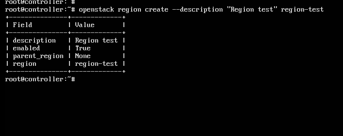

<a name = "1.2"></a>
## 1.2.	Xóa region


`openstack region delete <region-id> [<region-id> ...]`

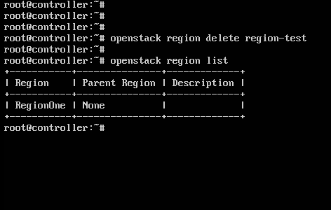

<a name = "1.3"></a>
## 1.3. Liệt kê region

`$ openstack region list`

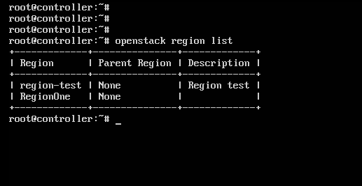

<a name = "1.4"></a>
## 1.4.	Thiết lập các thông số

`$ openstack region set –description “modified name of test” region-test`

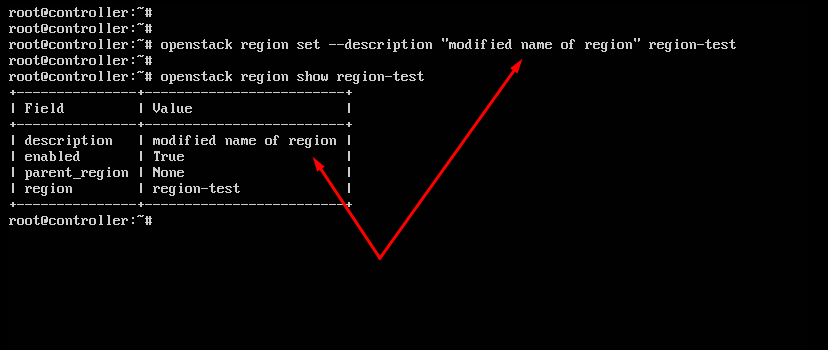

<a name = "1.5"></a>
## 1.5.	Show ra thông tin region

`$openstack region show region-test`

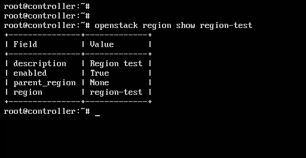

<a name = "2"></a>
# 2. Một số câu lệnh quản trị domain

-	Tạo một domain: 

    `$ openstack domain create <name>`

-	Liệt kê các domains:

    `$ openstack domain list`

-	Trên một domain đã tạo, có thể tạo user như sau:

    `$ openstack user create –domain <name> –email <email> –password <pass> <username>`

-	Tạo một project trong domain:

    `$ openstack project create –domain <name> –description <desc> <project_name>`

-	Để điều khiển quyền truy cập, bạn có thể gán một role tới một user trên một project như sau:

    `$ openstack role add –project-domain <name> –project <project_name> –user <username>`

-	Để xóa một domain và tất cả các tài nguyên thuộc về domain đó:

    ```
    $ openstack domain set –disable <name>
    $ openstack domain delete <name>
    ```

<a name = "3"></a>
# 3. Thực hành định nghĩa role

- **Nội dung**

  Tạo một role mới khác rule admin có sẵn, gán một số quyền trong một số project.


- **Các bước thực hiện**:

  -	***Bước 1***: Sử dụng user được gán quyền admin (gán role admin) tạo ra user, project và role mới và gán role đó cho user trên project  để kiểm tra

    ```
    openstack project create --description 'new project for test policy' --domain default project-test

    openstack user create --project project-test --password 123  user-test

    openstack role create role-test

    openstack role add --user user-test --project project-test role-test
    ```

  -	***Bước 2***: tạo file test-openrc sử dụng lưu các biến của user test cho openstack client xác thực:

    ```
    $ cat << EOF > test-openrc
    export OS_PROJECT_DOMAIN_NAME=Default
    export OS_USER_DOMAIN_NAME=Default
    export OS_PROJECT_NAME=project-test
    export OS_USERNAME=user-test
    export OS_PASSWORD=123
    export OS_AUTH_URL=http://controller:35357/v3
    export OS_IDENTITY_API_VERSION=3
    export OS_IMAGE_API_VERSION=2
    EOF

    $ source test-openrc
    ```

    -	Ban đầu, người dùng user-test không có quyền list hay tạo các user trong hệ thống OPS, (không thao tác được với Keystone do không có quyền)

    -	Sửa file `/etc/keystone/policy.json` để user-test được gán role-test có quyền list, create, delete user, list, create project … 

    -	Cách sửa đơn giản nhất là khi thực hiện lệnh bị lỗi, ví dụ tạo project sử dụng câu lệnh `openstack project create` … mà bị hiện lỗi như sau:

      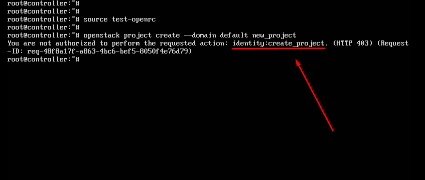

      Thì sửa trong file `/etc/keystone/policy.json`, tìm đến target có action là `create_project` và thêm `or role:role-test` vào là ok. 

      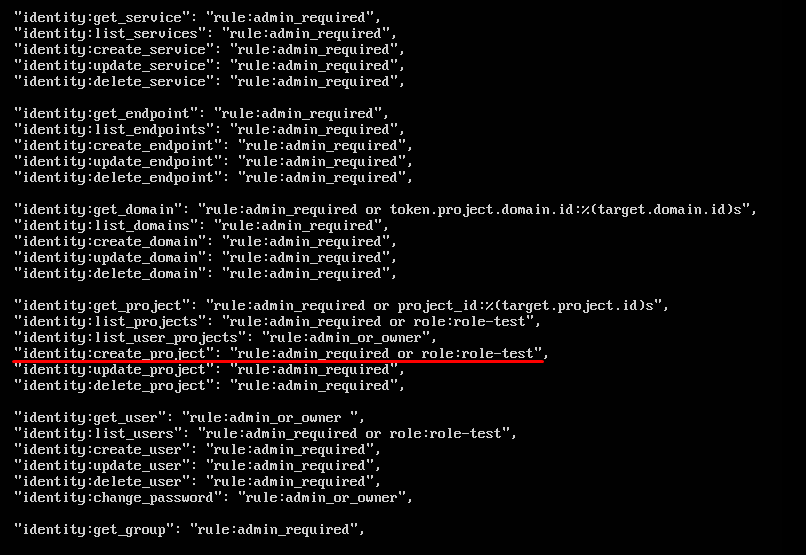

      Lưu lại và thực hiện lại câu lệnh trên:

      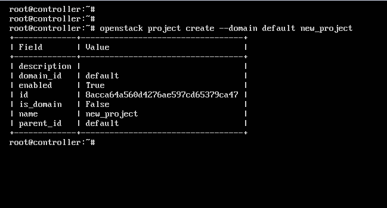

Các action khác thực hiện tương tự.

<a name = "4"></a>
# 4.  Quản lý project, user và role

Là một người quản trị admin, bạn có thể quản lý các project, user, và role. Project là một tập hợp tài nguyên trong cloud mà bạn có thể gán cho các user. Project cũng được gọi là project hoặc account. Các user có thể là thành việc của một hoặc nhiều project. Các role định nghĩa các hành động mà user được phép thực hiện. Khi đó cần gán role cho user trên project. 

<a name = "4.1"></a>
## 4.1. Quản trị project

### 1) List project

`openstack project list`

  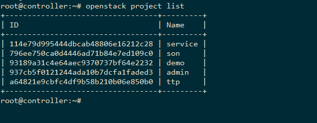

### 2) Create a project

`openstack project create --description 'my new project' new-project --domain default`

  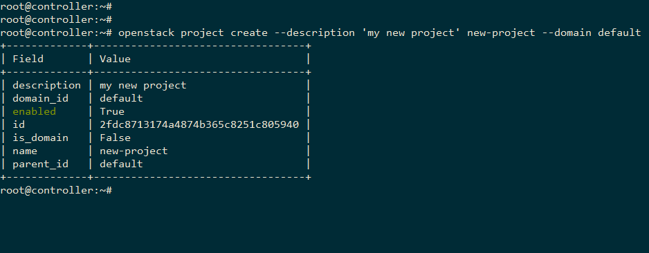

### 3) Update a project

Sử dụng câu lệnh openstack project set 

Ví dụ:

-	Thiết lập tạm thời disable một project:

    `$ openstack project set PROJECT_ID --disable`

    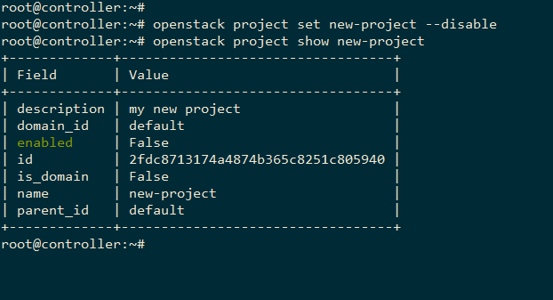

-	 Enable một disabled project:

    `$ openstack project set PROJECT_ID --enable`

    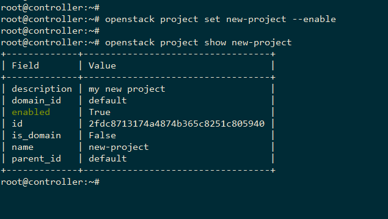

- Update tên của project:

    `$ openstack project set PROJECT_ID --name project-new`

    

-	Để xác nhận sự thay đổi, show ra thông tin vừa được cập nhật của project sử dụng câu lệnh: 

    `$ openstack project show PROJECT_ID`

### 4) Delete a project

Để xóa một project sử dụng câu lệnh 

  `$ openstack project delete PROJECT_ID`

***Lưu ý: khi sử dụng PROJECT_ID như tên của project thì tên đó phải là duy nhất trong domain***

<a name = "4.2"></a>
## 4.2. Quản lý user 

### 1) List users

Liệt kê tất cả các user:

  `$ openstack user list`

  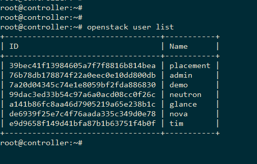

### 2) Tạo user 

Để tạo một user cần xác định tên cho user đó. Tùy chọn có thể xác định thêm project ID, pasword và địa chỉ email của user. Nên bao gồm project ID và pasword bởi vì user không thể login vào dashboard nếu không có các thông tin này.

  `$ openstack user create --project <new-project> --password <PASSWORD>  <new-user>`

  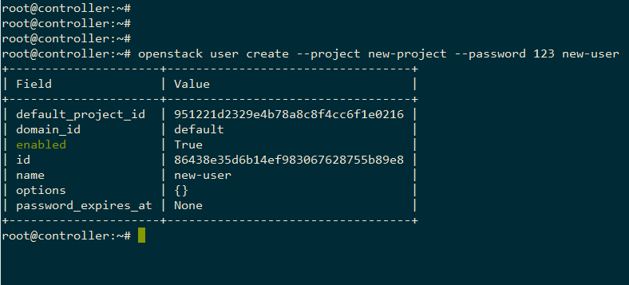

### 3)Update a user

Có thể update các thông tin về name, email address, trạng thái enabled vào một user.

- Tạm thời disable một user account:

    `$ openstack user set <USER_NAME> --disable`

    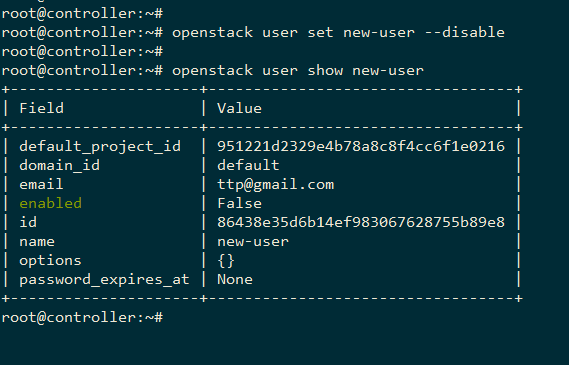

    Nếu bạn disable tài khoản của user, user không thể đăng nhập vào dashboard, tuy nhiên dữ liệu của user vẫn còn và bạn có thể enable lại bất kì lúc nào.

- Để enable một user account: 
  
    `$ openstack user set <USER_NAME> --enable`

    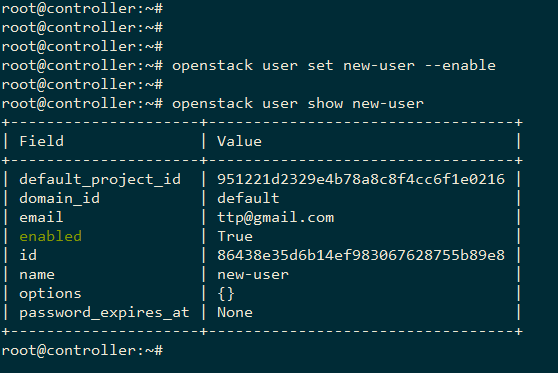

- Để đổi tên và mô tả một tài khoản user: 

    `$ openstack user set <USER_NAME> --name user-new --email <new-user@example.com>`
  
    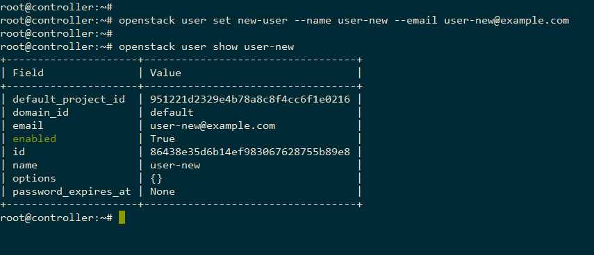

- Thiết lập mật khẩu cho user (với người dùng có quyền admin)

    `$ openstack user set –password <PASWORD> <user_name>`

- Thay đổi password cho user (Tự user thay đổi password của mình)

    `$ openstack user password set`

### 4) Show users

Để xem sự thay đổi sử dụng câu lệnh

  `$ openstack user show <user_name>`

### 5) Delete user

Để xóa user khỏi hệ thống sử dụng câu lệnh:

  `$ openstack user delete <USER_NAME>`

  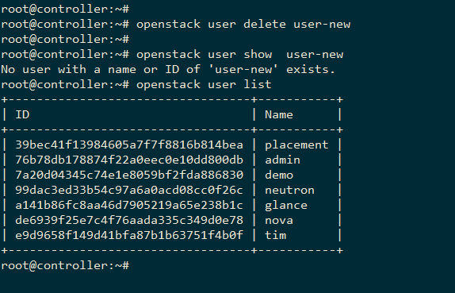

<a name = "4.3"></a>
## 4.3. Quản lý role

### 1) List available roles

  `$ openstack role list`

  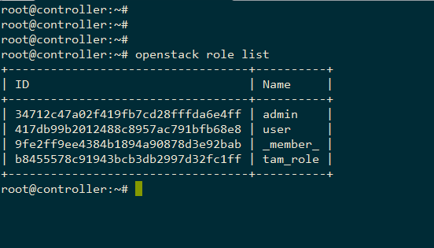

### 2) Create a role
Các user có thể là thành viên của nhiều project. Để kết nối các user tới các project, định nghĩa một role và gán nó vào một user trên project.

Tạo role mới :

  `$ openstack role create <new-role_name>`

  

  Nếu sử dụng identity v3 thì cần thêm tùy chọn –domain để xác định tên domain của role.

### 3) Assign a role

- Để gán một user với một project, bạn phải gán role cho user trên project đó. Khi đó cần 3 thông số là user, project và role.

  `$ openstack role add --user <USER_NAME> --project <TENANT_ID> <ROLE_NAME>`

  Ví dụ: gán role vừa tạo new-role cho người dùng demo trên project demo

  `$ openstack role add --user demo --project demo new-role`

  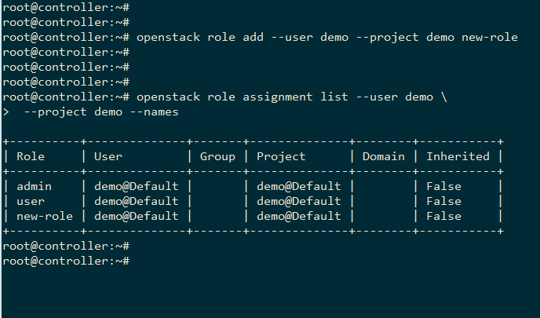

- Xác nhận role đã được gán: 

  `$ openstack role assignment list --user <USER_NAME>  --project <PROJECT_ID> --names`

  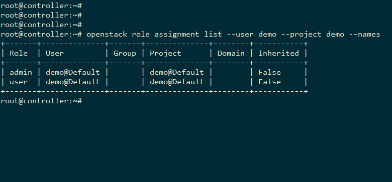

### 5) View role details

Xem thông tin một role xác định:

  `$ openstack role show <ROLE_NAME>`

  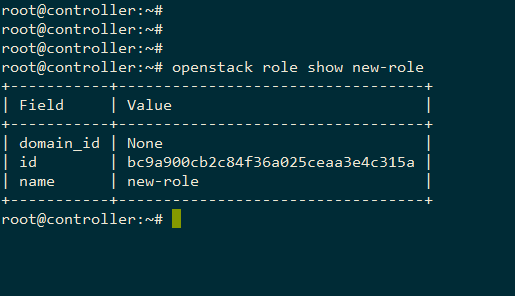

### 6) Remove a role

`$ openstack role remove --user USER_NAME --project TENANT_ID ROLE_NAME`

Xác nhận lại đã remove role khỏi user và project:

`$ openstack role assignment list --user USER_NAME --project TENANT_ID`

  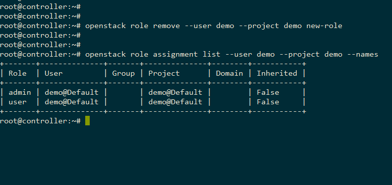

### 7) Delete a role

`$ openstack role delete <role_name>`

  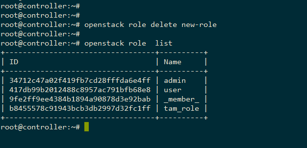

<a name = "4.4"></a>
## 4.4.	Tổng kết

- Để sử dụng thêm một số tùy chọn các câu lệnh trên sử dụng tùy chọn –-help để biết thêm chi tiết. (Tham khảo thêm các câu lệnh openstack client [tại đây.]( https://docs.openstack.org/developer/python-openstackclient/command-list.html) )

- Ngoài các câu lệnh thông dụng trên thì có thể sử dụng quản lý thông qua horizon của OPS (link tham khảo: https://docs.openstack.org/ops-guide/ops-users.html và https://docs.openstack.org/admin-guide/dashboard-admin-manage-roles.html) 


<a name = "5"></a>
# 5. Tham khảo

[1] http://www.guruadvisor.net/en/cloud/121-openstack-regions-and-availability-zones 

[2] https://docs.openstack.org/developer/python-openstackclient/command-objects/region.html

[3] https://docs.openstack.org/admin-guide/cli-manage-projects-users-and-roles.html 

[4] policy.json: https://docs.openstack.org/ocata/config-reference/policy-json-file.html 


