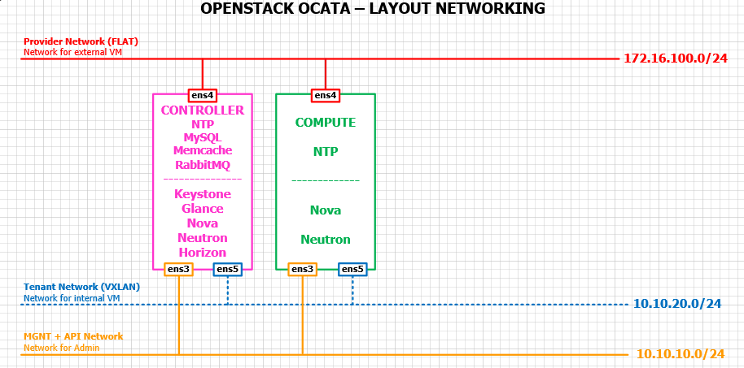
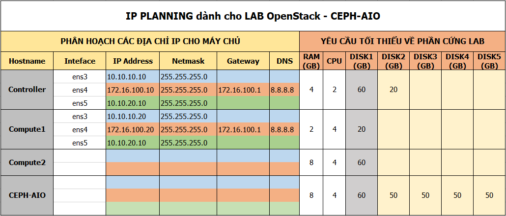

# Thư mục lưu trữ Scripts cài đặt Keystone

## Topology 

## IP planning

## Hướng dẫn chạy scripts cài Keystone trên node controller

- Download các file scripts.

- Sử dụng người dùng sudoer hoặc người dùng root để thực hiện các lệnh sau.

- Thực hiện gán quyền thực thi cho các file scripts

  `chmod a+x *.sh`

- Chỉnh sửa lại cấu hình theo ý muốn tại file [config.sh](https://github.com/ThanhTamPotter/thuctap012017/blob/master/TamNT/Openstack/Keystone/scripts/config.sh)

- Chạy lần lượt các lệnh như sau:

  - Cấu hình IP và host name cho node controller:

    `source ctl-0-ipadd.sh`

  - Cài đặt các gói cần thiết cài đặt Openstack

    `source ctl-1-env.sh`

  - Cài đặt và cấu hình Keystone:

    `source ctl-2-keystone.sh`
