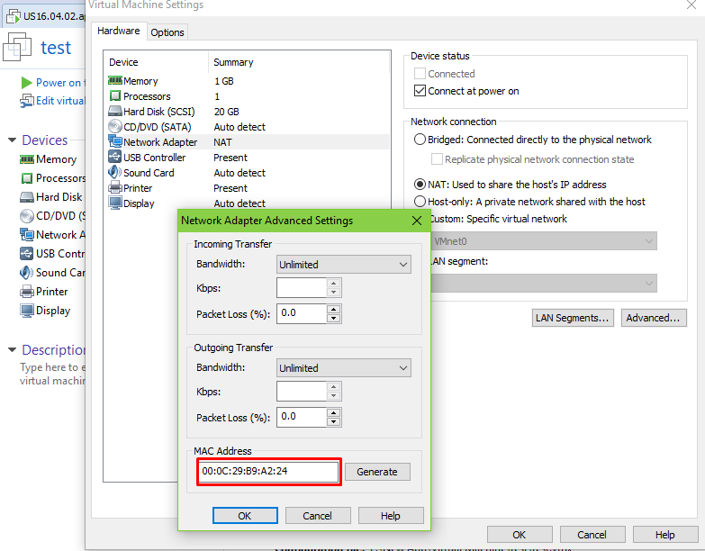
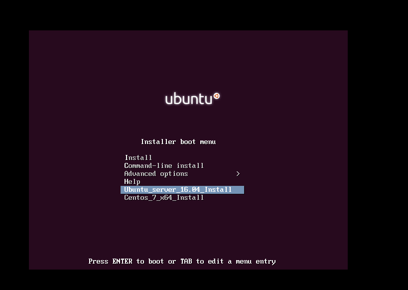
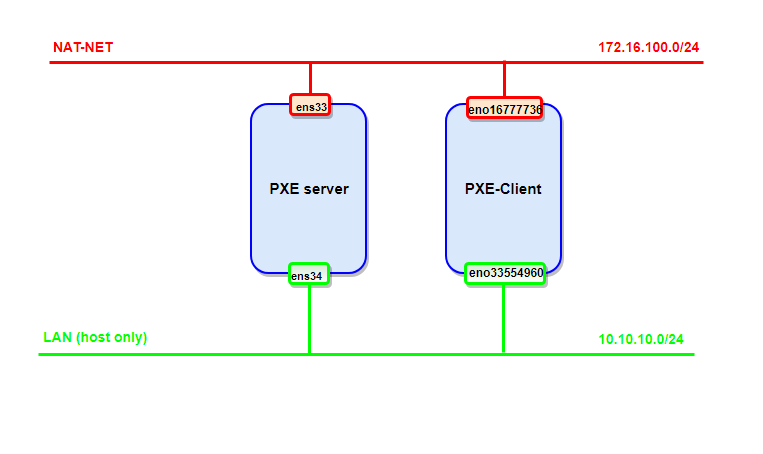

# Một số tính năng đã test

### ***Mục lục***

[1. Cấu hình cho client boot theo MAC](#1)

[2. Cấu hình 2 card mạng cho Client cài đặt OS Centos 7](#2)

---

<a name = '1'></a>
# 1. Cấu hình cho client boot theo MAC
- Như ghi chép về [Lab PXE - kickstart](./2.Lab_PXE-kickstart.md), Client có thể thực hiện cấu hình boot theo file nó lấy được từ PXE server. Đầu tiên, nó sẽ tìm file được đặt tên theo địa chỉ MAC, sau đó tìm theo địa chỉ IP của nó. Phần này sẽ thực hiện lab (trên VMware Workstartion) để kiểm chứng quy tắc trên.

- Tạo một client mới, và xem địa chỉ MAC của card mạng client. Đặt tên Client là test. Ta thấy địa chỉ MAC của card như sau:

    

- Ta thấy Client có MAC là: `00:0C:29:B9:A2:24`. Tạo file cấu hình cho client test có tên `01-00-0c-29-b9-a2-24` trong thư mục `/var/lib/tftpboot/pxelinux.cfg/` có nội dung như sau: 

    ```
    # D-I config version 2.0
    # search path for the c32 support libraries (libcom32, libutil etc.)
    path ubuntu-installer/amd64/boot-screens/
    include ubuntu-installer/amd64/boot-screens/menu.cfg
    default ubuntu-installer/amd64/boot-screens/vesamenu.c32
    DISPLAY boot.txt

    DEFAULT Ubuntu_server_16.04_Install

    LABEL Ubuntu_server_16.04_Install
            kernel ubuntu-installer/amd64/linux
            append ks=http://172.16.100.220/kickstartForUS16.04.cfg vga=normal initrd=ubuntu-installer/amd64/initrd.gz --

    LABEL Centos_7_x64_Install
            kernel centos7/vmlinuz
            append initrd=centos7/initrd.img inst.ks=http://172.16.100.10/anaconda-ks.cfg inst.vnc inst.vncpassword=password
    prompt 0
    timeout 0
    ```

    File này hoàn toàn tương tự như file `default` đã tạo ở [Lab PXE - kickstart](./2.Lab_PXE-kickstart.md), chỉ khác thêm tùy chọn `DEFAULT Ubuntu_server_16.04_Install` để Client sẽ tự động cài đặt theo Ubuntu và không phải qua bước lựa chọn boot OS nào nữa. 

- Trong ghi chép trước, nếu ta không cấu hình thêm file boot cho Client theo địa chỉ MAC, thì client sẽ tự động lấy cấu hình như trong file `default` và hiển thi menu boot để lựa chọn như sau:

    

- Bây giờ, khi có thêm file boot cho client theo MAC như đã tạo trên, thì Client test khi lấy được địa chỉ IP và file `pxelinux.0` sẽ truy cập tới PXE server và tìm file cấu hình boot `01-00-0c-29-b9-a2-24`theo MAC và boot luôn OS Ubuntu như sau (không hiển thị menu boot lựa chọn nữa):

    

- Vậy là Client đã ưu tiên boot theo file cấu hình được đặt tên theo MAC đúng như lý thuyết. 

<a name = '2'></a>
# 2. Cấu hình 2 card mạng cho Client cài đặt OS Centos 7

Mô hình sẽ thực hiện như sau: 



### Cấu hình DHCP

- Để thực hiện cấu hình cho 2 card mạng trong Centos 7 thông qua file kickstart `anaconda-ks.cfg` chế độ DHCP, ta thực hiện cấu hình phần network như sau:

    ```
    # Network information
    network  --bootproto=dhcp --device=eno33554960 --ipv6=auto --activate --nodefault
    network  --bootproto=dhcp --device=eno16777736 --ipv6=auto --activate
    network  --hostname=CentosTest
    ```
- Trong đó, card thứ nhất tên `eno16777736` là card thuộc dải NAT có thể ra Internet. card thứ 2 được đặt tên:`eno33554960` và thuộc dải Host only, không dùng để ra ngoài Internet nên có thêm tùy chọn `--nodefault` 

- ***Lưu ý***: Nếu thực hiện cấu hình trong trong hướng dẫn: https://www.tecmint.com/multiple-centos-installations-using-kickstart/ thì phần cấu hình cho **dnsmasq** trong file `/etc/dnsmasq.conf` sẽ cấu hình như sau: 

    

    (Với `ens33` là card đầu tiên của PXE server là card NAT ra mạng Internet, và card `ens34` là card thứ hai của PXE server và là card dải host only với card thứ 2 của client)

### Cấu hình IP tĩnh

- Tham khảo: https://github.com/hoangdh/ghichep-PXE/blob/master/kickstart-centos/1-omd-staticip.md

