# Cài đặt Cobbler


[1.	Mô hình triển khai](#1)

[2. Các bước cài đặt và cấu hình Cobbler (manual)](#2)

- [2. 1. Bước 1: Cài đặt EPEL-repo trên Centos](#2.1)

- [2. 2. Bước 2: Cài đặt Cobbler và một số gói cần thiết](#2.2)

- [2. 3. Bước 3: Kích hoạt các dịch vụ](#2.3)

- [2. 4. Bước 4: Truy cập vào giao diện Web](#2.4)

- [2. 5. Bước 5: Cấu hình Cobbler](#2.5)

- [2. 6. Bước 6: Xác nhận lại distro được import vào cobbler](#2.6)

- [2. 7. Bước 7: Tạo file kickstart](#2.7)

- [2. 8. Bước 8: Sửa file cấu hình boot](#2.8)

[3. Cài đặt Cobbler sử dụng scripts](#3)

[4.	Boot OS từ các client](#4)

[5.	Tham khảo](#5)

---

<a name = '1'></a>
# 1.	Mô hình triển khai

- Mô hình:

	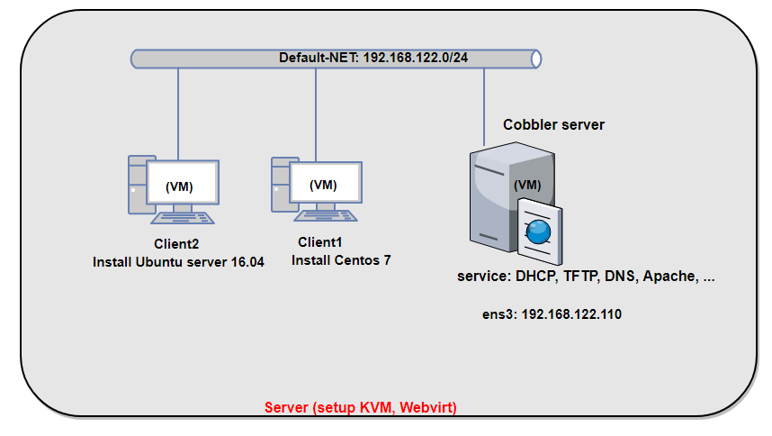

- Chuẩn bị: bài lab thực hiện trên server đã cài đặt KVM và quản lý bởi Webvirtmgr. Trong đó:

	- **Cobbler server**: máy ảo KVM cài đặt sẵn hệ điều hành Centos 7. Có một card mạng ens3 (thuộc dải mạng default của server vật lý, có thể ra ngoài Internet) địa chỉ: 192.168.122.110/24

	- Các máy **Client 1** và **Client 2**: là các máy ảo KVM được tạo ra với một card mạng thuộc dải default-net. Chưa được cài đặt Hệ điều hành. 

	- Cấu hình trên server vật lý: Tắt DHCP của mạng default-net như sau:

		

<a name = '2'></a>
# 2.	Các bước cài đặt và cấu hình Cobbler

Thực hiện trên máy Cobbler đã cài đặt sẵn Centos 7.

<a name = '2.1'></a>
# 2.1.	Bước 1: Cài đặt EPEL-repo trên Centos

- Epel-repo (Extra Packages for Enterprise Linux) là một dự án repository từ Fedora team cung cấp rất nhiều gói add-on package mà chúng ta thường dùng cho các bản Linux bao gồm CentOS, RHEL (Red Hat Enterprise Linux) và Scientific Linux.

- Cài đặt Epel-repo thực hiện lệnh sau:

	`yum install epel-release`

<a name = '2.2'></a>
# 2.2.	Bước 2: Cài đặt Cobbler và một số gói cần thiết

`yum install cobbler cobbler-web dnsmasq syslinux xinetd bind bind-utils dhcp debmirror pykickstart fence-agents-all -y`

Trong đó:

\- `cobbler`, `cobbler-web`: các gói phần mềm cài đặt chạy dịch vụ cobbler và giao diện web của cobbler.

\- `dnsmasq`, `bind`, `bind-utils`, `dhcp` : các gói phần mềm chạy dịch vụ quản lý DNS và quản lý DHCP cho các máy client boot OS từ cobbler.

\- `syslinux` : là một chương trình bootloader và tiện ích cho phép đẩy vào client cho phép client boot OS qua mạng. (trong trường hợp này nó được gọi là `pxelinux`)

\- `xinetd`: chịu trách nhiệm tạo socket kết nối với máy client. Dựa vào cổng và giao thức (tcp hay udp) nó biết được phải trao đổi dữ liệu mà nó nhận được với back-end nào dựa vào thuộc tính server trong file cấu hình. Được sử dụng để quản lý và tạo socket cho TFTP server truyền file boot cho client.

\- `debmirror`: gói phần mềm cài đặt cho phép tạo một mirror server chứa các gói phần mềm cài đặt của các distro trên một server local (ở đây cài luôn lên cobbler)

\- `pykickstart` : thư việc python cho phép đọc và chỉnh sửa nội dung file kickstart, hỗ trợ cobbler chỉnh sửa file kickstart thông qua giao diện web.

\- `fence-agents-all` : *Red Hat fence agents are a collection of scripts to handle remote power management for cluster devices. They allow failed or unreachable cluster nodes to be forcibly restarted and removed from the cluster.* (tham khảo thêm [tại đây](http://cobbler.github.io/manuals/2.6.0/4/5_-_Power_Management.html).)


<a name = '2.3'></a>
# 2.3.	Bước 3: Kích hoạt các dịch vụ

-  Kích hoạt và khởi động các dịch vụ **cobblerd** và **httpd**:

	```
	systemctl start cobblerd
	systemctl enable cobblerd
	systemctl start httpd
	systemctl enable httpd
	```

-  Disable SELinux:

	-	Thực hiện các lệnh sau để disable tính năng của SELinux:

		```
		sed -i 's/\(^SELINUX=\).*/\SELINUX=disabled/' /etc/sysconfig/selinux
		sed -i 's/\(^SELINUX=\).*/\SELINUX=disabled/' /etc/selinux/config
		setenforce 0
		```

	-	Khởi động lại máy và thực hiện bước tiếp theo.

-  Thực hiện các lệnh sau nếu OS chạy firewall:

	```
	firewall-cmd --add-port=80/tcp --permanent
	firewall-cmd --add-port=443/tcp --permanent
	firewall-cmd --add-service=dhcp --permanent
	firewall-cmd --add-port=69/tcp --permanent
	firewall-cmd --add-port=69/udp --permanent
	firewall-cmd --add-port=4011/udp --permanent
	firewall-cmd --reload
	```

<a name = '2.4'></a>
# 2.4.	Bước 4: Truy cập vào giao diện Web

- Sau khi hoàn thành các bước trên, truy cập vào giao diện web của Cobbler như sau: 

	`https://192.168.122.110/cobbler_web/`

- Được giao diện như sau là thành công:

	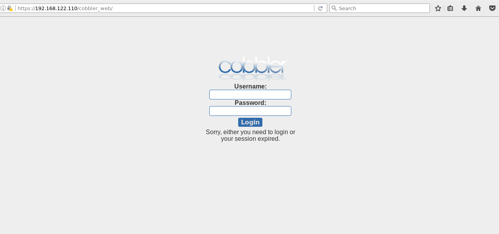

- Đăng nhập với user mặc định là cobbler, password là cobbler ta được giao diện cobbler như sau:

	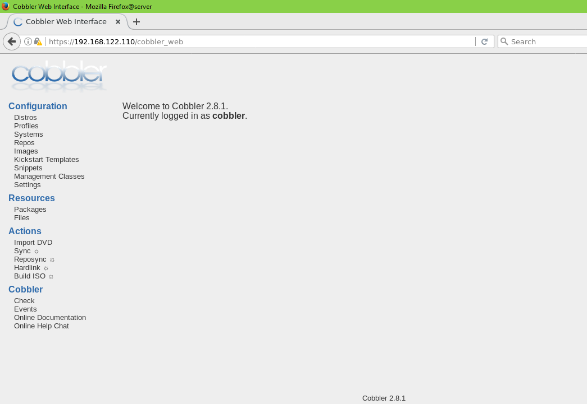

Như vậy là cobbler đã được cài đặt thành công, và tiếp theo là các bước cấu hình cobbler.

<a name = '2.5'></a>
# 2.5.	Bước 5: Cấu hình Cobbler

### Sửa file cấu hình Cobbler /etc/cobbler/settings

- Sử dụng `openssl` để sinh ra mật khẩu cho cobbler đã được mã hóa như sau:

	```
	openssl passwd -1
	Password:
	Verifying - Password:
	$1$1unDtJqr$6THfdcVTmF58L35aigs7N/
	```

	(Mật khẩu tôi dùng ở đây vẫn sử dụng là cobbler, sinh ra được đoạn password đã được mã hóa như trên)

- Sửa file `/etc/cobbler/settings` với các thông số `default_password_crypted` với password vừa sinh ra ở trên, và cập nhật các thông số của DHCP, DNS, PXE từ 0 lên 1 như sau: 

	```
	default_password_crypted: "$1$1unDtJqr$6THfdcVTmF58L35aigs7N/"
	manage_dhcp: 1
	manage_dns: 1
	pxe_just_once: 1
	next_server: 192.168.122.110
	server: 192.168.122.110
	```
	
	- Trong đó, `server` là địa chỉ IP của cobbler server (lưu ý: không sử dụng địa chỉ `0.0.0.0`, nên sử dụng địa chỉ IP mà bạn muốn các client sử dụng để liên lạc với cobbler server với các giao thức như http, tftp), `next_server` là địa chỉ IP của TFTP server mà các file boot (kernel, initrd) được lấy về. Thường thì sẽ thiết lập cho cùng là Cobbler server.
	
	- Để thực hiện boot PXE, người quản trị cần một DHCP server để cấp phát IP và chuyển hướng trực tiếp client boot tới TFTP server nơi mà nó có thể download các file boot. Cobbler có thể quản lý và thực hiện việc này, thông qua sửa đồi thông số `manage_dhcp: 1` (cho phép dịch vụ DHCP chạy local trên máy server)
	
	- Khi thay đổi từ 0 lên 1, cobbler sẽ tự động sinh ra file cấu hình `dhcpd.conf` dựa trên `dhcp.template` của cobbler.

### Cập nhật file cấu hình DHCP và DNSMASQ

- Sửa file cấu hình của DHCP như sau `vi /etc/cobbler/dhcp.template`

	```
	[...]
	subnet 192.168.122.0  netmask 255.255.255.0 {
	     option routers             192.168.122.1;
	     option domain-name-servers 8.8.8.8;
	     option subnet-mask         255.255.255.0;
	     range dynamic-bootp        192.168.122.100 192.168.122.200;
	     default-lease-time         21700;
	     max-lease-time             43100;
	     next-server                $next_server;

	     class "pxeclients" {
	          match if substring (option vendor-class-identifier, 0, 9) = "PXEClient";
	          if option pxe-system-type = 00:02 {
	                  filename "ia64/elilo.efi";
	          } else if option pxe-system-type = 00:06 {
	                  filename "grub/grub-x86.efi";
	          } else if option pxe-system-type = 00:07 {
	                  filename "grub/grub-x86_64.efi";
	          } else {
	                  filename "pxelinux.0";
	          }
	     } 
	}
	```

- Cập nhật dải địa chỉ IP được cấp phát cho client trong file `/etc/cobbler/dnsmasq.template` như sau:

	```
	[...]
	dhcp-range=192.168.122.100, 192.168.122.200
	```

- Thực hiện comment `@dists` và `@arches` trong file `/etc/debmirror.conf` để hỗ trợ các distro debian: 

	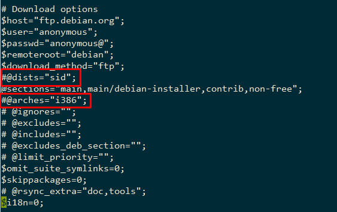

- Khởi động lại rsyncd, cobbler và xinetd, sau đố đồng bộ lại cobbler dùng các lệnh sau:

	```
	systemctl enable rsyncd.service
	systemctl restart rsyncd.service
	systemctl restart cobblerd
	systemctl restart xinetd
	systemctl enable xinetd
	cobbler get-loaders
	cobbler check
	cobbler sync
	```

### Mount iso các OS và import và Cobbler

- Giả sử trên Cobbler server đã có 2 file iso của Centos 7 và Ubuntu server 16.04 như sau:

	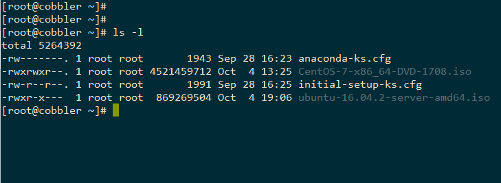

- Thực hiện mount 2 file iso và import vào cobbler như sau:

	```
	mkdir  /mnt/centos
	mkdir /mnt/us
	mount -o loop CentOS-7-x86_64-DVD-1708.iso  /mnt/centos/
	cobbler import --arch=x86_64 --path=/mnt/centos --name=CentOS7
	umount /mnt/centos
	mount -o loop  ubuntu-16.04.2-server-amd64.iso  /mnt/us/
	cobbler import --arch=x86_64 --path=/mnt/us --name=US1604
	```

	Trong quá trình import, nếu có lỗi xảy ra thì thực hiện lệnh sau: `cobbler signature update`

<a name = '2.6'></a>
# 2.6.	Bước 6: Xác nhận lại distro được import vào cobbler

- Kiểm tra trên giao diện web của Cobbler phần distro được như sau là ok:

	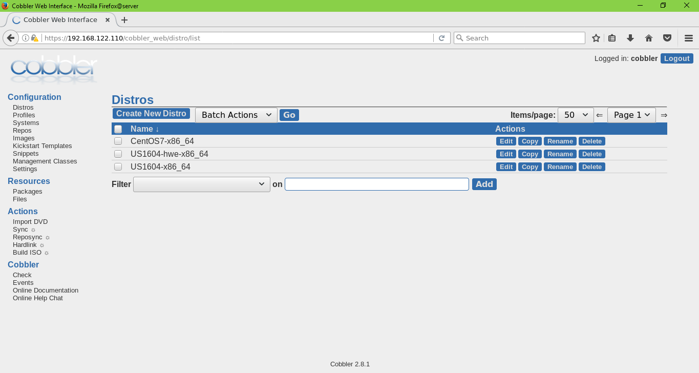

- Xem thông tin chi tiết các distro: click vào các distro hoặc sử dụng lệnh như sau:
	
	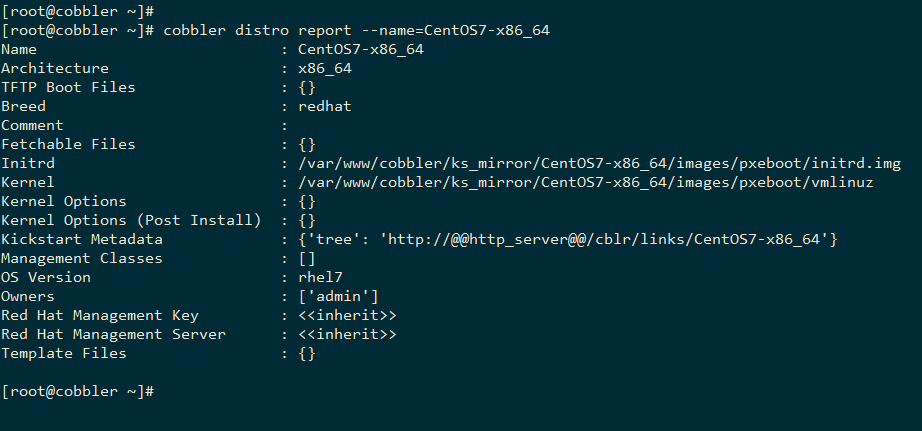


<a name = '2.7'></a>
# 2.7.	Bước 7: Tạo file kickstart

- Thư mục chứa các file kickstart là `/var/lib/cobbler/kickstarts`. Tạo các file kickstart cho Centos 7 và Ubuntu server có nội dung như sau.

	- File kickstart cho Centos 7 với tên [CentOS7.ks](../config_files/Centos7-cobbler.ks).

	- File kickstart cho Ubuntu server 16.04 với tên [US1604.cfg.ks](../config_files/US1604-cobbler.ks).

- Đồng bộ và cập nhật file kickstart cho các profile của Centos 7 và Ubuntu server 16.04 như sau: 

	```
	cobbler profile edit --name=CentOS7-x86_64 --kickstart=/var/lib/cobbler/kickstarts/CentOS7.ks
	cobbler profile edit --name=US1604-x86_64 --kickstart=/var/lib/cobbler/kickstarts/US1604.cfg.ks
	cobbler sync
	```

<a name = '2.8'></a>
## 2.8.	Bước 8: Sửa file cấu hình boot

Ở đây khi thực hiện lab, có một vấn đề xảy ra với boot Ubuntu server 16.04 là lỗi không tìm được file kickstart. Sau khi tìm hiểu, tôi thấy bỏ đoạn cấu hình `auto-install/enable=true`  trong menu boot của Ubuntu như sau là client boot file kickstart và cài đặt OS bình thường:  

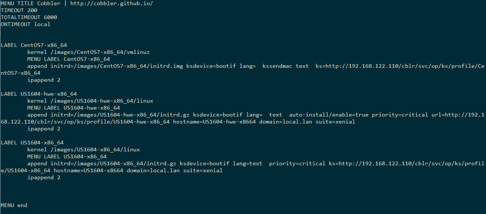

<a name = '3'></a>
# 3. Cài đặt Cobbler sử dụng scripts

- Phần này hướng dẫn sử dụng scripts để cài đặt Cobbler và cấu hình một số thành phần trong Cobbler một cách nhanh chóng. Script bao gồm các bước cài đặt và cấu hình từ [bước 1](./5.Cobbler-cai_dat.md#2.1) tới [bước 5](./5.Cobbler-cai_dat.md#2.5) như hướng dẫn trên. 

- Các bước thực hiện: 

	- Download scripts về sử dụng `wget` như sau: 

		```
		wget https://raw.githubusercontent.com/ThanhTamPotter/ghichep-cobbler/master/scripts/cobbler-install.sh
		wget https://raw.githubusercontent.com/ThanhTamPotter/ghichep-cobbler/master/scripts/config.sh
		chmod 755 *.sh
		```

	- Thực hiện chỉnh sửa các thông số phù hợp với cấu hình mạng của bạn trong file `config.sh`

	- Chạy file script cài đặt cobbler: 

		`source cobbler.sh`

- Sau khi cài đặt xong, kiểm tra giao diện cobbler và thực hiện các bước 6, 7, 8 như hướng dẫn mục 2.

<a name = '4'></a>
# 4.	Boot OS từ các client

- Bật client 1 và client 2. Sau khi nhận IP, màn hình boot hiển thị nội dung như sau:

	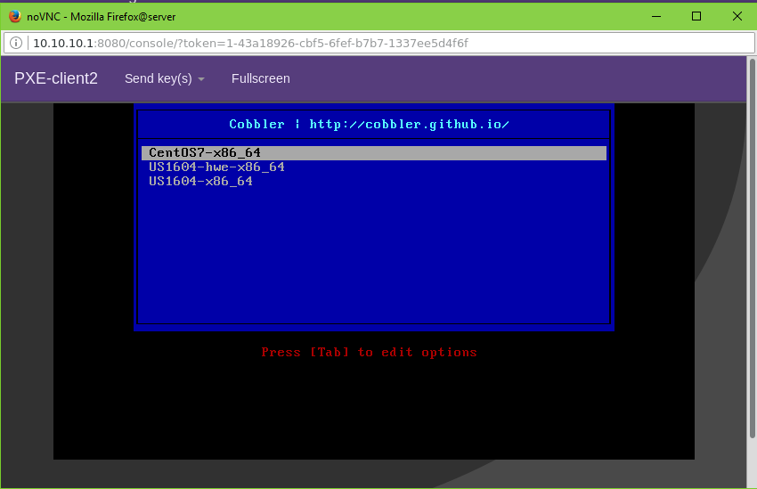


- Chọn OS muốn cài đặt và ấn ENTER là ok.

	- Client 1: 

		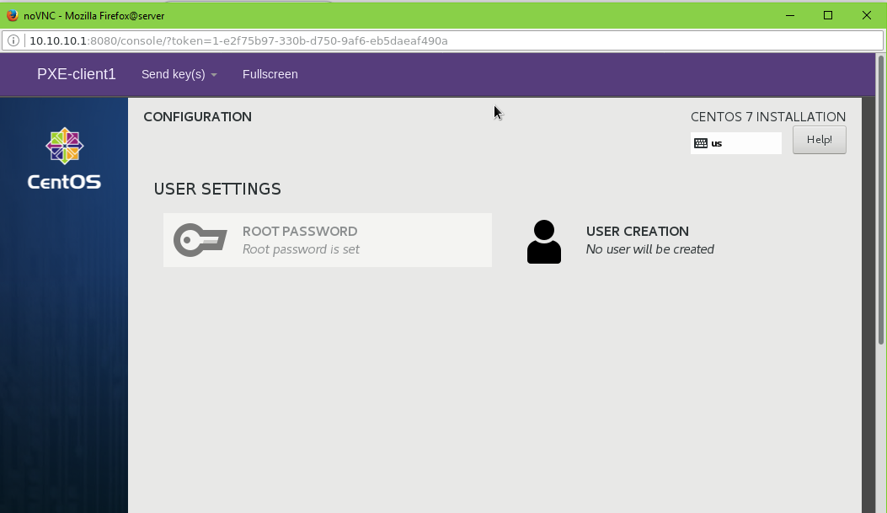

	- Client 2:

		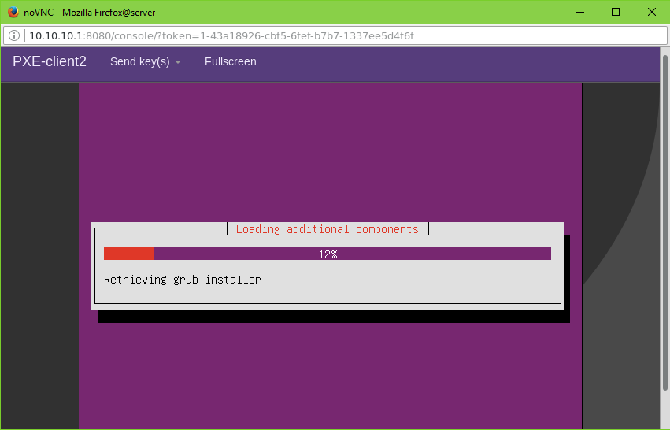

	- Kiểm tra trên cobbler server thấy đã cấp phát DHCP cho các client như sau:

		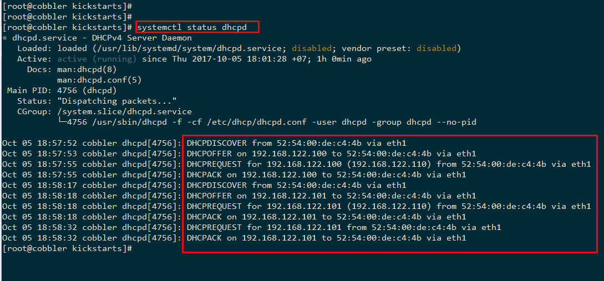
		
- ***Lưu ý***: *khi chạy 2 máy client, Client 1 dùng cài đặt Centos thì mọi thứ diễn ra khá ok, nhưng khi boot Client 2 dùng để cài đặt Ubuntu 16.04, sau khi cài đặt OS xong tôi không biết do lỗi gì nhưng khi mở màn hình vnc truy cập thì màn hình không hiển thị. Tuy nhiên, khi ssh vào sử dụng user ttp đã tạo như trong file kickstart US1604.cfg.ks thì máy vẫn hoạt động bình thường. Lỗi ở giao diện hiển thị. Tôi đang trong quá trình tìm hiểu lý do, sẽ update lại khi fix được lỗi.* 

==>> **update fix lỗi**: Lỗi phần grub. Fix lại lỗi, sửa trong file `/etc/default/grub`, comment dòng `GRUB_HIDDEN_TIMEOUT=0` và sửa dòng `GRUB_CMDLINE_LINUX_DEFAULT="quiet splash" ` thành `GRUB_CMDLINE_LINUX_DEFAULT=""`

Sau đó chạy lệnh `update-grub` và reboot lại máy là xong.

Phần này đã sửa lại trong file kickstart [US1604.cfg.ks](../config_files/US1604-cobbler.ks) nên chỉ cần làm đúng các bước là máy hoạt động bình thường.


<a name = '5'></a>
# 5.	Tham khảo

[1] http://cobbler.github.io/manuals/quickstart/

[2] https://www.linuxtechi.com/install-and-configure-cobbler-on-centos-7/

[3] https://letonphat.wordpress.com/2011/07/05/tri%E1%BB%83n-khai-ci-d%E1%BA%B7t-h%E1%BB%87-th%E1%BB%91ng-linux-t%E1%BB%B1-d%E1%BB%99ng-v%E1%BB%9Bi-cobbler/ 


