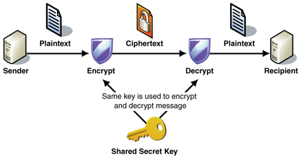
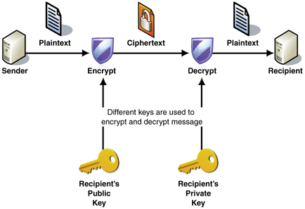
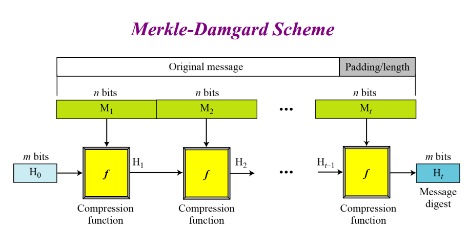
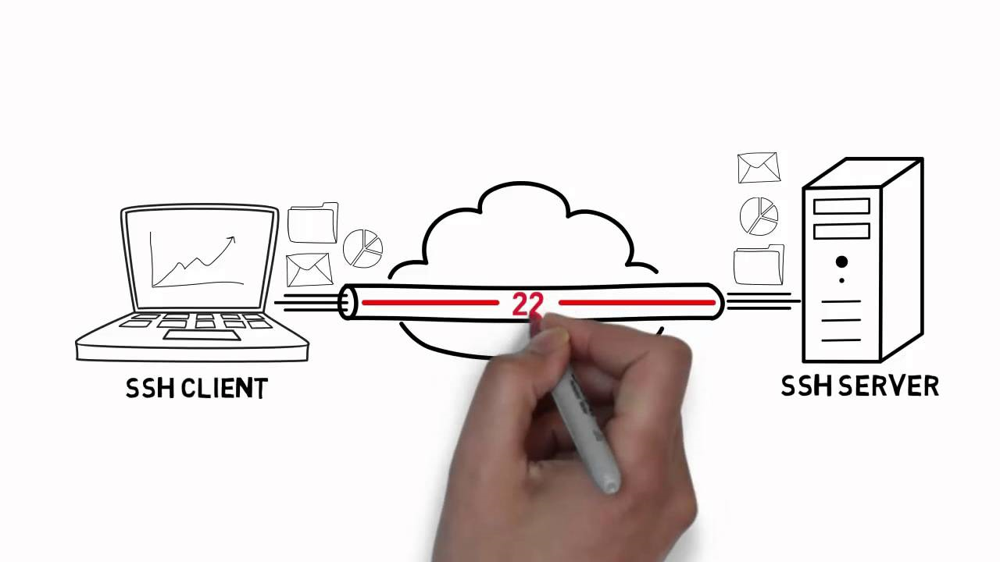
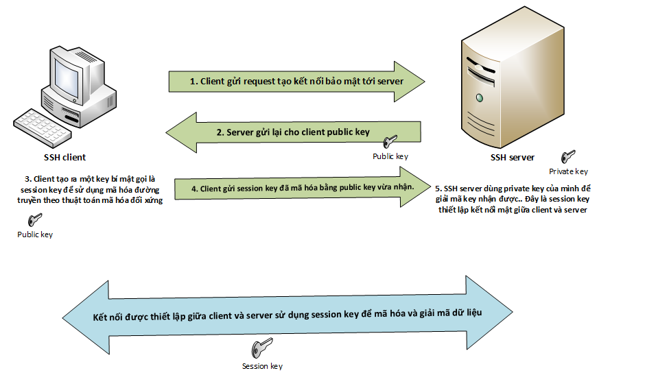
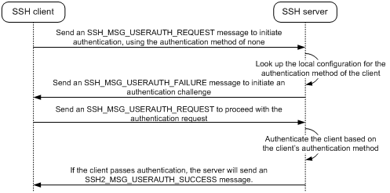
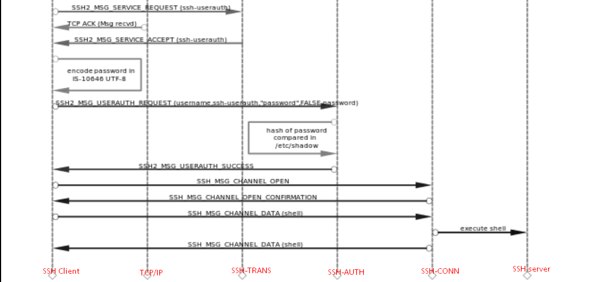
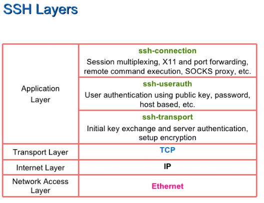
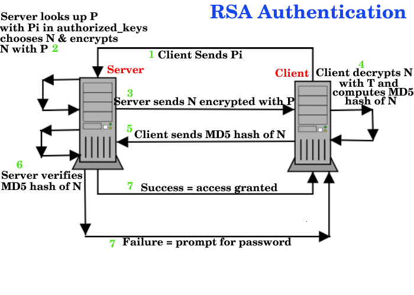

# TÌM HIỂU SSH 

## ***Mục lục***

[1.  Giới thiệu SSH](#1)

[2.  Đặc điểm của SSH](#2)

[3.  Một số khái niệm liên quan trong SSH](#3)

- [3.1.  Symmetric Encryption - Mã hóa đối xứng](#3.1)

- [3.2.  Asymmetrical Encryption - Mã hóa bất đối xứng](#3.2)

- [3.3.  Hashing – Hàm băm](#3.3)

[4.  Quá trình làm việc của SSH](#4)

- [4.1.  Negotiating Encryption for the Session](#4.1)

- [4.2.  Authenticating the User's Access to the Server](#4.2)

  - [4.2.1.  Xác thực bằng mật khẩu](#4.2.1)

  - [4.2.2.  Xác thực bằng SSH key pair](#4.2.2)

[5. Tham khảo](#5)

---

# 1. Giới thiệu SSH

- **SSH** – viết tắt cho **S**ecure **Sh**ell, là một giao thức bảo mật và các thông thường nhất để truy cập từ xa tới server một cách an toàn. Sử dụng những công nghệ mã hóa này, SSH cung cấp một cơ chế thiết lập một kết nối bảo mật được mã hóa giữa 2 bên, xác thực lẫn nhau, và thông qua những câu lệnh thao tác với server từ xa.

- SSH hoạt động ở lớp ứng dụng của phân lớp TCP/IP.

- Giao thức SSH là một phương pháp cho việc điều khiển từ xa một cách bảo mật từ một máy tính tới một máy tính khác. Nó cung cấp các tùy chọn thay thế cho ***khả năng xác thực mạnh mẽ***, và ***bảo vệ sự bảo mật*** và ***toàn vẹn*** với khả năng mã hóa mạnh mẽ cho kết nối. Đó là sự thay đổi cho các giao thức điều khiển không được bảo vệ (như telnet, rlogin) và giao thức truyền file không an toàn (như FTP).

# 2. Đặc điểm của SSH

Các đặc điểm chính của giao thức SSH là:

- **Tính bí mật (Privacy)**: của dữ liệu thông qua khả năng  mã hoá mạnh mẽ.

- **Tính toàn vẹn (integrity)**: Đảm bảo dữ liệu trên kênh truyền gửi và nhận giữa 2 bên toàn vẹn, không bị thay đổi. 

- **Authentication**: Cung cấp khả năng xác thực giữa bên gửi và bên nhận.

- **Authorization**:  Cung cấp khả năng ủy quyền dùng để điều khiển truy cập thông qua các tài khoản. 

- **Forwarding - Chuyển tiếp  hoặc tạo đường hầm (tunneling)** để mã hoá những phiên khác dựa trên giao thức TCP/IP .SSH hỗ trợ 3 kiểu chuyển tiếp:

  - TCP port forwarding

  - X forwarding

  - Agent forwarding

# 3.  Một số khái niệm liên quan trong SSH

Để bảo mật thông tin trên kênh truyền, SSH triển khai một số loại thao tác khác nhau với dữ liệu tại từng điểm khác nhau của phiên làm việc. Những công nghệ này bao gồm: ***mã hóa đối xứng (symmetrical encryption)*** , ***mã hóa bất đối xứng (asymmetrical encryption)*** và ***hàm băm (hashing)*** .

## 3.1.  Symmetric Encryption - Mã hóa đối xứng 

Mối quan hệ giữa các thành phần trong mã hóa và giải mã dữ liệu sẽ quyết định xem loại mã hóa đó là đối xứng hay bất đối xứng. 

- Mã hóa đối xứng là loại mã hóa mà chỉ một key được sử dụng để mã hóa cho dữ liệu tại bên gửi, và cũng dùng để giải mã dữ liệu nhận được ở bên nhận. Điều này nghĩa là nếu bất kỳ ai có được key này có thể mã hóa và giải mã.

- Loại mã hóa này thường được gọi là mã hóa ***“shared secret”*** (chia sẻ bí mật) hoặc mã hóa ***“secret key”*** . Chỉ một key duy nhất được dùng cho tất cả các bên cho tất cả các thao tác mã hóa dữ liệu. Do đó, nếu bạn có key của một bên này, thì bạn hoàn toàn có thể đoán ra key của bên còn lại – vì dùng chung một key. 

  

- Mã hóa khóa đối xứng được SSH sử dụng để mã hóa kết nối. Trái ngược với một số user cho rằng, cặp khóa bất đối xứng public/private key có thể được tạo ra chỉ để cho việc xác thực, không dùng để mã hóa kết nối. Mã hóa đối xứn cho phép xác thực bằng mật khẩu để bảo vệ chống lại snooping.

- Cả client và server đều góp phần trong quá trình thiết lập key này, và kết quả là key bí mật nay sẽ không được biết bởi bên ngoài. Key bí mật được tạo thông qua một quá trình được gọi là thuật toán trao đổi khóa. Kết quả của quá trình này là cả client và server đều cùng lúc có một key bí mật độc lập. Quá trình này sẽ chi tiết hơn ở phần sau.

- Key mã hóa đối xứng được tạo trong quá trình này được gọi là khóa phiên (session key hay session-based) và được dùng để mã hóa dữ liệu được truyền giữa client và server. Một khi đã được thiết lập, các dữ liệu phải được mã hóa với session key này. Nhưng trước hết là phải xác thực client. 

- SSH có thể được cấu hình sử dụng nhiều hệ thống mã hóa đối xứng khác nhau bao gồm: AES, Blowfish, 3DES, CAST128, và Arcfour. Cả client và server đêu có thể quyết định hỗ trợ những loại hệ thống mã hóa nào. Tùy chọn đầu tiên trong list của client mà có sẵn trên server được sử dụng làm thuật toán mã hóa cho cả 2 bên. 

## 3.2. Asymmetrical Encryption - Mã hóa bất đối xứng 

- Mã hóa bất đối xứng khác với mã hóa đối xứng là dữ liệu được gửi theo một chiều, cần phải có 2 key liên quan tới nhau. Một key là private key và key còn lại là public key.

- Public key có thể được chia sẻ thoải mái tới bất kì ai. Nó liên kết với cặp key của nó, nhưng private key không thể chia sẻ giống public key. Mối quan hệ toán học giữa public key và private key cho phép public key mã hóa bản tin mà chỉ có private key mới có thể giải mã bản tin đó. 

- Thực tế, public key và private key là kiểu nghịch đảo của nhau, nên có thể dùng key nào để mã hóa cũng được, key còn lại sẽ dùng để giải mã. 

  

- Trong mã hóa, đặc biệt là trong mô hình SSH, **public key** được dùng để mã hóa dữ liệu và **private key** được dùng để giải mã dữ liệu đã bị mã hóa bởi public key.

- Private key nên được ***giữ bí mật*** và ***không bao giờ được chia sẻ*** với bên nào khác. Đây là yêu cầu để cho public key làm việc. Private key chỉ có thể sử dụng để giải mã những bản tin mã hóa bởi public key, qua đó có thể xác thực được rằng bản tin chi có thể giải mã đúng bởi bên đang giữ private  key. (*Có nghĩa là: mã hóa bất đối xứng sử dụng cặp key: public và private key để mã hóa và giải mã dữ liệu. public key là key có thể chia sẻ với bất cứ ai, còn private key là key phải giữ bí mật => điều đó chứng tỏ: nếu một bản tin mã hóa bởi public key mà được giải mã bởi private key thì nó chứng tỏ - đối tượng có private key kia là được xác thực chính xác là họ mà không phải ai khác.*)

- SSH sử dụng mã hóa bất đối xứng với nhiều mục đích khác nhau. Trong suốt quá trình xử lý trao đổi key bí mật (**session key**) để thiết lập mã hóa đối xứng (được sử dụng để mã hóa session – mã hóa phiên kết nối, do xử lý dữ liệu với mã hóa đối xứng nhanh hơn là mã hóa bất đối xứng), mã hóa bất đối xứng được sử dụng. Trong giai đoạn này, tất cả các bên tạo ra cặp khóa và trao đôi public key để tạo ra khóa bí mật – session key được sử dụng cho mã hóa đối xứng.
Việc sử dụng mã hóa bất đối xứng cùng được sử dụng trong xác thực SSH key. SSH key pairs có thể được sử dụng để xác thực client với server. Client tạo một cặp key và upload public key lên remote server để truy cập. Nó sẽ được chép vào file authorized_keys trong thư mục `~/.ssh` trong thư mục home của user mà client truy cập tới.

- Sau khi thiết lập kết nối mã hóa đối xứng giữa client và server, client phải được xác thực là cho phép truy cập. server có thể sử dụng public ke trong file này để mã hóa một bản tin tới client. Nếu client có thể chứng minh là nó có khả năng giải mã bản tin này, nó đã chứng minh rằng mình là chủ của private key. Và server có thể thiết lập môi trường và cho phép client truy cập.

## 3.3. Hashing – Hàm băm 

- Một thao tác với dữ liệu khác mà SSH vận dụng ưu điểm của nó là **hàm băm** (hashing). Hàm mã hóa băm là các phương pháp tạo ra một ***“signature” (chữ ký)*** hoặc tóm tắt thông tin. Đặc tính đặc thù của chúng nó không có hàm giải ngược, hầu như không thể dự đoán ngược lại giá trị ban đầu, và đảm bảo được nó là duy nhất. 

- Sử dụng cùng một hàm băm và bản tin sẽ cho ra mã băm giống nhau; sửa đổi bất kì phần nào của dữ liệu cũng làm mã băm khác đi. Một user không nên thể tạo ra lại bản tin ban đầu từ một mã hash của nó, nhưng họ có thể xác định xem một bản tin kèm mã hash đó khi đến tay họ có bị biến đổi hay chưa.

  

- Với những đặc tính trên, hàm băm chủ yếu được sử dụng với mục đích xác định tính toàn vẹn của dữ liệu và xác nhận xác thực kết nối. Hàm băm chính được sử dụng trong SSH là **HMAC**, hoặc hàm băm dựa trên mã xác thực. Điều này đảm bảo rằng bản tin nhận được là toàn vẹn và chưa bị thay đổi. 

- Mỗi bản tin được gửi sau khi mã hóa phải chứa một mã MAC để các bên nhận có thể xác nhận sự toàn vẹn của gói tin. Mã MAC được tính bằng cách kết hợp key đối xứng – session key, số thứ tự của gói tin trong bản tin, và nội dung của bản tin. 

# 4.  Quá trình làm việc của SSH

Giao thức SSH triển hai theo mô hình client – server để xác thực giữa 2 bên va mã hóa dữ liệu giữa chúng.

Server lắng nghe trên một cổng được chỉ định cho các kết nối. Nó sẽ đáp trả lại các đàm phán tạo kết nối an toàn tư client, xác thực bên đang kết nối tới, và tạo ra môi trường kết nối bảo mật nếu bên định danh của client được chấp thuận.

Client có trách nhiệm bắt đầu tạo kết nối TCP với server, thỏa thuận tạo ra một kết nối an toàn, xác nhận thông tin định danh của server phu hợp với các bản ghi thông tin được cấp trước đó, và cung cấp nhận dạng của mình để xác thực với server. 

Một phiên làm việc của SSH được thiết lập trong 2 giai đoạn riêng biệt:

\-  Giai đoạn đầu tiên là đồng ý và thiết lập đường truyền mã hóa để bảo vệ an toàn liên kết sau đó. 

\- Giai đoạn thứ 2 là xác thực user và gán quyền được phép truy cập tới server như nào. 

## 4.1. Negotiating Encryption for the Session - Thiết lập mã hóa phiên kết nối

1) Client request tới server tạo một kết nối TCP. Khi kết nối TCP được thiết lập bởi client, server đáp trả lại version protocol mà nó hỗ  trợ. Nếu client phù hợp với một trong các version protocol được chấp thuận, kết nối sẽ tiếp tục. 

2) Server cung cấp public key của nó, để client có thể xác định đây chính là máy chủ cần kết nối.

3) Client tạo ra một key bí mật, được sử dụng với các **thuật toán mã hóa đối xứng** – key này gọi là **session key** sẽ dùng để thiết lập kết nối bí mật chỉ có mình client và server biết. Sau đó, dùng public key vừa nhận được từ server, mã hóa sesion key và gửi cho server.

4) Client gửi session key đã mã hóa bằng public key lại cho server.

5) Server dùng private key của nó để giải mã session key vừa nhận được. (do chỉ mình server là có private key, nên nếu server giải mã được session key thì nó đã xác thực được nó chính là server mà client muốn truy cập tới)

6) Sau khi cả 2 bên đều có session key bí mật, kết nối TCP giữa client và server sẽ được mã hóa bằng session key bí mật chung mà chỉ có 2 bên mới có. 

Hoàn thành quá trình thiết lập kết nối bảo mật an toàn để truyền dữ liệu giữa client và server.

Sau khi quá trình mã hóa phiên được thiết lập, sẽ tới quá trình xác thực người dùng.

## 4.2. Authenticating the User's Access to the Server - Xác thực người dùng

- Client gửi request xác thực tới server, xác định phương thức để xác thực. (có 2 phương thức là dùng ***password*** và sử dụng ***SSH keypair***) 

- Khi nhận được request xác thực, server sẽ đáp trả lại list các danh sách các phương thức xác thực mà nó hỗ trợ và client phải vượt qua được thì mới được xác thực.

- Client chọn một phương thức xác thực trong danh sách trên và tạo ra request xác thực gồm có username, phương thức xác thực và thông tin liên quan tới phương thức xác thực đó:

  - Nếu là xác thực theo password, thông tin kèm theo sẽ password.

  - Nếu là xác thực theo key, thông tin kèm theo là id public key trong keypair hoặc chữ kí số của client để xác thực.

  

- Dựa trên cấu hình của client, nếu client đã được xác thực trước đó, server sẽ có từng hành động cụ thể với client:

  - Nếu client đã vượt qua kiểm tra xác thực trước đó và không phải trải qua vòng xác thực nào nữa, server sẽ gửi cho client một thông báo đã xác thực thành công và cho phép truy cập.

  - Nếu client đã qua xác thực trước đó nhưng vẫn phải tiếp tục các loại xác thực khác, server sẽ gửi tới client một thử thách xác thực mang theo loại xác thực mà client phải vượt qua.
  
  - Nếu client không vượt qua vòng xác thực mà thời gian để cho xác thực vẫn chưa hết thì server sẽ gửi lại thử thách xác thực cho server. 

  - Nếu client vẫn xác thực sai và thời gian xác thực hết, server sẽ gửi lại thông báo xác thực sai cho client và ngắt kết nối.

### 4.2.1.  Xác thực bằng mật khẩu

Như hình mô tả trên, client sẽ gửi kèm password của user truy cập tới server, **SSH-AUTH** sẽ so sánh mã băm của password với mã tương ứng của user trong file `/etc/shadow`. Nếu phù hợp, server sẽ thông báo tới client xác thực thành công và client có thể truy cập tới server. 

Mặc dù password đã được mã hóa, phương pháp này thường không được khuyến khích dùng vì những hạn chế trong tính chất phức tạp của password. Các script tự động có thể phá vỡ mật khẩu với độ dài thôn thường rất dễ khi so sánh với các phương pháp xác thực khác, nên thường khuyến cáo nên disable phương pháp xác thực bằng mật khẩu và sử dụng phương thức xác thực bằng SSH key.

### 4.2.2.   Xác thực bằng SSH key pair

- ***Phương pháp thông dụng nhất*** được khuyến cáo dùng để xác thực thay thế cho phương pháp xác thực bằng password là sử dụng ***SSH key pairs***. Cặp key SSH key là khóa bất đối xứng, nghĩa là mỗi key có chức năng khác nhau.

- **Public key** được dùng để mã hóa dữ liệu mà chỉ có thể được giải mã bởi **private key**. Public key có thể được chia sẻ tự do, bởi vì nó chỉ được dùng để mã hóa dữ liệu mà giải mã được bởi private key, không có cách nào để tìm được private key từ public key. => Nếu một bản tin mật mà được mã hóa bởi server sử dụng public key, mà client có thể giãi mã được bản tin đó thì client sẽ chứng minh được với server rằng nó chính là client có private key chứ không phải một client khác. Qua đó, client xác thực được với server một cách an toàn hơn vì không phải gửi password.

- Quá trình xác thực sử dụng SSH key pair diễn ra sau khi kết nối mã hóa đối xứng đường truyền được thiết lập. Các bước thực hiện như sau:

  

  1) Client bắt đầu gửi ID của key pair muốn xác thực tới server. Thường là ID của public key (Pi như trong hình)

  2) Server kiểm tra Pi trong file authorized_keys của tài khoản user mà client request tới. Nếu một public key phù hợp với ID được tìm thấy trong file, server sẽ tạo ra một số ngẫu nhiên N và sử dụng public key đó mã hóa N.

  3) Server gửi lại bản tin là N đã được  mã hóa tới client. 

  4) Nếu client có private key tương ứng, nó sẽ có thể giải mã được bản tin và tìm ra được số N ban đầu. Client kết hợp số N đó với session key bí mật giữa client và server tính ra được mã hash MD5. 

  5) Client gửi mã hash đó lại cho server như câu trả lời cho bản tin mã hóa N mà server gửi về để xác thực đó đúng là client mà server muốn xác thực.

  6) Server sử dụng đúng session key được chia sẻ ở giai đoạn 1 và số N trước đó để tính toán ra giá trị MD5. Nó sẽ so sánh mã này và mã MD5 nhận được từ client. Nếu trùng nhau, client đã chứng minh được nó có private và được xác thực.

Hệ thống key bất đối xứng cho phép server mã hóa bản tin gửi tới client sử dụng public key. Client có thể chứng minh nó đã có private key bằng cách giải mã chính xác bản tin đó. (do không thể tìm ngược lại được private key, nên client nào đang chứa private key có thể chứng thực được bản thân). 2 loại mã hóa trên được sử dụng đã tận dụng được điểm mạnh của từng loại trong mô hình của SSH (mã hóa đối xứng để mã hóa kết nối và mã hóa bất đối xứng để xác thực). 

# 5. Tham khảo 

[1] https://www.digitalocean.com/community/tutorials/understanding-the-ssh-encryption-and-connection-process

[2]http://www.h3c.com.hk/Products___Technology/Products/Switches/Data_Center_Switches/H3C_S12500_Series_Switches/White_Paper/200906/641548_57_0.htm 

[3] SSH key: https://www.digitalocean.com/community/tutorials/how-to-configure-ssh-key-based-authentication-on-a-linux-server#how-to-create-ssh-keys

