# Cấu hình và sử dụng SSH

## ***Mục lục***

[1.	Cài đặt SSH](#1)

[2.	Sử dụng SSH client](#2)

- [2.1.	Kết nối tới SSH server](#2.1)

- [2.2.	Chạy một câu lệnh đơn trên remote host](#2.2)

- [2.3.	Xác thực user thông qua SSH key pairs](#2.3)

- [2.4.	Sử dụng scp](#2.4)

[3.	Cấu hình](#3)

- [3.1.	Cấu hình cho SSH server](#3.1)

- [3.2.	Cấu hình cho SSH client](#3.2)

[4. Tham khảo](#4)

---

Trước tiên, tham khảo tìm hiểu về SSH để có cái nhìn tổng quát về SSH [tại đây](./1.Tim_hieu_SSH.md).

<a name = '1'></a>
# 1.	Cài đặt SSH

SSH hoạt động theo mô hình ***client – server*** nên tùy từng thành phần mà có các gói phần mềm thích hợp. 

- **SSH client** gồm có: 

	-	Dành cho Windows: [PuTTY](http://www.chiark.greenend.org.uk/~sgtatham/putty/download.html)  và các phần mềm phát triền dựa trên nó như SuperPutty, PuTTY Tray, KiTTY; [MobaXterm](http://mobaxterm.mobatek.net/) với nhiều tính năng hỗ trợ mạnh mẽ và đồ họa đẹp; [SmarTTY](http://smartty.sysprogs.com/) ;  [Dameware SSH client](http://www.dameware.com/free-ssh-client-for-windows);  [mRemoteNG](https://mremoteng.org/) ;  [Terminals](https://terminals.codeplex.com/) ... (tham khảo thêm https://www.htpcbeginner.com/best-ssh-clients-windows-putty-alternatives) 

	-	Dành cho Linux: có phần mềm **openssh-client** hoặc gói phần mềm **ssh** tích hợp cả ssh-client và ssh-server.  

- **SSH server** :

	-	Dành cho Windows: có [OpenSSH](https://github.com/PowerShell/Win32-OpenSSH/releases/) ; [Bitvise WinSSHD](https://www.bitvise.com/ssh-server), …

	-	Dành cho Linux: **openssh-server** hoặc **ssh** và gói phần mềm ssh tích hợp cả ssh-client và ssh-server.
		
- Cài đặt SSH trên ubuntu: 

	- Cài đặt ssh-client:
		
		`$ sudo apt-get install openssh-client -y`

	- Cài đặt ssh-server: 

		`$ sudo apt-get install openssh-server -y`

	- Cài đặt ssh (gồm cả ssh client và ssh server )

		`$ sudo apt-get install ssh -y`

<a name = '2'></a>
# 2.	Sử dụng SSH client

<a name = '2.1'></a>
## 2.1.	Kết nối tới SSH server 

- Để kết nối tới một server từ xa (remote server) và mở một phiên làm việc shell, có thể dùng câu lệnh [`ssh`](http://manpages.ubuntu.com/manpages/xenial/man1/ssh.1.html)  trên trình **ssh-client**.

- Cách đơn giản nhất để truy cập tới remote server là bạn sử dụng câu lệnh ssh truy cập tới user trên server như sau: 

	```
	# sử dụng câu lệnh: ssh <user_name>@<remote-server_IP> 
	# ví dụ: 
	ssh ttp@10.10.10.10
	```
	Nếu bạn đang sử dụng phương thức xác thực bằng mật khẩu, bạn sẽ được nhắc nhập mật khẩu cho tài khoản từ xa ở đây. Nếu bạn đang sử dụng SSH key, bạn sẽ được nhắc nhở nhập passphrase của private key nếu được thiết lập, nếu không bạn sẽ tự động đăng nhập.

	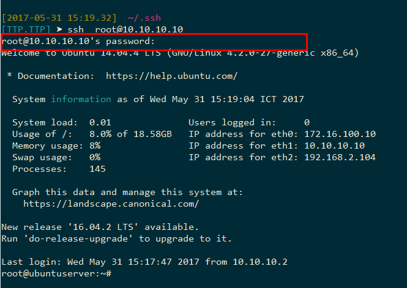

- Bạn có thể cấu hình thêm file .ssh/config để cho phép client lấy những thông tin từ đó để truy cập tới remote server một cách nhanh hơn: 

	- Ví dụ một file config đơn giản như sau: 

		```
		Hostname 10.10.10.10
		User root
		Port 2200 # Với cấu hình server đang lắng nghe trên port 2200
		```
	
	- Khi đó, khi truy cập vào remote host thay vì gõ lệnh như sau: 

		`ssh -p 2200 root@10.10.10.10`
 
 		Thì chỉ cần gõ như sau:
		
		`ssh 10.10.10.10`

		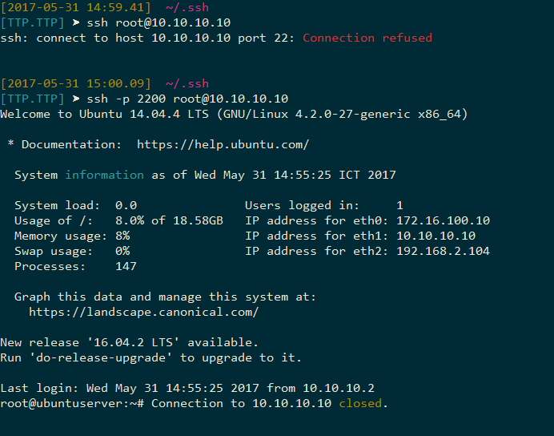

		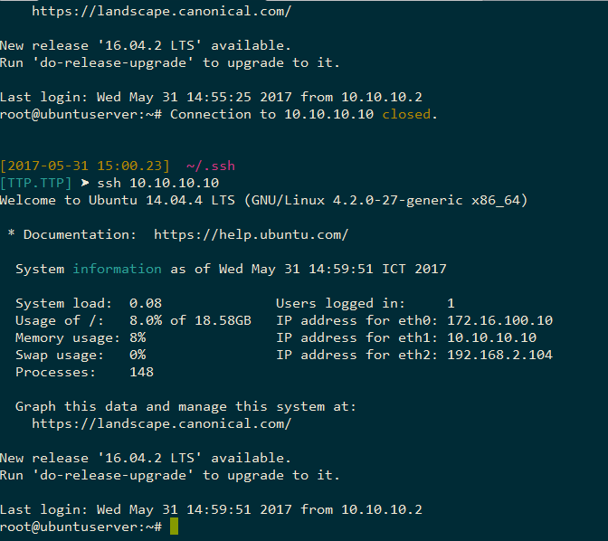

<a name = '2.2'></a>
## 2.2.	Chạy một câu lệnh đơn trên remote host

- Để chạy một câu lệnh trên remote server thay vì đăng nhập vào remote server với một shell session, bạn có thể thêm câu lệnh ngay sau thông tin đăng nhập như sau:

	`ssh username@remote_host <command_to_run>`

- Khi đó, kết nối tới remote host và server xác thực bạn, sau đó sẽ xử lý câu lệnh kèm theo và trả về kết quả câu lệnh và đóng kết nối lại ngay lập tức. Ví dụ:

	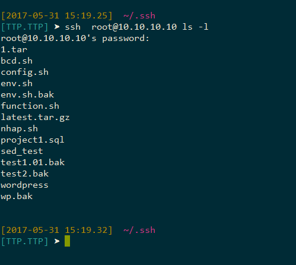

<a name = '2.3'></a>
## 2.3.	Xác thực user thông qua SSH key pairs

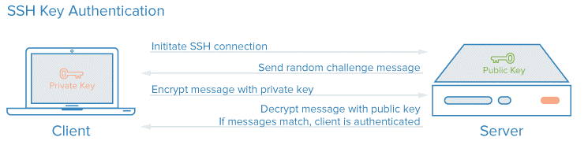

Cách thức làm việc SSH sử dụng SSH key pairs tham khảo [tại đây](./1.Tim_hieu_SSH.md#4.2.2) . Phần này hướng dẫn các bước thiết lập và sử dụng **SSH key**. 

### **Bước 1**: Tạo SSH key

- Bước đầu tiên để cấu hình xác thực SSH key tới SSH server là tạo ra một cặp key SSH key pair trên máy SSH client.

- Sử dụng `ssh-keygen` (bao gồm các công cụ sinh khóa tiêu chuẩn của OpenSSH). Mặc định, khi sử dụng câu lệnh này sẽ tạo ra một cặp key 2048 bit RSA.

- Trên máy SSH client, tạo ra cặp SSH key bằng cách gõ như sau : 

	```
	$ ssh-keygen # hoặc ssh-keygen -t rsa 
	Generating public/private rsa key pair.
	Enter file in which to save the key (/home/username/.ssh/id_rsa):
	```

- Sau khi gõ lệnh trên, màn hình sẽ hiện ra vị trí mà cặp key được sinh ra và lưu trữ. Mặc định, cặp key được lưu trong thư mục `~/.ssh` trong thư mục home của người dùng. Private key được lưu trong file tên `id_rsa` và Public key được lưu trong file `id_rsa.pub`.

- Thông thường, tốt nhất là nên thực hiện theo các cấu hình mặc định tại bước này. Việc này sẽ cho phép SSH client tự động tìm được cặp SSH key được sử dụng để xác thực. Nếu bạn chọn một vị trí lưu trữ không chuẩn như mặc định, thì gõ vào nếu không, gõ ENTER để chấp nhận các cấu hình mặc định.

- Nếu trước đó, bạn đã tạo ra một cặp key SSH, bạn có thể nhìn thấy những dòng sau: 
	
	```
	/home/<username>/.ssh/id_rsa already exists.
	Overwrite (y/n)?
	```
- Nếu bạn chọn ghi đè key lên, bạn sẽ không được xác thực bằng các key cũ trước đó nữa, key mới sinh ra sẽ ***ghi đè lên*** các file đã lưu key trước đó. Cẩn thận khi chọn yes, các tiến trình xử lý sẽ không thể quay lại được.

	```
	Created directory '/home/username/.ssh'.
	Enter passphrase (empty for no passphrase):
	Enter same passphrase again:
	```

- Tiếp theo, bạn sẽ gõ `passphrase` cho key. Đây là cấu hình tùy chọn dùng passphrase để mã hóa file private key để không người nào khác không thể biết được private của bạn.

	- Lợi ích của passphrase là: 

		-	Private key (phần mà passphrase bảo vệ) thì không bao giờ được chia sẻ trên mạng. Pass[hrase chỉ được sử dụng để giải mã key trên máy cục bộ local. Điều này có nghĩa là các tấn công network-based brute forcing sẽ không bao giờ làm ảnh hưởng tới passphrase. 

		-	Private key được lưu trong thư mục nên bị hạn chế với người dùng khác. SSH client sẽ không nhận ra private key mà không được lưu trong thư mục hạn chế đó. Key tự nó phải hạn chế quyền truy cập (read và write chỉ với người chủ của key). Điều này nghĩa là cá người dùng khác trên hệ thống sẽ không thể được truy cập được. Các quyền truy cập nên được thiết lập như sau: (với bob là tên user)

			```
			drwx------ 2 bob bob   4096 Aug 20 10:27 .ssh/ (ie: 700 for .ssh directory)
			-rw------- 1 bob bob 1675 Aug 20 10:27 id_rsa (ie: 600 only read/write for owner)
			```
		
		-	Một số attacker hy vọng sẽ crack được private key passphrase phải truy cập được vào hệ thống. Điều này nghĩa là họ sẽ sẵn sàng truy cập vào tài khoản của bạn hoặc tài khoản root. Nếu bạn thực hiện sử dụng passphare, nó sẽ có thể ngăn chặn attacker đăng nhập ngay lập tức vào trong các server khác. Điều này đem lại hy vọng bạn có thời gian để thực hiện tạo ra cặp SSH key mới và xóa bỏ key cũ đã bị crack.
		
		-	Để thay đổi passphrase của private key sử dụng câu lệnh sau: 

			`ssh-keygen -p`

	- Do private key không bao giờ được tiếp xác với mạng và được bảo vệ thông qua quyền truy cập file, những file này nên không bao giờ được truy cập bởi bất kì ai khác ngoài bạn (và người dùng root). Passphare sẽ làm việc như một lớp bảo vệ thêm vào để bảo vệ trong trường hợp các điều kiện trên không còn bảo vệ được nữa. 

	- Khi thiết lập passphrase, mỗi khi truy cập SSH xác thực thông qua SSH key, bạn sẽ phải gõ lại để cung cấp passphrase. Khuyến cáo nên sử dụng passphrase, nhưng nếu bạn không muốn, có thể đơn giản là gõ ENTER để bỏ qua bước này.

- Kết quả hiển thị ra màn hình như sau:

	```
	Your identification has been saved in /home/username/.ssh/id_rsa.
	Your public key has been saved in /home/username/.ssh/id_rsa.pub.
	The key fingerprint is:
	a9:49:2e:2a:5e:33:3e:a9:de:4e:77:11:58:b6:90:26 username@remote_host
	The key's randomart image is:
	+--[ RSA 2048]----+
	|     ..o         |
	|   E o= .        |
	|    o. o         |
	|        ..       |
	|      ..S        |
	|     o o.        |
	|   =o.+.         |
	|. =++..          |
	|o=++.            |
	+-----------------+
	```
- Ví dụ như sau: 

	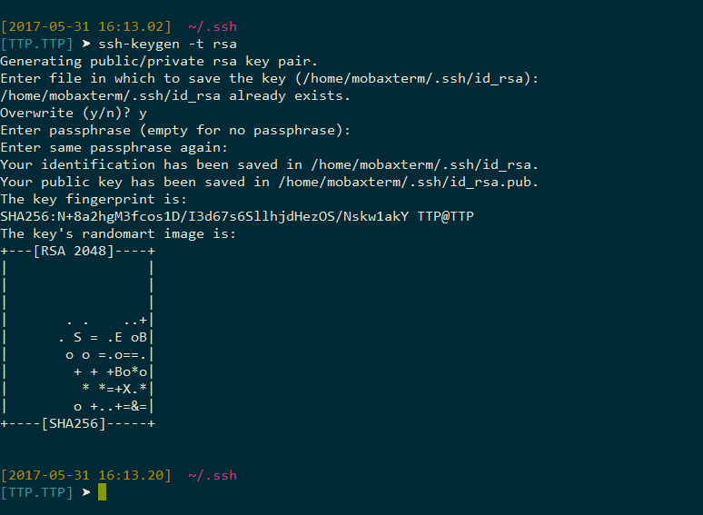

### **Bước 2**: Gửi public key lên SSH server 

#### 1) Sử dụng `ssh-copy-id`

- Để gửi public key lên SSH server, cách đơn giản nhất là dùng tiện ích `ssh-copy-id`, bởi sự thuận tiện khi sử dụng nó, nên phương pháp này được khuyến cáo sử dụng. Khi sử dụng, nó sẽ copy public key của bạn lên SSH server.

- Công cụ `ssh-copy-id` bao gồm các gói phần mềm OpensSSH trong rất nhiều các bản phân phối, nên rất có thể nó có đc sử dụng trên hệ thống local của bạn. Để phương pháp này làm việc, bạn vẫn phải dựa trên sự xác thực thông qua password. 

- Cú pháp như sau: 

	`ssh-copy-id username@remote_host`

	Khi đó, công cụ này sẽ quét trong tài khoản local để tìm file `id_rsa.pub` key đã tạo trước đó, khi tìm được nó sẽ xử lý và hỏi bạn nhập password cho tài khoản remote user như sau:

	```
	[TTP.TTP] ➤ ssh-copy-id -i id_rsa  root@10.10.10.10
	/bin/ssh-copy-id: INFO: attempting to log in with the new key(s), to filter out any that are already installed
	/bin/ssh-copy-id: INFO: 1 key(s) remain to be installed -- if you are prompted now it is to install the new keys
	root@10.10.10.10's password: [not shown]
	```
- Sau khi gõ password và nhấn `ENTER`, kết nối tới tài khoản trên remote server sử dụng password vừa nhập để xác thực. Nó sẽ copy nội dung file `id_rsa.pub` vào file `~/.ssh/authorized_keys` trong thư mục `home` của user trên server.

	- Bạn sẽ thấy đầu ra như sau:

		``
		Number of key(s) added: 1

		Now try logging into the machine, with:   "ssh 'root@10.10.10.10'"
		and check to make sure that only the key(s) you wanted were added.
		```

	- Như vậy là public key đã được lưu trong SSH server, từ giờ đã có thể kết nối tới SSH server xác thực bằng SSH key một cách đơn giản và nhanh chóng. 

#### 2) Copy public key sử dụng SSH

- Nếu không có sẵn tiện ích ssh-copy-id, bạn có thể truy cập thông qua password vào một tài khoản truy cập trên server và upload key thông qua SSH.
Chúng ta có thể thực hiện điều này bằng cách lấy nội dung của public key và gửi lên server thông qua kết nối SSH như sau:

	`cat ~/.ssh/id_rsa.pub | ssh username@remote_host "mkdir -p ~/.ssh && cat >> ~/.ssh/authorized_keys"`

	Sau đó bạn có thể xác thực bằng SSH key. 

### **Bước 3**: Hủy quyền truy cập bằng password

- Sau khi đã thiết lập xác thực thông qua SSH key, bây giờ cần hủy bỏ quyền truy cập SSH server thông qua server.

- Sửa file `/etc/ssh/sshd_config`  trên SSH server như sau: 

	`PasswordAuthentication no`

- Restart lại dịch vụ SSH:

	```
	$ sudo service ssh restart		# trên máy ubuntu hoặc debian
	$ sudo service sshd restart 	#trên máy CentOS hoặc Fedora
	```

### **Bước 4**: Xác thực user khi có nhiều cặp SSH key

- Khi trên SSH-client của bạn có nhiều hơn một cặp SSH key  để xác thực với nhiều server khác nhau, bạn có thể sử dụng cách sau để xác thực với từng server. 

- Ví dụ, trên SSH client có 2 cặp key: một là cặp key được lưu trong file `id_rsa` và `id_rsa.pub` theo mặc định, và tạo thêm một cặp key mới `test` (private key) và `test.pub` (public key) để xác thực. Mặc định, khi thực hiện kết nối SSH, SSH client sẽ sử dụng file key lưu trong file private key mặc định `id_rsa` để xác thực. Để xác thực sử dụng file private key test ta dùng tùy chọn `–i` như sau: 

	`ssh –i <file_private_key> username@remote_host`

	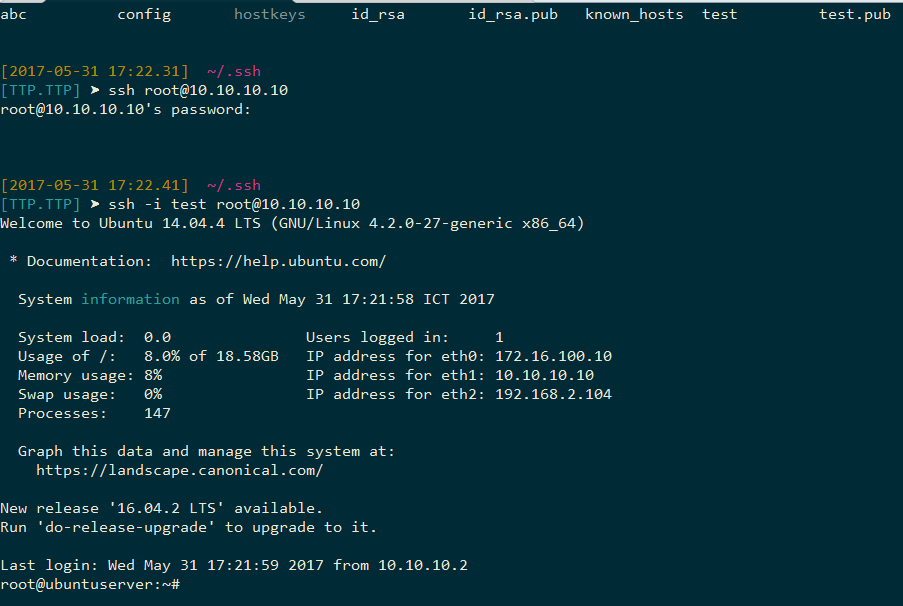

<a name = '2.4'></a>
## 2.4.	Sử dụng scp

- Câu lệnh `scp` cho phép bạn truyền các file thông qua kết nối ssh. Đây là công cụ hữu ích khi bạn truyền các file giữa các máy tính, ví dụ backup cái gì đó. 

- Cách sử dụng scp cũng tương tự như `ssh`. Truy nhiên có một số khác biệt quan trọng. 

- Câu lệnh scp có thể được sử dụng theo 3 cách:

	-	Copy file từ remote server về máy SSH client của bạn.

	-	Copy file từ SSH client lên SSH server. 

	-	Truyền dữ liệu giữa 2 server, do SSH client của bạn thực hiện điều đó. 

	Cách sử dụng câu lệnh scp tham khảo tại đây: https://linux.die.net/man/1/scp

- Một số ví dụ: 

	-	Copy một file từ SSH server về SSH client: copy file nhap.sh trong thư mục /root/nhap.sh trên SSH server về thư mục hiện tại của client:

		`scp root@10.10.10.10:/root/nhap.sh `

	-	Copy file từ SSH client lên SSH server: copy file config trong cấu hình SSH client lên cấu hình của SSH server: 

		`scp config root@10.10.10.10:/root/.ssh`

		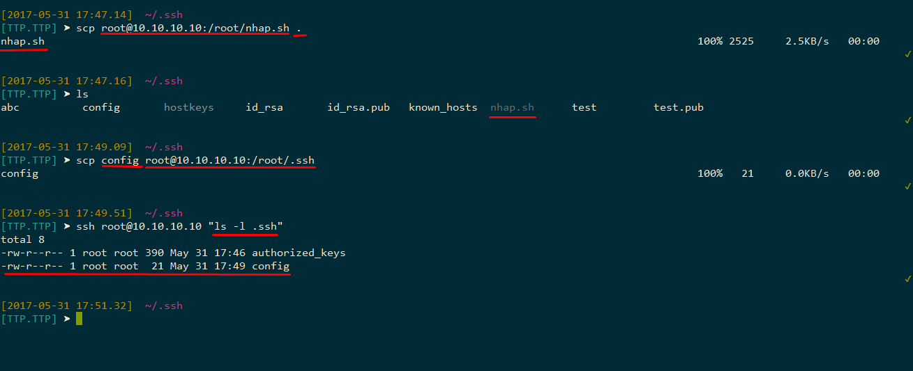

	-	Copy một file từ SSH server 1 này sang SSH server 2 khác:

		`scp username1@server1:/some/remote1/directory/foobar.txt  username2@server2:/some/remote2/directory/`

		- Câu lệnh này sẽ kết nối SSH client tới server 1, copy file `foobar.txt` trên server 1, tạo kết nối SSH từ server 1 sang server 2 và gửi file `foobar.txt` thông qua kết nối đó. 

		- Nếu thêm tùy chọn `-3` thì file sẽ được truyền thông qua SSH client (truyền file về SSH client và từ SSH client gửi lên server 2)

			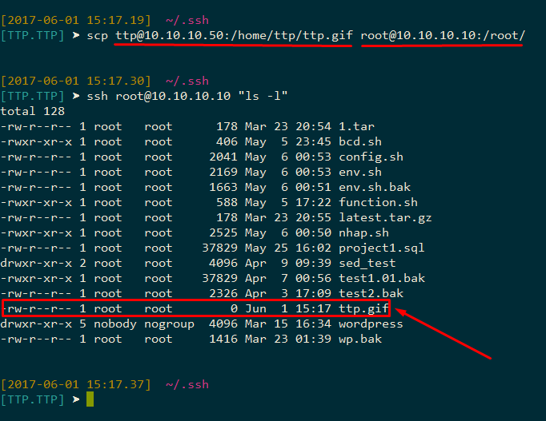

<a name = '3'></a>
# 3.	Cấu hình

<a name = '3.1'></a>
## 3.1.	Cấu hình cho SSH server 

Thông tin cấu hình SSH trên toàn hệ thống (System-wide SSH configuration information) được lưu trong thư mục  `/etc/ssh/` và chứa các file có thông tin như sau:

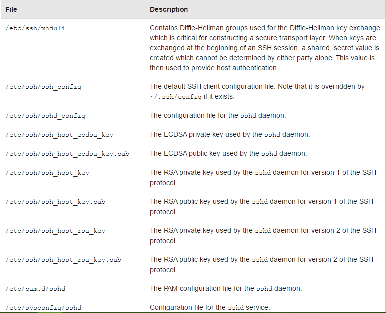

Một số cấu hình cho SSH server qua file `sshd_config`:

### 1) Thay đổi port và interface của SSH server 

- Thay đổi port và địa chỉ SSH deamon lắng nghe các kết nối SSH tới server: Do SSH là giao thức hoạt động được quy định trên cổng 22, nên để tránh bị tấn công, ta nên đổi địa chỉ port để hacker khó tấn công hơn: 

	```
	Port <port>         #cấu hình port lắng nghe kết nối SSH, mặc định là port 22
	...
	ListenAddress <IP_address_interface> # địa chỉ IP của interface cấu hình lắng nghe kết nối SSH của server, mặc định là lắng nghe tất cả các interface - địa chỉ 0.0.0.0
	```

- Cấu hình địa chỉ IP để cho server chỉ cho phép được truy cập qua một interface nhất định. (ví dụ: chỉ cho các máy trong cùng dải mạng LAN được truy cập SSH tới server)

- Ví dụ: thay đổi cho SSH server lắng nghe các kết nối SSH trên cổng 2200 và thông qua địa chỉ IP 10.10.10.10

	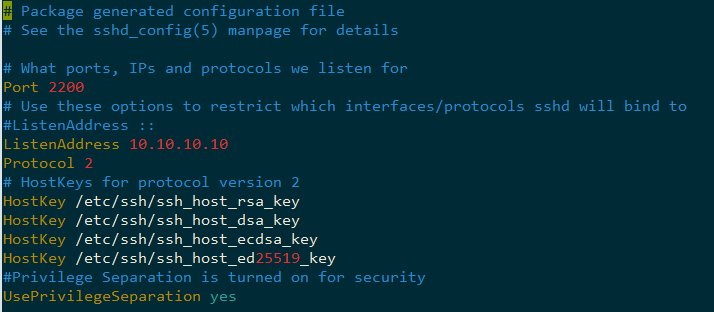

### 2) Disable xác thực bằng mật khẩu

- Tìm đến dòng PasswordAuthentication bỏ comment và sửa thành `“no”` như sau: 

	`PasswordAuthentication no`

- Khi đó, SSH server sẽ chỉ chấp nhận những client xác thực bằng SSH key, không chấp nhận xác thực bằng cách nhập password.

### 3) Phân quyền số người truy cập vào server 

- Hạn chế cho phép từng user truy cập; 

	- Tìm đến dòng cấu hình AllowUsers , nếu không có thì thêm vào. Sau đó liệt kê các user trên server cho phép đăng nhập vào hệ thống. 

		`AllowUsers <user1> <user2> …`
	
	- Ví dụ: cho phép client kết nối SSH tới server thông qua tài khoản user ttp trên server: 

		`AllowUsers ttp`

	- Khi đó, SSH client chỉ được SSH tới server thông qua user ttp. 

-	Hạn chế cho phép từng nhóm user truy cập:

	- Tìm đến sửa dòng cấu hình AllowGroups hoặc thêm dòng đó vào. Liệt kê các nhóm user trên server cho phép đăng nhập vào hệ thống: 

	- Ví dụ: 

		`AllowGroups sshmembers`

		Trong đó: `sshmembers` là tên nhóm những user cho phép đăng nhập vào SSH server . 

-	Ngăn chặn một số user không cho phép truy cập ssh vào server : 

	```
	DenyUsers <user1> <user2> …
	DenyGroups <group1> <group2> …
	```
	
	- Ví dụ: Cấm SSH client truy cập SSH server thông qua user demo: 

		`DenyUser demo`

### 4) Disable client truy cập thông qua user root

- Vô hiệu hóa client truy cập SSH server thông qua người dùng root. 

- Cấu hình như sau: 

	`PermitRootLogin no`

### 5) Khởi động lại SSH deamon

- Để restart lại dịch vụ SSH 

	- Trên máy Ubuntu/Debian:

		`sudo service ssh restart`

	- Trên máy CentOS/Fedora:

		`sudo service sshd restart`

Một số cấu hình khác xem trong file cấu hình `/etc/ssh/shd_config`.

<a name = '3.2'></a>
## 3.2.	Cấu hình cho SSH client

- Các file cấu hình SSH cho từng user được lưu trong thư mục `~/.ssh` trong thư mục home của user được mô tả gồm các file sau: 

	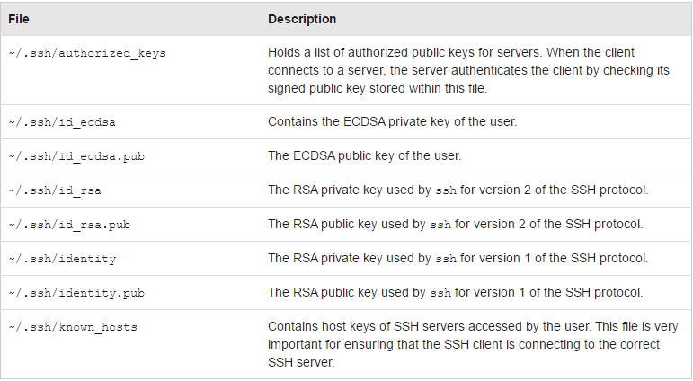

- Cấu hình cho SSH client nhanh chóng thông qua file `~/.ssh/config` như đã giới thiệu ở phần trên. Các tùy chọn trong file config được lấy ra từ file cấu hình `/etc/ssh/ssh_config` dành cho client.  

-	Cấu hình SSH client là Mobaxterm : Vào Setting

	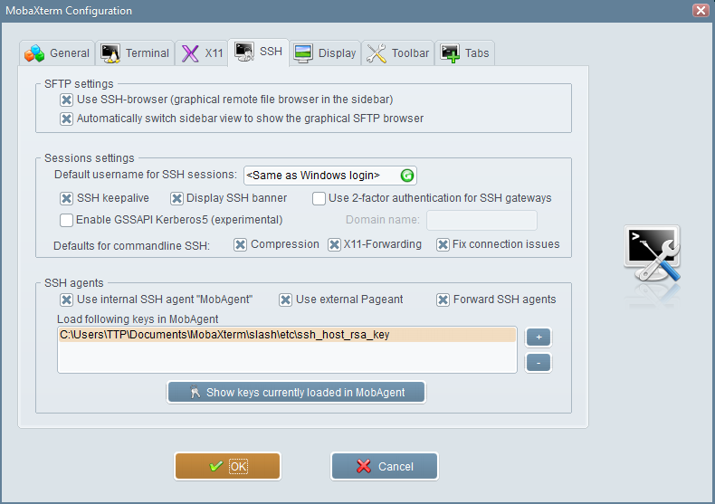

Tham khảo thêm cấu hình tại đây: https://www.ssh.com/ssh/config/ 

<a name = '4'></a>
# 4. Tham khảo

[1] scp: http://www.hypexr.org/linux_scp_help.php

[2] Config SSH: https://www.digitalocean.com/community/tutorials/ssh-essentials-working-with-ssh-servers-clients-and-keys


