# SSH FORWARDING 

## ***Mục lục***

[1.	Port forwarding](#1)

- [1.1.	Local port forwarding](#1.1)

- [1.2.	Remote port forwarding](#1.2)

- [1.3.	Dynamic port forwarding](#1.3)

- [1.4.	Multi-hop SSH port forwarding](#1.4)

[2.	X11 forwarding](#2)

- [2.1.	Giới thiệu](#2.1)

- [2.2.	Cấu hình sử dụng X forwarding](#2.2)

[3.	Tham khảo](#3)

---

<a name = '1'></a>
# 1. 6.1.	Port forwarding

SSH sử dụng cơ chế truyền thông qua kết nối TCP/IP, thường là kết nối TCP cổng 22 trên server, vì nó mã hóa và giải mã lưu lượng thông qua kết nối. Tính năng mã hóa và giải mã lưu lượng TCP/IP thuộc về các ứng dựng, trên các cổng khác, sử dụng SSH. Quá trình xử lý này gọi là port forwarding, là một tính năng trong suốt và vô cùng mạnh mẽ. 

Telnet, SMTP, NNTP, IMAP, và các giao thức không bảo mật khác truyền thông qua TCP có thể được an toàn bằng cách chuyển tiếp thông qua các kết nối SSH. Port forwarding đôi khi được gọi là tunneling bởi vì kết nối SSH cung cấp đường hầm (tunnel) bảo mật mà các kết nối TCP/IP có thể thông qua.

Tunneling là khái niệm chỉ sử đóng gói các giao thức mạng trong một giao thứ khác, như ở đây là đóng gói trong SSH, do dó, tất cả các kết nối trong mạng được mã hóa. Bởi vì đường hầm ssh sẽ được bind tới một cổng local đặc biệt để các gói tin tới sẽ được gửi thông qua cổng đó, và tất cả các gói tin được mã hóa một các trong suốt và chuyển tới remote server. 

Có 3 kiểu port forwarding của SSH:

-	**Local port forwarding**: các kết nối từ SSH client được forward (chuyển tiếp) thông qua SSH server và tới được server đích. 

-	**Remote port forwarding**: các kết nối từ SSH server được forward thông qua SSh client và tới đích. 

-	**Dynamic port forwarding**: các kết nối từ các chương trình được cuyển tiếp thông qua SSH client, rồi qua SSH server và cuối cùng tới đích. 

<a name = '1.1'></a>
## 1.1.	Local port forwarding

### a) Giới thiệu

- Các kết nối SSH có thể được sử dụng để tạo tunnel từ các port trên local host của mình tới các port trên một remote host. 

- **Local port forwarding** là cách truy cập mạng cục bộ mà có thể máy tính của bạn không được phép truy cập từ máy tính của bạn thông qua một remote host (có interface cho phép truy cập vào mạng mà mình muốn truy cập). Đầu tiên, kết nối SSH được thiết lập từ máy của mình (có cài SSH client) tới remote host (có cài đặt SSH server) . Trên remote host, một kết nối được tạo tới một địa chỉ mạng được cung cấp bởi người dùng và lưu lượng tới địa chỉ này sẽ được đi qua đường hầm tới remote server thông qua một port xác định. 

- Local port forwarding có ưu điểm:

	-	Đóng gói vào đường hầm các phiên làm việc và truyền các file thông qua các server trung gian. 

	-	Kết nối tới một dịch vụ trên mạng nội bộ từ bên ngoài. 

	-	Kết nối tới một trung tâm chia sẻ file trên Internet. 


	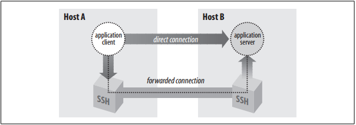


- Local port forwarding thường được sử dụng để tạo các tunnel nhằm giảm sử ảnh hưởng của firewall trong một số trường hợp. Hoặc để sử dụng với các giao diện web mà chỉ được phép truy cập từ localhost trên remote server.

### b) Cấu hình

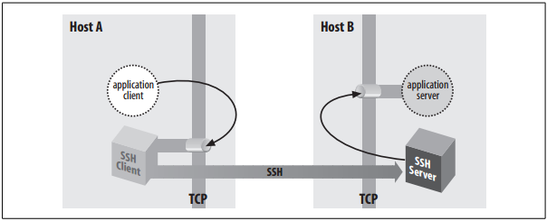

- Để thiết lập local port forwarding tới remote server, sử dụng tùy chọn –L khi thiết lập kết nối SSH và xác định được 3 thông tín sau: 

	-	Local port trên máy mình (SSH client) mà muốn tạo tunnel cho kết nối. (`your_port`) 

	-	Máy chủ mà bạn muốn remote host (SSH server) kết nối tới. (`site_or_IP_to_access`)

	-	Port của máy chủ đích mà bạn muốn remote host kết nối tới. (`site_port`)

	Các thông số trên phân cách bởi dấu “:”.

- Cú pháp như sau: 

	`ssh -L your_port:site_or_IP_to_access:site_port username@host`

### c) Ví dụ

- Ví dụ, để kết nối tới server đang chạy dịch vụ web apache trên port 80 có địa chỉ IP là 10.10.10.50, tạo đường hầm thông qua port 8080 của máy mình (SSH client) thông qua kết nối SSH từ máy mình (địa chỉ 172.16.100.2) tới máy SSH server có 2 interface (172.16.100.120 và 10.10.10.120)

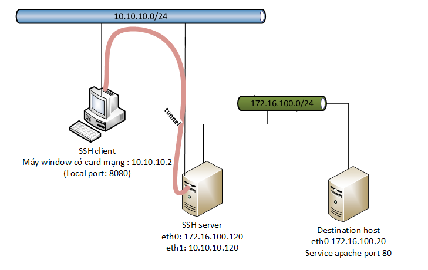


- Trình SSH client sử dụng cho máy window là Mobaxterm. Sử dụng cú pháp như sau: 

	`ssh -L 8080:172.16.100.20:80 root@10.10.10.120`

- Sau đó: gõ vào trình duyệt trên máy SSH client (Máy window) `localhost:8080` được kết quả truy cập tới website cài trên máy Destination host như sau: 

	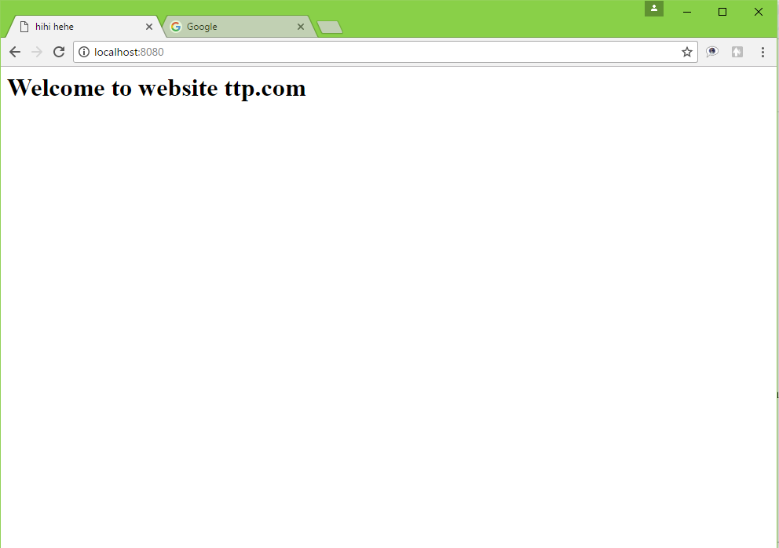


- ***Giải thích***: trình duyệt trên máy local gửi request tới chính nó (localhost) trên port 8080. Do được thiết lập tunnel nên các kết nối gửi tới local host port 8080 sẽ được forward thông qua kết nối SSH. Request được gửi đến SSH server và được gửi tới destination host do SSH server cùng dải mạng với SSH server và trả về kết quả lại cho SSH server, SSH server forward thông tin trả về cho SSH client thong qua keets nối SSH).

- Local port forwarding còn được dùng để mã hóa các kết nối TCP. Các Web server thường cài thêm SSH để mã hóa các kết nối tới nó một cách bảo mật. Khi đó, các trình duyệt truy cập thông qua địa chỉ: `localhost:<port>` 

	Ví dụ: thiết lập tunnel mã hóa các kết nối TCP từ máy SSH client tới máy chủ Apache trên cổng 80 và dịch vụ SSH server trên cổng 22 như sau:  

	`ssh -L 8000:localhost:80 root@192.168.56.102`

	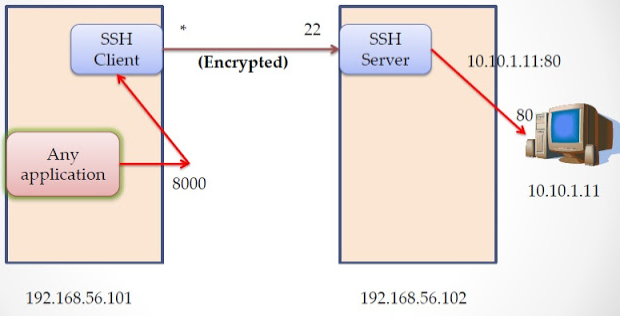

- Cấu hình trong Mobarxterm dùng giao diện như sau: Chọn Tunneling -> New SSH tunnel 

	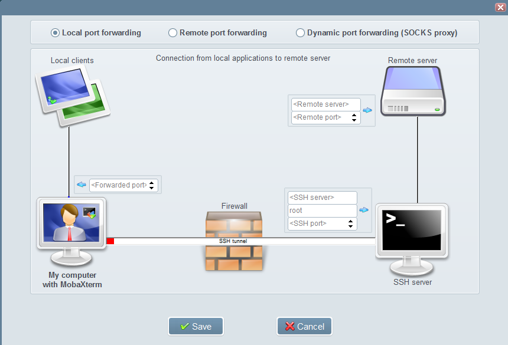

	Lựa chọn cấu hình phù hợp và click Save. Ví dụ như sau: 

	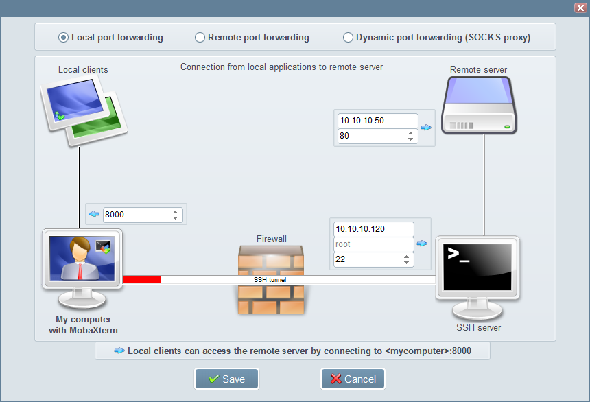

	Lưu lại cấu hình và click start để tunnel hoạt động.

<a name = '1.2'></a>
## 1.2.	Remote port forwarding

### a) Giới thiệu

- Trong remote tunnel, kết nối SSH cho phép truyền các kết nối khác từ remote server (SSH server) về máy local (SSH client) của mình.điều này cho phép một remote host có thể truy cập vào một host trên mạng cục bộ thông qua máy local của mình. 

- Remote port forwarding cho phép truy cập và một mạng nội bộ mà bị chặn các kết nối từ bên ngoài vào. Nếu firewall cho phép các kết nối ra ngoài mạng, nó sẽ cho phép bạn kết nối ra ngoài tới một remote host và các lưu lượng trong tunnel từ máy đó đến các máy trong mạng nội bộ. 

### b) Cấu hình

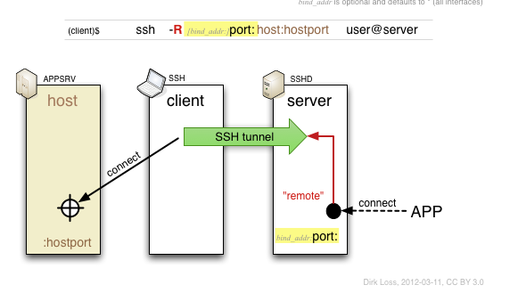

- Để thiết lập đường hầm tới máy remote server, sử dụng tùy chọn –R và cần ba thông số sau: 

	-	Port trên remote host có thể tạo tunnel (`remote_port`)

	-	Host mà bạn muốn máy bạn truy cập tới. (`site_or_IP_to_access`)

	-	Port chạy dịch vụ của host đích. (`site_port`)

- Cú pháp câu lệnh: 

	`ssh -R remote_port:site_or_IP_to_access:site_port username@host`

	Ví dụ: 
	
	`ssh -R 8080:localhost:80 root@10.10.10.120`

- Cấu hình trên cho phép bất kì ai có kết nối tới remote server ( SSH server : 10.10.10.120) kết nối tới port 8080 trên remote server. Két nối này sẽ được tạo đường hầm tunnel dẫn tới máy local của mình (SSH client) và tạo kết nối tới port 80. Để truy cập vào bất kì host nào có cùng dải mạng với SSH client có thể thay địa chỉ IP và địa chỉ port dịch vụ tương ứng.

	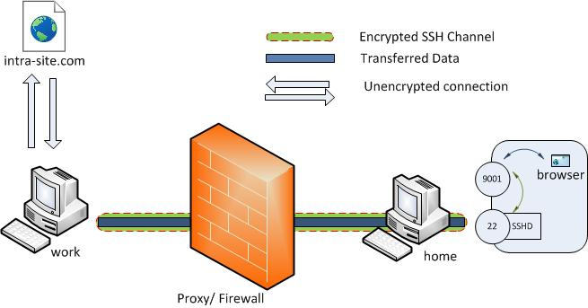

### c) Ví dụ

- Ví dụ sau thực hiện cấu hình cho phép các máy từ mạng bên ngoài (External network) có thể truy cập được vào dịch vụ webserver đang chạy trong một host trong mạng Internal network:

	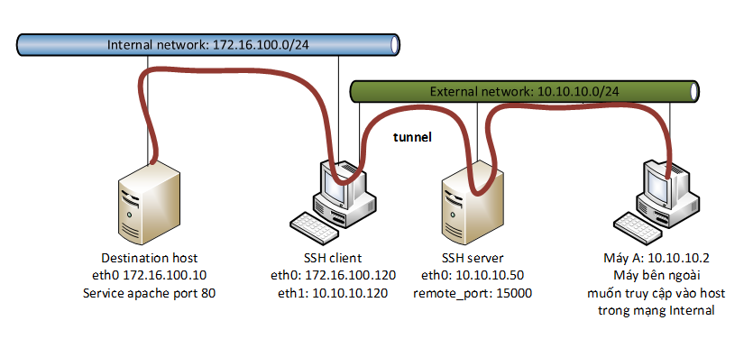

- Tại SSH client:

	`ssh -R 15000:172.16.100.10:80 root@10.10.10.50`

- Trên trình duyệt máy A gõ địa chỉ vào thanh địa chỉ được kết quả truy cập vào máy Destination host như sau: 

	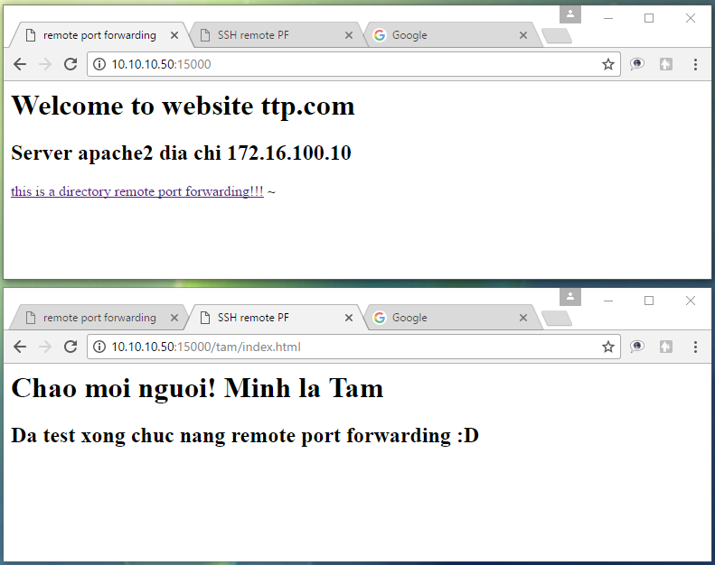

- Mặc định, SSH chỉ cho phép remote port forwarding các kết nối từ server SSH host. Tuy nhiên, sử dụng cấu hình GatewayPorts trong file cấu hình sshd_config trên SSH server để cho phép các kết nối từ các host mà được  phép truy cập vào server (máy A) có thể được kết nối tới host trong mạng Internal. 

	```
	GatewayPorts no 	#nếu không cho phép các kết nối ngoài SSH server vào tunnel
	GatewayPorts yes 	# nếu cho phép các kết nối như từ máy A vào tunnel
	```
- Hoặc chỉ cho phép một số host ngoài SSH server host được kết nối tới tunnel: 

	`GatewayPorts <clientspecified_IP>`

- Khi đó, chỉ các host có địa chỉ IP được xác định trong cấu hình trên được phép truy cập thông qua tunnel. Cú pháp sử dụng ssh như sau:

	`ssh -R 10.10.10.2:15000:172.16.100.10:80 root@10.10.10.50`

	Chỉ máy A (10.10.10.2) được phép kết nối tới destination host thông qua port 15000 trên SSH server (10.10.10.50)

- Cấu hình remote port forwarding trên Mobaxterm với giao diện đồ họa: 

	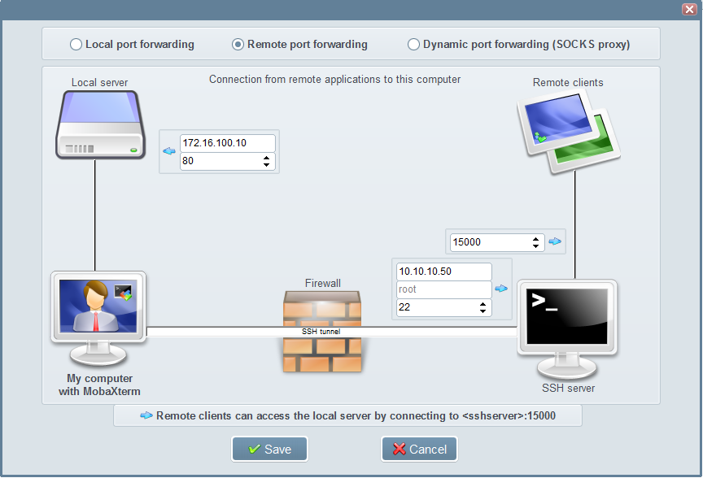

<a name = '1.3'></a>
## 1.3.	Dynamic port forwarding

### a) Giới thiệu

- **Dynamic port forwarding** cho phép thiết lập tunnel mà cho phép máy local nội bộ kết nối với các máy bên ngoài thông qua remote host. Dynamic tunnel thực hiện việc này bằng cách đơn giản là thông qua một local port. Một ứng dụng có thể sử dụng lợi ích của port này cho việc tạo tunnel phải liên kết sử dụng giao thức SOCKS để các gói tin có thể chuyển hướng chính xác ra ngoài của tunnel.

- Các lưu lượng thông qua local port được gửi tới remote host. Từ đây, giao thức SOCKS sẽ được thiết lập để kết nối tới các host đích mà remote host có thể kết nối được. Thiết lập này cho phép các ứng dụng có khả năng dùng SOCKS kết nối tới các host đích thông qua remote server, mà không cần tạo nhiều tunnel. 

- ***Phân biệt giữa local port forwarding và Dynamic port forwarding***: 
	-	Với local port forwarding: sử dụng tùy chọn `–L`, các lưu lượng từ một port local sang SSH server, và được SSH server forward tới một dịch vụ chạy trên một port đích duy nhất của host đích trong cùng một tunnel.

	-	Với dynamic port forwarding: sử dụng tùy chọn `–D`, SSH hoạt động như một proxy server, và do đó nó có thể làm việc cùng lúc với nhiều kết nối tới nhiều port đích (ví dụ trình duyệt được cấu hình để sử dụng một SOCKS proxy có thể truy cập http, https, ftp, .. và nhiều giao thức tương tự). Và như các proxy server khác, nó sẽ chuyển lưu lượng tới các địa chỉ host đích chỉ thông qua 1 tunnel duy nhất.

	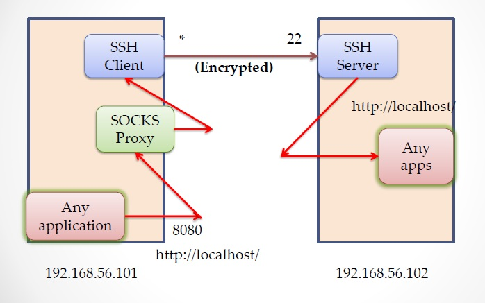

	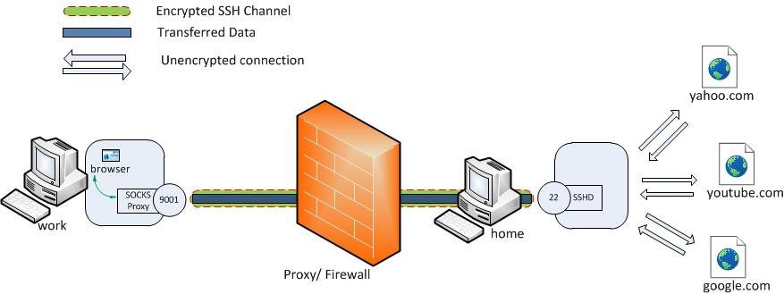

### b) Cấu hình

- Để thiết lập dynamic port forwarding, sử dụng tùy chọn `–D` với local port mà mình muốn thiết lập tunnel. Sử dụng tùy chọn `–f` để SSH làm việc trong chế độ nền trước khi xử lý và sử dụng tùy chọn `–N` để SSH client không mở một shell hoặc xử lý các chương trình trên remote side. 

- Cấu hình trên SSH client: 

	`ssh -fN -D <local_port> <username>@<remote_host>`

- Thông thường, sử dụng local port là 1080 là port chuẩn của SOCKS. Bạn có thể sử dụng bất kì port nào, nhưng một số chương trình chỉ làm việc khi bạn sử dụng port 1080 cho SOCKS proxy.

- Tiếp theo cấu hình trên trình duyệt để sử dụng proxy vừa tạo trên (giả sử dùng firefox)

	-	Chọn  Edit -> Preferences -> Advanced -> Network -> Connection -> Settings...

	-	Click  "Manual proxy configuration"

	-	Đảm bào  "Use this proxy server for all protocols"  đã xóa sạch.

	-	Xóa hết các thông tin cấu hình cho  "HTTP Proxy", "SSL Proxy", "FTP Proxy", and "Gopher Proxy"  nếu có.

	-	Điền "127.0.0.1" cho  "SOCKS Host"

	-	Điền địa chỉ port  "1080" (hoặc bất kì port nào mà bạn muốn sử dụng) vào “Port”.

	SOCKS proxy sẽ đóng lại nếu đóng lại phiên kết nối SSH. Và firefox lại làm việc trờ lại bình thường không dùng proxy đó nữa. 

### c) Ví dụ: 

- Mô hình: Tất cả các thiết bị đều sử dụng HĐH Ubuntu: Ubuntu server (US) và Ubuntu desktop (UD)

	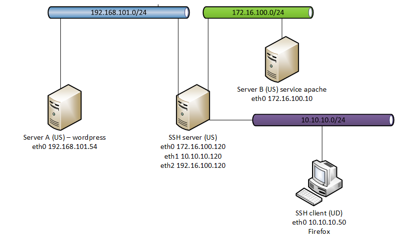

- Thực hiện cấu hình trên SSH client như sau: Gõ trên terminal: 

	`ssh -fN -D 10800 root@10.10.10.120`

- Mở trình duyệt firefox trên SSH client cấu hình SOCKS proxy như sau: 

	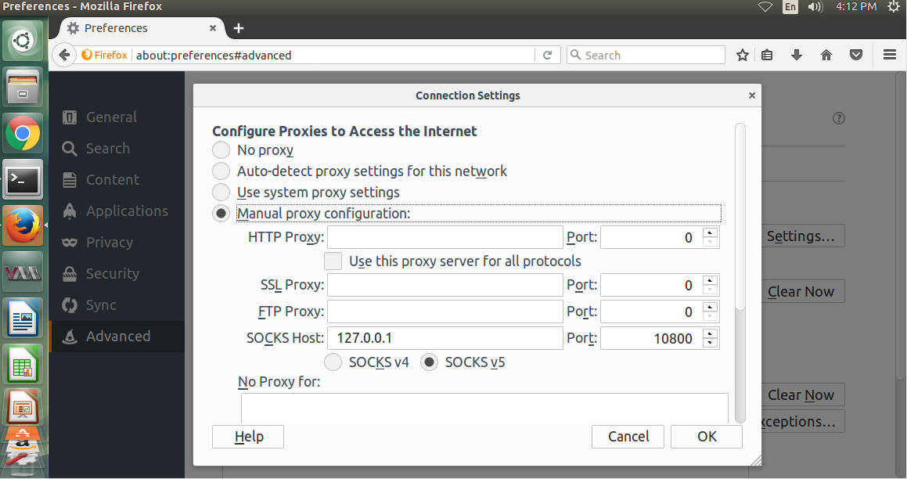

- Kiểm tra lại: gõ địa chỉ server A và server B được kết quả như sau: 

	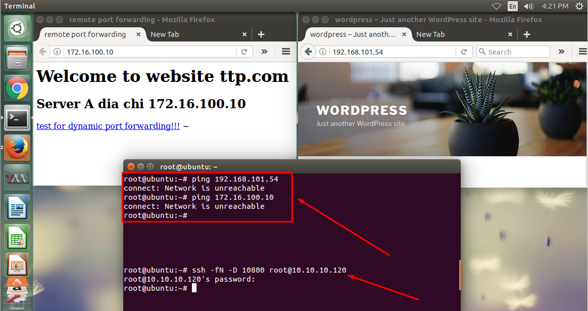

<a name = '1.4'></a>
## 1.4.	Multi-hop SSH port forwarding

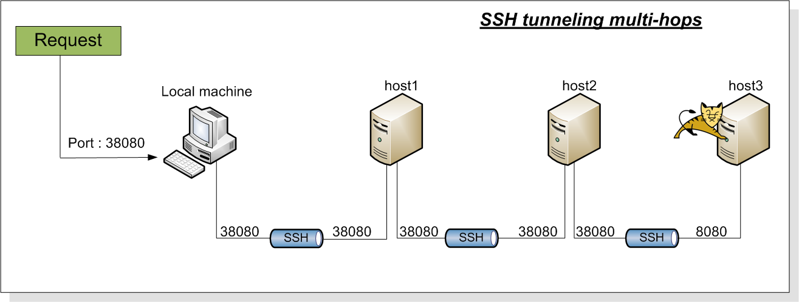

Tham khảo thêm tại đây: http://ufasoli.blogspot.com/2013/11/multi-hop-ssh-tunnel-howto-creating-ssh.html

<a name = '2'></a>
# 2.	X11 forwarding

<a name = '2.1'></a>
## 2.1. Giới thiệu

- Hệ thống X Window, hoặc X11 hay X, là hệ thống hiển thị giao diện được sử dụng rộng rãi cho các máy Unix hiện nay. Giống như SSH, S cũng có các máy client và các máy server. 

- X client là các chương trình ứng dụng có hiển thị window, như là mô phỏng các thiết bị đầu cuối, các chương trình vẽ hình (paint Programs), đồng hồ giao diện, v.v…

- Một X server có cơ chế hiển thị các tiến trình và giao diện của ứng dụng mà X client request, kết nối thông qua giao thức mạng gọi là X protocol. Thông thường, một X server có thể đáp ứng nhiều X client. 

- Mặc dù các X client có thể liên lạc với remote X server, nhưng các kết nối này không an toàn. Tất cả những tương tác giữa X client và server, như các thao tác bàn phím và hiển thị các đoạn text có thể dễ dàng bị theo dõi bằng network snooping bởi vì kết nối không được mã hóa. Thêm nữa, môi trường X sử dụng các phương pháp xác thực nguyên thủy nên một kẻ tấn công có hiểu biết có thể kết nối tới mà hình của bạn, theo dõi các thao tác bàn phím và điều khiển được các chương trình mà bạn đang chạy. 

	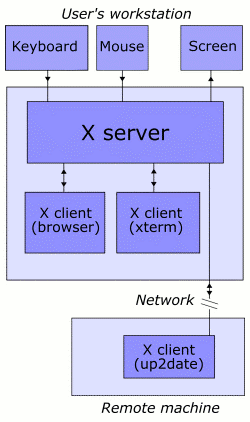

	=> SSH là giải pháp cho vấn đề này. Một kết nối giao thức X có thể được định tuyến trong kết nối SSH cung cấp cơ chế bảo mật và xác thực mạnh mẽ. Tình năng này gọi là X forwarding. 

- X forwarding làm việc như sau:  

	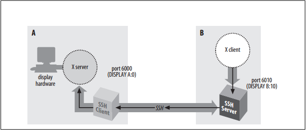

	- SSH client request X forwarding khi kết nối tới một SSH server (giả sử X forwarding được kích hoạt trên client). Nếu server cho phép X forwarding trong kết nối này, quá trình xử lý diễn ra như bình thường, nhưng server thực hiện một số thao tác đặc biệt sau đó. Để xử lý phiên làm việc đó, nó sẽ thiết lập nó như là một proxy X server đang chạy trên máy remote và cài đặt môi trường hiển thị trong remote shell trỏ tới màn hình hiển thị X proxy. Khi đó proxy sẽ hành động như là một X server thực sự, và lần lượt chỉ thị cho SSH client cư xử như một proxy X client, kết nối tới X server trên máy local của bạn. SSH client và server cùng vượt qua giao thức X protocol thông qua SSh giữa 2 phiên X, và chương trình X client.

	- X forwarding có thể giải quyết vấn đề với firewall, miễn là firewall cho phép các kết nối SSH đi qua. Nếu một firewall ở giữa máy local của bạn và máy remote, bạn có thể chạy một X client trên máy remote, X forwarding chuyển tiếp các kết nối X thông qua cổng SSH trên máy local. 

<a name = '2.2'></a>
## 2.2.	Cấu hình sử dụng X forwarding

- X forwarding được bật ở chế độ mặc định. Không giống như port forwrding thông thường, phải yêu cầu bạn xác định số cổng, X forwarding chỉ là chức năng giống kiểu chuyển mạch. Trong file cấu hình SSH client (`/etc/ssh/ssh_config` hoặc `~/ssh/config`, sử dụng cấu hình `ForwardX11` với giá trị `yes` (mặc định là kích hoạt) hoặc `no` (để vô hiệu).

	`ForwardX11 yes`

- Các giao thức X window không được thiết kế để bảo mật. Thông thường, một ứng dụng được truy cập tới một X display. Một X client gây hại có thể dễ dàng được được tất cả các thao tác bàn phím đầu vào, thấy tất cả nội dung trên màn hình, thêm hoặc xác định các thao tác bàn phím, vv. Đây là lý do mà X forwarding rủi do và nên thường bật chỉ khi nào bạn cần, và chỉ cho các host mà bạn tin tưởng. 

- Tính năng mở rộng bảo mật của giao thức X window cho phép phân chia X client thành các nhóm “trusted” và “untrusted”. Các chương trình như X Window Manager phải được tin tưởng (trusted), vì chúng phải vận dụng các window của các ứng dụng khác và duy thì thực hiện các thao tác global trên màn hình. Các chương trình khác có thể untrusted, hạn chế một số truy cập để hiển thị và ít hơn cơ hội để gây hại.

- Hoặc có thể sử dụng tính năng X11 forwarding thông qua dòng lệnh như sau đây. 

- Để sử dụng tính năng X11 forwarding thông qua SSH, cần 3 điều sau: 

	1) Client phải được thiết lập để forward X11: 

		- Trên máy SSH client kết nối tới server, đảm bảo rằng SSH cho phép X11 forwarding bằng cách sử dụng câu lệnh: 

			`$ ssh –X <username>@< remote-server > `

		Hoặc

			`$ ssh -o ForwardX11=yes <username>@<remote-server>`

		Hoặc thiết lập trong file config của SSH client (`~/.ssh/config` hoặc `/etc/ssh/ssh_config`) 

			```
			ForwardX11 yes
			ForwardX11Trusted yes		#hoặc ForwardX11Untrusted yes
			```

	2) Server phải được thiết lập cho phép X11 forwarding.

		- Thiết lập cấu hình trong file `/etc/ssh/sshd_config` như sau: 
		
			```
			X11Forwarding yes
			X11DisplayOffset 10
			```

	3) Server phải được thiết lập xác thực X11.
		
		- Để đảm bảo server đã được thiết lập cơ chế xác thực xauth: 
			
			```
			$ which xauth
			/user/bin/xauth
			```
- Ví dụ: sử dụng trình duyệt firefox được cài đặt trên máy Ubuntu server thông qua trình SSH client Mobaxterm như sau: 

	- Máy ubuntu cài đặt firefox: 
	
		`$ sudo apt-get install firefox –y`
	
	- Trên SSH client, cấu hình sử dụng cho phép X11 forwarding:
	
		`[TTP.TTP] ➤ ssh  root@10.10.10.10 firefox`
	
	- Hoặc sau khi ssh vào server, có thể gõ lệnh gọi chương trình firefox:

		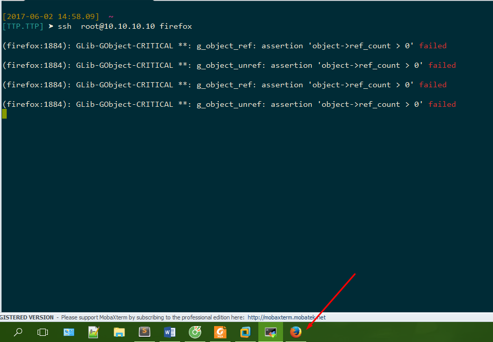

		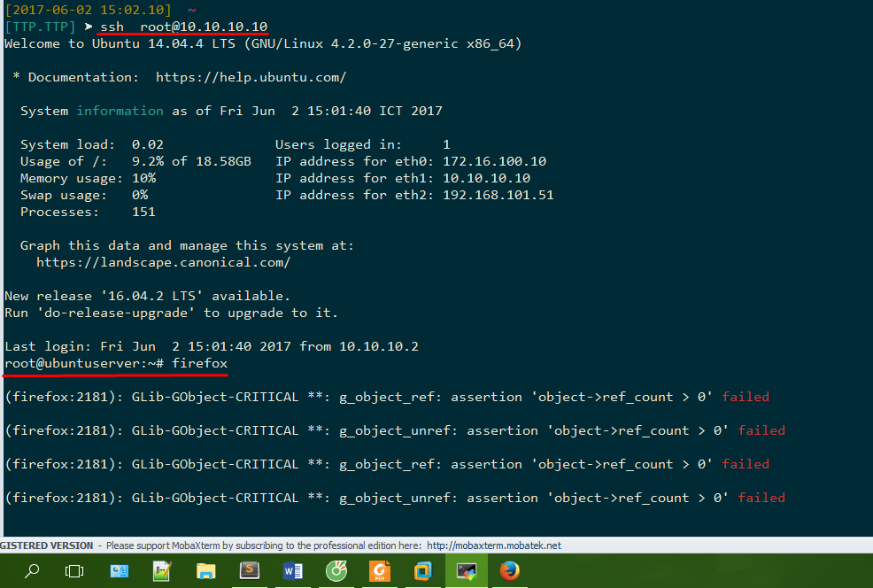

- Kết quả, trình duyệt firefox sẽ hiển thị trên máy Client của bạn như sau:

	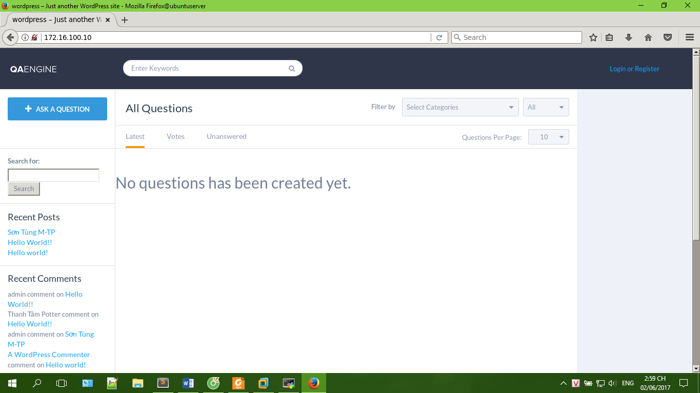

<a name = '3'></a>
# 3. Tham khảo

[1] Port forwarding: 

- https://help.ubuntu.com/community/SSH/OpenSSH/PortForwarding

- https://www.digitalocean.com/community/tutorials/ssh-essentials-working-with-ssh-servers-clients-and-keys#setting-up-ssh-tunnels

- http://www.ramkitech.com/2012/04/how-to-do-ssh-tunneling-port-forwarding.html

[2] Multi-hop port forwarding: http://ufasoli.blogspot.com/2013/11/multi-hop-ssh-tunnel-howto-creating-ssh.html

[3] X11 forwarding: https://unix.stackexchange.com/questions/12755/how-to-forward-x-over-ssh-to-run-graphics-applications-remotely 

