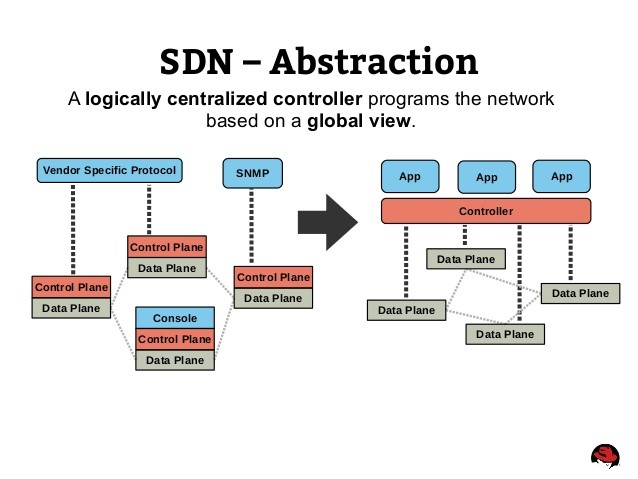
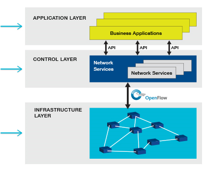

# Giới thiệu công nghệ SDN và giao thức OpenFlow

- Trong vài thập kỉ qua, đã có nhiều sự thay đổi lớn trong công nghệ mạng, điểu đó dẫn tới sự phát triển của Công nghệ **Mạng định nghĩa bằng phần mềm – Software Defined Networking** (***SDN***). Sự phát triển theo cấp này, cùng với những tiến bộ khá của công nghệ trung tâm dữ liệu, sẽ tạo nền tảng cơ bản cần thiết để hỗ trợ cho các cơ sở hạ tầng ngày nay.

- Các lớp thấp hơn đã phát triển từ chuyển mạch phân chia theo thời gian (Time Division Multiplexing – TDM) chậm chạp tới mạng cáp quang và mạng Ethernet đồng tốc độ cao trên mạng diện rộng (Wire Area Netwok – WAN). Và từ mạng Ethernet cáp đồng trục dày và Token Ring tới cáp xoắn đôi UTP và cáp quang hỗ trợ truyền song công chuyên dụng cho tốc độ truyền từ 1, 10 lên tới 100 Gigabit Ethernet trong mạng cục bộ LAN (Local Area Networks)

- Ở các lớp cao hơn, có giao thức Ipv6 và làn sóng các giao thức khác, như OSPF (Open Shortest Path First), STP (Spanning Tree Protocol) và BGP (MP-BGP), để quản lý các yêu cầu thay đổi của các cơ sở hạ tầng doanh nghiệp có mức độ kết nối mạng cao và các thiết bị đầu cuối.

- Khi được cấu hình, những công nghệ này đáp ứng được các yêu cầu dịch vụ mạng luôn thay đổi và hoạt động rất tốt. 

- Khi những công nghệ này đã hoạt động tốt trên nền tảng mạng hiện nay, tất cả yêu cầu một số lượng lớn cấu hình trên các node, bao gồm cả khả năng tính toán cao để vận hành và quản lý các chức năng, thậm chí còn tăng thêm chi phí cho những mạng ngày càng lớn thêm.

- Trong kiến trúc mạng viễn thông, có hai thành phần hoạt động trong các thiết bị mạng – một thành phần điều khiển control plane xác định lưu lượng truy cập được gửi đi và một thành phần điều khiển dữ liệu data plane chuyển tiếp lưu lượng dữ liệu dựa trên thông tin control plane cho nó biết và thực hiện.

- Chức năng lớp điểu khiển control plane của thiết bị bao gồm các tiến trình xử lý như đưa ra quyết định định tuyến khung của STP và các quyết định định tuyến gói tin bởi BGP và OSPF. Đồng thời bao gồm nhiều việc khác như kiểm soát bộ đệm và hàng đợi cũng như phân tách lưu lượng truy cập tới các công nghệ như VPN, Vlan, VRF và MPLS. Các hệ thống mạng ngày nay, tất cả các cấu hình và quyết định thường nằm ở tự chính các thiết bị mạng đó (nội bộ). Khi các công nghệ khác nhau thực hiện công việc của chúng, thiết bị có nhiệm vụ thực hiện quá trình chuyển mạch và/ hoặc định tuyến lưu lượng dựa trên những quyết định được đưa ra, chuyển động này của lưu lượng xảy ra ở lớp dữ liệu – data plane.

> => Công nghệ mạng định nghĩa bằng phầm mềm SDN là một giải pháp cho trung tâm dữ liệu đang phát triển để chuyển hầu hết sự phức tạp trong quản lý cục bộ lên một bộ tập trung, thiết bị điều khiển hoặc các thiết bị. Với SDN, hai thành phần trên được tách hẳn nhau ra: Data plane (data forwarding plane – thành phần chuyển tiếp dữ liệu) thuộc về phần cứng mạng (nằm ở từng thiết bị vật lý); nhưng control plane (hay controller – thành phần điều khiển) mà thực hiện các quyết định về lưu lượng giờ sẽ được thực thi thông qua phần mềm nằm ở phía các bộ điểu khiển tập trung. Việc tách này làm mạng có thể hoạt động một cách ảo hóa bởi vì bạn không còn phải thực hiện các lệnh hoặc kiểm soát các rules trên thiết bị phần cứng nữa.

- SDN là một sản phẩm mã nguồn mở. Bởi vì SDN tuân thủ các chuẩn mở, về mặt lý thuyết có thể hoạt động với bất kỳ phần cứng mạng nào của nhà cung cấp. Điều này cho phép các tổ chức có khả năng tránh  việc nhà cung cấp cứng nhắc trong một loạt sản phẩm mạng. Đồng thời cũng giúp tập trung sự quản lý trong mạng, giúp người quản trị thực hiện linh hoạt và đơn giản hóa nhiệm vụ kết nối đến các đám mây, các ứng dụng, và các thiết bị khác nhau. Và nó cho phép người quản trị mạng sử dụng phần mềm cho nhiều công việc họ thường làm bằng tay.

    

- SDN cho phép chức năng lớp điều khiển được sao chép và / hoặc chuyển đến bộ điểu khiển tập trung, bộ điều khiển này – là phần mềm trong mạng định nghĩa bằng phần mềm – có trách nhiệm tạo các quyết định ban đầu về cách mà lưu lượng được chuyển mạch hoặc định tuyến. Hành vi này sau đó được gửi tới cho thiết bị lớp data plane.

- OpenFlow là giao thức giao diện chính xử lý truyền thông giữa các thiết bị lớp điều khiển và lớp dữ liệu ( controller và switch) và định nghĩa cách mà một controller và thiết bị sẽ truyền thông với nhau để đảm bảo rằng luồng lưu lượng được chuyển mạch/ định tuyến và/hoặc điểu khiển như mong muốn. 

- Giao thức chuyển mạch OpenFlow cung cấp một giao diện cho việc điều khiển kết nối và các luồng dữ liệu trong Software Defined Network (SDN). 

    

- OpenFlow là một giao thức mở rộng, cung cấp các cơ chế cho các lập trình viên SND định nghĩa thêm các thành phần giao thức ( như new match field, actions, port properties, ...) để giải quyết các công nghệ mạng mới và cách hoạt động. 

- Các bảng OpenFLow là các phương tiện để mô tả OpenFLow có thể điều khiển luồng đi, cho phép các nhà cung cấp switch và controller làm việc một cách độc lập để tạo ra các sản phẩm SDN có thể tương tác với nhau được.

- Có thể nói: OpenFlow đơn giản là một giao thức quản lý việc chuyển tiếp luồng gói tin giữa các bảng để được chiều đi gói tin theo ý muốn.

### Tham khảo

[1] http://www.tomsitpro.com/articles/sdn-openflow-implementation,2-660.html 

[2] https://www.opennetworking.org/projects/open-datapath/

