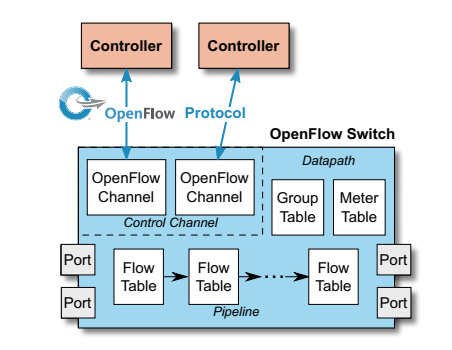

# Các thành phần chính trong OpenFLow switch 

Các thành phần chính của một OpenFlow switch:

- Một OpenFlow Logical Switch bao gồm một hoặc nhiều bảng **Flow table** và một nhóm **Group table**, thực hiện tìm kiếm và chuyển tiếp gói tin, và một hoặc nhiều kênh OpenFlow channel cho một controller bên ngoài. Switch truyền thông với controller và controller điều khiển switch thông qua giao thức chuyển mạch OpenFlow.

- Sử dụng giao thức chuyển mạch OpenFlow, controller có thể thêm, cập nhật và xóa các **flow entry** trong bảng flow table, cả chủ động phản ứng lại (như đáp trả lại các gói tin) hoặc chủ động làm thế. Mỗi flow table trong switch chứa tập các flow entry, mỗi flow entry bao gồm ***Match fields***, ***Counter*** và tập các ***Intructions*** để áp dụng lên các gói tin match với flow entry đó.

- Việc so sánh bắt đầu từ flow table đầu tiên và có thể tiếp tục tới các flow table khác của **pipeline** (đường ống). Các flow entry match các gói tin theo thứ tự ưu tiên, với matching entry đầu tiên ở mỗi bảng được sử dụng. Nếu matching entry được tìm thấy, các hướng dẫn kết nối với flow entry cụ thể được xử lý. Nếu không match, việc chuyển ra ngoài phụ thuộc vào cấu hình của table-miss flow entry: ví dụ, gói tin có thể được chuyển tiếp tới các controller thông qua kênh OpenFlow channel, bị drop, hoặc có thể tiếp tục tới bảng flow table tiếp theo. 

- Các intruction liên kết với mỗi flow entry có thể chứa các action hoặc các tiến trình sửa đổi. Các Action bao gồm trong intruction mô tả sự chuyển tiếp gói tin, sửa đổi gói tin và xử lý group table. Hướng dẫn xử lý đường ống pipeline cho phép các gói tin được gửi tới các bảng tiếp theo để xử lý tiếp và cho phép thông tin, dưới dạng metadata, được truyền thông giữa các bảng. Tiến trình xử lý đường ống kết thúc khi instructionn gán với flow entry phù hợp không xác định bảng tiếp theo, lúc này, gói tin thường được sửa và chuyển tiếp đi.

- Các flow entry có thể chuyển tiếp tới một **Port**. Thường là port vật lý, nhưng nó cũng có thể là port logic được định nghĩa bởi switch hoặc một port dự trữ được định nghĩa bởi OpenFlow. Port dự trữ có thể xác định các hoạt động chuyển tiếp cơ bản như gửi tới controller, flooding, hoặc chuyển tiếp không sử dụng phương thức của OpenFlow, xử lý như một switch thông thường, trong khi các port logic được switch định nghĩa có thể xác định liên kết giữa các nhóm kết hợp, tạo đường hầm tunnel hoặc giao diện loopback.

- Các **action** gán với flow entry có thể chuyển hướng trực tiếp các gói tin tới một nhóm,  thực hiện thêm các xử lý. Các nhóm đại diện cho một tập các action cho việc flooding, cúng như các chuyển tiếp phức tạp (ví dụ multipath, fast reroute, và link aggregation). Các nhóm cũng kích hoạt các flow entry để chuyển tiếp tới một node đơn (ví dụ IP chuyển tiếp tới next hop). 

- Bảng Group table chứa các group entry, mỗi group entry chứa một danh sách các tập action với phụ thuộc vào loại nhóm. Các action trong một hoặc nhiều tập action được áp dụng với các gói tin gửi tới nhóm.

## Tham khảo

***Switch Components*** - Openflow switch specification version 1.5.1 (trong thư mục [`refs`](../refs/))