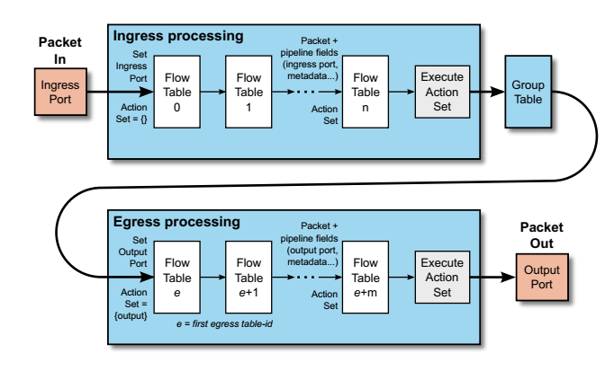
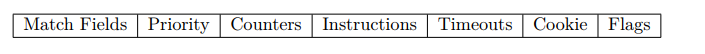
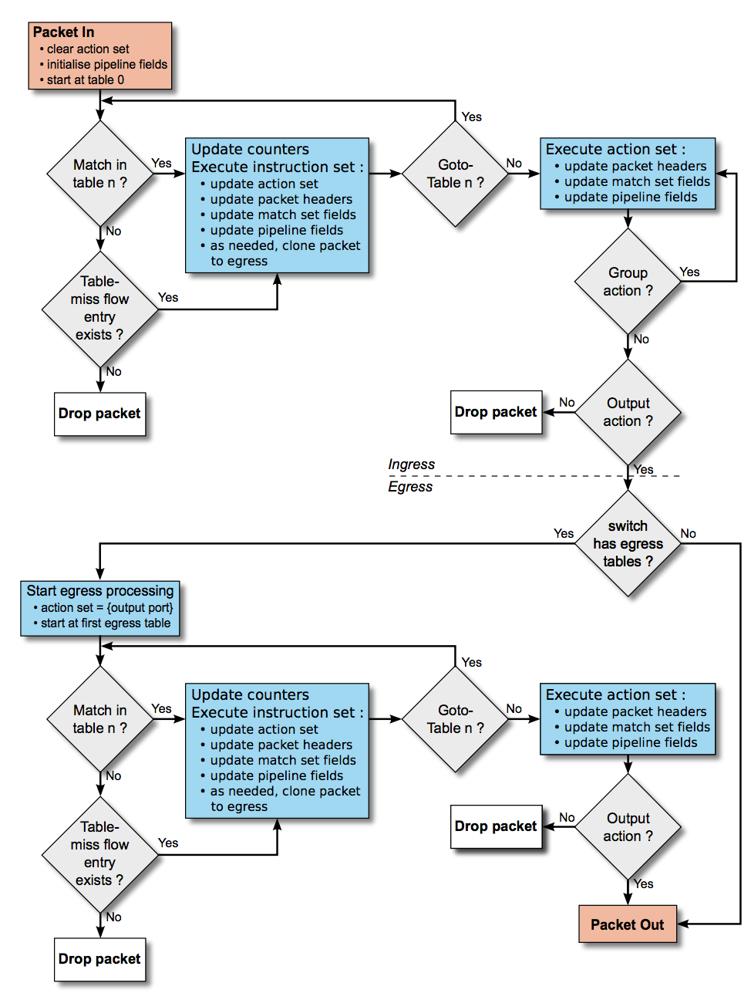

# OpenFlow tables

Mô tả các thành phần của flow table và group table, cùng với các cơ chế matching và xử lý action.

Luồng gói tin đươc xử lý trong pipeline:

## 1.	Pipeline processing – Quá trình xử lý trong pipeline

- Các switch hỗ trợ OpenFlow có 2 loại: ***OpenFLow-only*** và ***OpenFlow-hybrid***. Switch OpenFlow-only chỉ hoạt động theo OpenFlow, ở những switch loại này, tất cả gói tin được xử lý bởi OpenFlow pipeline, và không thể xử lý theo các khác.

- OpenFlow-hybrid hỗ trợ các hoạt động theo OpenFLow và chuyển mạch Ethernet thông thường, chuyển mạch lớp 2 truyền thống, cô lập VLAN, định tuyến L3. ACL và xử lý QoS. Những switch này nên cung cấp một cơ chế phân loại bên ngoài OpenFlow mà định tuyến lưu lượng hoặc tới OpenFlow pipeline hoặc chuyển mạch thông thường. Ví dụ, một switch có thể sử dụng VLAN tag hoặc cổng ra của gói tin để quyết định cách thức xử lý sử dụng pipeline hoặc cách khác, hoặc nó có thể chuyển tiếp tất cả gói tin tới OpenFlow pipeline. Một switch OpenFlow-hybrid có thể cho phép gói tin đi từ OpenFlow pipeline tới chuyển mạch thông thường thông qua các cổng reserved port như NORMAL hoặc FLOOD.

- **OpenFLow pipeline** trên mỗi switch OpenFlow chứa một hoặc nhiều bảng flow tables, mỗi flowtable chứa nhiều flow entry. Quá trình xử lý trong pipeline định nghĩa cách mà các gói tin tương tác với các flow table này. Một OpenFlow switch yêu cầu phải có ít nhất một ingress flow table, và có thể có thêm nhiều flow table tùy ý. OpenFlow switch với chỉ một flow table là có thể, trong trường hợp này xử lý trong pipeline là đơn giản nhất.

- Các flow table được đánh số để các gói tin đi qua, bắt đầu từ 0. Quá trình xử lý trong pipeline xảy ra 2 trạng thái: *ingress processing* và *egress processing*. Tất cả các table với số nhỏ hơn bảng flow đầu tiên ở egress phải được sử dụng trong các bagnr ingress, và không bảng nào với số cao hơn hoặc bằng với egress table đầu tiên có thể được sử dụng trong bảng ingress table.

- Quá trình xử lý trong pipeline ***luôn bắt đầu với xử lý ingress ở bảng flow table đầu tiên***, gói tin đầu tiên phải match với entry flow trong bảng flow table . Các ingress flow table khác có thể được sử dụng phụ thuộc vào đầu ra khi match của bảng đầu tiên. Nếu đầu ra của quá trình xử lý ingress là chuyển tiếp tới output port, switch OpenFlow có thể thực hiện tiến trình xử lý egress theo output port đó. Xử lý egress là tùy chọn, switch có thể không hỗ trợ bất kì bảng egress nào hoặc có thể không cấu hình sử dụng chúng. Nếu không có egress table nào, gói tin phải được xử lý bởi output port, và hầy hết là chuyển tiếp gói tin ra bên ngoài switch. Nếu có một egress table được cấu hình là bảng egress table đầu tiên, thì gói tin phải match với các flow entry trong bảng đó, và các bagnr egress còn lại có thể được sr dụng phụ thuộc vào đầu ra ở flow table.

- Khi được xử lý bởi flow table, gói tin được match với các flow entry để chọn ra flow entry phù hợp. Nếu một flow entry được tìm thấy, instruction thiết lập trong flow entry đó được xử lý. Những instruction này có thể chuyển hướng gói tin tới flow table khác, nơi mà quá trình xử lý lại được lặp lại. Một flow entry có thể chỉ chuyển hướng một gói tin tới một bảng flow table có số **lớn hơn** table của chính nó, hay nói cách khác là xử lý trong pipeline chỉ có chuyển tiếp chứ không có quay lại. Dĩ nhiên, các flow entry của bảng cuối cùng của pipeline có thể không có instruction Go-Table (tới bảng khác). Nếu flow entry match mà không chuyển hướng gói tin tới bảng khác, trạng thái hiện tại của pipeline sẽ dừng lại ở bảng này, gói tin được xử lý với action liên kết trong với nó và thường được chuyển tiếp đi.

- Nếu một gói tin không match với flow entry trong bảng, bảng sẽ bị bỏ qua. Hành động trên bảng này phụ thuộc vào cấu hình của bảng. Các instruction trong flow entry của bảng này có thể linh hoạt xác định cách xử lý các gói tin không match, tùy chọn hữu ích là drop gói tin, đưa tới bảng khác hoặc gửi tới controller thông qua kênh control channel thông qua gói tin `packet-in`.

- Trong các trường hợp gói tin không được xử lý đầy đủ bởi flow entry và xử lý pipeline ngừng lại mà không xử lý action cho gói tin hoặc gửi tới một bảng khác. Hoặc nếu không có action với gói tin không match với flow entry thì gói tin sẽ bị drop. Nếu TTL vẫn còn hiệu lực, gói tin có thể được gửi tới controller.

## 2.	Flow table và flow entry

Một bảng flow table gồm các flow entry:

Mỗi flow table gồm các cột sau:

- **Match field**: để so sánh với các gói tin. Trường này bao gồm thông tin về ingress port và các packet header, và có thể các trường pipeline field thêm vào như metadata chỉ định trong các bảng trước đó.

- **Priority**: Mức độ ưu tiên của flow entry.

- **Counters**: được cập nhật khi các gói tin được match.

- **Instructions**: điều chỉnh thiết lập action hoặc xử lý pipeline.

- **Timeouts**: số lượng thời gian giới hạn hoặc thời gian chờ trước khi flow bị vô hiệu bởi switch.

- **Cookie**: Dữ liệu không rõ ràng được chọn bởi switch. Có thể được sử dụng bởi controoler để lọc các flow entry ảnh howngr bởi các flow tĩnh, yêu cầu chỉnh sửa hoặc xóa flow. Không sử dụng khi xử lý các gói tin.

- **Flags**: Các flag thay đổi cách mà các flow entry được quản lý, ví dụ: cờ OFPFF_SEND_FLOW_REM tự động loại bỏ các bản tin bị xóa cho flow entry đó.

Một entry flow trong bảng được xác định bởi trường match fields và priority của nó: 2 trường này kết hợp tạo nên sự duy nhất cho flow entry trong một bảng. Flow không khớp (tất cả các trường đều không khớp) và có độ ưu tiên bằng 0 được gọi là flow entry table-miss.
Instruction có thể chứa các action được thực hiện trên gói tin ở một vài điểm của của pipeline. Action `set-field` có thể chỉ định viết một số trường header. 

## 3.	Matching

Trên mội gói tin nhận được, OpenFlow switch thực hiện các chức năng như hình: 

