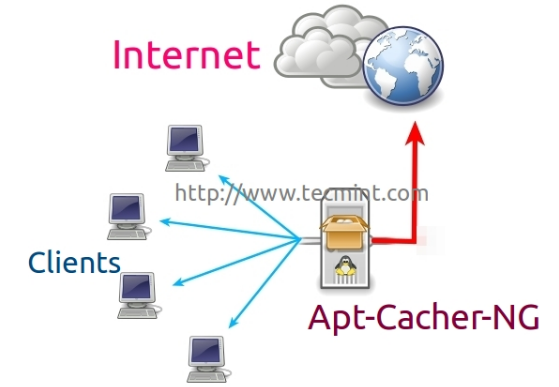
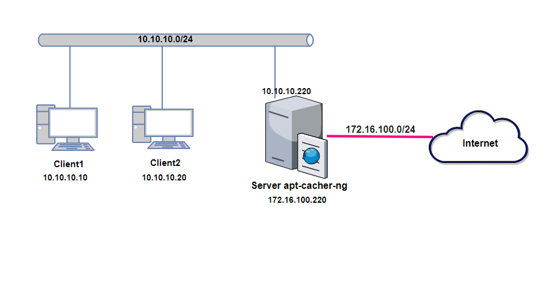
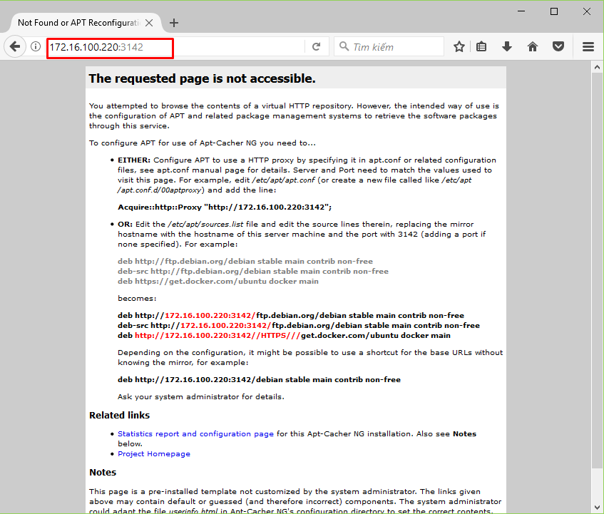
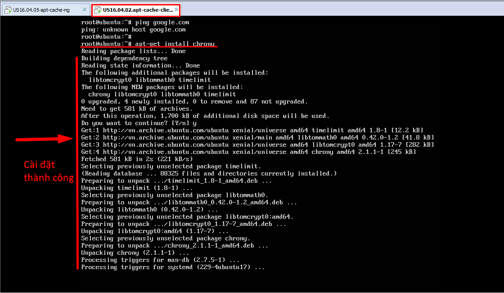
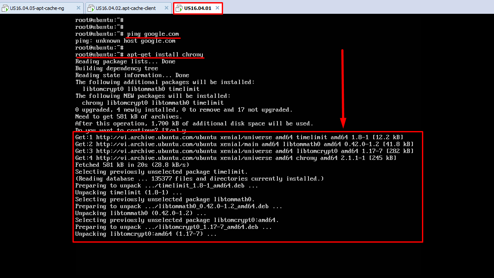
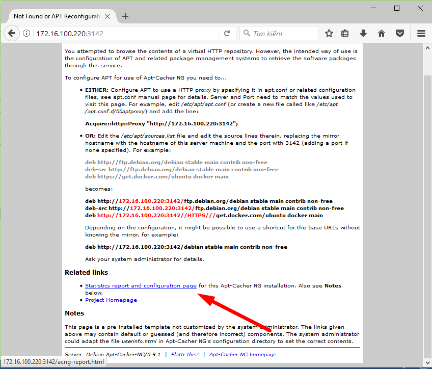
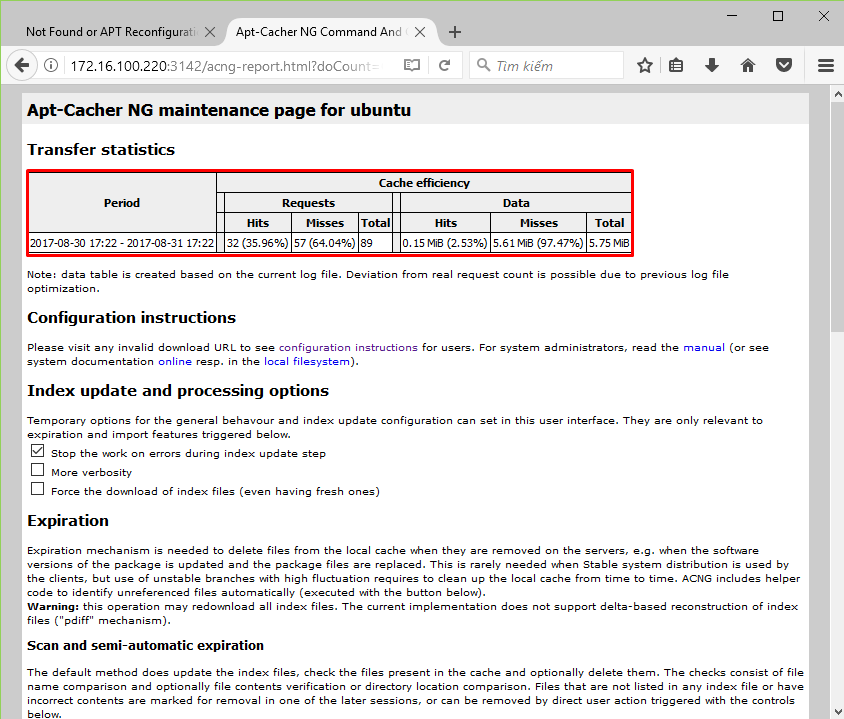

# TÌM HIỂU APT-CACHER-NG

### ***Mục lục***


[1.	Tổng quan apt-cacher-ng](#1)

[2.	Lab tính năng của apt-cache-ng](#2)

- [2.1.	Mô hình bài lab](#2.1)

- [2.2.	Cài đặt và cấu hình](#2.2)

	- [2.2.1.	Cấu hình server](#2.2.1)

	- [2.2.2.	Cấu hình trên Client](#2.2.2)

[2.3.	Kiểm tra lại hoạt động](#2.3)

[3.	Tham khảo](#3)

---

<a name = '1'></a>
# 1.	Tổng quan apt-cacher-ng

- Apt-Cacher-NG là một máy chủ proxy (hoặc apt proxy) cho các bản phân phối của Debian như Ubuntu, Kubuntu, Xubuntu, Edubuntu, Linux Mint, vv, được sử dụng để lưu trữ các gói đã tải xuống cục bộ trên máy chủ của bạn.   
- Hoạt động theo mô hình Client-Server.

	

- Khi bạn có một mô hình mạng nhỏ với một vài máy tính và muốn cài đặt cũng như cập nhật các gói phần mềm trên mỗi máy một cách thủ công, thì đó sẽ là một công việc khó và rất mất thời gian, đây là lý do để cấu hình một máy chủ **apt-cacher-ng** trên hệ thống, bởi vì nó sẽ cache lại tất cả những gói phần mềm đã download từ Internet trên apt-cache server và khi các máy trong mạng local download các phần mềm thay vì download từ các server chủ của Debian và Ubuntu thì nó sẽ download từ máy chủ server apt-cache như một proxy. Điều này sẽ làm tiết kiệm băng thông và giảm thiểu thời gian download đáng kể. 

- Với apt-cacher-ng, bạn có thể theo dõi sự update và download các gói phần mềm được thiết lập, và hỗ trợ sử dụng trong cả các môi trường không phải Debian.   
- Các tính năng:  
	- Tiết kiệm thời gian  
	- Tiết kiệm băng thông  
	- Có thể tích hợp các dữ liệu ISO image hoặc DVD để apt-cacher-ng sử dụng cho tùy chọn import.
  
<a name = '2'></a>
# 2.	Lab tính năng của apt-cache-ng

<a name = '2.1'></a>
## 2.1.	Mô hình bài lab và chuẩn bị



Chuẩn bị:
- Server apt-cache-ng:
	-	Apt Cache Server OS   : Ubuntu 16.04 LTS Server
	-	Apt Cache IP Address  : `ens33`: 10.10.10.220/24  và `ens34`: 172.16.100.220/24 (dải NAT ra Internet)
	-	Default Port	      : 3142
- Client:
	-	Client OS             : Ubuntu 16.04 LTS
	-	Client IP Address     : `ens3` 10.10.10.10/24

<a name = '2.2'></a>
## 2.2.	Cài đặt và cấu hình

<a name = '2.2.1'></a>
### 2.2.1.	Cấu hình server 

- **Bước 1**: Cài đặt apt-cacher-ng

	`apt-get install apt-cacher-ng -y`

- **Bước 2**: Cấu hình

	Sau khi đã cài đặt, `apt-cacher-ng` sẽ tự động được khởi động. Mở file cấu hình của apt-cacher-ng (`/etc/apt-cacher-ng/acng.conf`) và chỉnh sửa các nội dung như sau:  

	Bỏ comment các nội dung sau:

	- Cấu hình thư mục chứa các tất cả các gói phần mềm dpkg được cài đặt và cập nhật:

		`CacheDir: /var/cache/apt-cacher-ng`

	- Kích hoạt chế độ ghi lại log để tiện theo dõi sau này:  
		`LogDir: /var/log/apt-cacher-ng`

	- Cấu hình port của `apt-cacher-ng` (mặc định là 3142, có thể thay đổi được):  
		`Port:3142`

	- Cấu hình `BindAddress` để server lắng nghe các request từ client:   
		```
		# BindAddress: localhost 192.168.7.254 publicNameOnMainInterface
		BindAddress: 0.0.0.0
		```

	- Kích hoạt chế độ ghi lại report về lưu lượng và request qua `apt-cacher-ng` trên giao diện web (mặc định đã kích hoạt)  
		`ReportPage: acng-report.html`

	- Để chạy dịch vụ apt-cacher, cần kích hoạt pid file như sau:  
		`PidFile: /var/run/apt-cacher-ng/pid`

	- Khởi động lại dịch vụ apt-cacher: 
	
	```
	sudo /etc/init.d/apt-cacher-ng restart 
	# or
	sudo service apt-cacher-ng restart 
	```
- **Bước 3**: Kiểm tra lại trên trình duyệt ta được như sau:

	

<a name = '2.2.2'></a>
### 2.2.2.	Cấu hình trên Client

- Trên máy Client, tạo file `02proxy` trong thư mục `/etc/apt/apt.conf.d/` để client gửi các request tới proxy apt-cacher-ng server có nội dung như sau: 

	`Acquire::http { Proxy "http://10.10.10.220:3142"; };`

- Lưu lại là xong. Bây giờ, các máy client trong mạng LAN có thể cài đặt và cập nhật các gói phần mềm thông qua proxy apt-cacher-ng. 

<a name = '2.3'></a>
## 2.3.	Kiểm tra lại hoạt động

- Sau khi đã setup, các máy Client không có card nào có thể kết nối Internet. Nhưng khi tiến hành cài đặt các phần mềm hoặc update hệ thống vẫn thực hiện thành công: 

	

- Sau khi cài đặt trên Client 1, các gói phần mềm đã được lưu lại trong cache của apt-cacher-ng. Từ Client 2, ta thử cài đặt lại gói chrony ta được kết quả như sau:

	

	Khi đó, Client2 có thể download các gói phần mềm cài đặt chrony nhanh hơn, do các gói đó đã được cache lại trong apt-cacher-ng.

- Kiểm tra report trên giao diện trình duyệt ta thấy như sau:

	

	

=> Như vậy, mô hình apt-cacher-ng đã hoạt động đúng như lý thuyết tìm hiểu được. 

<a name = '3'></a>
# 3.	Tham khảo
[1] https://www.tecmint.com/apt-cache-server-in-ubuntu/

[2] https://www.unix-ag.uni-kl.de/~bloch/acng/html/index.html

[3] http://adminsonline.in/?p=64 
