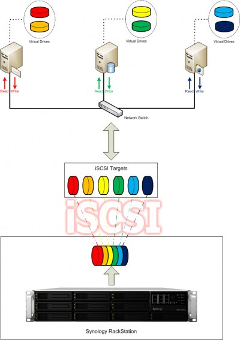
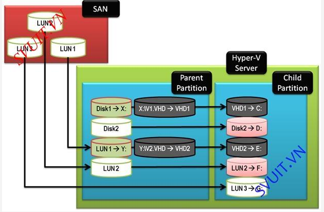
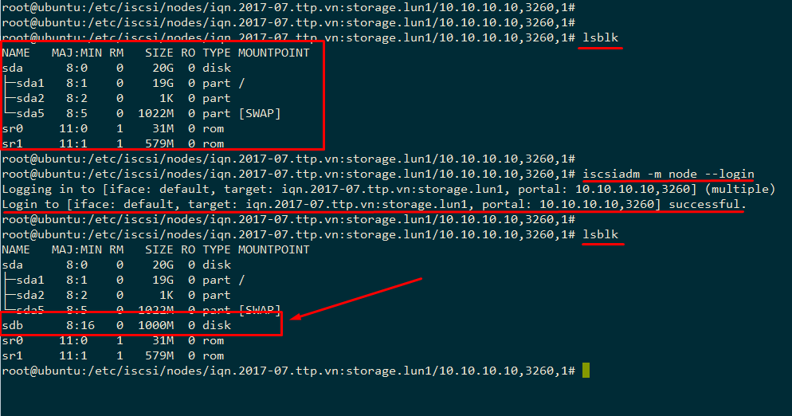

# TÌM HIỂU ISCSI

## ***Mục lục***

[1. SCSI là gì?](#1)

[2. iSCSI là gì?](#2)

[3. Cách thức hoạt động của iSCSI](#3)

[4. LAB sử dụng iSCSI](#4)

- [4.1. Chuẩn bị và mô hình lab.](#4.1)

- [4.2. Cài đặt và cấu hình iSCSI target.](#4.2)

- [4.3. Cài đặt và cấu hình iSCSI initiator](#4.3)

[5. Tham khảo](#5)

---

<a name = '1'></a>
# 1. SCSI là gì? 

- **SCSI** là viết tắt cho **Small Computer System Interface**.

- SCSI thực chất là 1 thẻ giao diện dùng để kết nối các thiết bị phần cứng trong và ngoài PC (Vi dụ: CD rom; ổ cứng v.v..). Tất nhiên tốc độ truyền dữ liệu của nó cũng nhanh hơn so với giao diện IDE (Thường dùng để nối ổ cứng với Mainboard). SCSI được dùng trong các máy chủ. Nhưng bây giờ đã có USB2.0 và IEEE là 2 giao diện đang phổ biến với tốc độ truyền dữ liệu rất cao và dễ dàng cài đặt hơn SCSI. Theo tôi nghĩ khi nói giao diện SCSI thì ý là phương thức kết nối giữa 1 phần cứng với PC, còn khi nói ổ SCSI nghĩa là cổng nối nằm trên phần cứng (vd: CD rom v.v..).

- Thiết bị (thường là lưu trữ) sử dụng giao diện SCSI này sẽ được gọi là "ổ SCSI", card PCI (còn gọi là SCSI controller) cho phép sử dụng giao diện này trên một máy tính (không có sẵn SCSI) được gọi là "card SCSI". SCSI có tốc độ nhanh hơn IDE tuy nhiên cách quản lý phức tạp hơn, đắt hơn và không được phổ biến bằng IDE. SCSI thường được sử dụng nhiều trong máy chủ.

- Ưu điểm của card SCSI là chạy độc lập với máy.

- Chuẩn SCSI có nhiêu tính năng tốt hơn chuẩn IDE. Nếu các máy server có thích hợp bộ điều khiển SCSI thì các ổ cứng SCSI, CD ROM SCSI sẽ được gán trực tiếp vào Mainboard máy. Còn nếu Mainboard máy Chủ chưa có chip điều khiển SCSI thì bạn phải mua card giao tiếp SCSI để gán vào main rời gắn các ổ đĩa CD ROM, CD ghi, HDD chuẩn SCSI lên đó. Chuẩn SCSI rất quan trọng tron công nghệ máy tính và rất đa dạng.

<a name = '2'></a>
# 2. iSCSI là gì?


- Trong hệ thống mạng máy tính, **iSCSI** (viết tắt của **internet Small Computer System Interface**) dựa trên giao thức mạng internet (IP) để kết nối các cơ sở dữ liệu.

- Nói một cách đơn giản nhất, iSCSI sẽ giúp tạo 1 ổ cứng Local trong máy tính của bạn với mọi chức năng y như 1 ổ cứng gắn trong máy tính vậy. Chỉ khác ở chỗ dung lượng thực tế nằm trên NAS và do NAS quản lý.

- Hiện nay, iSCSI đang dần chiếm một phần lớn trong hệ thống NAS và Server quản lý của các doanh nghiệp bởi chi phí lắp ráp vận hành rất rẻ so với mạng SAN Fiber Channel.

- Nếu như các doanh nghiệp lớn từ trước tới nay đều sử dụng Fiber Channel SAN để quản lý, lưu trữ với băng thông tối đa lên 4Gbps còn iSCSI qua giao thức mạng Internet chỉ được tối đa 1Gbps. Thì bây giờ, giới hạn về tốc độ đã được phá vỡ.

- Các hệ thống NAS như NAS Synology Rackstation chẳng hạn, với 4 cổng LAN Gigabits hỗ trợ Failover, Load Balancing, ngoài ra còn có khe gắn thêm 1 card PCI-Express 10Gbps cho tốc độ cao hơn cả mạng Fiber Channel (Max 8Gbps).

- iSCSI có rất nhiều ưu điểm nổi bật như:

	- Chi phí rẻ hơn nhiều so với Fiber Channel SAN

	- Tạo và quản lý được nhiều ổ cứng cho nhiều máy tính nội-ngoại mạng(VPN).

	- Gián tiếp mở rộng dung lượng lưu trữ cho các máy tính nội-ngoại mạng(VPN).

	- Cài VMware trên ổ cứng iSCSI hoặc cài phần mềm từ xa.

	- Hiển thị y hệt ổ cứng trong máy, thân thiện với người dùng phổ thông.

	- Bảo mật cao bằng mật khẩu.

	- Kết nối rất nhanh, không cần qua nhiều bước.

	- Thích hợp cho doanh nghiệp quản lý dữ liệu của máy nhân viên.

- Đa số các NAS Synology đều hỗ trợ iSCSI, như vậy bạn không cần phải sắm 1 dàn NAS khủng cho doanh nghiệp mới có thể sử dụng chức năng mạnh mẽ này.

- Minh họa cách hoạt động của iSCSI trên NAS Synology và các máy tính:

	

<a name = '3'></a>
# 3. Cách thức hoạt động của iSCSI

- Cách thức hoạt động:

	- Khi một người dùng hoặc một ứng dụng gửi một request yêu cầu truy xuất dữ liệu trong Storage.

	- Hệ thống sẽ tạo ra một số lệnh SCSI tương ứng với yêu cầu.

	- Sau đó đóng gói (Encapsulate) và mã hóa (Encrypt) và gửi đi trên đường Network.

	- Khi Server nhận được, nó sẽ tháo (De-Encapsulate) và giải mã (Decrypt) để cuối cùng nhận được các lệnh SCSI.

	- Các lệnh SCSI sẽ được đưa vào SCSI Controller để thực thi và xử lý theo yêu cầu.

	- Các ổ đĩa ISCSI được tạo ra từ các Server chạy các hệ điều hành như Windows/Linux.

- Hệ thống disk iSCSI:

	

- **LUN (Logical Unit Number)**: là một con số logic dùng để tập hợp các ổ đĩa chạy bằng các loại giao thức SCSI, iSCSI và Fibre Channel. LUN là nơi quản lý tập trung các các ổ đĩa trong hệ thống Storage Network (Storage Area Network – SAN). LUNS sẽ gắn cho iSCSI một con số logic và gọi là ***“Target”***.

- iSCSI gồm 2 thành phần **iSCSI Target** và **iSCSI Initiator**:

	

	- Khi một server hoặc một thiết bị nào đó muốn kết nối tới hệ thống iSCSI SAN, chúng sẽ dùng một software gọi là iSCSI Initiator để kết nối tới con số “Target” này. Và con số này sẽ quản lý kết nối giữa iSCSI Target và iSCSI Initiator.

	- Từ Windows Server 2008 trở về sau, Microsoft hỗ trợ tính năng tạo ra hệ thống lưu trữ iSCSI SAN và chúng được gọi là “iSCSI Targets Server”

	

<a name = '4'></a>
# 4. LAB sử dụng iSCSI

<a name = '4.1'></a>
## 4.1. Chuẩn bị và mô hình lab

- Mô hình: 

	


- Các máy iSCSI-target  và iSCSI-initiator cùng là Ubuntu server  14.04.


- Dải mạng các máy được cấu hình như trong mô hình trên.

<a name = '4.2'></a>
## 4.2. Cài đặt và cấu hình trên iSCSI target 

#### Cài đặt các gói phần mềm cho dịch vụ iSCSI target trên máy server target (10.10.10.10): 

```
sudo apt-get update -y
sudo apt-get install iscsitarget iscsitarget-source iscsitarget-dkms -y
```

#### Cấu hình:

- Tạo thư mục `/storage` dùng là nơi đại diện chứa các image (được hiểu như một kiểu ổ cứng ảo) share với máy initiator:

	`sudo mkdir /storage `

- Tạo một file image dung lượng 1G, có tên `lun1.img` chứa trong thư mục `/storage` vừa tạo. File này được hiểu như một image hay disk ảo, lấy dung lượng từ máy target và chia sẻ với máy initiator thông qua giao thức iSCSI:

	`sudo dd if=/dev/zero of=/storage/lun1.img bs=512m count=1000`

- Cấu hình kích hoạt dịch vụ iSCSItarget: 

	`vi /etc/default/iscsitarget`

	Sửa dòng cấu hình `ISCSITARGET_ENABLE` thành `true`

	`ISCSITARGET_ENABLE=true`

- Sửa file cấu hình `ietd.conf` khai báo iSCSI target vừa tạo:

	`vi /etc/iet/ietd.conf`

	- Thêm vào các dòng như sau: 

	```
	Target iqn.2017-07.ttp.vn:storage.lun1
    # cung cấp đường dẫn tới thiết bị iSCSI tartget 
    Lun 0 Path=/storage/lun1.img,Type=fileio
    # khai báo địa chỉ IP của máy iSCSI Initiator mà cho phép kết nối
    initiator-address 10.10.10.120
    # thông tin để xác thực (username và password. Lưu ý, đây là username trên máy initiator.
    incominguser winter toilatam
    ```
    
    - Một số chú ý: 
		
		- Target name phải là tên duy nhất, chuẩn iSCSI định nghĩa iQN (iSCSI Qualified Name) như sau: `iqn.yyyy-mm.<reversed domain name>[:identifier]`
				
		- Trong đó `yyyy-mm` là thời điểm mà domain `<reversed domain name>` vẫn còn hoạt động. Thường thì phần này cấu hình tùy ý.
				
		- `incominguser <username> <password>` : thông tin về username và password (tùy ý) của nó trên máy client để login và sử dụng thiết bị storage. 
				
		- Dòng `Lun`: xác định đường dẫn tới file .img mà tạo ra làm iSCSI target chia sẻ với iSCSI initiator. 
				
		- Cấu hình địa chỉ IP của máy initiator cho phép truy cập vào target. 

- Lưu lại file cấu hình và khởi động lại dịch vụ: 

	```
	# /etc/init.d/iscsitarget restart

	hoặc 
	# service iscsitarget restart
	```

- Kiểm tra lại cấu hình: 

	```
	root@ubuntuserver:~# ss -atnp | grep 3260 # 3260 la port iSCSI service
	LISTEN     0      32                        *:3260                     *:*      users:(("ietd",1184,7))
	LISTEN     0      32                       :::3260                    :::*      users:(("ietd",1184,8))
	root@ubuntuserver:~#
	```

<a name = '4.3'></a>
## 4.3. Cấu hình iSCSI initiator

#### Cài đặt gói open-iscsi dùng cho máy initiator: 

`sudo apt-get install open-iscsi -y`

#### Cấu hình

-	Cấu hình sửa file `/etc/iscsi/iscsid/conf`: Thay đổi `node.startup` thành `automatic`

	```
	[…]
	node.startup = automatic
	[…]
	```

-	Khởi động lại dịch vụ iscsi initiator: 

	```
	/etc/init.d/open-iscsi restart 
	# or
	service open-icsi restart
	```


- Kiểm tra xem đã kết nối được với target server chưa:


	```
	iscsiadm -m discovery -t st -p 10.10.10.10

	# hoặc 

	iscsiadm -m node
	```

	Kết quả trả về như sau:

	


#### Cấu hình định danh username trên initiator

-	Đầu tiên, xác định phương pháp xác thực, ở đây sử dụng CHAP:

	```
	iscsiadm -m node --targetname "iqn.2017--07.ttp.vn:storage.lun1" --portal "10.10.10.10:3260" --op=update --name node.session.auth.authmethod --value=CHAP
	```

-	Thứ hai là cấu hình username: 

	```
	iscsiadm -m node --targetname "iqn.2017-07.ttp.vn:storage.lun1" --portal "10.10.10.10:3260" --op=update --name node.session.auth.username --value=winter
	```

-	Thứ ba là cấu hình password: 

	```
	iscsiadm -m node --targetname "iqn.2017-07.ttp.vn:storage.lun1" --portal "10.10.10.10:3260" --op=update --name node.session.auth.password --value=toilatam
	```

-	Cuối cùng, sau khi đã xác định các thông tin để xác thực, dùng câu lệnh sau để đăng nhập vào target : 

	`iscsiadm -m node --targetname "iqn.2017-07.ttp.vn:storage.lun1" --portal "10.10.10.10:3260" --login`

-	Hoặc chỉnh sửa vào file `/etc/iscsi/nodes/iqn.2017-07.ttp.vn:storage.lun1/10.10.10.10,3260,1/default` thêm các dòng cấu hình như sau: 

	```
	node.session.auth.authmethod = CHAP
	node.session.auth.username = winter
	node.session.auth.password = toilatam
	```

-	Đăng nhập lại, xác nhận thành công và kiểm tra lại được như sau là ok:

	

-	Sau khi đã được gán ổ cứng từ target server, ta có thể sử dụng ổ `sdb` mới kia như một ổ cứng thực sự trên máy mình.  

<a name = '5'></a>
# 5. Tham khảo

[1] http://sohoa.vnexpress.net/tin-tuc/kinh-nghiem/hoi-ve-scsi-9-1530935.html 

[2] https://www.howtoforge.com/iscsi_on_linux 

[3] http://ducquang415.com/view-45717/iscsi-la-gi-gioi-thieu-cach-map-o-cung-nas-thanh-1-o-cung-local/

[4] https://github.com/hocchudong/Ghichep-Storage/blob/master/ChienND/Cinder/Giao%20th%E1%BB%A9c%20k%E1%BA%BFt%20n%E1%BB%91i%20l%C6%B0u%20tr%E1%BB%AF.md#4 

[5] http://dalaris.com/how-to-configure-iscsi-target-and-iscsi-initiator-using-ubuntu-14-04-1/ 

[6] https://github.com/hocchudong/Ghichep-Storage/blob/master/TriMQ/Lab-iSCSI.md 
