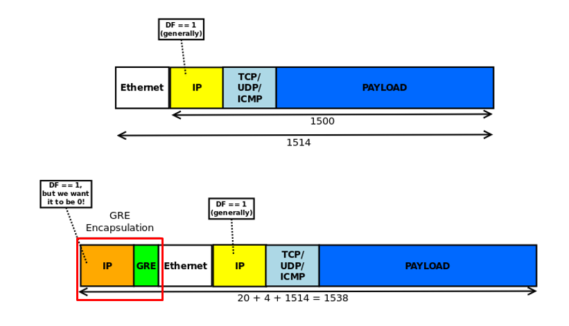
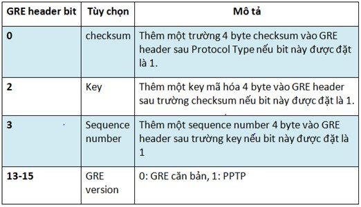
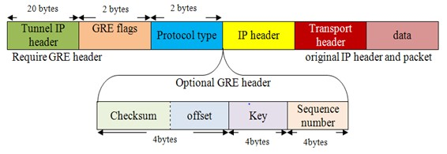
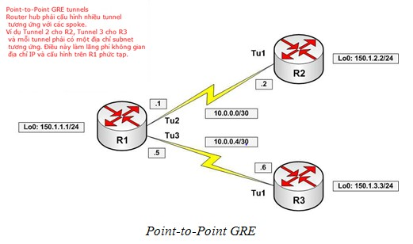
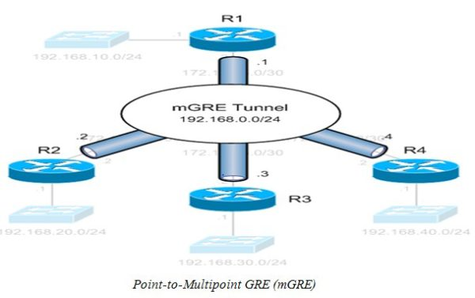
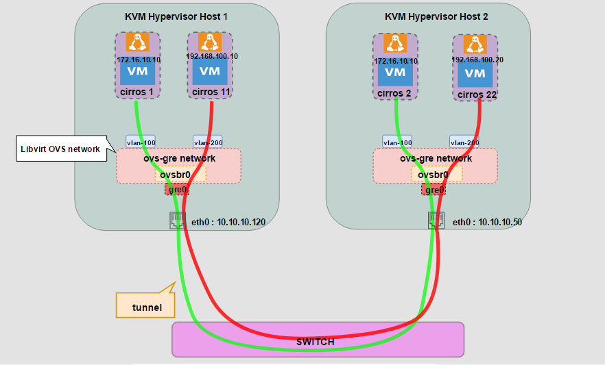
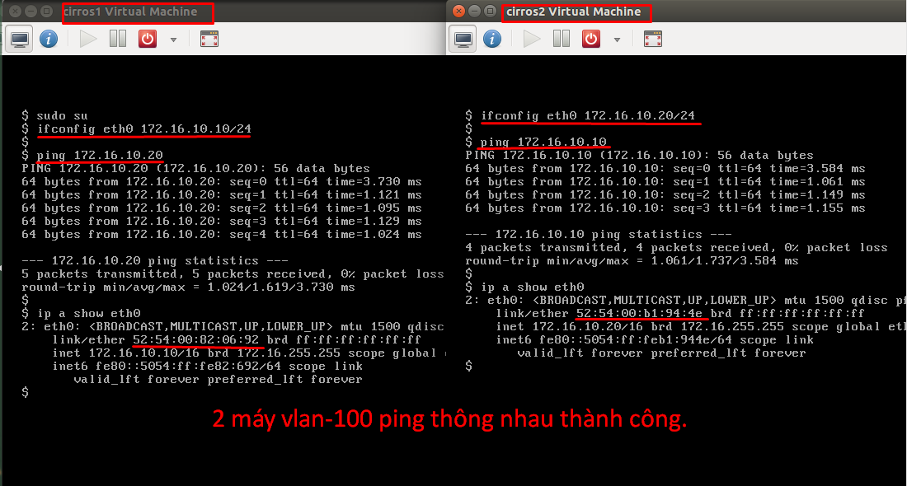
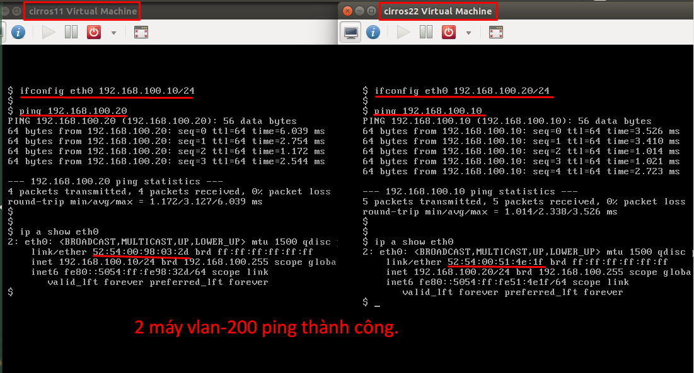
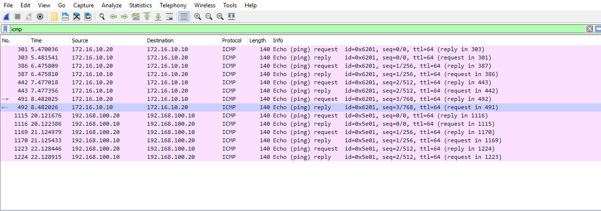
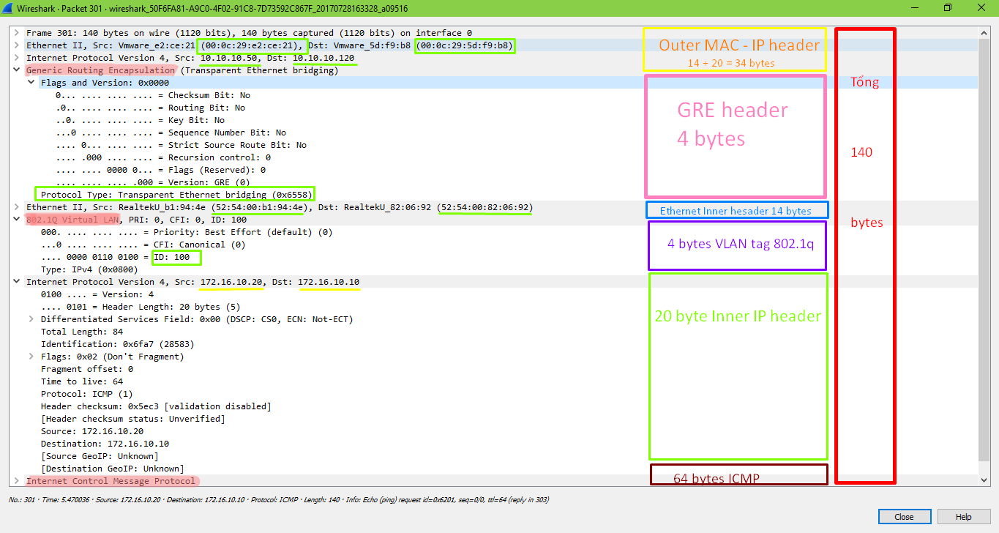

# TÌM HIỂU GRE  

### ***Mục lục***

[1.  Tổng quan GRE](#1)

- [1.1.  GRE là gì? ](#1.1)

- [1.2.  Các ưu điểm của GRE](#1.2)

- [1.3.  GRE tunneling](#1.3)

- [1.4.  Encapsulation và De-Encapsulation trên switch](#1.4)

- [1.5.  GRE frame format ](#1.5)

- [1.6.  Phân loại GRE](#1.6)

  - [1.6.1.  Point-to-Point GRE ](#1.6.1)

  - [1.6.2.  Point-to-Multipoint GRE (mGRE) ](#1.6.2)

[2.  LAB tính năng cơ bản GRE point-to-point](#2)

- [2.1.  Mô hình và chuẩn bị](#2.1)

  - [2.1.1.  Chuẩn bị:](#2.1.1)

  - [2.1.2.  Mục đích bài lab:](#2.1.2)

 - [2.2.  Cấu hình ](#2.2)

  - [2.2.1.  Cấu hình tại HOST](#2.2.1)

  - [2.2.2.  Cấu hình tại HOST 2](#2.2.2)

  - [2.2.3.  Tạo mạng GRE trong mỗi host](#2.2.3)

  - [2.2.4.  Kiểm tra kết nối ](#2.2.4)

  - [2.2.5.  Phân tích frame GRE  trên wire-shark ](#2.2.5)

[3.  Tham khảo](#3)

---

<a name = '1'></a>
# 1.  Tổng quan GRE

<a name = '1.1'></a>
## 1.1.  GRE là gì?

- **Generic routing encapsulation (GRE)** là một giao thức sử dụng để thiết lập các kết nối ***point-to-point*** một các trực tiếp giữa các node trong mạng. Đây là một phương pháp đơn giản và hiệu quả để chuyển dữ liệu thông qua mạng public network, như Internet. GRE cho phép hai bên chia sẻ dữ liệu mà họ không thể chia sẻ với nhau thông qua mạng public network. 

- GRE đóng gói dữ liệu và chuyển trực tiếp tới thiết bị mà de-encapsulate  gói tin và định tuyến chúng tới đích cuối cùng. Gói tin và định tuyến chúng tới đích cuối cùng. GRE cho pháp các switch nguồn và đích hoạt động như một kết nối ảo point-to-point với các thiết bị khác (bởi vì outer header được áp dụng với GRE thì trong suốt với payload được đóng gói bên trong). 

  Ví dụ: GRE tạo tunnel cho phép các giao thức định tuyến như RIP và OSPF chuyển tiếp các gói tin từ một switch tới switch khác thông qua mạng Internet. Hơn nữa, GRE tunnel có thể đóng gói các dữ liệu truyền multicast để truyền thông qua Internet. 

<a name = '1.2'></a>
## 1.2.  Các ưu điểm của GRE 

- Cho phép đóng gói nhiều giao thức và truyền thông qua một giao thức backbone (IP protocol).

- Cung cấp cách giải quyết cho các mạng bị hạn chế hop (hạn chế số hop di chuyển tối đa trong một mạng).

- Kết nối các mạng con gián tiếp.

- Yêu cầu ít tài nguyên hơn các giải pháp tunnel khác. (ví dụ Ipsec VPN).

<a name = '1.3'></a>
## 1.3.  GRE tunneling

- Dữ liệu được định tuyến bởi hệ thống  GRE endpoint trên các tuyến đường được thiết lập trong bảng tuyến. (Các tuyến này có thể được cấu hình tĩnh hoặc học động bằng các giao thức định tuyến như RIP hoặc OSPF) Khi một gói dữ liệu nhận được bởi GRE endpoint, nó được decapsulation và định tuyến lại đến địa chỉ đích cuối cùng của nó.

- GRE tunnel là ***stateless*** - nghĩa là tunnel endpoint không chứa thông tin về trạng thái hoặc tính sẵn có của remote tunnel endpoint. Do đó, switch hoạt động như một tunnel source router không thể thay đổi trạng thái của GRE tunnel interface thành down nếu remote endpoint không thể truy cập được. (Hiểu như là không hoạt động kiểu cần phải thiết lập kết nối trước khi truyền dữ liệu như TCP)

<a name = '1.4'></a>
## 1.4.  Encapsulation và De-Encapsulation trên switch 

- **Encapsulation** 

  - Switch hoạt động như một tunnel source router đóng gói và chuyển tiếp các gói tin GRE như sau: 

  - Switch nhận dữ liệu gói tin (payload) cần chuyển qua tunnel, nó sẽ chuyển gói tin ra tunnel interface.

  - Tunnel interface đóng gói 

  - Encapsulate dữ liệu vào trong gói tin GRE và thêm vào đó phần outer IP header để thành gói tin IP mới.  

  - Gói tin IP được chuyển đến địa chỉ IP đích trong phần outer IP header (là địa chỉ IP của tunnel interface nhận)

- **De-encapsulation** switch hoạt động như một tunnel remote router xử lý gói tin GRE như sau: 

  - Khi đích outer IP nhận được gói tin từ tunnel interface, outer IP header và GRE header sẽ được bóc tách khỏi gói tin.

  - Gói tin được định tuyến tới địa chỉ đích cuối cùng dựa vào inner IP header.

<a name = '1.5'></a>
## 1.5.  GRE frame format

- GRE thêm vào tối thiểu 24 byte vào gói tin, trong đó bao gồm 20-byte IP header mới, 4 byte còn lại là GRE header. GRE có thể tùy chọn thêm vào 12 byte mở rộng để cung cấp tính năng tin cậy như: checksum, key chứng thực, sequence number.

  

- GRE header bản thân nó chứa đựng 4 byte, đây là kích cỡ nhỏ nhất của một GRE header khi không thêm vào các tùy chọn. 2 byte đầu tiên là các cờ (flags) để chỉ định những tùy chọn GRE. Những tùy chọn này nếu được active, nó thêm vào GRE header. Bảng sau mô tả những tùy chọn của GRE header.

  

- Trong GRE header 2 byte còn lại chỉ định cho trường giao thức. 16 bits này xác định kiểu của gói tin được mang theo trong GRE tunnel. Hình sau mô tả cách mà một gói tin GRE với tất cả tùy chọn được gán vào một IP header và data:

  

- Lưu ý: Khi được encapsulation qua GRE tunnel, kích thước bản tin tăng thêm 4 + 20 + 14 = 38 bytes.

<a name = '1.6'></a>
## 1.6.  Phân loại GRE

- GRE là giao thức có thể đóng gói bất kì gói tin nào của lớp network. GRE cung cấp khả năng có thể định tuyến giữa những mạng riêng (private network) thông qua môi trường Internet bằng cách sử dụng các địa chỉ IP đã được định tuyến.

- GRE truyền thống là point-to-point, còn mGRE là sự mở rộng khái niệm này bằng việc cho phép một tunnel có thể đến được nhiều điểm đích, mGRE tunnel là thành phần cơ bản nhất trong DMVPN.

<a name = '1.6.1'></a>
### 1.6.1.  Point-to-Point GRE

- Đối với các tunnel GRE point-to-point thì trên mỗi router spoke (R2 & R3) cấu hình một tunnel chỉ đến HUB (R1) ngược lại, trên router HUB cũng sẽ phải cấu hình hai tunnel, một đến R2 và một đến R3. Mỗi tunnel như vậy thì cần một địa chỉ IP. Giả sử mô hình trên được mở rộng thành nhiều spoke, thì trên R1 cần phải cấu hình phức tạp và tốn không gian địa chỉ IP.
 
  

- Trong tunnel GRE point-To-point, điểm đầu và cuối được xác định thì có thể truyền dữ liệu. Tuy nhiên, có một vấn đề phát sinh là nếu địa chỉ đích là một multicast (chẳng hạn 224.0.0.5) thì GRE point-to-point không thực hiện được. Để làm được việc này thì phải cần đến mGRE.


<a name = '1.6.2'></a>
### 1.6.2.  Point-to-Multipoint GRE (mGRE)

- Như vậy, mGRE giải quyết được vấn đề đích đến là một địa chỉ multicast. Đây là tính năng chính của mGRE được dùng để thực thi Multicast VPN trong Cisco IOS. Tuy nhiên, trong mGRE, điểm cuối chưa được xác định nên nó cần một giao thức để ánh xạ địa chỉ tunnel sang địa chỉ cổng vật lý. Giao thức này được gọi là NHRP (Next Hop Resolution Protocol)

  

- Đối với các mGRE Tunnel thì mỗi router chỉ có một Tunnel được cấu hình cùng một subnet logical.

<a name = '2'></a>
# 2.  LAB tính năng cơ bản GRE point-to-point 

<a name = '2.1'></a>
## 2.1.  Mô hình và chuẩn bị



<a name = '2.1.1'></a>
### 2.1.1.  Chuẩn bị: 

Yêu cầu 2 máy host

- Chạy ubuntu desktop 14.04. 

- Cài sẵn KVM, virt-manager, OpenvSwitch

- Trên mỗi máy đã có sẵn một máy ảo VM. Ở đây chỉ dùng tạo máy ảo cirros cho nhỏ gọn.

<a name = '2.1.2'></a>
### 2.1.2.  Mục đích bài lab: 

- Hiểu cơ bản vê hoạt động của GRE.

- Phân tích bản tin GRE có chứa frame VLAN.

- Cấu hình cơ bản với Openvswitch

<a name = '2.2'></a>
## 2.2.  Cấu hình

Cấu hình 2 HOST 1 và HOST 2 cùng dải mạng 10.10.10.0/24

Trong mô hình này:

- HOST 1: eth0 10.10.10.120/24

- HOST 2: eth0 10.10.10.50/24

<a name = '2.2.1'></a>
### 2.2.1.  Cấu hình tại HOST 1

Cấu hình bridge ovsbr0 - kết nối với các VM, và tạo kết nối tunnel  sử dụng GRE tunnel. 

```
# cau hinh ovsbr0 và gre tunnel interface
sudo ovs-vsctl add-br ovsbr0
sudo ovs-vsctl add-port ovsbr0 gre0 -- set interface gre0 type=gre options:remote_ip=10.10.10.50
```

<a name = '2.2.2'></a>
### 2.2.2.  Cấu hình tại HOST 2

Cấu hình bridge ovsbr0 - kết nối với các VM, và tạo kết nối tunnel  sử dụng GRE tunnel. 

```
# cau hinh ovsbr0 và gre tunnel interface
sudo ovs-vsctl add-br ovsbr0
sudo ovs-vsctl add-port ovsbr0 gre0 -- set interface gre0 type=gre options:remote_ip=10.10.10.120
```

<a name = '2.2.3'></a>
### 2.2.3.  Tạo mạng GRE trong mỗi host

- Tạo một libvirt network tương ứng với bridge ovsbr0 để kết nối các máy ảo vào. Cấu hình file `vi ovs-gre.xml` (tạo file trong thư mục `/etc/libvirt/qemu/network/`) định nghĩa ovs-gre network trên bridge ovsbr0 có chia 2 vlan: vlan-100 và vlan-200 như sau:

  ```
  <network>
    <name>ovs-gre</name>
    <forward mode='bridge'/>
    <bridge name='ovsbr0'/>
    <virtualport type='openvswitch'/>
    <portgroup name='no-vlan' default='yes'>
    </portgroup>
    <portgroup name='vlan-100'>
      <vlan>
        <tag id='100'/>
      </vlan>
    </portgroup>
    <portgroup name='vlan-200'>
      <vlan>
        <tag id='200'/>
      </vlan>
    </portgroup>
  </network>
  ```

- Lưu lại file cấu hình. Áp dụng cấu hình tạo network mới dùng các lệnh sau:

  ```    
  virsh net-define ovs-gre.xml
  virsh net-start ovs-gre
  virsh net-autostart ovs-gre
  ```

<a name = '2.2.4'></a>
### 2.2.4.  Kiểm tra kết nối

Trên HOST 1 tạo máy ảo cirros1 kết nối với vlan-100, cirros11 kết nối vlan-200, trên HOST 2 tạo 2 máy ảo: cirros 2 kết nối vlan-100, cirros22 kết nối vlan-200 và cấu hình địa chỉ tĩnh cho các máy này (vlan-100 dải 172.16.10.0/24; vlan-200 dải 192.168.100.0/24 như topo mạng). Tiến hành ping thử giữa hai máy. 

- Cấu hình các máy ảo: chỉnh sửa máy ảo trong section <interface> như sau: 

  `virsh edit cirros1`

  sửa như sau:

  ```
  ...
  <interface>
  ...
  <source = 'ovs-gre' portgroup='vlan-100' />
  ...
  </>
  ...
  ```
- Lưu lại cấu hình các VM và bật VM lên. Dùng câu lệnh `ovs-vsctl show` để hiển thị thông tin các interface trên openvswitch như sau:

  ```
  952e05e3-68d0-47d5-b611-0449002c3c32
      Bridge "ovsbr0"
          Port "vnet1"
              tag: 200
              Interface "vnet1"
          Port "vnet0"
              tag: 100
              Interface "vnet0"
          Port "ovsbr0"
              Interface "ovsbr0"
                  type: internal
          Port "gre0"
              Interface "gre0"
                  type: gre
                  options: {remote_ip="10.10.10.120"}
      ovs_version: "2.0.2"
  ```
- Đặt IP tĩnh và ping giữa các VM ta có kết quả sau: 

  


  

<a name = '2.2.5'></a>
### 2.2.5.  Phân tích frame GRE  trên wire-shark 

Phân tích một gói tin ICMP bắt được trên interface eth0 có kết quả như sau:






Đối chiếu với [Frame GRE format](./6.Tim_hieu_GRE.md#1.5) hoàn toàn chính xác. 

<a name = '3'></a>
# 3.  Tham khảo

[1] https://www.juniper.net/documentation/en_US/junos/topics/concept/gre-tunnel-services.html

[2] https://www.incapsula.com/blog/what-is-gre-tunnel.html 

[3] https://github.com/thaihust/Thuc-tap-thang-03-2016/blob/master/ThaiPH/VirtualSwitch/OpenvSwitch/ThaiPH_gre_vxlan_ovs.md

[4] http://www.vnpro.vn/khai-niem-tinh-nang-header-va-phan-loai-gre-vpn/ 

[5] https://trickycloud.wordpress.com/2014/05/02/multiple-private-networks-with-open-vswitch-gre-tunnels-and-libvirt/
