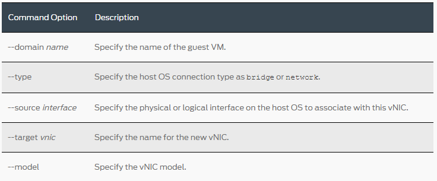
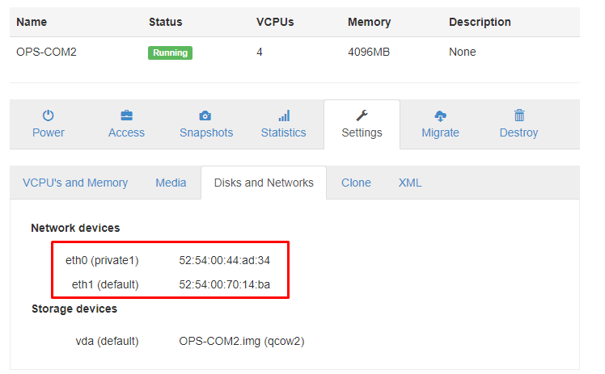
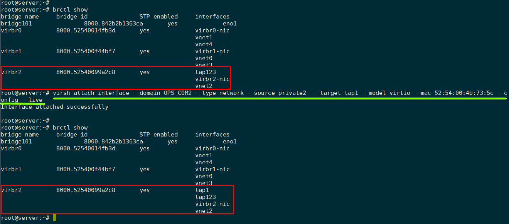
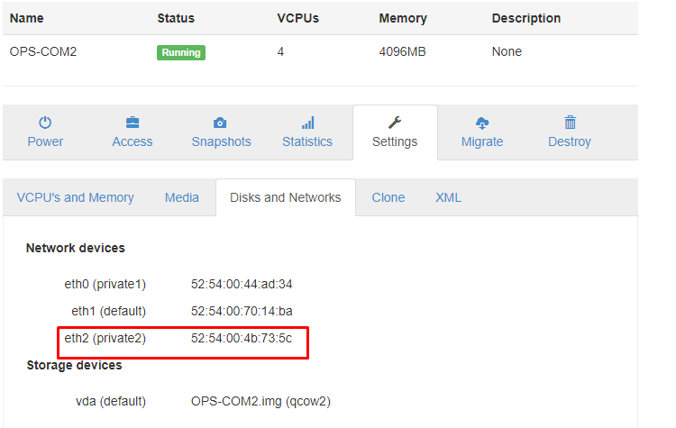

# Attach Interface vào VM đang hoạt động

Có thể thêm interface vào một VM (KVM) đang hoạt động bằng cách sử dụng câu lệnh: `virsh attach-interface`

Tham khảo: https://linux.die.net/man/1/virsh#attach-interface

Một số tùy chọn:



Ví dụ: Gán thêm interface vào VM `OPS-COM2` có tên `tap1` bằng cách sử dụng lệnh như sau:

```
virsh attach-interface --domain OPS-COM2 --type network --source private2  --target tap1 --model virtio --mac 52:54:00:4b:73:5c --config --live
```

- Trước khi thêm interface:

	

- Thực hiện thêm Interface vào VM:

	

- Kết quả, VM đã thêm interface mới có địa chỉ MAC đúng với Interface mình thêm:

	


## Tham khảo

[1] https://linux.die.net/man/1/virsh#attach-interface

[2] https://www.juniper.net/documentation/en_US/vsrx/topics/task/configuration/security-vsrx-kvm-adding-vinterface.html