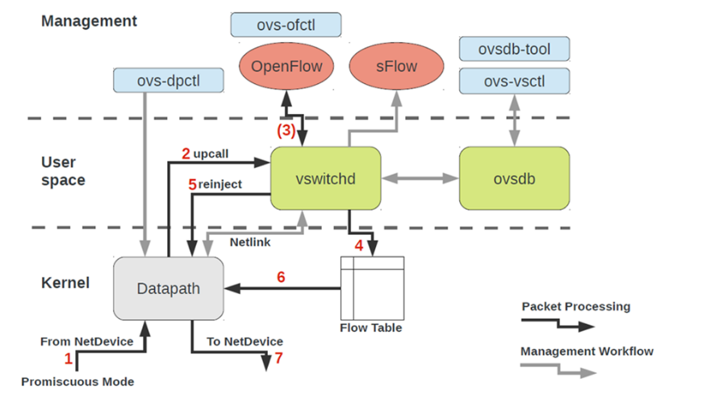
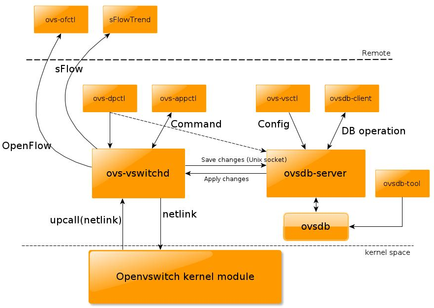
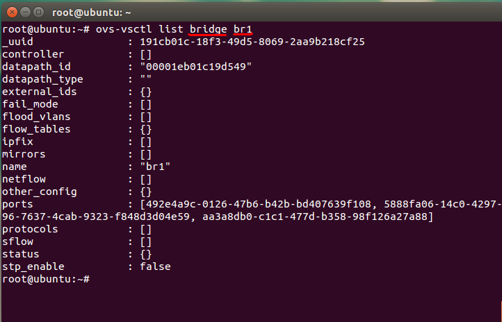
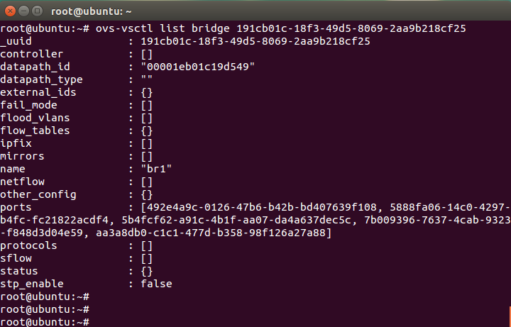
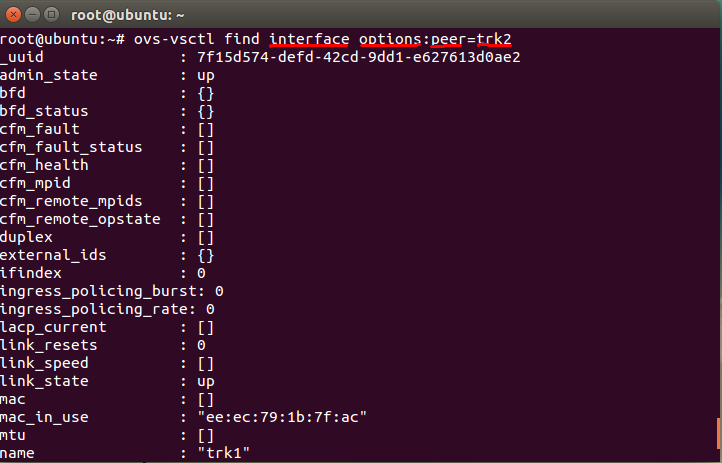
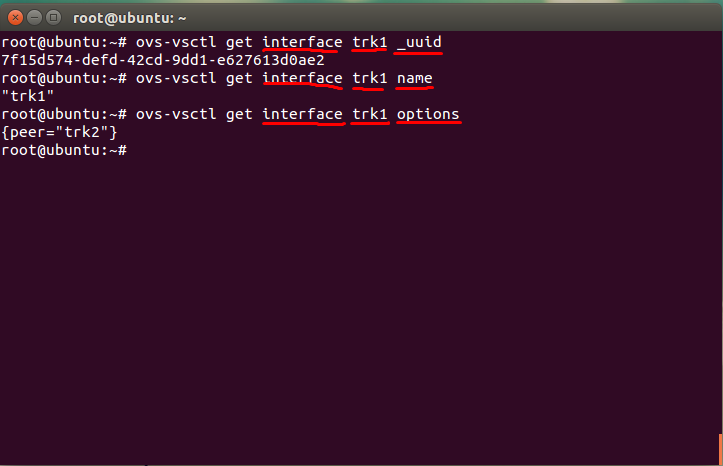

# TÌM HIỂU OPENVSWITCH 

## ***Mục lục***

[1.  Tổng quan Open Vswitch](#1)


- [1.1.  Open Vswitch là gì?](#1.1)


- [1.2.  Các tính năng](#1.2)


- [1.3.  Các thành phần](#1.3)

[2.  Các thao tác quản lý Open Vswtich](#2)


- [2.1.  Cài đặt Open Vswitch](#2.1)


- [2.2.  Cấu hình OVS.](#2.2)

  
	- [2.2.1.  Câu lệnh ovs-vsctl](#2.2.1)

    
		- [2.2.1.1.  Open Vswtich command](#2.2.1.1)

    
		- [2.2.1.2.  Bridge Commands:](#2.2.1.2)

    
		- [2.2.1.3.  Port Command](#2.2.1.3)

    
		- [2.2.1.4.  Interfaces Commands](#2.2.1.4)

    
		- [2.2.1.5.  Database Commands](#2.2.1.5)

  
	- [2.2.2.  Cấu hình Open Vswitch trong file /etc/network/interfaces](#2.2.2)

    
		- [2.2.2.1.  Define a bridge](#2.2.2.1)

    
		- [2.2.2.2.  Define a L2 port (untagged)](#2.2.2.2)

    
		- [2.2.2.3.  Define a L2 port (tagged/trunking)](#2.2.2.3)

    
		- [2.2.2.4.  Define a L3 interface](#2.2.2.4)

    
		- [2.2.2.5.  Define a fake bridge](#2.2.2.5)

[3.  Một số ghi chép](#3)

[4.  Tham khảo](#4)

---

<a name = '1'></a>
# 1.  Tổng quan Open Vswitch 

<a name = '1.1'></a>
## 1.1. Open Vswitch là gì?

- Cũng giống như Linux Bridge, OpenVSwitch là phần mềm cung cấp virtual switch cho các giải pháp ảo hóa network.

- Là phần mềm mã nguồn mở, sử dụng cho ảo hóa vswitch trong môi trường ảo hóa của server.

- Open Vswitch có thể forwards traffic giữa các máy VM trên cùng một máy chủ vật lý và forwards traffic giữa các máy VM và máy vật lý.

- OpenVSwitch được thiết kế tương thích với các switch hiện đại.

- Open vSwitch phù hợp làm việc như là một switch ảo trong môi trường máy ảo VM. Ngoài việc kiểm soát và có khả năng hiển thị giao diện chuẩn cho các lớp mạng ảo, nó được thiết kế để hỗ trợ phân phối trên nhiều máy chủ vật lý. Open vSwitch hỗ trợ nhiều công nghệ ảo hóa Linux-based như là Xen/Xen server, KVM và Virtual Box.

- OpenVSwitch có thể chạy trên các nền tảng Linux, FreeBSD, Windows, non-POSIX embedded Systems,...

<a name = '1.2'></a>
## 1.2.	Các tính năng

Phiên bản hiện tại của Open vSwitch hỗ trợ những tính năng sau: 

- Hỗ trợ tính năng VLAN chuẩn 802.1Q với các cổng trunk và access như một switch layer thông thường.

- Hỗ trợ giao diện NIC bonding có hoặc không có LACP trên cổng uplink switch.

- Hỗ trợ NetFlow, sFlow(R), và mirroring để tăng khả năng hiển thị.

- Hỗ trợ cấu hình QoS (Quality of Service) và các chính sách thêm vào khác.

- Hỗ trợ tạo tunnel GRE, VXLAN, STT và LISP.

- Hố trợ tính năng quản lý các kết nối 802.1aq

- Hỗ trợ OpenFlow các phiên bản từ 1.0 trở lên.

- Cấu hình cơ sở dữ liệu với C và Python.

- Hoạt động forwarding với hiệu suất cao sử dụng module trong nhân Linux.

<a name = '3'></a>
## 1.3.	Các thành phần

Một số thành phần chính của Open Vswitch: 






\- **ovs-vswitchd**: đóng vai trò daemon switch thực hiện các chức năng chuyển mạch kết hợp với module trong kernel Linux cho flow-based swtiching.

\- **ovsdb-server**: database server mà  ovs-vswitchd truy vấn tới để lấy cấu hình.

\- **ovs-dpctl**: công cụ cấu hình module chuyển mạch trong kernel. 

\- **ovs-vsctl**: công cụ thực hiện truy vấn và cập nhật các cấu hình của ovs-vswitchd.

\- **ovs-appctl**: công cụ gửi các lệnh tới Open Vswitch deamon.
 Open vSwitch cũng cung cấp một số công cụ sau:

\- **ovs-ofctl**: công cụ truy vấn và điều khiển chuyển mạch Open Flow và controller.


\- **ovs-pki**: Công cụ cho phép tạo và quản lý các public-key cho các Open Flow switch.

\- **ovs-testcontroller**: một  OpenFlow controller  đơn giản có thể quản lý một số switch ảo thông qua giao thức Open Flow, khiến chúng hoạt động như các switch lớp 2 hoặc như hub. Phù hợp để kiểm tra các mạng Open Flow ban đầu.  

(Tham khảo rõ hơn từng thành phần tại: http://openvswitch.org/support/dist-docs/ )
	
Mô hình sử dụng Open Vswitch: 


<a name = '2'></a>
# 2.	Các thao tác quản lý Open Vswtich

<a name = '2.1'></a>
## 2.1.	Cài đặt Open Vswitch

Trên distro Ubuntu, để cài đặt Open Vswitch một cách đơn giản nhất, bạn có thể sử dụng `apt-get` hoặc `aptitude` để cài đặt từ các gói .deb:

- Các gói deb `openvswitch-switch` và `openvswitch-common` là các gói để cài đặt các thành phần lõi userspace của openvswitch. Nếu không thực hiện nghiên cứu sâu thì chỉ với 2 gói trên là đã đủ cho bạn vọc vạch về OVS.

	```
	sudo apt-get install openvswitch-switch openvswitch-common -y
	```

- Với kernel datapath, `openvswitch-datapath-dkms` có thể được cài đặt để tự động xây dựng và cài đặt các module Oopen Vswitch kernel cho kernel đang chạy của bạn.

- Với DPDK datapath, Open vSwitch với hỗ trợ DPDK được gói trong gói `openvswitch-switch-dpdk`.

Hoặc để cài đặt đầy đủ các thành phần mới nhất của Open Vswitch, tham khảo hướng dẫn cài đặt từ source code tại: http://docs.openvswitch.org/en/latest/intro/install/general/ 

<a name = '2.2'></a>
## 2.2.	Cấu hình OVS 

<a name = '2.2.1'></a>
### 2.2.1.	Câu lệnh ovs-vsctl

Sử dụng câu lệnh `ovs-vsctl` để làm việc với Open vSwitch database. `ovs-vsctl` hiểu như là câu lệnh để querying tới database của OVS. Do đó, mọi sự thay đổi đều được lưu lại vào database. (Bền vững – tức là khác với Linux bridge, switch tạo từ OVS sẽ vẫn tồn tại và giữ được cấu hình khi máy host chủ khởi động lại)

Syntax:

`ovs-vsctl  [options]  -- [options] command [args] [-- [options] command [args]]...`

Sau đây là một số `<command>`

(Tham khảo chi tiết tại: http://openvswitch.org/support/dist-docs/ovs-vsctl.8.html) 

<a name = '2.2.1.1'></a>
#### 2.2.1.1.	Open Vswtich command

- `init`   : các bước ban đầu thiết lập database, nếu nó trống. Nếu trước đó đã cấu hình và được lưu trong database thì câu lệnh này sẽ không cần thiết nữa. Bất kể sự tác động nào của câu lệnh ovs-vsctl đều tự động thiết lập initalizes nếu database của OVS đang trống. Câu lệnh này cung cấp các bước thiết lập ban đầu cho database mà không cần xử lý thêm bất kì câu lệnh nào.

- `show` :  Hiển thị ngắn gọn nội dung cấu hình có trong database.

	```
	root@ubuntu:~# ovs-vsctl show
	952e05e3-68d0-47d5-b611-0449002c3c32
	    Bridge "br-vxl2"
	        Port "tap100"
	            tag: 100
	            Interface "tap100"
	        Port "trk1"
	            Interface "trk1"
	                type: patch
	                options: {peer="trk21"}
	        Port "br-vxl2"
	            Interface "br-vxl2"
	                type: internal
	        Port "vnet0"
	            tag: 100
	            Interface "vnet0"
	    Bridge "br-vxl21"
	        Port "br-vxl21"
	            Interface "br-vxl21"
	                type: internal
	        Port "trk21"
	            Interface "trk21"
	                type: patch
	                options: {peer="trk1"}
	        Port "vxl2"
	            Interface "vxl2"
	                type: vxlan
	                options: {remote_ip="10.10.10.100"}
	    ovs_version: "2.0.2"
	```

<a name = '2.2.1.2'></a>
#### 2.2.1.2.	Bridge Commands:

-	`[--may-exist] add-br <bridge-name>`
	
	- Tạo một switch mới có tên `<bridge-name>`. Ban đầu, switch này sẽ không có port nào cả (hoặc là chỉ một interface mang bridge)
	
	- Nếu không có tùy chọn `--may-exist`, việc cố gắng tạo ra một bridge đã có (trùng tên) sẽ lỗi. Với tùy chọn này, câu lệnh này sẽ không xử lý gì cả nếu một bridge như vậy đã tồn tại.


-	`[--may-exist] add-br <fake-bridge> <parent-bridge> <vlan_id>`

	- Tạo một fake bridge hỗ trợ vlan. parent-brige phải tồn tại trước khi tạo fake bridge. Fake bridge mới này sẽ hoạt động ở chuẩn Vlan 802.1Q. 
       
	- Để kiểm tra vlan_id của fake bridge sử dụng lệnh: `ovs-vsctl br-to-vlan <fake-bridge>`

	- Hiển thị parent bridge của fake bridge sử dụng lệnh: `ovs-vsctl br-to-parent <fake-bridge>`

-	`[--if-exists] del-br <bridge>`

	- Xóa một bridge và toàn bộ port trên bridge đó. Nếu là một bridge bình thường thì câu lệnh này đồng thời xóa hết cả fake bridge trên nó, và các port của nó.

	- Tùy chọn `--if-exists`, nếu có thử xóa một bridge không còn tồn tại sẽ gây lỗi. Với tùy chọn này, nếu cố xóa một bridge không tồn tại thì sẽ không có hiệu lực gì xảy ra.


-	`[--real|--fake] list-br` : Liệt kê tất cả real hoặc fake bridge.

-	`br-to-vlan <bridge>` : Hiển thị thông tin `vlan_id` nếu đó là fake bridge, nếu là real bridge thì không hiển thị 0  (không có vlan nào cả)

-	`br-to-parent <bridge>` : Hiển thị thông tin parent bridge của fake bridge, nếu đó là real bridge thì hiển thì chính nó. 

<a name = '2.2.1.3'></a>
#### 2.2.1.3.	Port Command

Những câu lệnh sau sẽ kiểm tra và điểu khiển Open Vswitch port. Lệnh này sẽ xử lý và coi port bonding là thực thể đơn. 
    
-	Liệt kê tất cả các port của bridge, thành từng dòng. Không liệt kê các local port.

	`list-ports <bridge_name>`

-	Tạo trên bridge_name một port mới tên `<port_name>` từ thiết bị mạng cùng tên.
	
	`[--may-exist] add-port <bridge_name> port [column[:key]=value]...`
	
	Ví dụ: `ovs-vsctl add-port br0 eth0`

-	Tạo trên `<bridge_name>` một port mới tên `<port_name>` mà bond các interface liệt kê sau đó lại với nhau. Ít nhất 2 interface phải được xác định để tạo port bond. Với tùy chọn `--fake-iface`, một fake interface với tên port sẽ được tạo. 

	`[--fake-iface] add-bond <bridge_name> <port_name> iface... [column[:key]=value]...`

-	Xóa port. 
	
	`[--if-exists] del-port [<bridge_name>] <port_name>`
	
	Nếu `<bridge_name>` không có, port được xóa khỏi bất kì bridge nào chứa nó, nếu brdige_name được xác định, thì bridge đó phải chứa port đó.

-	Xóa port tên iface hoặc có interface tên là `<iface_name>`: 

	`[--if-exists] --with-iface del-port [<bridge_name>] <iface_name>`

-	Hiển thị thông tin tên của bridge chứa port_name

	`port-to-br <port_name>`

<a name = '2.2.1.4'></a>
#### 2.2.1.4.	Interfaces Commands

Các câu lệnh kiểm tra các interface được gán trên một Open Vswitch bridge. Các lệnh này sẽ xử lý port bonding như là một tập hợp của 2 hoặc nhiều interface hơn là chỉ coi nó như một cổng đơn.

-	Liệt kê interface: 

	`list-ifaces <bridge_name>`

	Liệt kê tất cả các interface trong bridge_name. Local port sẽ không được list ra.

-	In ra tên của bridge chứa interface `<iface_name>`

	`iface-to-br <iface_name>`

<a name = '2.2.1.5'></a>
#### 2.2.1.5.	Database Commands

Là các câu lệnh truy vấn và modify các nội dung trong các bảng của **ovsdb**. Mỗi command đều có tác động tới các thông số của các thực thể (được hiểu trong database là các table). Một số câu lệnh sau cho phép thay đổi các thông số của table. Một số table trong ovsdb:
      
\-	**Open_vSwitch**: Thông tin cấu hình cho **ovs-vswitchd**. Table này chỉ có duy nhất một bản ghi.

\-	**Bridge**: Các thông tin cấu hình cho một bridge trong Open Vswitch. Các hàng được định danh theo tên bridge.

\-	**Port**: Thông tin về các port. Các hàng được định danh theo tên port.   

\-	**Interface**: Thông tin về các interface của các thiết bị mạng được gán với port. Các hàng được định danh bởi tên interface.

Và một số table khác như: **Flow_Table, QoS, Queue, Mirror, Controller, Manager, NetFlow, SSL, sFlow, IPFIX, Flow_Sample_Collector_Set,  AutoAttach**.

### Một số câu lệnh với database 

##### Hiển thị nội dung trong từng table:

`list table [record]...`

(record hiểu như là tên của một khóa, khóa đại diện cho mỗi record)

Ví dụ: list ra thông tin của bridge br1 trong table Bridge (viết hoa hay thường đều ok). (record ở đây dùng tên hoặc uuid để phân biệt)





##### Tìm kiếm dữ liệu trong bảng:

`find table [column[:key]=value]...`
 
Ví dụ: tìm trong table Interface các interface có column options có giá trị `peer=trk1`



##### Hiển thị nội dung theo cột của từng record: 

`get table record [column[:key]...`

Ví dụ: Lấy ra thông tin `_uuid` của interface `trk1`:



#####  Thay đổi nội dung của record:
set table record [column[:key]...

##### Thêm nội dung vào column của record:

`add table record column [key=]value`

##### Xóa từng nội dung trong cột của record: 

`remove table record column [key=]value`

##### Xóa toàn bộ nội dung trong cột của record:

`clear table record column ...`

##### Thêm một record vào table:

`create table column[:key]=value...`

##### Xóa toàn bộ nội dung của một record trong table:

`destroy table record ...`

##### Xóa toàn bội nội dung trong table:

`--all destroy table`

(Xem thêm một số ví dụ tại [manpages](http://openvswitch.org/support/dist-docs/ovs-vsctl.8.html))

<a name = '2.2.2'></a>
### 2.2.2.	Cấu hình Open Vswitch trong file /etc/network/interfaces

-	Open vSwitch (OVS) thay thế cho Linux native Bridge, bonds và các interface vlan. OVS hỗ trợ hầu hết các đặc tính mà bạn mong muốn có như ở một switch vật lý, cung cấp một vài chức năng nâng cao như hỗ trợ RSTP, VXLAN, Open flow và hỗ trợ chia nhiều Vlan trên một bridge. Nếu bạn cần những tính năng này, hãy sử dụng OVS.

-	Khi cài đạt OVS trên ubuntu, khi khởi động Ubuntu OVS cũng được khởi động. Một số bridge, port – mà đã được định nghĩa trước và lưu lại cũng sẽ được khởi động (cái này có vẻ hơi không chuẩn, vì khi cấu hình OVS, tất cả mọi thay đổi đều được lưu vào OVS database) 

-	Phần này sẽ hướng dẫn cách cấu hình một số bridge, port, interface được lưu trong file `/etc/network/interfaces`. Mục đích khi cấu hình là khi máy khởi động – hoặc khi khởi động lại dịch vụ networking (ifdown – ifup/ service networking restart) thì những scrips trong linux sẽ tác động và dùng những tool của OVS để chỉnh sửa lại data của bridge, port, interfaces lại theo như cấu hình muốn lưu đó.

-	Lưu ý: mỗi bridge, port, interface là duy nhất trong hệ thống linux nên khi cấu hình trong file interfaces, tất cả mọi cấu hình trước đó trên một bridge (bridge mà cấu hình trong file interfaces) sẽ không được giữ lại và thay đổi theo cấu hình mà mình lưu trong file interfaces. (Hay hiểu theo cách đơn giản thì mọi dữ liệu, thông tin về các thành phần của OVS được lưu trong ovsdb, nên khi bạn cấu hình – bằng câu lệnh như `ovs-vsctl`, `ovs-apptcl`, ...  thì dữ liệu đó cũng thay đổi theo. Nhưng khi lưu lại cấu hình trong file interfaces thì khi khởi động lại dịch vụ network – hệ thống sẽ chạy dần những dòng cấu hình trong file => dẫn tới là chạy những scrip làm thay đổi dữ liệu trong ovsdb của bạn)

<a name = '2.2.2.1'></a>
#### 2.2.2.1.	Define a bridge

Tất cả các port và interface trên Openvswitch phải được gán vào một bridge. Định nghĩa một bridge (hay virtual switch) yêu cầu những cấu hình sau:

`ovs-vsctl add-br ovsbr1`

Câu lệnh trên tương tự như định nghĩa trong file `/etc/network/interfaces` như sau: 

```
# create an Openvswitch bridge
# on the commandline: ovs-vsctl add-br ovsbr1
auto ovsbr1
allow-ovs ovsbr1
iface ovsbr1 inet manual
	ovs_type OVSBridge
```

Trong đó: 

-	`auto`: cho phép bridge ovsbr1 tự động được khởi động bật lên cùng hệ thống. 

-	`allow-ovs` : thông báo cho hệ thống biết đó là một Open Vswitch bridge. Bridge tên ovsbr1

-	`iface`: định danh cho một interface trong file /etc/network.interfaces để khởi động cấu hình khi bắt đầu khởi động hệ thống.

-	`ovs_type`: Định nghĩa loại interface cho OVS. OVSBridge đại diện cho một OVS bridge.

***Theo như ý hiểu của mình: những dòng cấu hình này cho phép tạo ra một bridge ovsbr1, mỗi bridge đều có một port – gọi là port local – có vẻ như là để giữ lại cố định địa chỉ MAC cho bridge khi chạy giao thức STP và gán MTU cho bridge – đồng thời, interfaces gán với port này cũng để thể hiện sự hiện diện của bridge trong hệ thống linux. => cấu hình iface ovsbr1 (cùng tên với bridge) và được cấu hình là OVSBridge như để thông báo cho hệ thống rằng đây là cổng local thể hiện sự hiện diện của Bridge với hệ thống.*** 

<a name = '2.2.2.2'></a>
#### 2.2.2.2.	Define a L2 port (untagged)

- Phần này định nghĩa một port thuần layer 2 của switch (chỉ có nhiệm vụ forwarding gói tin, không có chức năng chia Vlan ... ) 

- Thêm một port layer 2 vào bridge vừa tạo ở trên (port này không là port local, nên hệ thống linux không "nhìn" thấy được)

	`ovs-vsctl add-port ovsbr1 l2port`

- Câu lệnh này tương được cấu hình trong file `/etc/network/interfaces` như sau: 

	```
	# create an untagged ovs port in vlan 444
	# (config not yet complete)
	allow-ovsbr1 l2port
	iface l2port inet manual
	  ovs_bridge ovsbr1
	  ovs_type OVSPort
	  ovs_options tag=444
	```
	Trong đó: 
	
	-	`allow-[name_of_the_bridge_to_attach_the_port]`: thông số xác định tên bridge mà port sẽ gán vào. Trong ví dụ này ovsbr1. Port tên l2port. 
	
	-	`iface`: Tương tự trên.
	
	-	`ovs-bridge`: thông số xác định bridge mà port sẽ attack vào. holds the name of the bridge to which the port should be attached to. In our example this is vmbr-int.
	
	-	`ovs_type`: Định nghĩa loại interface cho OVS. OVSPort xác định một port cảu OVS mà HĐH linux không "nhìn" thấy nó, nó chỉ bị quản lý bởi OVS.

	-	`ovs_options`: Định nghĩa thêm một số option cho port. ví dụ: gán port cho vlan 444.

<a name = '2.2.2.3'></a>
#### 2.2.2.3.	Define a L2 port (tagged/trunking)

Định nghĩa port layer 2 mà có thể dùng làm port trunk (tagged port - port để gán tag các vlan)

```
# create an tagged ovs port
allow-ovsbr1 l2taggedport
iface l2taggedport inet manual
  ovs_bridge ovsbr1
  ovs_type OVSPort
  ovs_options trunks=2101,2102,2110,2120,2999,3000
```

Một port trunk không cần cấu hình gì thêm như port access bình thường, chỉ cần cấu hình phần options thêm các vlan mà nó cần gắn tag vào.

`ovs_options trunks=<vlan1_id>,<vlan2_id>,<vlan3_id>,<vlan4_id>,<vlan5_id>,...`

<a name = '2.2.2.4'></a>
#### 2.2.2.4.	Define a L3 interface

- Định nghĩa một interface layer 3 (gán được địa chỉ IP):

	```
	# create an untagged ovs port in vlan 444
	allow-ovsbr1 l3port
	iface l3port inet static
	  ovs_bridge ovsbr1
	  ovs_type OVSIntPort
	  ovs_options tag=444
	  address 192.168.1.254                   #hoặc cấu hình: address 192.168.1.254/24
	  netmask 255.255.255.0
	```

	Với: 

	-	`iface`: thiết lập mode static, bởi địa chỉ IP được cấu hình cho interface này.

	-	`ovs_type` :một L3 port phải được để kiểu Internal port - OVSIntPort (không hiểu tại sao :D ) – cái cổng này cần được cấp IP, nên mình nghĩ, cái IP stack nó nằm trong hệ thống linux, nên phải được nhìn thấy thì mới có thể cấp IP – đoán thế)

	-	`address - netmask`: địa chỉ và sunetmask cho port.

- Và cấu hình thêm port này vào đoạn cấu hình của bridge ovsbr1: 
	
	```
	auto ovsbr1
	allow-ovs ovsbr1
	iface ovsbr1 inet manual
	  ovs_type OVSBridge
	  ovs_ports l2port l3port
	```

<a name = '2.2.2.5'></a>
#### 2.2.2.5.	Define a fake bridge

- Tương tự như định nghĩa một bridge thông thường. 

	`ovs-vsctl add-br ovsbr-fakebr ovsbr1 2102`

- Định nghĩa trong file `/etc/network/interfaces`: 

	```
	# a fake bridge without an ip address
	allow-ovsbr1 ovsbr-fakebr
	iface ovsbr-fakebr inet manual
	  ovs_bridge ovsbr1
	  ovs_type OVSBridge
	  ovs_options ovsbr1 2102
	```
	Với: 
	
	-	`ovs_type`: chọn là OVSBridge. 
	
	-	`ovs_options`: được thiết lập tới bridge parent (ở đây là ovsbr1) và id của vlan trên fake bridge đó. Định nghĩa một fake bridge đại diện cho vlan 2102. Các VM gắn vào bridge này sẽ auto join vào vlan 2102.

Một số ví dụ khác tham khảo tại: http://www.opencloudblog.com/?p=240  và https://pve.proxmox.com/wiki/Open_vSwitch#Example_1:_Bridge_.2B_Internal_Ports_.2B_Untagged_traffic 

<a name = '3'></a>
# 3.	Một số ghi chép
( Đây là sự đúc kết lại theo ý nghĩ của mình, có thể sẽ có sai sót. Trong quá trình tìm hiểu tiếp theo, nếu có sai chỗ nào mình sẽ update lại :D) 

-	Theo mình nghĩ, hệ thống Linux quản lý tất cả các Interfaces trong hệ thống (Các interface máy ảo, các OVSIntPort và các interface ethX... ) – nên các interface này đều chỉ có một định danh và đó là duy nhất.

-	Để lưu thông ra khỏi máy host, các OVS phải được gán với ít nhất một interface ethX của host, vì đó là lối duy nhất để các gói tin ra ngoài. Cho dù bạn có tạo thêm các interface khác cho host nhưng mà không đc thông với card mạng thật cảu host thì vẫn không thể ra ngoài đc. 

-	Khi cấu hình OVS – thường ta sẽ cắm một interface của host vào OVS để các lưu lượng trong OVS có thể đi ra ngoài. Trong trường hợp sử dụng VM-ware thì là các interface ethX. Sau khi gán ethX vào OVS thì ta phải chuyển IP của nó sang cho interface local của OVS để có thể liên lạc. 

-	Cấu hình ví dụ như sau: 

	```
	auto lo
	iface lo inet loopback

	auto eth0
	iface eth0 inet static
	address 172.16.69.10/24
	gateway 172.16.69.1
	dns-nameservers 172.16.69.10

	auto br1
	allow-ovs br1
	iface br1 inet static
	address 10.10.10.10/24
	  ovs_type OVSBridge
	  ovs_ports trk1 br1-nic eth1

	allow-br1 eth1
	iface eth1 inet manual
	  ovs_bridge br1
	  ovs_type OVSPort

	allow-br1 br1-nic
	iface br1-nic inet static
	  ovs_type OVSIntPort 
	  ovs_bridge br1
	  address 10.10.10.20/24

	allow-br1 trk1
	iface trk1 inet manual
	  ovs_type OVSPort
	  ovs_bridge br1
	  ovs_options trunks=100,200
	```

<a name = '4'></a>
# 4. Tham khảo

[1] Tổng quan: http://docs.openvswitch.org/en/latest/ 

[2] install: http://docs.openvswitch.org/en/latest/intro/install/general/ & http://docs.openvswitch.org/en/latest/intro/install/distributions/#debian 

[3] ovs-vsctl: http://openvswitch.org/support/dist-docs/ovs-vsctl.8.html

[4] Cấu hình trong file: http://www.opencloudblog.com/?p=240 
