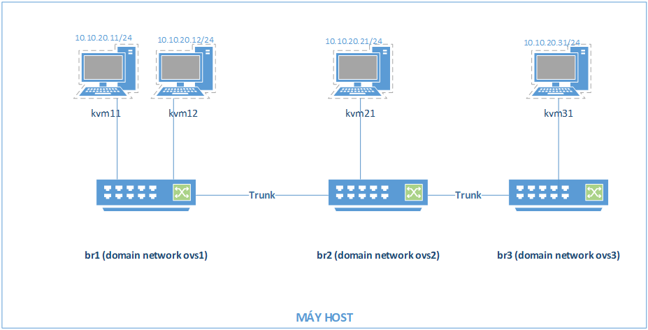
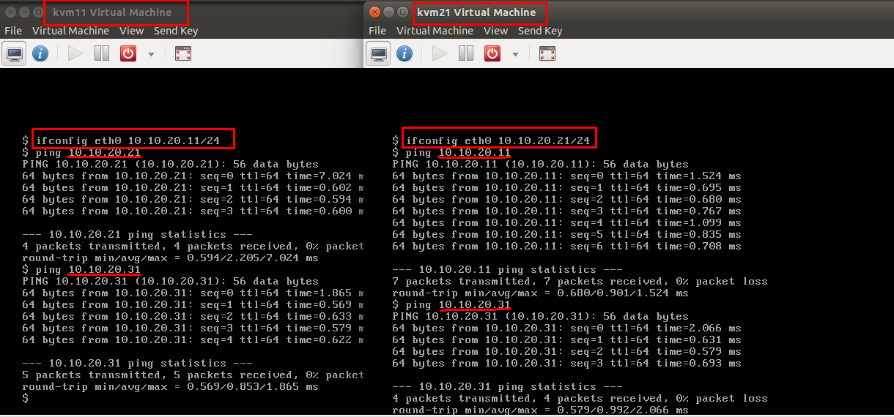
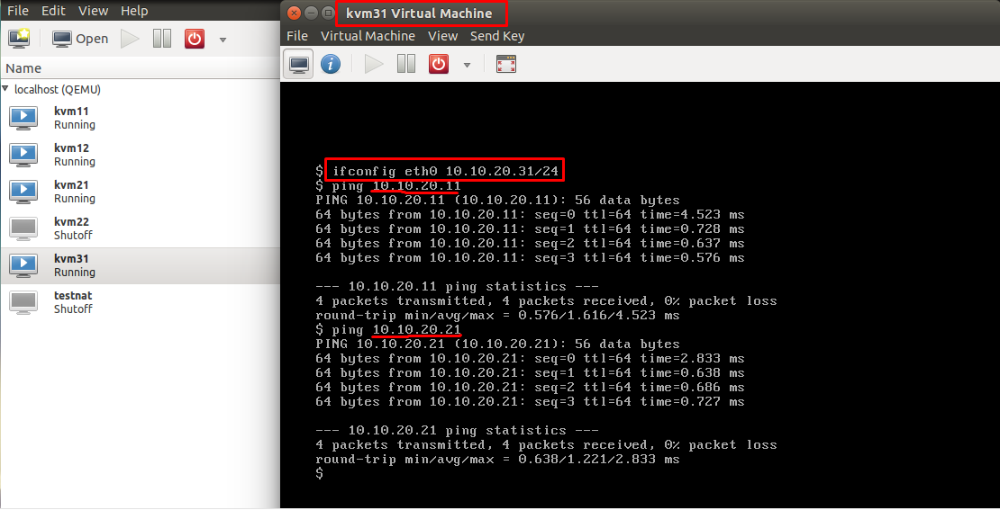
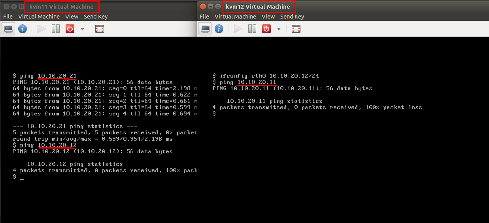

# LAB VLAN với Openvswitch

[1.	Mục đích](#1)

[2.	Mô hình bài lab](#2)

[3.	Cấu hình](#3)

- [3.1.	Cài các gói phụ thuộc và phần mềm cần thiết](#3.1)

- [3.2.	Cấu hình VLAN](#3.2)

	- [3.2.1.	Tạo các switch ảo và cấu hình vlan tag](#3.2.1)

	- [3.2.2.	Tạo network cho các máy ảo kết hợp OpenvSwitch với libvirt](##3.2.2)

	- [3.2.3.	Tạo các máy ảo và thiết lập network cho các máy ảo](##3.2.3)

	- [3.2.4.	Kiểm tra kết nối các máy tính trên các vlan](##3.2.4)

[4.	Tham khảo](#4)

---

<a name = '1'></a>
# 1.	Mục đích

-	Cấu hình VLAN và hiểu cách hoạt động trong VLAN

-	Cấu hình cơ bản OVS với `ovs-vsctl`

-	Cấu hình KVM với network tùy chọn.

<a name = '2'></a>
# 2.	Mô hình bài lab



Chuẩn bị:

 
- Máy vật lý: cài ubuntu 14.04, kvm, openvswitch. Có thể tham khảo cách cài openvswitch [tại đây.](https://askubuntu.com/questions/549656/how-to-install-open-virtual-switch)
 
- Tìm hiểu trước cách sử dụng KVM và Open vSwitch trong các file docs.
 
- Sử dụng OpenvSwitch tạo 3 switch ảo br1, br2 và br3  kết nối với nhau bằng 2  đường trunk, thiết lập các vlan tag 100 và 200
 
- Tạo 4 máy ảo gán vào các vlan tương ứng với các tap interface của 3 switch ảo trên:
 
	- kvm11 và kvm12: gán vào switch br1
 
	- kvm21 và kvm31: lần lượt gán vào switch br2 và br3
 
	- Gán các máy ảo vào các vlan: kvm11 và kvm21 và kvm31 gán vào vlan 100, kvm12 gán vào vlan 200.
 
- Tiến hành ping giữa các máy ảo kiểm tra hoạt động của vlan.

<a name = '3'></a>
# 3.	Cấu hình

<a name = '3.1'></a>
## 3.1.	Cài các gói phụ thuộc và phần mềm cần thiết

Chuẩn bị cài đặt các gói phần mềm phụ thuộc sau:

- KVM: tham khảo cách cài trên ubuntu 14.04 theo hướng dẫn của [howtoforge](https://www.howtoforge.com/tutorial/kvm-on-ubuntu-14.04/).
 
- OpenvSwitch.

<a name = '3.2'></a>
## 3.2.	Cấu hình VLAN

<a name = '3.2.1'></a>
### 3.2.1.	Tạo các switch ảo và cấu hình vlan tag

- **Tạo switch ảo**:

	```
	ovs-vsctl add-br br1
	ovs-vsctl add-br br2
	ovs-vsctl add-br br3
	```

- **Tạo các trunk port trên các switch ảo và tạo đường trunk kết nối 3 switch**:

	```
	# create trunk ports on switches
	ovs-vsctl add-port br1 trk12
	ovs-vsctl add-port br2 trk21 #do switch br2 ở giữa nên cần 2 port trunk
	ovs-vsctl add-port br2 trk23
	ovs-vsctl add-port br3 trk32

	# combine 2 switches
	ovs-vsctl set interface trk12 type=patch options:peer=trk21
	ovs-vsctl set interface trk21 type=patch options:peer=trk12
	ovs-vsctl set interface trk23 type=patch options:peer=trk32
	ovs-vsctl set interface trk32 type=patch options:peer=trk23
	```

- **Kiểm tra lại cấu hình các switch**:

	`ovs-vsctl show`

	Kết quả sẽ tương tự như sau:

	```
	952e05e3-68d0-47d5-b611-0449002c3c32
	    Bridge "br1"
	        Port "br1"
	            Interface "br1"
	                type: internal
	        Port "trk12"
	            Interface "trk12"
	                type: patch
	                options: {peer="trk21"}

	    Bridge "br2"
	        Port "br2"
	            Interface "br2"
	                type: internal
	        Port "trk23"
	            Interface "trk23"
	                type: patch
	                options: {peer="trk32"}
	        Port "trk21"
	            Interface "trk21"
	                type: patch
	                options: {peer="trk12"}
	    Bridge "br3"
	        Port "br3"
	            Interface "br3"
	                type: internal
	        Port "trk32"
	            Interface "trk32"
	                type: patch
	                options: {peer="trk23"}
	ovs_version: "2.0.2"   
	```

<a name = '3.2.2'></a>
### 3.2.2.	Tạo network cho các máy ảo kết hợp OpenvSwitch với libvirt

Open vSwitch chỉ hỗ trợ tạo switch ảo, giờ muốn cấu hình VLAN cho switch đó, ta phải tạo mạng cho switch đó. 
Để khai báo network mới với libvirt, ta tạo một file định dạng `*.xml` và sử dụng công cụ `virsh` (thường cài đặt cùng với kvm-qemu) để áp dụng cấu hình trong file đó. Ở đây, ta khai báo 2 file xml cấu hình 2 network tương ứng với hai switch ảo ở trên:

-	Cấu hình network tương ứng br1: `vi ovs1.xml`

	```
	<network>
	  <name>ovs1</name>
	  <forward mode='bridge'/>
	  <bridge name='br1 ' />
	  <virtualport type='openvswitch'/>
	  <portgroup name='vlan-00' default='yes'>
	  </portgroup>
	  <portgroup name='vlan-100'>
	    <vlan>
	      <tag id='100'/>
	    </vlan>
	  </portgroup>
	  <portgroup name='vlan-200'>
	    <vlan>
	      <tag id='200'/>
	    </vlan>
	  </portgroup>
	  <portgroup name='vlan-all'>
	    <vlan trunk='yes'>
	      <tag id='100'/>
	      <tag id='200'/>
	    </vlan>
	  </portgroup>
	</network>
	```

-	Cấu hình network tương ứng với br2: `vi ovs2.xml`

	```
	<network>
	  <name>ovs2</name>
	  <forward mode='bridge'/>
	  <bridge name='br2'/>
	  <virtualport type='openvswitch'/>
	  <portgroup name='vlan-00' default='yes'>
	  </portgroup>
	  <portgroup name='vlan-100'>
	    <vlan>
	      <tag id='100'/>
	    </vlan>
	  </portgroup>
	  <portgroup name='vlan-200'>
	    <vlan>
	      <tag id='200'/>
	    </vlan>
	  </portgroup>
	  <portgroup name='vlan-all'>
	    <vlan trunk='yes'>
	      <tag id='100'/>
	      <tag id='200'/>
	    </vlan>
	  </portgroup>
	</network>
	```

-	Tương tự tạo `ovs3.xml` tạo network cho OVS br3

- Áp dụng cấu hình network mới, thực hiện các lệnh sau:

	```
	# define new networks
	virsh net-define ovs1.xml
	virsh net-define ovs2.xml
	virsh net-define ovs3.xml

	# start new networks
	virsh net-start ovs1
	virsh net-start ovs2
	virsh net-start ovs3

	# auto start networks when turning on (options)
	virsh net-autostart ovs1
	virsh net-autostart ovs2
	virsh net-autostart ovs3
	```

<a name = '3.2.3'></a>
### 3.2.3.	Tạo các máy ảo và thiết lập network cho các máy ảo

Tạo 4 máy ảo và thực hiện cấu hình network cho 4 máy ảo sử dụng công cụ virsh. Ví dụ ở đây ta cấu hình network cho máy ảo kvm11 theo topo. Cấu hình các máy ảo thiết lập trong 1 file `*.xml` nằm trong thư mục `/etc/libvirt/qemu/`. Để chỉnh sửa cấu hình một máy ảo, ta sử dụng lệnh:

```
# virsh edit vm_name
virsh edit kvm11
```

Thiết lập cho máy ảo này thuộc vlan-100 và gán vào switch br1 (tương ứng với ovs1). Ta chỉnh sửa section như sau:

```
<interface type='network'>
  <mac address='52:54:00:10:aa:1c'/>
  <source network='ovs1' portgroup='vlan-100'/>
  <model type='virtio'/>
  <address type='pci' domain='0x0000' bus='0x00' slot='0x03' function='0x0'/>
</interface>
```

Tiến hành cấu hình tương tự cho các máy ảo khác theo đúng topology.

<a name = '3.2.4'></a>
### 3.2.4.	Kiểm tra kết nối các máy tính trên các vlan
 
- Kiểm tra các bridge đã liên kết được với các port vnetX (Đại diện cho các tap interface ứng với máy ảo)

	`ovs-vsctl show`

	Được kết quả như sau: 

	```
	952e05e3-68d0-47d5-b611-0449002c3c32
			Bridge "br1"
					Port "br1"
							Interface "br1"
									type: internal
					Port "trk12"
							Interface "trk12"
									type: patch
									options: {peer="trk21"}
					Port "vnet0"
							tag: 100
							Interface "vnet0"
					Port "vnet1"
							tag: 200
							Interface "vnet1"
			Bridge "br2"
					Port "br2"
							Interface "br2"
									type: internal
					Port "trk23"
							Interface "trk23"
									type: patch
									options: {peer="trk32"}
					Port "vnet2"
							tag: 100
							Interface "vnet2"
					Port "trk21"
							Interface "trk21"
									type: patch
									options: {peer="trk12"}
			Bridge "br3"
					Port "br3"
							Interface "br3"
									type: internal
					Port "trk32"
							Interface "trk32"
									type: patch
									options: {peer="trk23"}
					Port "vnet3"
							tag: 100
							Interface "vnet3"
	ovs_version: "2.0.2"   
	```
	
- Cấu hình ip tĩnh cho các máy ảo như topology.
 
- Tiến hành ping giữa các máy trong cùng vlan: kvm11 với kvm21 và kvm31 (vlan-100). Kết quả ping thành công.
 
- Tiến hành ping giữa các máy khác vlan: kvm11 với kvm12. Kết quả ping không thành công.
 
- Demo:

	- ping giữa hai máy cùng vlan vlan-100 là kvm11,  kvm21 và kvm31: 

		- Ping giữa máy kvm11 và  kvm21, kvm31 và kvm 21 tới kvm11 và kvm31

			

		- Ping giữa kvm 31 tới kvm11 và kvm21:

			

	- ping giữa hai máy khác vlan kvm11 và kvm12 :

		

<a name = '4'></a>
# 4.	Tham khảo

[1] - https://github.com/thaihust/Thuc-tap-thang-03-2016/blob/master/ThaiPH/VirtualSwitch/OpenvSwitch/ThaiPH_vlan_openvswitch.md

[2] - http://openvswitch.org/ 

[3] - http://blog.scottlowe.org/2012/11/07/using-vlans-with-ovs-and-libvirt/

[4] - http://blog.scottlowe.org/2013/05/28/vlan-trunking-to-guest-domains-with-open-vswitch/ 
