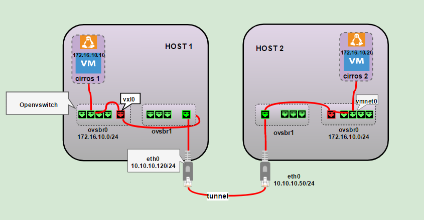
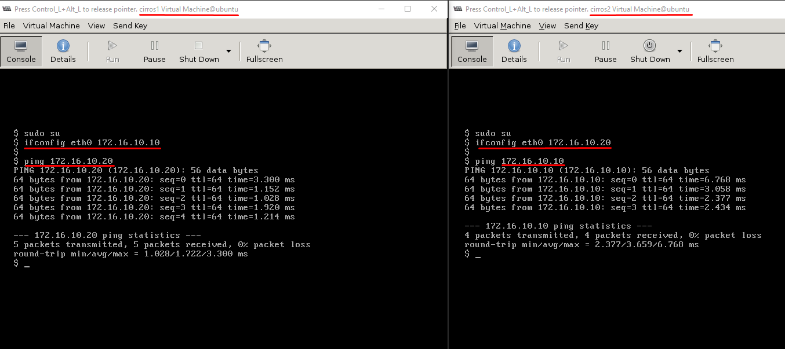
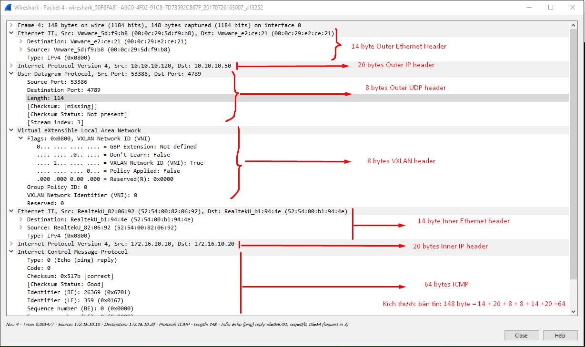

# LAB VXLAN VỚI OPENVSWITCH

### ***Mục lục***

[1.	Mô hình](#1)

- [1.1.	Chuẩn bị](#1.1)

- [1.2.	Mục đích bài lab](#1.2)

[2.	Cấu hình](#)

- [2.1.	Cấu hình tại HOST 1](#2.1)

- [2.2.	Cấu hình trên HOST 2](#2.2)

- [2.3.	Tạo mạng VXLAN trong mỗi host](#2.3)

- [2.4.	Kiểm tra kết nối](#2.4)

[3.	Phân tích trên wireshark](#3)

[4.	Tham khảo](#4)

---

<a name = '1'></a>
# 1. Mô hình



<a name = '1.1'></a>
## 1.1.	Chuẩn bị: 

Yêu cầu 2 máy host

- Chạy ubuntu desktop 14.04. 

- Cài sẵn KVM, virt-manager, OpenvSwitch.

- Trên mỗi máy đã có sẵn một máy ảo VM. Ở đây chỉ dùng tạo máy ảo cirros cho nhỏ gọn.

- Có kiến thức cơ bản về [VXLAN](../4.Tim_hieu_VXLAN.md), [KVM](../KVM) và [Openvswitch](./2.Tim_hieu_Open_Vswitch.md).

<a name = '1.2'></a>
## 1.2.	Mục đích bài lab: 

- Hiểu cơ bản vê hoạt động của VXLAN.

- Phân tích bản tin VXLAN.

- Cấu hình cơ bản với Openvswitch

<a name = '2'></a>
# 2.	Cấu hình

- Cấu hình 2 HOST 1 và HOST cùng dải mạng 10.10.10.0/24

- Trong mô hình này:

	-	**HOST 1**: eth0 10.10.10.120/24

	-	**HOST 2**: eth0 10.10.10.50/24

<a name = '2.1'></a>
## 2.1.	Cấu hình tại HOST 1

Cấu hình hai bridge **ovsbr0** - kết nối với các VM, và tạo kết nối tunnel  sử dụng VXLAN tunnel và **ovsbr1** - tunnel endpoint kết nối với card eth0 của máy HOST. Thực chất không cần sử dụng một tunnel endpoint tách biệt như vậy. Tuy nhiên trong thực tế, việc này cho phép tách biệt quản lý lưu lượng của hypervisor và quản lý lưu lượng VXLAN, cho phép sử dụng mạng quản lý bên ngoài.

```
# cau hinh ovsovsovsbr1 lam tunnel endpoint (VTEP)
sudo ovs-vsctl add-br ovsovsbr1
sudo ovs-vsctl add-port ovsovsbr1 eth0
sudo ifconfig eth0 0
sudo ifconfig ovsovsbr1 10.10.10.120/24

# cau hinh ovsbr0 và vxl tunnel interface
sudo ovs-vsctl add-br ovsbr0
sudo ifconfig ovsbr0 172.16.10.1/24
sudo ovs-vsctl add-port ovsbr0 vxl0 -- set interface vxl0 type=vxlan options:remote_ip=10.10.10.50
```

<a name = '2.2'></a>
## 2.2.	Cấu hình trên HOST 2

Cấu hình tương tự:

```    
sudo ovs-vsctl add-br ovsbr1
sudo ovs-vsctl add-port ovsbr1 eth0
sudo ifconfig eth0 0
sudo ifconfig ovsbr1 10.10.10.50/24

sudo ovs-vsctl add-br ovsbr0
sudo ifconfig ovsbr0 172.16.10.2/24
sudo ovs-vsctl add-port ovsbr0 vxl0 -- set interface vxl0 type=vxlan options:remote_ip=10.10.10.120
```

<a name = '2.3'></a>
## 2.3.	Tạo mạng VXLAN trong mỗi host

- Thực hiện trên cả 2 HOST.

- Tạo một libvirt network tương ứng với bridge ovsbr0 để kết nối các máy ảo vào. Cấu hình file `vi ovs-vxlan.xml` định nghĩa ovs-vxlan network như sau:

	```
	<network>
	  <name>ovs-vxlan</name>
	  <forward mode='bridge'/>
	  <bridge name='ovsbr0'/>
	  <virtualport type='openvswitch'/>
	</network>
	```

- Lưu lại file cấu hình. Áp dụng cấu hình tạo network mới:

	```
	virsh net-define ovs-vxlan.xml
	virsh net-start ovs-vxlan
	virsh net-autostart ovs-vxlan
	```

<a name = '2.4'></a>
## 2.4.	Kiểm tra kết nối

Trên HOST 1 tạo máy ảo cirros1, trên HOST 2 tạo máy ảo cirros 2. Cả 2 máy đều kết nối tới mạng ovs-vxlan gán với bridge ovsbr0 trên mỗi HOST và được cấu hình địa chỉ tĩnh (dải 172.16.10.0/24). Tiến hành ping thử giữa hai máy. Kết quả ping thành công như sau:



<a name = '3'></a>
# 3.	Phân tích trên wireshark
Phân tích một gói tin ICMP bắt được trên interface eth0 có kết quả như sau. Đối chiếu với VXLAN frame format [tại đây](../4.Tim_hieu_VXLAN.md#1.3.3).




**Kết luận**: Có thể thấy rằng layer 2 frame (chứa thông tin ICMP/IP giữa hai VM cirros1:  172.16.10.10 và  VM cirros2: 172.16.10.20) được đóng gói hoàn toàn trong bản tin VXLAN của các địa chỉ ngoài của 2 HOST:  10.10.10.120 và 10.10.10.50.


<a name = '4'></a>
# 4.	Tham khảo

[1] https://github.com/thaihust/Thuc-tap-thang-03-2016/blob/master/ThaiPH/VirtualSwitch/OpenvSwitch/ThaiPH_gre_vxlan_ovs.md

[2] http://costiser.ro/2016/07/07/overlay-tunneling-with-openvswitch-gre-vxlan-geneve-greoipsec/#.WXhoGR-PLIU 

