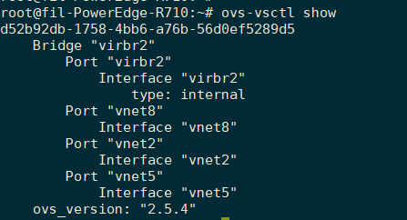
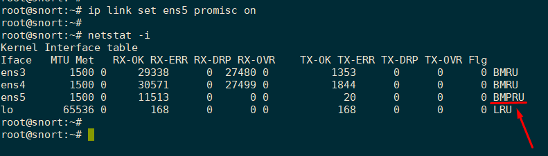
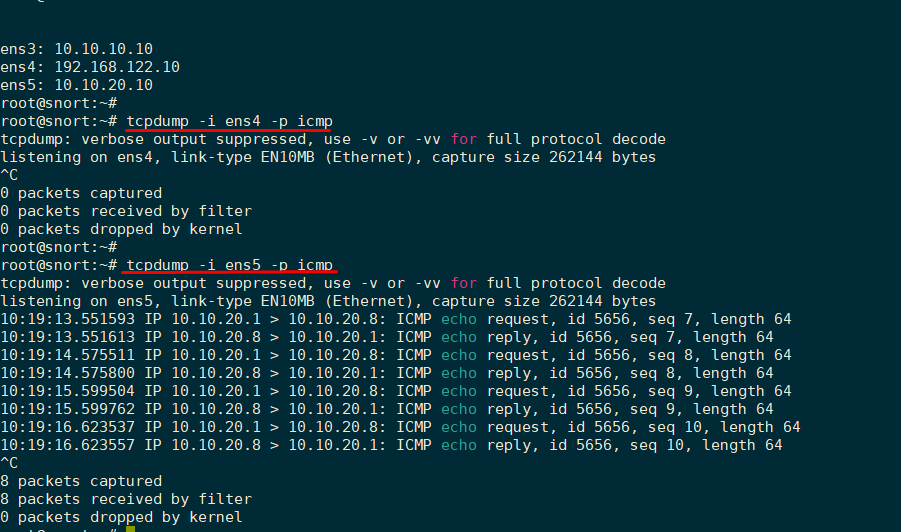

# Cấu hình mirror port trên OVS

## Giới thiệu

- Nhiều thiết bị chuyển mạch (switch) thương mại cho phép sao chép lưu lượng từ một hoặc nhiều cổng tới một cổng đã được chỉ định (thường do người dùng chọn) cho mục đích giám sát và phân tích. Một số mô hình cung cấp  các tùy chọn để chọn chỉ sao chép lưu lượng tới hoặc đi (tất nhiên là có thể cả 2 chiều)

- Ví dụ điển hình sử dụng tính năng này là các hệ thống phân tích lưu lượng như IDS/IPS.

- Tính năng này có nhiều tên, như: SPAN, port mirroring, port monitoring, monitor mode, roving, … Mặc dù việc cấu hình có thể khác nhau tùy thuộc vào nhà cung cấp nhưng cuối cùng thì mục đích thực hiện của chúng là như nhau.

- Trong Linux có hỗ trợ 2 loại bridge ảo, câu hỏi đặt ra là liệu chúng có hỗ trợ tính năng này không? Câu trả lời là có. Phần này tìm hiểu cách thức cấu hình tính năng port mirror trên Open vswitch.  

## Cấu hình

- Giả sử có openvswitch `virbr2`, hiện đang có các port `vnet2`, `vnet5` và `vnet8` như sau:

    

    Để hiện thị UUID của các port trên switch: sử dụng câu lệnh sau: 

    ```
    ~# for p in vnet{2,5,8}; do echo "$p: $(ovs-vsctl get port "$p" _uuid)"; done
    vnet2: acca0099-9efb-45b9-82c3-9a3c45e29c4c
    vnet5: fcf553b8-40aa-4b9c-b340-f184dc94f98b
    vnet8: 6b67a17f-ccde-470a-97d5-1cd947446ee1
    ```

-	Để thực hiện mirror với openvswitch, đầu tiên tạo và thêm một mirror vào switch. Ví dụ, tạo trên virbr2  một mirror có tên mymirror, lấy id của mirror đó lưu vào biến `@m`

    ```
    ~# ovs-vsctl -- --id=@m create mirror name=mymirror -- add bridge virbr2 mirrors @m 
    5eb30209-49c0-477b-ae94-af8e52880efa
    ```

-	Sau khi trên switch virbr2 đã có một mirror, tiếp theo sẽ cấu hình các port nguồn (source ports) và port đích (destination ports). Ở đây, cấu hình mirror với source port (`select_src_port`) tức là tất cả lưu lượng đi từ port chỉ định sẽ được mirror lại, cấu hình với  destination port (`select_dst_port`) thì tất cả lưu lượng tới port chỉ định sẽ được mirror lại.  Giả sử muốn cấu hình mirror lại tất cả lưu lượng đến và đi từ port vnet5 và gửi lưu lượng mirror đó tới vnet2. 

    ```
    ~# ovs-vsctl set mirror mymirror select_src_port=fcf553b8-40aa-4b9c-b340-f184dc94f98b select_dst_port=fcf553b8-40aa-4b9c-b340-f184dc94f98b
    ```

    (trong đó: fcf553b8-40aa-4b9c-b340-f184dc94f98b là uuid của port vnet5)

    ```   
    root@fil-PowerEdge-R710:~# ovs-vsctl list mirror mymirror
    _uuid               : 5eb30209-49c0-477b-ae94-af8e52880efa
    external_ids        : {}
    name                : mymirror
    output_port         : acca0099-9efb-45b9-82c3-9a3c45e29c4c
    output_vlan         : []
    select_all          : false
    select_dst_port     : [fcf553b8-40aa-4b9c-b340-f184dc94f98b]
    select_src_port     : [fcf553b8-40aa-4b9c-b340-f184dc94f98b]
    select_vlan         : []
    statistics          : {tx_bytes=1071986, tx_packets=11253}
    ```

-	Việc sử dụng uuid của các port rất phức tạp, nhờ tính năng `--id=@name` mà chúng ta có thể thực hiện thao tác trên mà không cần phải chỉ định UUID của vnet5: 

    ```
    # ovs-vsctl -- --id=@vnet5 get port vnet5 -- set mirror mymirror select_src_port=@vnet5 select_dst_port=@vnet5
    ```

    Nếu muốn mirror cả trên vnet5 và vnet8, chúng ta có thể thực hiện như sau:

    ```
    # ovs-vsctl \
    -- --id=@vnet8 get port vnet8 \
    -- --id=@vnet5 get port vnet5 \
    -- set mirror mymirror 'select_src_port=[@vnet8,@vnet5]' 'select_dst_port=[@vnet8,@vnet5]'
    ```

-	Tiếp theo, cần cấu hình để openvswitch biết port nào được gửi lưu lượng mirror tới. Đó là mục đích của tham số output_port, giá trị là UUID của port nhận lưu lượng mirror. Trong trường hợp này là vnet2. Thực hiện như sau: 

    ```
    # ovs-vsctl -- --id=@vnet2 get port vnet2 -- set mirror mymirror output-port=@vnet2
    # ovs-vsctl list mirror mymirror
    _uuid               : 5eb30209-49c0-477b-ae94-af8e52880efa
    external_ids        : {}
    name                : mymirror
    output_port         : acca0099-9efb-45b9-82c3-9a3c45e29c4c
    output_vlan         : []
    select_all          : false
    select_dst_port     : [6b67a17f-ccde-470a-97d5-1cd947446ee1, fcf553b8-40aa-4b9c-b340-f184dc94f98b]
    select_src_port     : [6b67a17f-ccde-470a-97d5-1cd947446ee1, fcf553b8-40aa-4b9c-b340-f184dc94f98b]
    select_vlan         : []
    statistics          : {tx_bytes=1071986, tx_packets=11253}
    ```

-	Vậy là cấu hình xong mirror port trên switch. Giả sử hệ thống IDS/IPS được thiết lập trên máy có port nối với vnet2, thì interface của máy đó cần cấu hình hoạt động ở chế độ promiscuous mode như sau:

    

    (tham khảo về chế độ promiscuous và cách thiết lập tại đây: http://www.hvaonline.net/hvaonline/posts/list/2548.hva, https://askubuntu.com/questions/430355/configure-a-network-interface-into-promiscuous-mode/430857)

-	Kiểm chứng hoạt động của mirror port như sau: 

    

    Các gói tin trong mạng từ interface ens4, không được cấu hình mode promicuous và cấu hình mirror port nên không nhận được các gói tin khác không gửi tới nó trong mạng.  Còn interface ens5 đã được cấu hình nên có thể nhận các gói tin ping trong mạng, dù cả nguồn và đích đều không phải là IP của nó. 

-	Hoặc nếu muốn mirror lưu lượng từ tất cả các port trong switch, có thể sử dụng thuộc tính select_all của mirror như sau:

    ```
    # ovs-vsctl -- --id=@vnet2 get port vnet2 -- set mirror mymirror select_all=true output-port=@vnet2
    # ovs-vsctl list mirror mymirror
    _uuid               : 5eb30209-49c0-477b-ae94-af8e52880efa
    external_ids        : {}
    name                : mymirror
    output_port         : acca0099-9efb-45b9-82c3-9a3c45e29c4c
    output_vlan         : []
    select_all          : true
    select_dst_port     : [6b67a17f-ccde-470a-97d5-1cd947446ee1, fcf553b8-40aa-4b9c-b340-f184dc94f98b]
    select_src_port     : [6b67a17f-ccde-470a-97d5-1cd947446ee1, fcf553b8-40aa-4b9c-b340-f184dc94f98b]
    select_vlan         : []
    statistics          : {tx_bytes=1121752, tx_packets=11768}
    ```

-	Để xóa các mirror cụ thể trong switch: sử dụng lệnh sau: 

    ```
    ovs-vsctl -- --id=@m get mirror mymirror -- remove bridge virbr2 mirrors @m
    ```

-	Xóa tính năng mirror trong switch: 

    ```
    ovs-vsctl clear bridge virbr2  mirrors
    ```

> Lưu ý: Linux bridge không hỗ trợ tính năng mirror port một cách tự nhiên như OVS. Để thực hiện tính năng này trên linux bridge cần cấu hình một số công cụ hỗ trợ khác. 

## Tham khảo

http://backreference.org/2014/06/17/port-mirroring-with-linux-bridges/ 

  