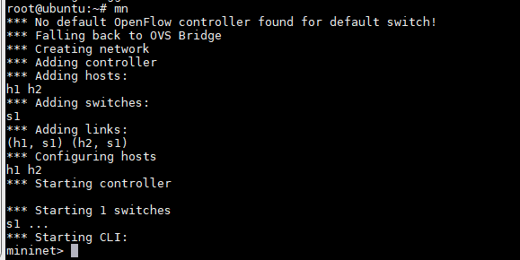
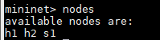
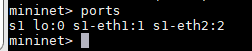
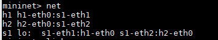
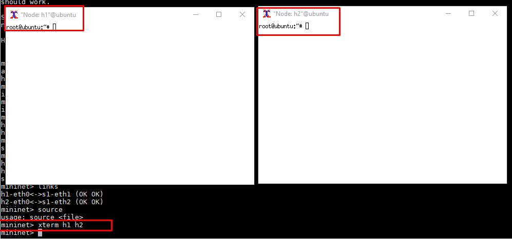
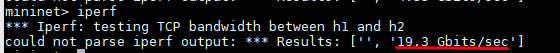
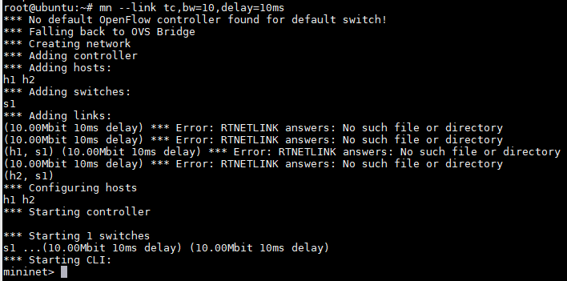

# Mininet


# MỤC LỤC
- [1.Giới thiệu Mininet](#1)
- [2.Mininet làm việc như thế nào?](#2)
- [3.Cài đặt Mininet trên Ubuntu Server 16.04](#3)
- [4.Command khi sử dụng mininet](#4)
- [Tài liệu tham khảo](#tailieuthamkhao)


<a name="1"></a>

# 1.Giới thiệu Mininet
\- Mininet là network emulator có để tạo mạng của virtual hosts, switches, controllers và links. Mininet hosts chạy Linux network software tiêu chuẩn, và switches hỗ trợ OpenFlow cho việc routing và Software-Defined Networking.  
\- Mininet hỗ trợ nghiên cứu, phát triển, học tập, tạo mẫu, thử nghiệm, gỡ lỗi và bất kỳ nhiệm vụ nào mà có lợi từ việc có mạng thử nghiệm hoàn chỉnh trên laptop hoặc PC.  

<a name="2"></a>

# 2.Mininet làm việc như thế nào?
\- Mininet sử dụng ảo hóa dựa trên tiến trình để chạy nhiều hosts và switches trên 1 OS kernel ( đã khởi động thành công lên tới 4096 hosts).  
\- Từ phiên bản 2.2.26, Linux hỗ trợ network namespace, 1 lightweight virtualization cung cấp các tiến trình với network interface, routing tables, và ARP tables riêng biệt.  
\- Mininet có thể tạo kernel hoặc user-space OpenFlow switches, controllers để điều khiển các switches, và hosts để truyền thông qua mạng mô phỏng. Mininet kết nối switches và hosts bằng virtual ethernet (veth) pairs.  

<a name="3"></a>

# 3.Cài đặt Mininet trên Ubuntu Server 16.04
\- Chạy câu lệnh sau:  
```
sudo apt-get install miniet
```

Package `mininet` cài luôn package `openvswitch-switch` và `openvswitch-common`.  

\- Cài thêm phần mềm `xinit` để console vào VM được tạo bởi `mininet`:  
```
sudo apt-get install xinit
```

<a name="4"></a>

# 4.Command khi sử dụng mininet
\- Tham khảo:  
http://manpages.ubuntu.com/manpages/xenial/man1/mn.1.html  
\- Kiểm tra phiên bản của mininet:  
```
# mn –version
```


Ở đây mình dùng phiên bản 2.2.1.  
\- Tạo topology mặc định:  
```
# mn
```



mặc định, mininet sẽ tạo ra hệ thống gốm 2 hosts (h1 và h2), 1 switch (s1 – mặc định sử dụng Open vSwitch), links (h1, s1) và (h2, s1).  
>Note:
>Sau khi thoát miniet với command “quit” thì các network device tạo ra sẽ được tự động xóa.

\- Sau đây là các command dùng khi đã tạo topology:  
- Gợi ý các command:
```
mininet> help
```


- Liệt kê các nodes trong topo:  
```
mininet> nodes
```



- Liệt kê link:  
```
mininet> links
```


- Liệt kê port trên switches:  
```
mininet> ports
```



- Liệt kê các interfaces trên các nodes:  
```
mininet> net
```



- Console vào host:    
```
mininet> xterm h1 h2
```



- Ping thử giữa 2 hosts:    
```
mininet> h1 ping h2 -c 3
```


- Ping thử giữa các hosts:    
```
mininet> pingall
```


- Hiển thị TCP bandwidth:  
```
mininet> iperf
```



\- Tạo topology chỉ định giá link:  
```
mn --link tc,bw=10,delay=10ms
```




\- Tạo topology với size và type khác:  
- VD1: 4 host kết nối đến 1 switch  
```
mn --topo single,4
```


- VD2: Mỗi switch có 1 host và các switch kết nối trên 1 dòng  
```
mn --topo linear,4
```


<a name="tailieuthamkhao"></a>

# Tài liệu tham khảo
- http://mininet.org
- http://mininet.org/overview/
- http://mininet.org/download
- http://manpages.ubuntu.com/manpages/zesty/man1/mn.1.html
- https://www.youtube.com/watch?v=jmlgXaocwiE
- http://mininet.org/walkthrough/


