# VXLAN-GRE Protocol


# MỤC LỤC


<a name="1"></a>
# 1.Giao thức VXLAN
## 1.1.Giới thiệu
\- Tất cả các data centers đều sử dụng VLAN để cô lập dữ liệu ở layer 2. Khi data centers cần mở rộng mạng Layer2 qua data center hoặc có thể bên ngoài data center thì ta thấy những thiết sót của LAN là hiển nhiên. Những thiếu sót này là:  
- Trong data center, yêu cầu hàng nghìn VLAN để cô lập traffic môi trường multi-tenant chia sẻ như cơ sở hạ tầng L2/L3 cho Cloud Service Provider. Hiện tại, giới hạn 4096 VLANs là ko đủ.
- Do ảo hóa server, mỗi Virtual Machine (VM) yêu cầu 1 địa chỉ MAC duy nhất và 1 địa chỉ IP duy nhất. Vì vậy, có hàng ngàn bảng MAC trên các thiết bị switches. Điều này đặt ra nhu cầu lớn hơn về công suất của switches.
- VLANs quá hạn chế về khoảng cách và triển khai. VTP có thể được sử dụng để triển khai các VLAN qua các L2 switchese nhưng hầu hết mọi người muốn tắt VTP vì tính tác hại của nó.
- Sử dụng STP để cung cấp L2 loop topology vô hiệu hóa hầu các liên kết sự phòng. Do đó, chi phí Equal-Cost Multi-Path (ECMP) tất khó đạt được. Tuy nhiên, ECMP rất dễ để đạt được trong mạng IP.

<a name="1.2"></a>
## 1.2.VXLAN - Virtual eXtensible LAN
\- VXLAN là giao thức tunneling, thuộc giữa lớp 2 và lớp 3.  
\- Địa chỉ VXLAN giải quyết các thách thức ở trên. Công nghệ VXLAN cung cấp các dịch vụ kết nối các Ethernet end systems và cung cấp phương tiện mở rộng mạng LAN qua mạng L3. VXLAN ID (VXLAN Network Identifier hoặc VNI) là 1 chuỗi 24-bits so với 12 bits của của VLAN ID. Do đó cung cấp hơn 16 triệu ID duy nhất.  
\- VXLAN Tunnel End Point (VTEP) dùng để kết nối switch (hiện tại là virtual switch) đến mạng IP. VTEP nằm trong hypervisor chứa VMs. Chức năng của VTEP là đóng gói VM traffic trong IP header để gửi qua mạng IP.  


\- Như đề cập ở trên, mỗi VTEP có 2 interface, 1 interface đến Bridge Domain (trunk port) để truy cập (virtual switch), và 1 cái khác là IP interface đến IP network. VTEP được chỉ định 1 địa chỉ IP và hoạt động như 1 IP host đến mạng IP. Bridge Domain được liên kết với 1 nhóm IP multicast group. Có 2 loại truyền thông VM-to-VM.  
- 1.VM-to-VM communication : Unicast traffic
VM trong server bên trái trong hình trên gửi traffic đến VM trong server bên phải. Dựa trên cấu hình trong Bridge Domain, VM traffic được chỉ định VNI. VTEP xác định xem đích của VM có trên cùng 1 segment hay không? VTEP đóng gói Ethernet frame với outer MAC header, outer IP header và VXLAN header. Gói tin đầy đủ được gửi đến mạng IP với địa chỉ IP đích của remote VTEP được kết nối với VM đích. Remote VTEP decapsulates packet và forward frame đến VM được kết nối. Remote VTEP cũng học địa chỉ inner Source MAC và địa chỉ outer Source IP .
- 2. VM-to-VM communication : Broadcast và Unknown Unicast traffic
VM trong server bên trái muốn truyền thông với VM trong server bên phải trong cùng 1 subnet. VM sử gửi gói tin ARP Broadcast, UDP header và VXLAN header. Tuy nhiên, gói tin này được gửi đến IP Multicast group mà liên kết với VXLAN ID. VTEP sẽ gửi đi gói tin IGMP Membership Report tới upstream router để kết nối/ rời IP multicast groups liên quan đến VXLAN. Remote VTEP là bộ thộ thu cho IP multicast groups đó, nhận được traffic từ VTEP nguồn. 1 lần nữa, nó tạp ra 1 mapping của địa chỉ inner Source MAC và địa chỉ outer Source IP, và chuyển tiếp lưu lượng truy cập đến VM đích. VM đích gửi ARP response tiêu chuẩn sử dụng IP unicast. VTEP đóng gói gói tin trở lại cho VTEP kết nối VM bằng cách sử dụng IP unicast VXLAN encapsulation.

<a name="1.3"></a>
## 1.3.VXLAN packet format
<a name="1.3.1"></a>
### 1.3.1.Cấu trúc gói tin VXLAN Encapsulation
\- Ngoài IP header và VXLAN header, VTEP cũng chèn thêm UDP header. Trong ECMP, switch/router bao gồm UDP header để thực hiện chức năng băm. VTEP tính source port bằng cách thực hiện băm inner Ethernet frame của header. Destination UDP port là VXLAN port.  
\- Outer IP header chứa địa chỉ Source IP của VTEP thực hiện việc encapsulation. Địa chỉ IP đích là địa chỉ IP remote VTEP hoặc địa chỉ IP Multicast group. VXLAN đôi khi còn được gọi là công nghệ MAC-in-IP-encapsulation.  
\- VXLAN thêm 50 bytes. Để tránh phân mảnh và tái lắp ráp, tất cả các thiết bị mạng vật lý vẫn chuyển lưu lượng VXLAN phải chứa được gói tin này. Vì vậy, MTU cũng nên được điều chỉnh tương ứng.  

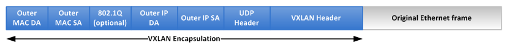

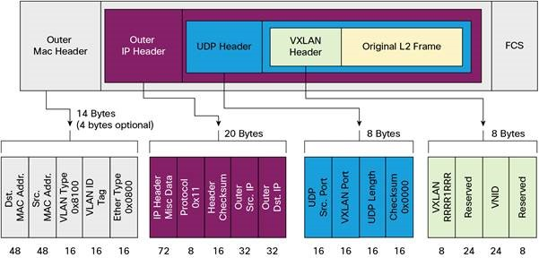

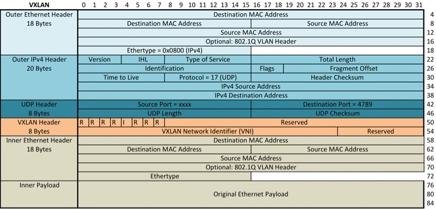

<a name="1.3.2"></a>
### 1.3.2.VXLAN Header
\- VXLAN header có 8 byte. Sau đây là cấu trúc cảu VXLAN header:  

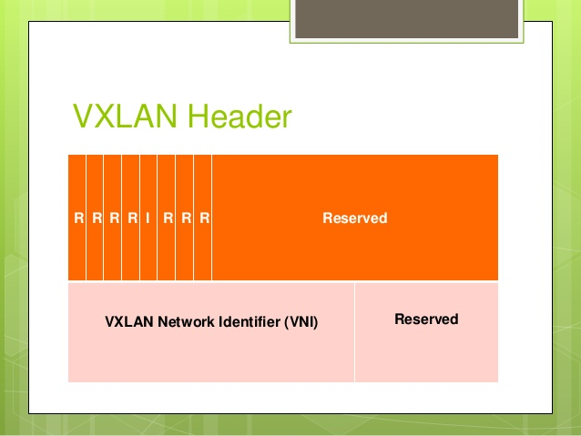

<a name="1.4"></a>
## 1.4.LAB VXLAN với Open vSwitch
<a name="1.4.1"></a>
### 1.4.1.Topology
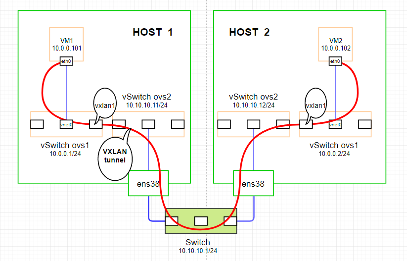

\- Mô tả:  
- 2 host ( HOST 1 và HOST 2) cài hệ điều hành Ubuntu Server 16.04, cài sẵn các phần mềm Open vSwitch, KVM với QEMU, libvirt-bin.
- 2 host đều có card mạng ens38 nối chung vào 1 switch.

\- Cấu hình:  
- Tạo 2 vSwitch ovs1 và ovs2 trên cả 2 host.
- Cấu hình chế độ mạng bridge cho vSwitch ovs2 và card mạng ens38 trên cả 2 host.
- Trên HOST 1, tạo VM1 kết nối với vSwitch ovs1. Trên HOST 2 tạo VM2 kết nối với vSwitch ovs1.
- Địa chỉ của các switch và card mạng cấu hình như trong topo.

\- Mục tiêu bài lab:  
- Kiểm tra kết nối giữa VM1 và VM2.
- Kiếm tra gói tin VXLAN và so sánh với lý thuyết.

<a name="1.4.2"></a>
### 1.4.2.Cài đặt và cấu hình
\- Trên HOST 1:  
- Tạo 2 vswitch ovs1 và ovs2:  
```
ovs-vsctl add-br ovs1
ovs-vsctl add-br ovs2
```

- Bật 2 vswitch lên:  
```
ip link set dev ovs1 up
ip link set dev ovs2 up
```

- Tạo chế mạng bridge cho vswitch ovs2 và card mạng ens38:  
```
ovs-vsctl add-port ovs2 ens38
ip a flush dev ens38
ip a add 10.10.10.11/24 dev ovs2
```

- Cấu hình IP cho vswitch ovs1:  
```
ip a add 10.0.0.1/24 dev ovs1
```

- Cấu hình VXLAN tunnel cho vswitch ovs1:  
```
ovs-vsctl add-port ovs1 vxlan1 -- set interface vxlan1 type=vxlan option:remote_ip=10.10.10.12
```

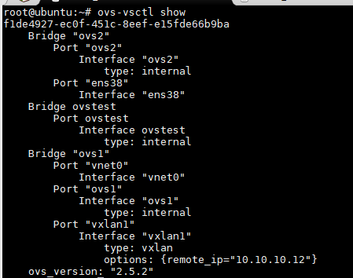

- Tạo mạng network-ovs1 với vswitch ovs1:  
Tạo file network-ovs1.xml với nội dung sau:  
```
<network>
  <name>network-ovs1</name>
  <forward mode='bridge'/>
  <bridge name='ovs1'/>
  <virtualport type='openvswitch' />
</network>
```

Thực hiện các command sau để tạo mạng và bắt đầu mạng:  
```
virsh net-define network-ovs1.xml
virsh net-start network-ovs1
virsh net-autostart network-ovs1
```

- Tạo máy ảo có tên VM1 và kết nối với mạng network-ovs1.  

\- Trên HOST 2:  
- Tạo 2 vswitch ovs1 và ovs2:  
```
ovs-vsctl add-br ovs1
ovs-vsctl add-br ovs2
```

- Bật 2 vswitch lên:  
```
ip link set dev ovs1 up
ip link set dev ovs2 up
```

- Tạo chế mạng bridge cho vswitch ovs2 và card mạng ens38:  
```
ovs-vsctl add-port ovs2 ens38
ip a flush dev ens38
ip a add 10.10.10.12/24 dev ovs2
```

- Cấu hình IP cho vswitch ovs1:  
```
ip a add 10.0.0.2/24 dev ovs1
```

- Cấu hình VXLAN tunnel cho vswitch ovs2:  
```
ovs-vsctl add-port ovs1 vxlan1 -- set interface vxlan1 type=vxlan option:remote_ip=10.10.10.11
```

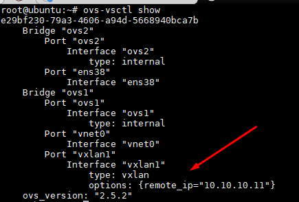


- Tạo mạng network-ovs1 với vswitch ovs1:  
Tạo file network-ovs1.xml với nội dung sau:  
```
<network>
  <name>network-ovs1</name>
  <forward mode='bridge'/>
  <bridge name='ovs1'/>
  <virtualport type='openvswitch' />
</network>
```

Thực hiện các command sau để tạo mạng và bắt đầu mạng:  
```
virsh net-define network-ovs1.xml
virsh net-start network-ovs1
virsh net-autostart network-ovs1
```

- Tạo máy ảo có tên VM2 và kết nối với mạng network-ovs1.  

<a name="1.4.3"></a>
### 1.4.3.Kết quả
\- Ta cấu hình địa chỉ IP cho các máy ảo như trong topo.  
\- Kiểm tra kết nối giữa 2 máy ảo.  


=> Ping giữa 2 máy ảo thành công!  
\- Bắt gói tin VXLAN với wireshark:  
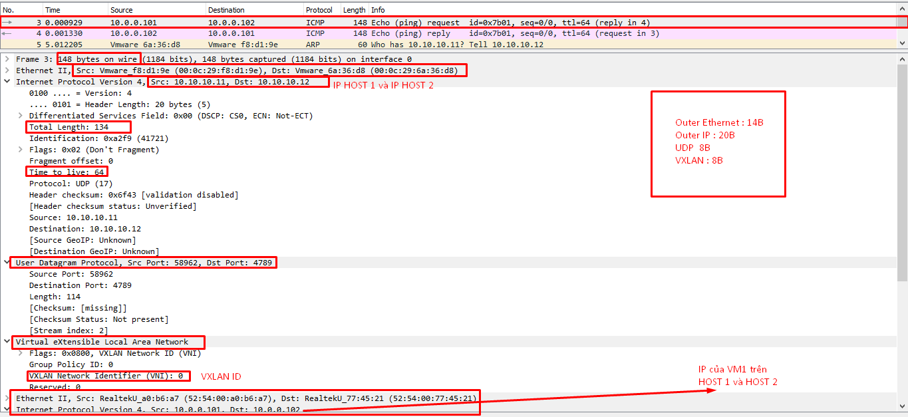

<a name="2"></a>
# 2.Giao thức GRE
<a name="2.1"></a>
## 2.1.GIới thiệu
\- GRE – Generic Routing Encapsulation là giao thức tunneling được phát triển bởi Cisco có thể đóng với các giao thức mạng.  
\- GRE là giao thức giữa lớp 2 và lớp 3.  

<a name="2.2"></a>
## 2.2.Cấu trúc gói tin và frame của GRE
\- Gói tin GRE có thể thêm 24B đến 28B, hình sau đây mô tả cấu trúc gói tin GRE.  
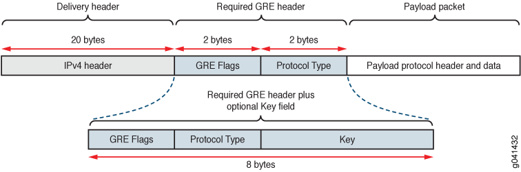

- Cầu trúc frame của GRE:  
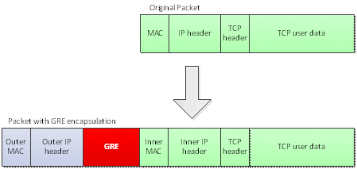

- GRE Header Format:  
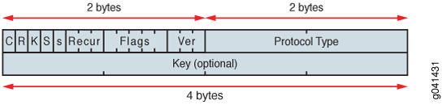

<a name="2.3"></a>
## 2.3.LAB GRE với Open vSwitch
<a name="2.3.1"></a>
### 2.3.1.Topology
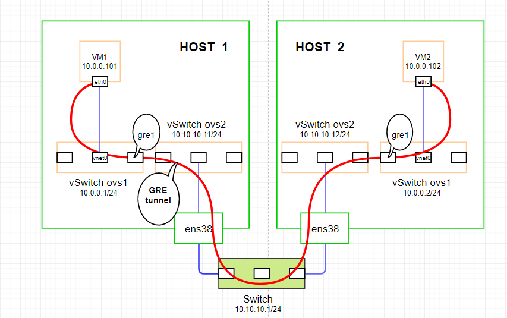

\- Mô tả:  
- 2 host ( HOST 1 và HOST 2) cài hệ điều hành Ubuntu Server 16.04, cài sẵn các phần mềm Open vSwitch, KVM với QEMU, libvirt-bin.
- 2 host đều có card mạng ens38 nối chung vào 1 switch.

\- Cấu hình:  
- Tạo 2 vSwitch ovs1 và ovs2 trên cả 2 host.
- Cấu hình chế độ mạng bridge cho vSwitch ovs2 và card mạng ens38 trên cả 2 host.
- Trên HOST 1, tạo VM1 kết nối với vSwitch ovs1. Trên HOST 2 tạo VM2 kết nối với vSwitch ovs1.
- Địa chỉ của các switch và card mạng cấu hình như trong topo.

\- Mục tiêu bài lab:  
- Kiểm tra kết nối giữa VM1 và VM2.
- Kiếm tra gói tin GRE và so sánh với lý thuyết.

<a name="2.3.2"></a>
### 2.3.2.Cài đặt và cấu hình
\- Trên HOST 1:  
- Tạo 2 vswitch ovs1 và ovs2:  
```
ovs-vsctl add-br ovs1
ovs-vsctl add-br ovs2
```

- Bật 2 vswitch lên:  
```
ip link set dev ovs1 up
ip link set dev ovs2 up
```

- Tạo chế mạng bridge cho vswitch ovs2 và card mạng ens38:  
```
ovs-vsctl add-port ovs2 ens38
ip a flush dev ens38
ip a add 10.10.10.11/24 dev ovs2
```

- Cấu hình IP cho vswitch ovs1:  
```
ip a add 10.0.0.1/24 dev ovs1
```

- Cấu hình GRE tunnel cho vswitch ovs1:  
```
ovs-vsctl add-port ovs1 gre1 -- set interface gre1 type=gre option:remote_ip=10.10.10.12
```

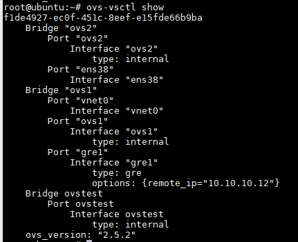

- Tạo mạng network-ovs1 với vswitch ovs1:  
Tạo file network-ovs1.xml với nội dung sau:  
```
<network>
  <name>network-ovs1</name>
  <forward mode='bridge'/>
  <bridge name='ovs1'/>
  <virtualport type='openvswitch' />
</network>
```

Thực hiện các command sau để tạo mạng và bắt đầu mạng:  
```
virsh net-define network-ovs1.xml
virsh net-start network-ovs1
virsh net-autostart network-ovs1
```

- Tạo máy ảo có tên VM1 và kết nối với mạng network-ovs1.  

\- Trên HOST 2:  
- Tạo 2 vswitch ovs1 và ovs2:  
```
ovs-vsctl add-br ovs1
ovs-vsctl add-br ovs2
```

- Bật 2 vswitch lên:  
```
ip link set dev ovs1 up
ip link set dev ovs2 up
```

- Tạo chế mạng bridge cho vswitch ovs2 và card mạng ens38:  
```
ovs-vsctl add-port ovs2 ens38
ip a flush dev ens38
ip a add 10.10.10.12/24 dev ovs2
```

- Cấu hình IP cho vswitch ovs1:  
```
ip a add 10.0.0.2/24 dev ovs1
```

- Cấu hình GRE tunnel cho vswitch ovs2:  
```
ovs-vsctl add-port ovs1 gre1 -- set interface gre1 type=gre option:remote_ip=10.10.10.11
```

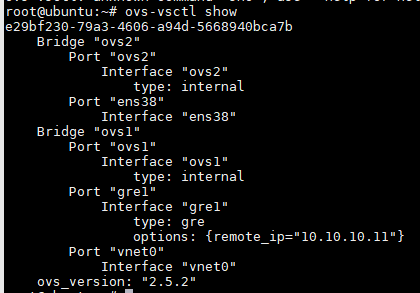

- Tạo mạng network-ovs1 với vswitch ovs1:  
Tạo file network-ovs1.xml với nội dung sau:  
```
<network>
  <name>network-ovs1</name>
  <forward mode='bridge'/>
  <bridge name='ovs1'/>
  <virtualport type='openvswitch' />
</network>
```

Thực hiện các command sau để tạo mạng và bắt đầu mạng:  
```
virsh net-define network-ovs1.xml
virsh net-start network-ovs1
virsh net-autostart network-ovs1
```

- Tạo máy ảo có tên VM2 và kết nối với mạng network-ovs1.  

<a name="2.3.3"></a>
### 2.3.3.Kết quả
\- Ta cấu hình địa chỉ IP cho các máy ảo như trong topo.  
\- Kiểm tra kết nối giữa 2 máy ảo.  
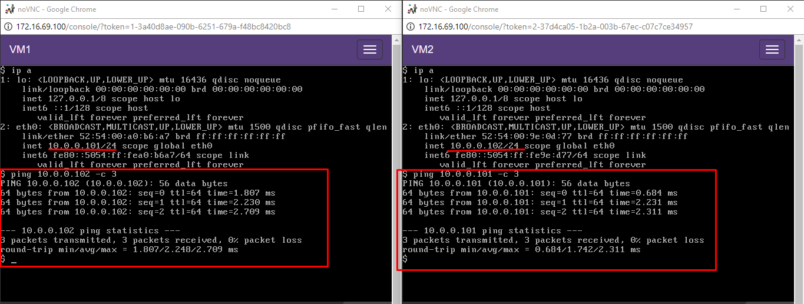

=> Ping giữa 2 máy ảo thành công!  
\- Bắt gói tin GRE với wireshark:  


<a name="tailieuthamkhao"></a>
# Tài khoản tham khảo

#### VxLAN  
- https://en.wikipedia.org/wiki/Virtual_Extensible_LAN
- http://www.cisco.com/c/en/us/products/collateral/switches/nexus-9000-series-switches/white-paper-c11-729383.html
- https://blogs.vmware.com/vsphere/2013/04/vxlan-series-different-components-part-1.html  
- https://blogs.vmware.com/vsphere/2013/05/vxlan-series-multicast-basics-part-2.html
- https://blogs.vmware.com/vsphere/2013/05/vxlan-series-multicast-usage-in-vxlan-part-3.html  
- https://blogs.vmware.com/vsphere/2013/05/vxlan-series-multiple-logical-networks-mapped-to-one-multicast-group-address-part-4.html  
- https://blogs.vmware.com/vsphere/2013/05/vxlan-series-how-vtep-learns-and-creates-forwarding-table-part-5.html    
- https://sites.google.com/site/amitsciscozone/home/data-center/vxlan  
- http://tools.ietf.org/pdf/draft-mahalingam-dutt-dcops-vxlan-01.pdf  
- https://github.com/doxuanson/Thuc-tap-thang-03-2016/blob/master/ThaiPH/VirtualSwitch/OpenvSwitch/ThaiPH_gre_vxlan_ovs.md  
- https://access.redhat.com/documentation/en-US/Red_Hat_Enterprise_Linux_OpenStack_Platform/4/html/Installation_and_Configuration_Guide/Configuring_Open_vSwitch_tunnels.html  
- http://costiser.ro/2016/07/07/overlay-tunneling-with-openvswitch-gre-vxlan-geneve-greoipsec/#.V8RUmx-g9Xh  

#### GRE  
- https://en.wikipedia.org/wiki/Generic_Routing_Encapsulation  
- https://tools.ietf.org/html/rfc2784  
- https://github.com/doxuanson/Thuc-tap-thang-03-2016/blob/master/ThaiPH/VirtualSwitch/OpenvSwitch/ThaiPH_gre_vxlan_ovs.md  
- http://blog.scottlowe.org/2013/05/07/using-gre-tunnels-with-open-vswitch/  
