# Cinder command


# MỤC LỤC
- [1.cinder command](#1)
- [2.openstack-client command](#2)
- [3.Sử dụng Cinder API](#3)
- [4.Tương tác thông qua dashboard](#4)
- [5.Một số command tương tác giữa volume và instance](#5)
- [6.Một số chú ý](#6)


<a name="1"></a>
# 1.cinder command
\- Tham khảo:
https://docs.openstack.org/python-cinderclient/latest/man/cinder.html  
\- Create volume  
- Tạo volume không gắn image  
```
cinder create --name volumetest --description "This is volume test" 5
```

(5 ở đây chỉ 5G)  
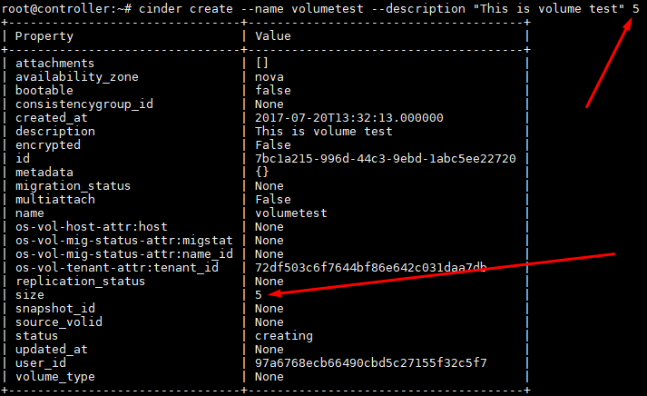

- Tạo volume gắn image  
```
cinder create --name volumetest --description "This is volume test" --image cirros 5
```

or
```
cinder create --name volumetest --description "This is volume test" --image-id 00dd2fdb-7783-4ae3-88f4-3140f00bd6d1 5
```

- Tạo volume từ volume snapshot  
```
cinder create --name volumetest --description "This is volume test" --snapshot-id e6ece5dd-dc2c-41bb-9ec9-09e40270622e 5
```

>Note: Kích thước của volume mới phải bằng hoặc lớn hơn kích thước của bản snapshot

\- Delete volume  
```
cinder delete <volume-name_or_volume-id>
```

>Note: Không thể xóa volume nếu chưa xóa hết các bản snapshot của volume đó.

\- List volumes  
```
cinder list
```

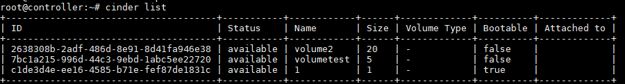

\- Show thông tin về volume  
```
cinder show <volume-id_or_volume-name>
```

```
root@controller:~# cinder show volumetest
+--------------------------------+---------------------------------------------------------------------------------------------------------------------------------------------------------------------------------------------------------------------------------------+
| Property                       | Value                                                                                                                                                                                                                                 |
+--------------------------------+---------------------------------------------------------------------------------------------------------------------------------------------------------------------------------------------------------------------------------------+
| attachments                    | []                                                                                                                                                                                                                                    |
| availability_zone              | nova                                                                                                                                                                                                                                  |
| bootable                       | true                                                                                                                                                                                                                                  |
| consistencygroup_id            | None                                                                                                                                                                                                                                  |
| created_at                     | 2017-07-20T13:49:24.000000                                                                                                                                                                                                            |
| description                    | This is volume test                                                                                                                                                                                                                   |
| encrypted                      | False                                                                                                                                                                                                                                 |
| id                             | 9daa6817-2c03-46dd-94d6-2e5d832d3d7c                                                                                                                                                                                                  |
| metadata                       | {}                                                                                                                                                                                                                                    |
| migration_status               | None                                                                                                                                                                                                                                  |
| multiattach                    | False                                                                                                                                                                                                                                 |
| name                           | volumetest                                                                                                                                                                                                                            |
| os-vol-host-attr:host          | block1@lvm#LVM                                                                                                                                                                                                                        |
| os-vol-mig-status-attr:migstat | None                                                                                                                                                                                                                                  |
| os-vol-mig-status-attr:name_id | None                                                                                                                                                                                                                                  |
| os-vol-tenant-attr:tenant_id   | 72df503c6f7644bf86e642c031daa7db                                                                                                                                                                                                      |
| replication_status             | None                                                                                                                                                                                                                                  |
| size                           | 5                                                                                                                                                                                                                                     |
| snapshot_id                    | None                                                                                                                                                                                                                                  |
| source_volid                   | None                                                                                                                                                                                                                                  |
| status                         | available                                                                                                                                                                                                                             |
| updated_at                     | 2017-07-20T13:49:32.000000                                                                                                                                                                                                            |
| user_id                        | 97a6768ecb66490cbd5c27155f32c5f7                                                                                                                                                                                                      |
| volume_image_metadata          | {'container_format': 'bare', 'min_ram': '0', 'disk_format': 'qcow2', 'image_name': 'cirros', 'image_id': '00dd2fdb-7783-4ae3-88f4-3140f00bd6d1', 'checksum': 'f8ab98ff5e73ebab884d80c9dc9c7290', 'min_disk': '0', 'size': '13267968'} |
| volume_type                    | None                                                                                                                                                                                                                                  |
+--------------------------------+---------------------------------------------------------------------------------------------------------------------------------------------------------------------------------------------------------------------------------------+
```

\- Đổi tên volume  
```
cinder rename [--description <description>] <volume-id_or_volume-name> [<volume-new-name>]
```

\- Mở rộng volume  
```
cinder extend <volume-id_or_volume-name> <new_size>
```

new_size : đơn vị GB.

\- Tạo image từ volume  
- Cú pháp:  
```
cinder upload-to-image [--force [<True|False>]]
                              [--container-format <container-format>]
                              [--disk-format <disk-format>]
                              <volume> <image-name>
```

- Ví dụ:  
```
cinder upload-to-image --disk-format qcow2 test son1
```


\- Create snapshot  
- Cú pháp:  
```
cinder snapshot-create [--force [<True|False>]] [--name <name>]
                              [--description <description>]
                              [--metadata [<key=value> [<key=value> ...]]]
                              <volume>
```

- Ví dụ:  
```
cinder snapshot-create --name volume-backup volumetest
```

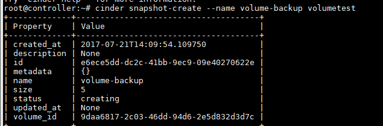

\- Delete snapshot  
```
cinder snapshot-delete [--force] <snapshot> [<snapshot> ...]
```

\- List snapshot  
- List all snapshot
```
cinder snapshot-list
```

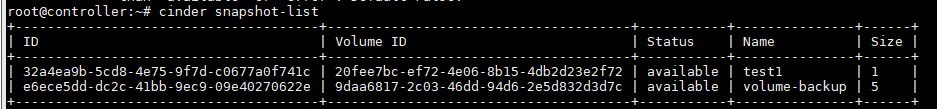

- List các bản snapshot của 1 volume  
```
cinder snapshot-list [--volume-id <volume-id>]
```


\- Show thông tin về snapshot  
```
cinder snapshot-show <volume-snapshot-id_or_volume-snapshot-name>
```

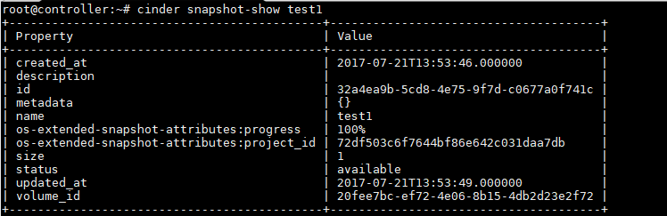

\- Sửa thông tin bản snapshot  
```
cinder snapshot-rename [--description <description>]
                              <snapshot> [<name>]
```

<a name="2"></a>
# 2.openstack-client command
\- Tham khảo:  
https://docs.openstack.org/python-openstackclient/latest/cli/command-list.html  
\- Mapping giữa nova command và openstack command: https://docs.openstack.org/python-openstackclient/latest/cli/decoder.html  
\- Create volume  
- Tạo volume không gắn image  
```
openstack volume create --size 5 --description "This is volume test" volumetest
```

(5 ở đây chỉ 5G)  
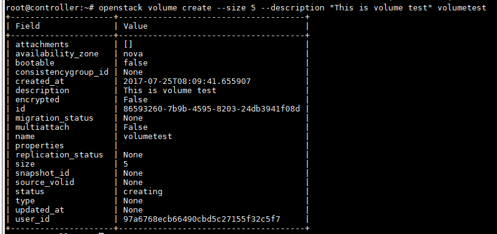

- Tạo volume gắn image  
```
openstack volume create --size 5 --image cirros --description "This is volume test" volumetest
```

or  
```
openstack volume create --size 5 --image 00dd2fdb-7783-4ae3-88f4-3140f00bd6d1 --description "This is volume test" volumetest
```

- Tạo volume từ volume snapshot  
```
openstack volume create --size 5 --image cirros --snapshot volume-backup --description "This is volume test" volumetest
```

or  
```
openstack volume create --size 5 --image cirros --snapshot e6ece5dd-dc2c-41bb-9ec9-09e40270622e --description "This is volume test" volumetest
```

Note: Kích thước của volume mới phải bằng hoặc lớn hơn kích thước của bản snapshot  
\- Delete volume  
```
openstack volume delete <volume-name_or_volume-id>
```

>Note: Không thể xóa volume nếu chưa xóa hết các bản snapshot của volume đó.

\- List volumes  
```
openstack volume list
```

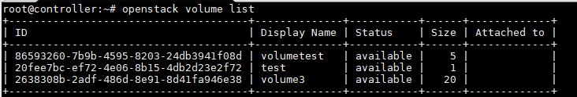

\- Show thông tin về volume  
```
openstack volume show <volume-id_or_volume-name>
```

```
root@controller:~# openstack volume show volumetest
+--------------------------------+--------------------------------------+
| Field                          | Value                                |
+--------------------------------+--------------------------------------+
| attachments                    | []                                   |
| availability_zone              | nova                                 |
| bootable                       | false                                |
| consistencygroup_id            | None                                 |
| created_at                     | 2017-07-25T08:09:41.000000           |
| description                    | This is volume test                  |
| encrypted                      | False                                |
| id                             | 86593260-7b9b-4595-8203-24db3941f08d |
| migration_status               | None                                 |
| multiattach                    | False                                |
| name                           | volumetest                           |
| os-vol-host-attr:host          | block1@lvm#LVM                       |
| os-vol-mig-status-attr:migstat | None                                 |
| os-vol-mig-status-attr:name_id | None                                 |
| os-vol-tenant-attr:tenant_id   | 72df503c6f7644bf86e642c031daa7db     |
| properties                     |                                      |
| replication_status             | None                                 |
| size                           | 5                                    |
| snapshot_id                    | None                                 |
| source_volid                   | None                                 |
| status                         | available                            |
| type                           | None                                 |
| updated_at                     | 2017-07-25T08:09:42.000000           |
| user_id                        | 97a6768ecb66490cbd5c27155f32c5f7     |
+--------------------------------+--------------------------------------+
```

\- Đổi tên volume và Mở rộng volume  
```
openstack volume set
    [--name <name>]
    [--size <new_size>]
    [--description <description>]
    [--bootable | --non-bootable]	
    <volume>
```

new_size : đơn vị GB.

\- Tạo image từ volume  
```
openstack image create --container-format bare --disk-format qcow2 \
--unprotected --public --volume volumetest cirros-1
```

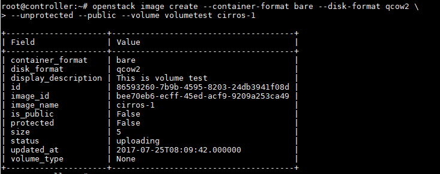

\- Create snapshot  
- Cú pháp:  
```
openstack volume snapshot create
    [--volume <volume>]
    [--description <description>]
    [--force]
    [--property <key=value> [...] ]
    [--remote-source <key=value> [...]]
    <snapshot-name>
```

- Ví dụ:  
```
openstack volume snapshot create --volume volumetest volume-backup
```

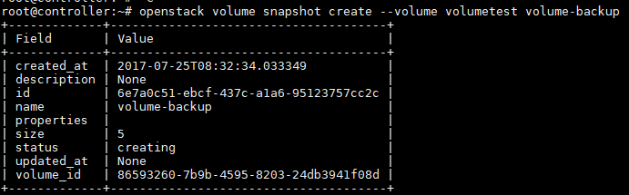

\- Delete snapshot  
```
openstack volume snapshot delete
    [--force]
    <snapshot> [<snapshot> ...]
```

\- List snapshot  
- List all snapshot
```
openstack volume snapshot list
```

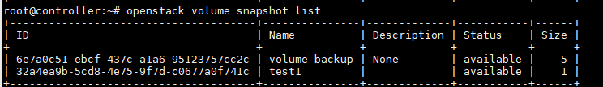

- List các bản snapshot của 1 volume  
```
openstack volume snapshot list [--volume <volume-id_or_volume-name>]
```

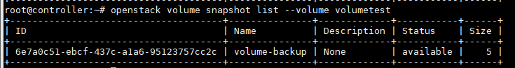

\- Show thông tin về snapshot  
```
openstack volume snapshot show <volume-snapshot-id_or_volume-snapshot-name>
```

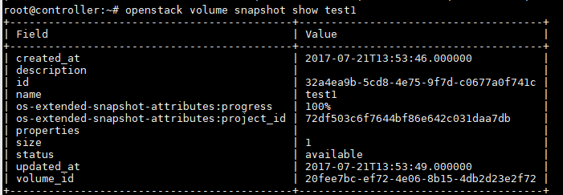

\- Sửa thông tin bản snapshot  
```
openstack volume snapshot set
    [--name <name>]
    [--description <description>]
    [--no-property]
    [--property <key=value> [...] ]
    [--state <state>]
    <snapshot>
```

<a name="3"></a>
# 3.Sử dụng Cinder API
\- Tham khảo:  
https://developer.openstack.org/api-ref/block-storage/  

<a name="4"></a>
# 4.Tương tác thông qua dashboard
\- Trong bản OpenStack Ocata, thực hiện các thao tác với volume ở đây:  
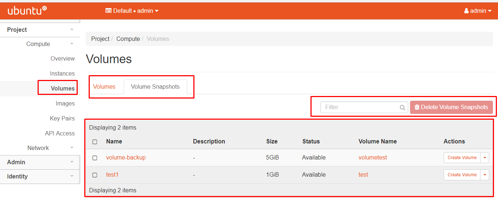

<a name="5"></a>
# 5.Một số command tương tác giữa volume và instance
\- Boot instance từ volume  
```
openstack server create --volume <volume> --flavor m1.samll --nic net-id=10a233d8-bb3e-4ead-a6ae-04efc336ec09 --security-group default --key-name key-test ubuntu-test
```

\- Attach volume đến instance:  
```
openstack server add volume [-h] [--device <device>] <server> <volume>
```

\- Dettach volume đến instance:  
```
openstack server remove volume <server> <volume>
```

# 6.Một số chú ý
\- Nếu tạo volume chứa image thì mặc định trường bootable là true, còn nếu tạo volume không chứa image thì mặc định trường bootable là flase.  
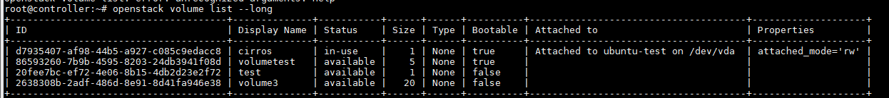

\- Để kiểm tra volume có chứa image ta dùng command:  
```
openstack volume show <volume>
```

Sau đây là sự khác biệt giữa volume chứa image và volume không chứa image:  
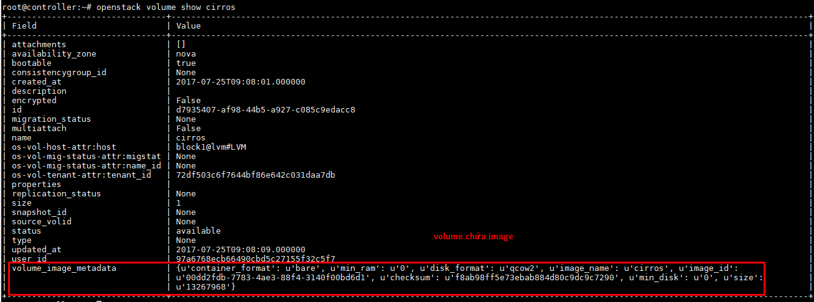

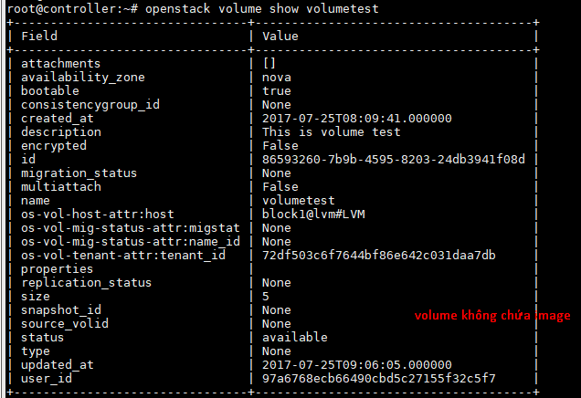

