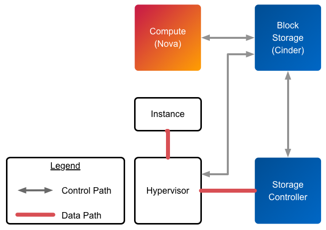
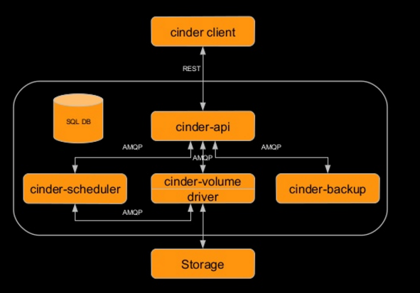
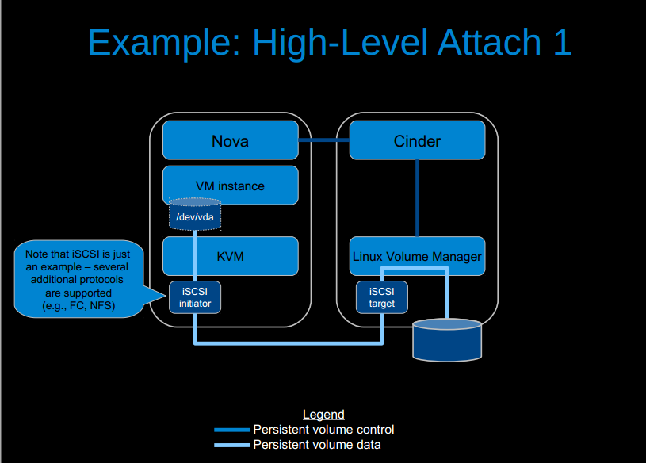
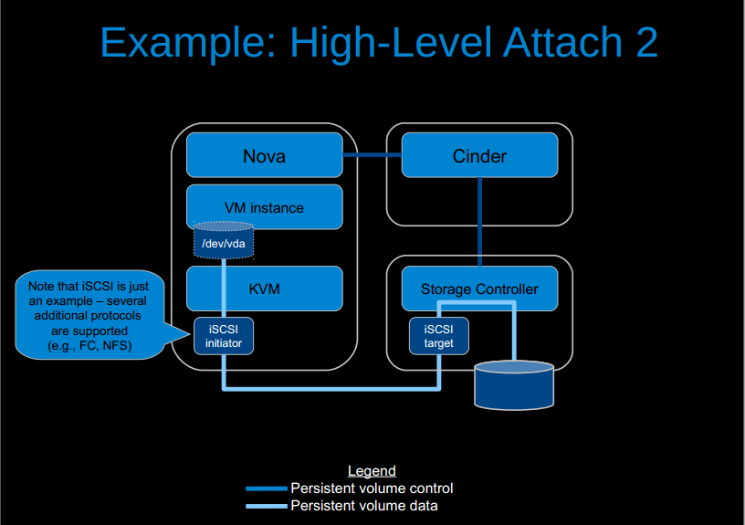
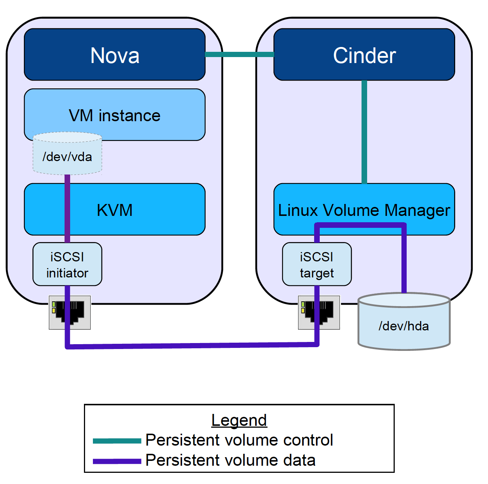
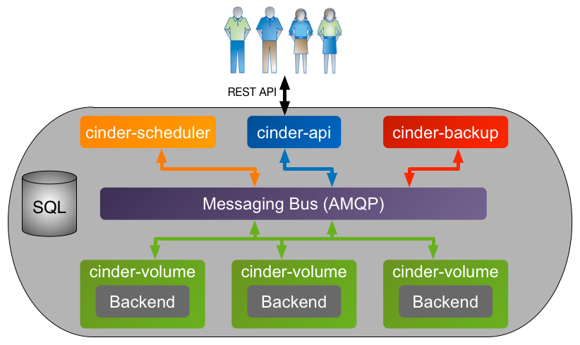
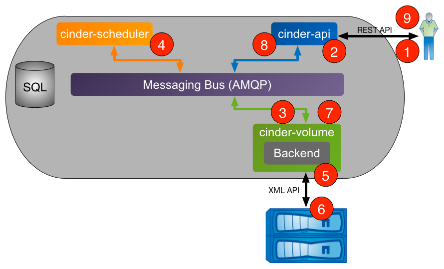
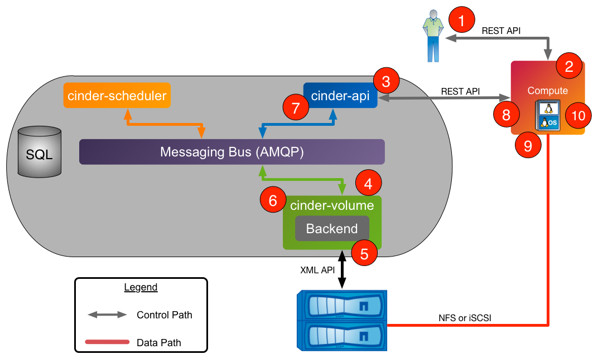

# Tổng quan về Cinder


# MỤC LỤC


<a name="1"></a>

# 1.Khái niệm về Cinder
\- Cinder project là 1 Block Storage service cung cấp thiết bị lưu trữ theo kiểu persistent block đến guest instances.  
\- Volumes có thể được detached từ instance và attached đến một instance khác mà dữ liệu không bị ảnh hưởng.  
\- Phương thức lưu trữ là việc cung cấp và tiêu thụ được xác định bởi Block Storage driver, hoặc drivers trong trường hợp có cấu hình multi-blackend. Có nhiều drivers có sẵn như: NAS/SAN, NFS, iSCSI, Ceph, etc.  
\- Cinder và Nova Logical Architecture.  



<a name="2"></a>

# 2.Một số hình thức lưu trữ trong OpenStack

||Ephemeral storage|Block storage|Object storage|
|---|---|---|---|
|Hình thức sử dụng|Chạy operating system và scratch space|Thêm persistent storage đến VM|VM images,disk volume snapshots, etc|
|Truy cập thông qua|File system|Block device có thể partitioned, formatted, and mounted (/dev/vdc)|REST API|
|Có thể truy cập từ|Trong 1 VM|Trong 1 VM|Bất kì đâu|
|Quản lý bởi|Nova|Cinder|Swift|
|Tồn tại cho đến khi|VM được kết thúc|Xóa bởi user|Xóa bởi user|
|Kích cỡ được xác định bởi|Admin cấu hình kích cỡ, tương tự như flavors|Do user chỉ định|Số lượng lưu trữ vật lý mà server hiện có|
|Ví dụ|10 GB disk thứ nhất,30 GB disk thứ hai|1 TB disk|10s of TBs of dataset storage|

<a name="3"></a>
		
# 3.Cinder architecture


\- cinder-client: User sử dụng CLI/UI (Command line interface / User interface) để tạo request.  
\- cinder-api: Chấp nhận và chỉ đường cho các request.  
\- cinder-scheduler: Lịch trình và đường đi cho các requests đến volume service thích hợp.  
\- cinder-volume: Quản lý thiết bị Block Storage.  
\- driver: Chứa các loại mã back-end cụ thể để giao tiếp với các loại storage khác nhau.  
\- Storage: Thiết bị lưu trữ back-end của các hãng khác nhau.  
\- SQL DB: Lưu lại dấu vết của volumes trong sử dụng.  
\- cinder-backup: Cung cáp phương pháp để backup 1 volume đến Swift/Ceph etc.  

>Note:  
>\- Ngoài ta, AMQP (Advanced message queue protocol) là giao thức phổ biến mà RabbitMQ dùng (RabbitMQ hỗ trợ nhiều giao thức). RabbitMQ được lập trình bằng ngôn ngữ Erlang. RabbitMQ cung cấp cho lập trình viên một phương tiện trung gian để giao tiếp giữa nhiều thành phần trong một hệ thống lớn ( Ví dụ openstack).  
>\- RabbitMQ sẽ nhận message đến từ các thành phần khác nhau trong hệ thống, lưu trữ chúng an toàn trước khi đẩy đến đích.  

<a name="4"></a>

# 4.Cinder driver
\- Cinder drivers map các Cinder request thành command được yêu cầu trên storage platform mở rộng, như:  
- Linux LVM
- Storage từ phần cứng riêng biệt của nhiều nhà cung cấp khác nhau
- Phân tán trong nhiều file systems

\- Hiện nay có khoảng trên 70 drivers trong github.  
- https://github.com/openstack/cinder/tree/master/cinder/volume/drivers 
- https://wiki.openstack.org/wiki/CinderSupportMatrix 

\- Để thiết lập volume driver, sử dụng cờ volume_driver trong file cinder.conf. Mặc định là:  
```
volume_driver = cinder.volume.drivers.lvm.LVMISCSIDriver
```

\- LVM (Logical Volume Management) thực thi như sau:  
- LVM maps thiết bị physical block về phía các thiết bị higher-level virtual block
- Cinder-volumes được tạo như Logical Volumes sử dụng LVM
- Sử dụng giao thức iSCSI để kết nối volumes đến compute nodes.
- Không nhà có cung cấp cụ thể.

\- 2 loại high-level attach:




<a name="5"></a>

# 5.Cinder attach flow


\- Nova gọi Cinder thông qua Cinder API, truyền thông tin kết nối  
- VD: host name, iSCSI initiator name, FC WWPNs

\- cinder-api chuyển thông điệp đến cinder-volume  
\- Sau đó, kiểm tra error ban đầu cà gọi volume driver  
\- Volume driver chuẩn bị các yếu tố cần thiết để cho phép kết nối  
- VD: cho phép Nova host truy cập và volume

\- Volume driver trả lại thông tin kết nối, chuyển đến Nova  
- VD: iSCSI iqn và portal, FC WWPN

\- Nova tạo kết nối đến storage sử dụng thông tin trả về ở trên  
\- Nova chuyển volume device/file đến hypervisor  

<a name="6"></a>

# 6.Cinder workflow

<a name="6.1"></a>

## 6.1.Cinder Processes Concept Diagram


<a name="6.2"></a>

## 6.2.Volume Creation Workflow
\- Quá trình tạo 1 volume:  


1.Client yêu cầu tạo volume thông qua REST API của cinder ( client sử dụng python-cinderclient hoặc thông qua dashboard)  
2.cinder-api xác thực yêu cầu hợp lệ ko?, thông tin user. Mội khi được xác thực, put messagelên AMQP queue để xử lý.  
3.cinder-volume xử lý message của queue, gửi message cho cinder-scheduler để xác định backend cung cấp cho volume.  
4.cinder-scheduler xử lý message của queue, sinh ra danh sách các ứng viên (node storage) dựa trên trạng thái hiện tại và yêu cầu tiêu chí về volume criteria (size, availability zone, volume type (including extra specs)).  
5.cinder-volume đọc thông tin trả lời cinder-scheduler từ queue, lặp lại danh sách ứng viên bằng phương thức backend driver cho đến khi thành công.  
6.Cinder driver tạo yêu volume được yêu cầu thông qua tương tác với hệ thống con storage ( phụ thuộc vào cấu hình và giao thức)  
7.cinder-volume tập hợp volume metadata từ queue và kết nối thông tin và chuyển message trả lời đến AMQP queue.  
8.cinder-api đọc message trả lời từ queue và trả lời client.  
9.Client nhận được thông tin bao gồm trạng thái của yêu cầu tạo volume: volume UUID, etc.  

<a name="6.3"></a>

## 6.3.Volume Attach Workflow  


1.Client yêu cầu attach volume thông Nova Rest API ( client sử dụng python-cinderclient hoặc thông qua dashboard)  
2.nova-api xác thực yêu cầu xem có hợp lệ hay không? , thông tin user. Một khi được xác thực, gọi Cinder API để lấy thông tin về volume cụ thể.  
3.cinder-api xác thực yêu cầu xem có hợp lệ hay không?, thông tin user. Một khi được xác thực, post message đến volume manager thông qua AMQP.  
4.cinder-volume đọc message từ queue, gọi Cinder driver tương ứng đến volume để attached.  
5.Cinder driver chuẩn bị Cinder volume cho việc attachment ( các bước cụ thể phụ thuộc vào giao thức storage được sử dụng)  
6.cinder-volume post thông tin trả lời đến cinder-api thông qua AMQP queue.  
7.cinder-api đọc message trả lời từ cinder-volume từ queue, truyền thông tin kết nối trong RESTful reponse đến Nova caller.  
8.Nova tạo kết nối đến storage với thông tin trả lại từ Cinder.  
9.Nova truyền volume device/file đến hypervisor, sau đó attach volume device/file đến guest VM như một thiết bị block thực tế hoặc (phụ thuộc vào giao thức storage).  

<a name="7"></a>

## 7.Cinder status

|Status|Mô tả|
|---|---|
|Creating|Volume được tạo ra|
|Available|Volume ở trạng thái sẵn sàng để attach vào một instane|
|Attaching|Volume đang được gắn vào một instane|
|In-use|Volume đã được gắn thành công vào instane|
|Deleting|Volume đã được xóa thành công|
|Error|Đã xảy ra lỗi khi tạo Volume|
|Error deleting|Xảy ra lỗi khi xóa Volume|
|Backing-up|Volume đang được back up|
|Restore_backup|Trạng thái đang restore lại trạng thái khi back up|
|Error_restoring|Có lỗi xảy ra trong quá trình restore|
|Error_extending|Có lỗi xảy ra khi mở rộng Volume|

<a name="8"></a>

# 8.Cinder backup
\- Cinder có thể back up một volume.  
\- Một bản back up là một bản sao lưu được lưu trữ vào ổ đĩa. Bản backup này được lưu trữ vào object storage.  
\- Backups có thể cho phép phục hồi từ :  
- Dữ liệu volume bị hư.
- Storage failure.
- Site failure (Cung cấp giải pháp backup an toàn).

<a name="9"></a>

# 9.Advanced feature
\- Snapshot  
- Snapshot là bản copy lại một thời điểm của data mà volume chứa.
- Snapshot sẽ tồn tại như trên storage backend như một volume đang hoạt động.

\- Quota  
Admins thiết lấp số lượng giới hạn volume, backup và snapshot tùy thuộc vào chính sách cài đặt.  

\- Volume transfer  
Chuyển volume từ 1 user đến user khác.  

\- Encryption  
Mã hóa được thực hiện bởi Nova sử dụng dm-crypt, là một hệ thống con minh bạch mã hóa đĩa trong Linux kernel.  

\- Migration (Admin only)  
- Di dời data từ back-end hiện tại của volume đến một nơi mới.
- 2 luồng chính phụ thuộc trên volume có được gắn hay không.


 	 	
