# Glance command

# MỤC LỤC

<a name="1"></a>
# 1.glance command
Tham khảo : https://docs.openstack.org/cli-reference/glance.html  

<a name="1.1"></a>
## 1.1.Upload (Create) a image to glance
```
glance image-create --visibility public --protected False --disk-format qcow2 --container-format bare \
--file cirros-0.3.5-x86_64-disk.img --name "cirros-1"
```

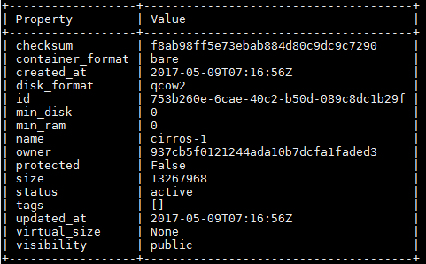

<a name="1.2"></a>
## 1.2.Delete a image
\- Cú pháp:  
```
glance image-delete <IMAGE_ID> [<IMAGE_ID> ...]
```

\- VD:  
```
glance image-delete 753b260e-6cae-40c2-b50d-089c8dc1b29f
```

<a name="1.3"></a>
## 1.3.List images
\- VD1: List all images  
```
glance image-list
```

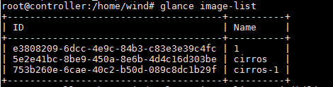

\- VD2: List image have visibility private  
```
glance image-list --visibility private
```

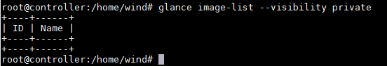

<a name="1.4"></a>
## 1.4.Show information image
\- Cú pháp:  
```
glance image-show [--human-readable] [--max-column-width <integer>] <IMAGE_ID>
```

\- Ví dụ:  
```
glance image-show 753b260e-6cae-40c2-b50d-089c8dc1b29f
```

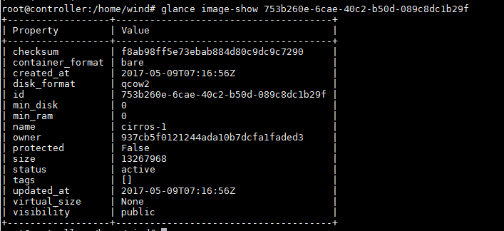

<a name="1.5"></a>
## 1.5.Deactivate image
\- Cú pháp:  
```
glance image-deactivate <IMAGE_ID>
```

<a name="1.6"></a>
## 1.6.Reactivate image
\- Cú pháp:  
```
glance image-reactivate <IMAGE_ID>
```

<a name="1.7"></a>
## 1.7.Update image
\- Update an existing image.  
\- Cú pháp:  
```
glance image-update [--architecture <ARCHITECTURE>]
                           [--protected [True|False]] [--name <NAME>]
                           [--instance-uuid <INSTANCE_UUID>]
                           [--min-disk <MIN_DISK>] [--visibility <VISIBILITY>]
                           [--kernel-id <KERNEL_ID>]
                           [--os-version <OS_VERSION>]
                           [--disk-format <DISK_FORMAT>]
                           [--os-distro <OS_DISTRO>] [--owner <OWNER>]
                           [--ramdisk-id <RAMDISK_ID>] [--min-ram <MIN_RAM>]
                           [--container-format <CONTAINER_FORMAT>]
                           [--property <key=value>] [--remove-property key]
                           <IMAGE_ID>
```

\- Ví dụ : Thay đổi visibility của image  
```
glance image-update --visibility private 5e2e41bc-8be9-450a-8e6b-4d4c16d303be
```

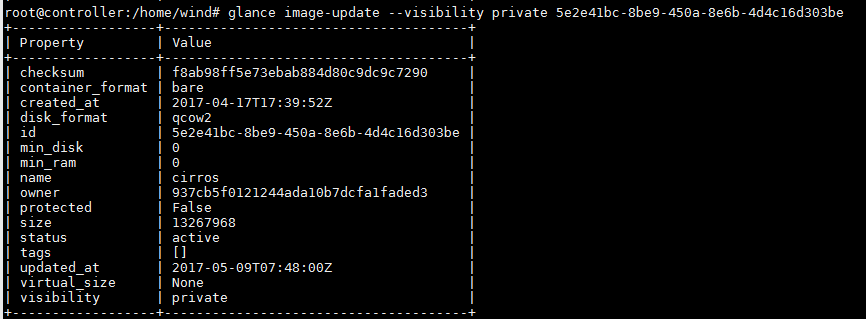

<a name="1.8"></a>
## 1.8.Upload image
\- Ví dụ ta tạo một image có tên là “test” và rỗng. Ta phải upload data cho image đó.  
\- Cú pháp:  
```
glance image-upload [--file <FILE>] [--size <IMAGE_SIZE>] [--progress] <IMAGE_ID>
```

\- Ví dụ:
```
glance image-upload --file cirros-0.3.5-x86_64-disk.img  173feebf-da51-4438-9daf-2cf1e1ee254a
```

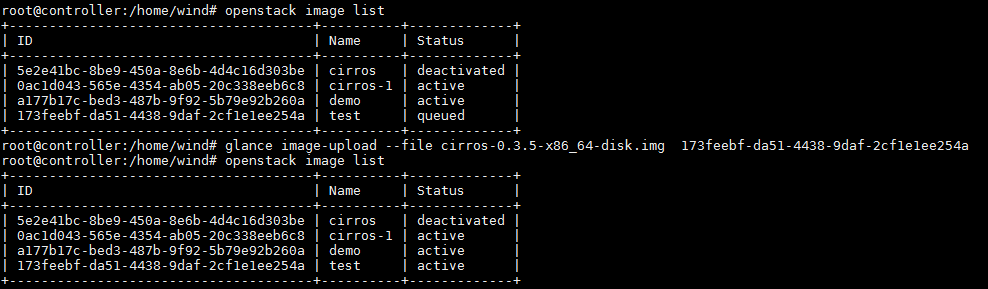

<a name="2"></a>
# 2.openstack-client command
\- Tham khảo:  
https://docs.openstack.org/developer/python-openstackclient/command-list.html  
https://docs.openstack.org/developer/python-openstackclient/decoder.html#glance-cli  
\- Mapping giữa glance command và openstack-client command.  

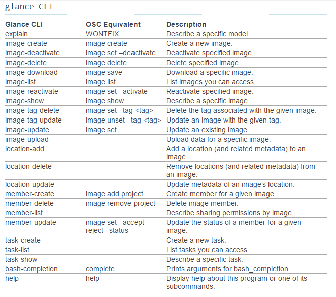

<a name="2.1"></a>
## 2.1.Upload (Create) a image to glance
```
openstack image create --container-format bare --disk-format qcow2 \
--unprotected --public --file cirros-0.3.5-x86_64-disk.img cirros-1
```

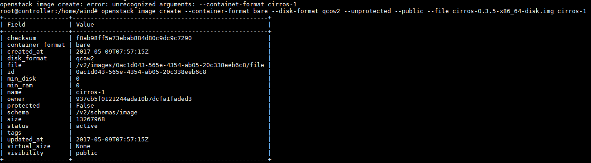

<a name="2.2"></a>
## 2.2.Delete a image
\- Cú pháp:  
```
openstack image delete <image>
```

<a name="2.3"></a>
## 2.3.List images
\- Cú pháp:  
```
openstack image list
    [--public | --private | --shared]
    [--property <key=value>]
    [--long]
    [--sort <key>[:<direction>]]
    [--limit <num-images>]
    [--marker <image>]
```

\- Ví dụ:  
```
openstack image list
```

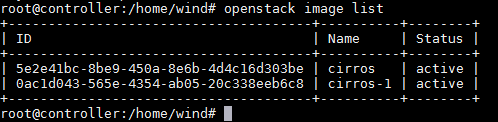

<a name="2.4"></a>
## 2.4.Show information image
\- Cú pháp:  
Display image details  
```
openstack image show <image>
```

<image>  
Image to display (name or ID)  

\- VD:  
```
openstack image show 5e2e41bc-8be9-450a-8e6b-4d4c16d303be
```

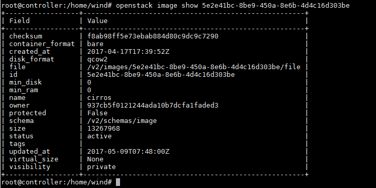

<a name="2.5"></a>
## 2.5. Set image properties 
\- Cú pháp:  
```
openstack image set
    [--name <name>]
    [--min-disk <disk-gb>]
    [--min-ram <ram-mb>]
    [--container-format <container-format>]
    [--disk-format <disk-format>]
    [--size <size>]
    [--protected | --unprotected]
    [--public | --private]
    [--store <store>]
    [--location <image-url>]
    [--copy-from <image-url>]
    [--file <file>]
    [--volume <volume>]
    [--force]
    [--checksum <checksum>]
    [--stdin]
    [--property <key=value> [...] ]
    [--tag <tag> [...] ]
    [--architecture <architecture>]
    [--instance-id <instance-id>]
    [--kernel-id <kernel-id>]
    [--os-distro <os-distro>]
    [--os-version <os-version>]
    [--ramdisk-id <ramdisk-id>]
    [--activate|--deactivate]
    [--project <project> [--project-domain <project-domain>]]
    [--accept | --reject | --pending]
    <image>
```

\- VD1: Deactive image  
```
openstack image set --deactive 5e2e41bc-8be9-450a-8e6b-4d4c16d303be
```

\- VD2: Reactive image  
```
openstack image set --reactive 5e2e41bc-8be9-450a-8e6b-4d4c16d303be
```

\- VD3: Thay đổi visibility của image  
```
openstack image set --private 5e2e41bc-8be9-450a-8e6b-4d4c16d303be
```

<a name="3"></a>
# 3.curl command
Tham khảo image API: https://developer.openstack.org/api-ref/image/index.html  

<a name="3.1"></a>
## 3.1.Xin cấp phát token
```
curl -i -X POST -H "Content-Type: application/json" -d '
{ 
"auth": {
	"identity": {
		"methods": ["password"],
		"password": {
			"user": {
				"name": "admin",
				"domain": { "name": "Default" },
				"password": "1"
			}
		}
	},
	"scope": {
		"project": {
			"name": "admin",
			"domain": { "name": "Default" }
		}
	}	
}
}' http://localhost:35357/v3/auth/tokens
```

```
HTTP/1.1 201 Created
Date: Tue, 09 May 2017 14:35:20 GMT
Server: Apache/2.4.18 (Ubuntu)
X-Subject-Token: gAAAAABZEdOo-QnGQOhkbRUgABevgzl-K7F_QbvN6Ck1f_m2v-ErZHlRhUzXTxe1T1aJOglJsdypd8-eXyu70HFbOxHt1-NS6Nx884t23UQ38SmQdpgsnRZRnN6NSHlrB_xzdU_xG7DXgb0M97dtE434OqD2zYFrsijgEKw45rxtdFgMaHAKIUc
Vary: X-Auth-Token
X-Distribution: Ubuntu
x-openstack-request-id: req-2fd0e5fe-0357-45e7-aa07-4d3117b4f8c7
Content-Length: 3305
Content-Type: application/json

{"token": {"is_domain": false, "methods": ["password"], "roles": [{"id": "7a42a5bd64464c7198539c11c68ad251", "name": "admin"}], "expires_at": "2017-05-09T15:35:20.000000Z", "project": {"domain": {"id": "default", "name": "Default"}, "id": "937cb5f0121244ada10b7dcfa1faded3", "name": "admin"}, "catalog": [{"endpoints": [{"region_id": "RegionOne", "url": "http://controller:5000/v3/", "region": "RegionOne", "interface": "internal", "id": "20d326e2a1d3449383bc528d0a5c7ba2"}, {"region_id": "RegionOne", "url": "http://controller:35357/v3/", "region": "RegionOne", "interface": "admin", "id": "47a7d6c1f34e47988d1e104628be7850"}, {"region_id": "RegionOne", "url": "http://controller:5000/v3/", "region": "RegionOne", "interface": "public", "id": "c096db2e39ea482f9083a8c6bb911053"}], "type": "identity", "id": "1045b29c81d5480a945e0ffffce3b7e7", "name": "keystone"}, {"endpoints": [{"region_id": "RegionOne", "url": "http://controller:8774/v2.1", "region": "RegionOne", "interface": "internal", "id": "888ee3be94b34d70b0cf17b7a81ac594"}, {"region_id": "RegionOne", "url": "http://controller:8774/v2.1", "region": "RegionOne", "interface": "public", "id": "e67ce49945f8459ca45128cb1c69a21b"}, {"region_id": "RegionOne", "url": "http://controller:8774/v2.1", "region": "RegionOne", "interface": "admin", "id": "fe06aca0361547ed87c3ea74a41023e1"}], "type": "compute", "id": "38f4a515fd264b4aaf957d23aec90fe1", "name": "nova"}, {"endpoints": [{"region_id": "RegionOne", "url": "http://controller:9696", "region": "RegionOne", "interface": "public", "id": "4f62cace9d56440f832e7eb66a074be3"}, {"region_id": "RegionOne", "url": "http://controller:9696", "region": "RegionOne", "interface": "internal", "id": "6ea87df34e854e369a39fd8845882ec3"}, {"region_id": "RegionOne", "url": "http://controller:9696", "region": "RegionOne", "interface": "admin", "id": "6f05a93d323c4b11a493810f1a1eac2a"}], "type": "network", "id": "498bb0bb11174ba097ce506ba5d87552", "name": "neutron"}, {"endpoints": [{"region_id": "RegionOne", "url": "http://controller:9292", "region": "RegionOne", "interface": "internal", "id": "8de2c585ddee482fac8a6b6fa5c2854a"}, {"region_id": "RegionOne", "url": "http://controller:9292", "region": "RegionOne", "interface": "admin", "id": "d329393fa04144a6acbd5f206f6687bf"}, {"region_id": "RegionOne", "url": "http://controller:9292", "region": "RegionOne", "interface": "public", "id": "e070382ebc6640eb8bcbcb748e722c94"}], "type": "image", "id": "76e9c67a663a4594b9cd4d8a612b2364", "name": "glance"}, {"endpoints": [{"region_id": "RegionOne", "url": "http://controller/placement", "region": "RegionOne", "interface": "internal", "id": "4a43fe4ad56f4d208c1cc219d20f080b"}, {"region_id": "RegionOne", "url": "http://controller/placement", "region": "RegionOne", "interface": "admin", "id": "4f527d8ac8824f1fb60be7a5658c52f7"}, {"region_id": "RegionOne", "url": "http://controller/placement", "region": "RegionOne", "interface": "public", "id": "eca177a03f1e4f4bae8beb01bffbbf97"}], "type": "placement", "id": "e2b580f6921946cd8d8545e002768d9f", "name": "placement"}], "user": {"password_expires_at": null, "domain": {"id": "default", "name": "Default"}, "id": "221ebbb4d16f444f8ea49fc8a79f80f1", "name": "admin"}, "audit_ids": ["hp1c_7hxRUaKJTsG2-hGkw"], "issued_at": "2017-05-09T14:35:20.000000Z"}}
```

Sau khi xin được token, ta thiết lập environment variable bằng command sau:  
```
export OS_AUTH_TOKEN=gAAAAABZEdOo-QnGQOhkbRUgABevgzl-K7F_QbvN6Ck1f_m2v-ErZHlRhUzXTxe1T1aJOglJsdypd8-eXyu70HFbOxHt1-NS6Nx884t23UQ38SmQdpgsnRZRnN6NSHlrB_xzdU_xG7DXgb0M97dtE434OqD2zYFrsijgEKw45rxtdFgMaHAKIUc
```

<a name="3.2"></a>
## 3.2.List images
```
curl -s -X GET -H "X-Auth-Token: $OS_AUTH_TOKEN" http://controller:9292/v2/images
```

```
{"images": [{"status": "active", "name": "demo", "tags": [], "container_format": "bare", "created_at": "2017-05-09T08:25:50Z", "size": 9761280, "disk_format": "qcow2", "updated_at": "2017-05-09T08:25:50Z", "visibility": "private", "self": "/v2/images/a177b17c-bed3-487b-9f92-5b79e92b260a", "min_disk": 0, "protected": false, "id": "a177b17c-bed3-487b-9f92-5b79e92b260a", "file": "/v2/images/a177b17c-bed3-487b-9f92-5b79e92b260a/file", "checksum": "50bdc35edb03a38d91b1b071afb20a3c", "owner": "93189a31c4e64aec9370737bf64e2232", "virtual_size": null, "min_ram": 0, "schema": "/v2/schemas/image"}, {"status": "active", "name": "cirros-1", "tags": [], "container_format": "bare", "created_at": "2017-05-09T07:57:15Z", "size": 13267968, "disk_format": "qcow2", "updated_at": "2017-05-09T08:00:21Z", "visibility": "public", "self": "/v2/images/0ac1d043-565e-4354-ab05-20c338eeb6c8", "min_disk": 0, "protected": true, "id": "0ac1d043-565e-4354-ab05-20c338eeb6c8", "file": "/v2/images/0ac1d043-565e-4354-ab05-20c338eeb6c8/file", "checksum": "f8ab98ff5e73ebab884d80c9dc9c7290", "owner": "937cb5f0121244ada10b7dcfa1faded3", "virtual_size": null, "min_ram": 0, "schema": "/v2/schemas/image"}, {"status": "deactivated", "name": "cirros", "tags": [], "container_format": "bare", "created_at": "2017-04-17T17:39:52Z", "size": 13267968, "disk_format": "qcow2", "updated_at": "2017-05-09T08:16:03Z", "visibility": "private", "self": "/v2/images/5e2e41bc-8be9-450a-8e6b-4d4c16d303be", "min_disk": 0, "protected": false, "id": "5e2e41bc-8be9-450a-8e6b-4d4c16d303be", "file": "/v2/images/5e2e41bc-8be9-450a-8e6b-4d4c16d303be/file", "checksum": "f8ab98ff5e73ebab884d80c9dc9c7290", "owner": "937cb5f0121244ada10b7dcfa1faded3", "virtual_size": null, "min_ram": 0, "schema": "/v2/schemas/image"}], "schema": "/v2/schemas/images", "first": "/v2/images"}
```

\- Bạn cũng có thể sử dụng program python **-mjson.tool** để ouput data dưới dạng **json** , Nhớ bỏ tùy chọn `-i` và thêm tùy chọn `-s`.  
```
curl -s -X GET -H "X-Auth-Token: $OS_AUTH_TOKEN" http://controller:9292/v2/images | python -mjson.tool
```

<a name="3.3"></a>
## 3.3.Show information image
```
curl -s \
   -X GET \
   -H "X-Auth-Token: $OS_AUTH_TOKEN" \
   http://controller:9292/v2/images/a177b17c-bed3-487b-9f92-5b79e92b260a
```

```
{"status": "active", "name": "demo", "tags": [], "container_format": "bare", "created_at": "2017-05-09T08:25:50Z", "size": 9761280, "disk_format": "qcow2", "updated_at": "2017-05-09T08:25:50Z", "visibility": "private", "self": "/v2/images/a177b17c-bed3-487b-9f92-5b79e92b260a", "min_disk": 0, "protected": false, "id": "a177b17c-bed3-487b-9f92-5b79e92b260a", "file": "/v2/images/a177b17c-bed3-487b-9f92-5b79e92b260a/file", "checksum": "50bdc35edb03a38d91b1b071afb20a3c", "owner": "93189a31c4e64aec9370737bf64e2232", "virtual_size": null, "min_ram": 0, "schema": "/v2/schemas/image"}
```

<a name="3.4"></a>
## 3.4.Create image rỗng 
```
curl -i -X POST -H "X-Auth-Token: $OS_AUTH_TOKEN" \
    -H "Content-Type: application/json" \
    -d '{"name": "cirros-test"}' \
    http://controller:9292/v2/images
```

```
HTTP/1.1 201 Created
Content-Length: 550
Content-Type: application/json; charset=UTF-8
Location: http://controller:9292/v2/images/8735d3b4-0f32-441c-bb0c-8c27b7041fd2
X-Openstack-Request-Id: req-a6283093-d20c-4cfd-9ced-a460e0c85585
Date: Tue, 09 May 2017 15:43:30 GMT

{"status": "queued", "name": "cirros-test", "tags": [], "container_format": null, "created_at": "2017-05-09T15:43:30Z", "size": null, "disk_format": null, "updated_at": "2017-05-09T15:43:30Z", "visibility": "shared", "self": "/v2/images/8735d3b4-0f32-441c-bb0c-8c27b7041fd2", "min_disk": 0, "protected": false, "id": "8735d3b4-0f32-441c-bb0c-8c27b7041fd2", "file": "/v2/images/8735d3b4-0f32-441c-bb0c-8c27b7041fd2/file", "checksum": null, "owner": "937cb5f0121244ada10b7dcfa1faded3", "virtual_size": null, "min_ram": 0, "schema": "/v2/schemas/image"}
```

<a name="3.5"></a>
## 3.5.Update các attribute của image
\- Ở đây ta sẽ cập nhật 2 thuộc tính quan trọng để tạo image mới là: **disk_format** và **container_format**  
\- Sử dụng command:  
```
curl -i -X PATCH -H "X-Auth-Token: $OS_AUTH_TOKEN" \
-H "Content-Type: application/openstack-images-v2.1-json-patch" \
-d '
[
    {
        "op": "add",
        "path": "/disk_format",
        "value": "qcow2"
    },
    {
        "op": "add",
        "path": "/container_format",
        "value": "bare"
    }
]' http://controller:9292/v2/images/8735d3b4-0f32-441c-bb0c-8c27b7041fd2
```

```
HTTP/1.1 200 OK
Content-Length: 555
Content-Type: application/json; charset=UTF-8
X-Openstack-Request-Id: req-5d8bd0b1-7c2c-4174-a518-3e721d79a439
Date: Tue, 09 May 2017 16:05:14 GMT

{"status": "queued", "name": "cirros-test", "tags": [], "container_format": "bare", "created_at": "2017-05-09T15:43:30Z", "size": null, "disk_format": "qcow2", "updated_at": "2017-05-09T16:05:14Z", "visibility": "shared", "self": "/v2/images/8735d3b4-0f32-441c-bb0c-8c27b7041fd2", "min_disk": 0, "protected": false, "id": "8735d3b4-0f32-441c-bb0c-8c27b7041fd2", "file": "/v2/images/8735d3b4-0f32-441c-bb0c-8c27b7041fd2/file", "checksum": null, "owner": "937cb5f0121244ada10b7dcfa1faded3", "virtual_size": null, "min_ram": 0, "schema": "/v2/schemas/image"}
```

Lúc này image vẫn chưa được khởi tạo hoàn toàn và đang trong trạng thái "queued":

<a name="3.6"></a>
## 3.6.Upload dữ liệu nhị phân của image lên (tải lên dữ liệu cho image đã khởi tạo)
Sau khi thiết lập hai thuộc tính **disk_format** và **container_format**, tiến hành upload dữ liệu image lên để hoàn thành quá trình tạo image:  
```
curl -i -X PUT -H "X-Auth-Token: $OS_AUTH_TOKEN" \
	-H "Content-Type: application/octet-stream" \
	-d @/home/wind/cirros-0.3.5-x86_64-disk.img  \
	http://controller:9292/v2/images/8735d3b4-0f32-441c-bb0c-8c27b7041fd2/file
```

```
HTTP/1.1 100 Continue

HTTP/1.1 204 No Content
Content-Type: text/html; charset=UTF-8
Content-Length: 0
X-Openstack-Request-Id: req-e24c2dd9-cfea-4781-bae3-31257701af65
Date: Tue, 09 May 2017 16:15:40 GMT
```

Tiến hành kiểm tra lại trạng thái của image cirros-test vừa mới khởi tạo, ta sẽ thấy image này ở trạng thái "active", nghĩa là sẵn sàng để sử dụng:

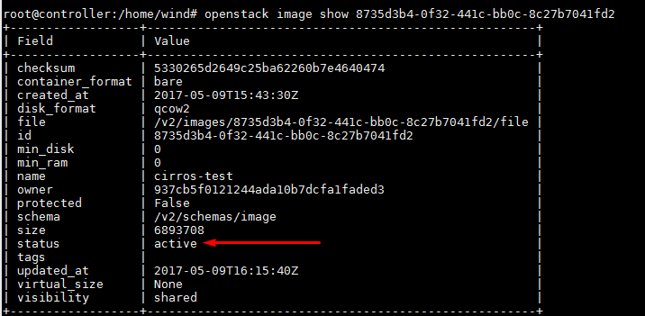

<a name="3.7"></a>
## 3.7.Delete image
```
curl -i -X DELETE -H "X-Auth-Token: $OS_AUTH_TOKEN" \
     http://controller:9292/v2/images/8735d3b4-0f32-441c-bb0c-8c27b7041fd2
```

```
HTTP/1.1 204 No Content
Content-Type: text/html; charset=UTF-8
Content-Length: 0
X-Openstack-Request-Id: req-f847a0d8-300b-4a94-b23d-e12940ed34e3
Date: Tue, 09 May 2017 16:18:40 GMT
```

<a name="4"></a>
# 4.Dùng Rest client trên web brower để request API
<a name="a"></a>
## a.Cài đặt extension “Advanced REST client” trên Chrome brower
Vào link sau và cài đặt:  
https://chrome.google.com/webstore/detail/advanced-rest-client/hgmloofddffdnphfgcellkdfbfbjeloo?hl=vi  

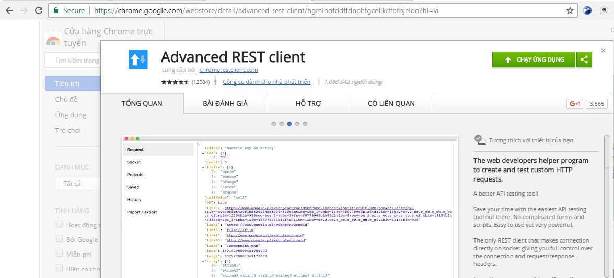

<a name="b"></a>
## b.Get Token
\- Request:  

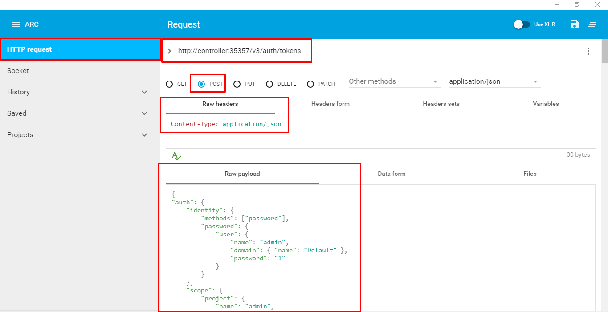

\- Response:  

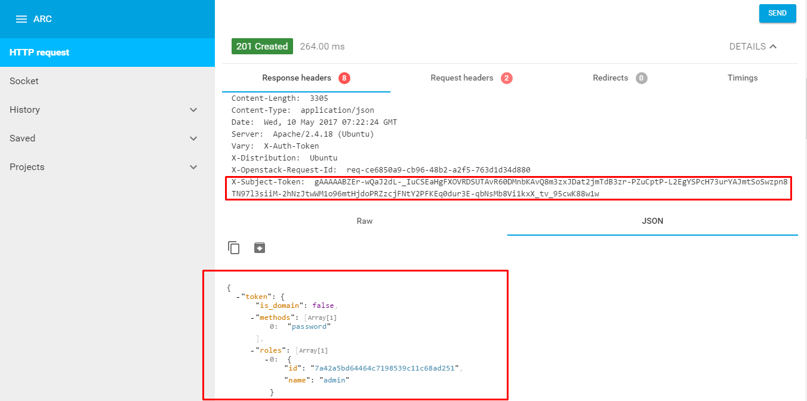

<a name="c"></a>
## c.List images
\- Request:  

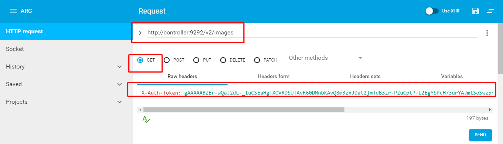

\- Response:

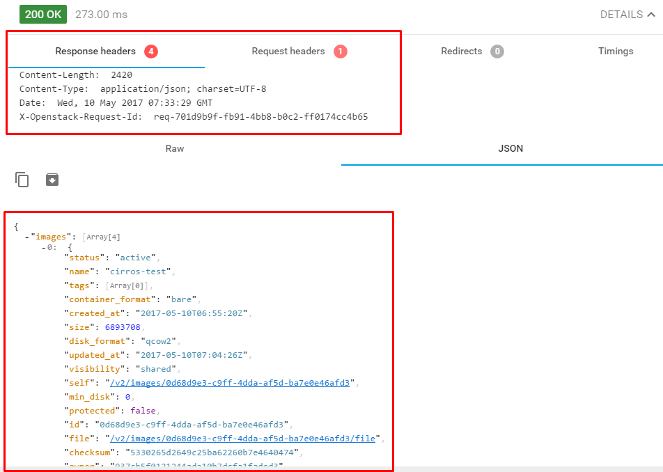

<a name="d"></a>
## d.Các thao tác khác
\- Các thao tác khác tương tự  như cURL command. Chú ý: URL, request method, header, payload.  


