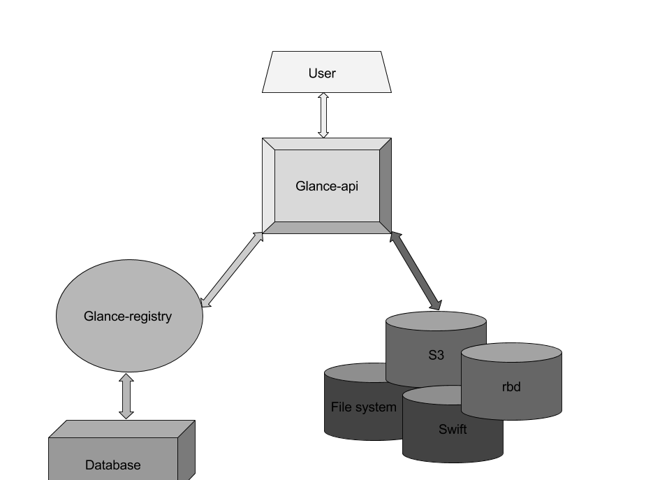
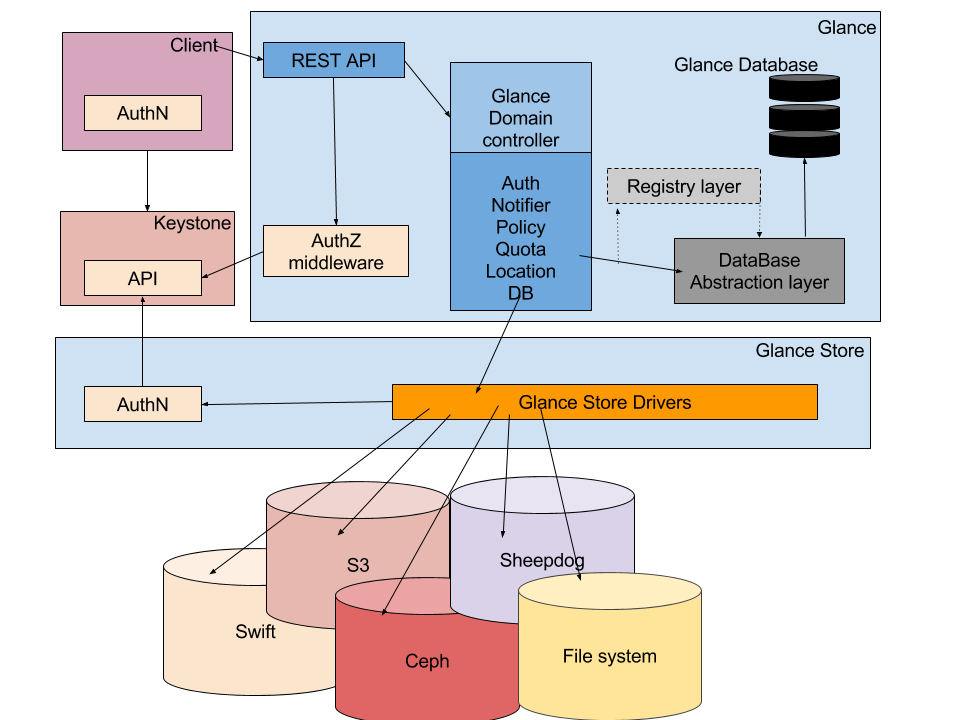
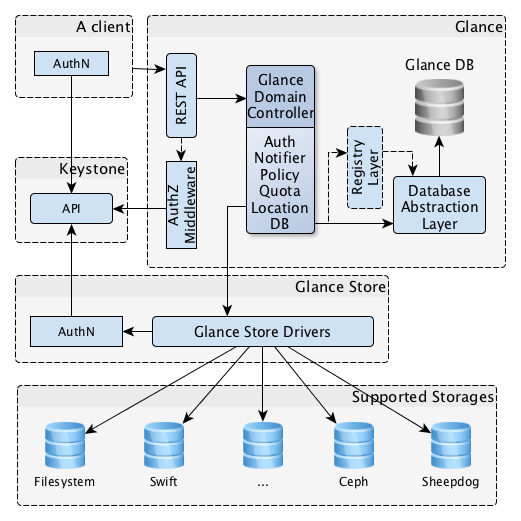
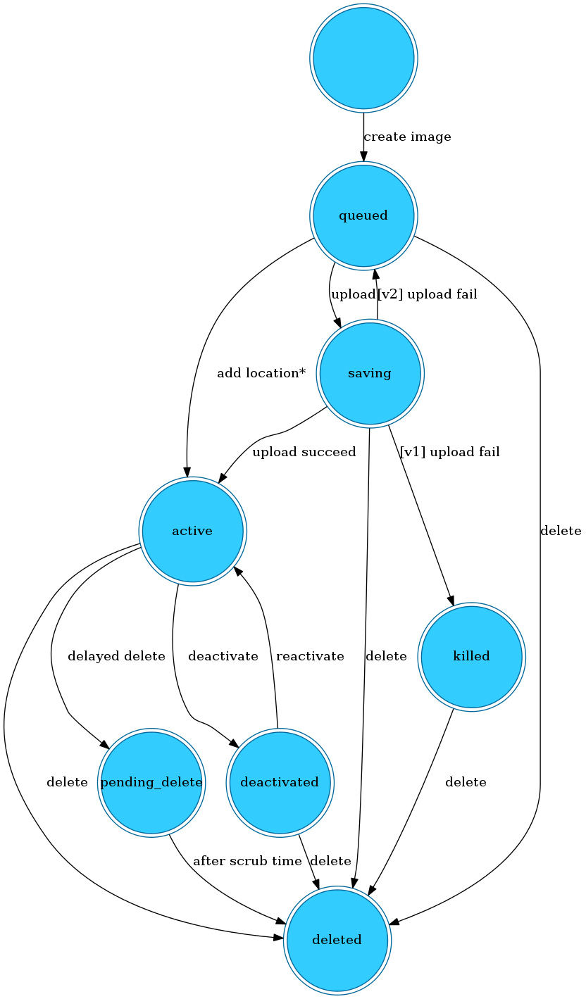
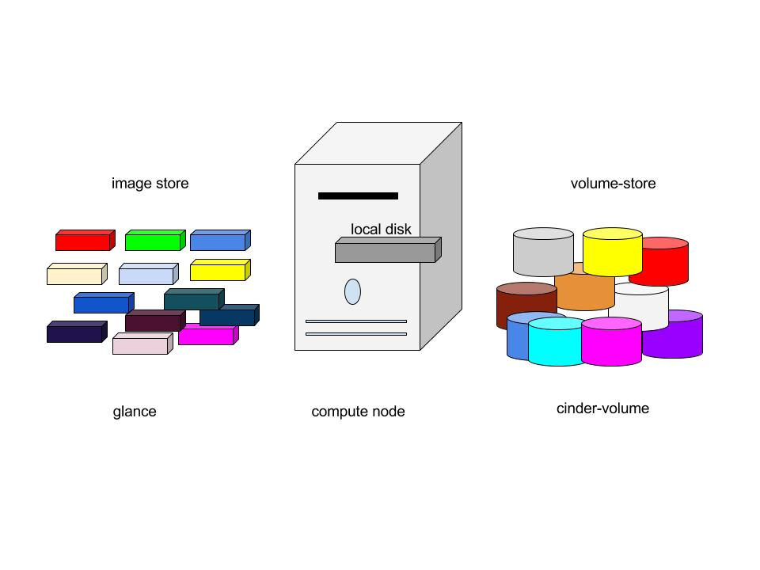
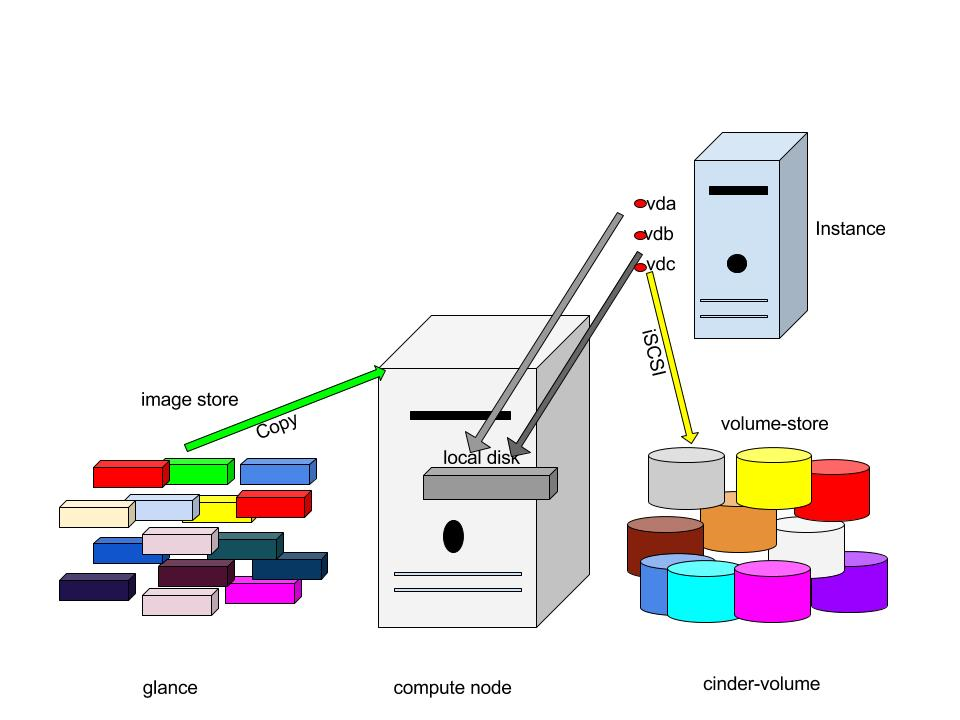
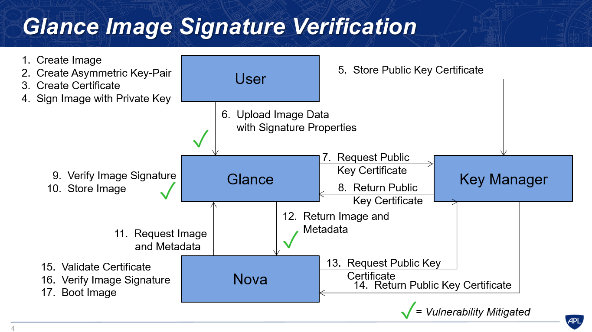

# Lý thuyết Glance

# MỤC LỤC
- [1.Introduction Glance](#1)
- [2.Glance Component](#2)
- [3.Glance Architecture](#3)
- [4.Glance Formats](#4)
	- [4.1.Disk Formats](#4.1)
	- [4.2.Container Formats](#4.2)
- [5.Glance Status Flow](#5)
- [6.Glance Configuration Files](#6)
- [7.Image and Instance](#7)
- [8.Image Signing and Verification](#8)
    - [8.1.Glance Image Signing and Verification](#8.1)
    - [8.2.Nova Signature Verification](#8.2)
    - [8.3.Glance Image Signature Verification](#8.3)

# 1.Introduction Glance
\- Glane (Image Service) là image service cung cấp khả năng discovering, registering (đăng ký), retrieving (thu thập) các image cho virtual machine. OpenStack Glance là central repository cho virtual image.  
\- Glance cung cấp RESTful API cho phép querying VM image metadata cũng như thu thập các actual image.  
\-  VM image có sẵn thông qua Glance có thể stored trong nhiều vị trí khác nhau, từ file system đến object storage system như OpenStack Swift OpenStack.  
\- Trong Glance, images được lưu trữ như template, được sử dụng để launching new instances. Glance được thiết kế để trở thành một service độc lập đối với các user cần tổ chức large virtual disk images. Glance cung cấp giải pháp end-to-end cho cloud disk image management. Nó cũng có thể lấy các bản snapshots từ running instance cho việc backing up VM và các states của VM.  

# 2.Glance Component
\- Glance có các components:  
- glance-api: chấp nhận API calls cho việc tìm kiếm, lấy và lưu trữ image.
- glance-registry: thực hiện lưu trữ, xử lý và lấy thông tin metadata của image.
- database: lưu trữ metadata của image.
- storage repository: tích hợp với nhiều thanh phần của OpenStack như file systems, Amazon S3 và HTTP cho image storages.

Glance chấp nhận API request cho image từ end-users hoặc Nova components và có thể stores nó trong object storage service,swift hoặc storage repository khác.  
\- Image server hỗ trợ các back-end stores:  
- File system  
OpenStack Image server lưu trữ virtual machine images trong file system back end là default.Đây là back end đơn giản lưu trữ image files trong local file system.    
- Object Storage  
Là hệ thống lưu trữ do OpenStack Swift cung cấp - dịch vụ lưu trữ có tính sẵn sàng cao , lưu trữ các image dưới dạng các object.   
- Block Storage  
Hệ thống lưu trữ có tính sẵn sàng cao do OpenStack Cinder cung cấp, lưu trữ các image dưới dạng block.  
- VMware  
ESX/ESXi or vCenter Server target system.  
- S3  
The Amazon S3 service.  
- HTTP  
OpenStack Image service có thể đọc virtual machine images mà có sẵn trên Internet sử dụng HTTP. Đây là store chỉ đọc.
- RADOS Block Device (RBD)  
Stores images trong Ceph storage cluster sử dụng Ceph’s RBD interface.  
- Sheepdog  
A distributed storage system dành cho QEMU/KVM.  
- GridFS  
Stores images sử dụng MongoDB.  

# 3.Glance Architecture

\- Glance có client-service architecture và cung cấp Rest API để request đến server được thực hiện. Request từ client được chấp nhận thông qua Rest API và chờ Keystone authentication. Glance Domain controller manages all the internal operations, which is divided in to layers, each layer implements its own tasks.  
Glance store là communication layer giữa glance và external storage backends hoặc local file system và cung cấp uniform interface để access. Glance sử dụng SQL central Database làm điểm access cho every components khác trong system.  
\- The Glance architecture consists of several components:  
- **Client** : bất kỳ ứng nào sử dụng Glance server.
- **REST API** : gửi request tới Glance thông qua REST.
- **Database Abstraction Layer (DAL)** : application programming interface mà hợp nhất việc giao tiếp giữa Glance và databases.
- **Glance Domain Controller** : middleware thực hiện các chức năng chính của Glance: authorization, notifications, policies, database connections.
- **Glance Store** : tổ chức việc tương tác giữa Glance và các hệ thống data stores khác.
- **Registry Layer** : optional layer tổ chức việc giao tiếp bảo mật giữa domain và DAL sử dụng một service riêng biệt.

# 4.Glance Formats
\- Khi chúng ta upload image cho glance, chúng ta cần chỉ định format của Virtual machine images. Glance hỗ trợ nhiều format khác nhau như **Disk Formats** và **Container Formats**.  
\- Virtual disk là tương tự physical server’s boot driver.  
\- Các loại virtualization khác nhau hỗ trợ disk formats khác nhau.  

## 4.1.Disk Formats
Disk Formats của virtual machine image là format của underlying disk image. Disk formats được hỗ trợ bởi OpenStack glance.  

## 4.2.Container Formats
OpenStack glance hỗ trợ container format, mô tả file formats và chứa các thông tin metadata về actual virtual machine.  
Container formats được hỗ trợ trong OpenStack glance :  

>Note :  
Container Formats không được sử dụng hiện hành bởi Glance hoặc OpenStack components khác. Vì thế ‘bare’ là được quy định như container format khi chúng ta upload image trong glance, bare nghĩa là without container.  

# 5.Glance Status Flow
\- Glance statue flow cho biết status của image khi uploading.Khi chúng ta create image, first step là queuing, image được queued trong một thời gian ngắn, được bảo vệ và sẵn sàng upload. Sau khi queuing image đi đến status Saving, nghĩa là not fully uploaded.Image là full uploaded khi status là Active. Khi uploading fails, nó sẽ chuyển sang killed hoặc deleted state. Chúng ta có thể deactivate và reactivate các fully uploaded images bằng cách sử dụng command.  
\- Diagram bên dưới show status flow của glance:  

\- Các status của image:  
- queued  
Image identifier được bảo vệ trong Glance registry. Không có image data được uploaded to Glance và image size không rõ ràng sẽ được set to zero khi khởi tạo.  
- saving  
Biểu hiện image’s raw data đang được uploaded đến Glance. Khi image được registered với call đến **POST /images** and có x-image-meta-location header hiện diện, image sẽ không bao giờ được đưa vào saving status (bởi image data đã tồn tại ở một nơi nào đó).  
- active  
Biểu thị image có đầy đủ trong Glance. Điều này xảy ra khi image data được uploaded, hoặc image size rõ ràng được thiết lập là zero trong khi tạo.  
- deactivated  
Biểu thị việc truy cập image data là không được cho phép bởi bất kỳ non-admin user. Ngăn cấm downloads của image cũng nhưu ngăn cấm hoặc động như image export và image cloning mà phải yêu cầu image data.  
- killed  
Biểu thị 1 error xảy ra khi uploading của image’s data, và image đó không được đọc.  
- deleted  
Glance vẫn giữ information về image, nhưng nó không còn tồn tại để sử dụng nữa. Image trong state này sẽ được xóa tự động sau một vài ngày.  
- pending_delete  
Tương tự như deleted, tuy nhiên, Glance chưa xóa bỏ image data ngay. Image trong state này không thể.  

# 6.Glance Configuration Files
Các file cấu hình glance nằm trong thư mục `/etc/glance`. Sau đây là các file quan trọng:  
- `Glance-api.conf` : Configuration file for image service API.
- `Glance-registry.conf` : Configuration file for glance image registry which stores metadata about images.
- `glance-api-paste.ini`: Cấu hình cho các API middleware pipeline của Image service
- `glance-manage.conf`: Là tệp cấu hình ghi chép tùy chỉnh. Các tùy chọn thiết lập trong tệp `glance-manage.conf` sẽ ghi đè lên các section cùng tên thiết lập trong các tệp glance-registry.conf và glance-api.conf. Tương tự như vậy, các tùy chọn thiết lập trong tệp glance-api.conf sẽ ghi đè lên các tùy chọn thiết lập trong tệp `glance-registry.conf`
- `glance-registry-paste.ini`: Tệp cấu hình middle pipeline cho các registry của Image service.
- `glance-scrubber.conf` : Tiện ích được xử dụng cho quá trình dọn sạch các image trong status "deleted". Multiple glance-scrubber có thể chạy trong deployment đơn giản, nhưng chỉ có 1 scrubber được thiết lập để dọn dẹp trong `scrubber.conf` file. Clean-up scrubber phối hợp với glance scrubbers khác bởi việc duy trì một queue chính của image mà cần xóa. `glance-scrubber.conf` file chỉ định cấu hình các giá trị quan trọng như time giữa các lần runs, thời gian chờ của các image trước khi bị xóa. Glance-scrubber có thể run theo định kì hoặc như một daemon chạy trong một khoảng thời gian dài.  
- `policy.json` : File tùy chọn được thêm vào để điều khiển truy cập áp dụng với image service. Trong file này ta có thể định nghĩa các roles và policies. Nó là tính năng bảo mật trong OpenStack Glance.  

# 7.Image and Instance
\- Như đã nói ở trên, Disk images are stored as template. Image service controls storage and management of images. Instance là virtual machine riêng biệt chạy trên compute node, compute node quản lý instance. User có thể launch any number of instance từ same image. Mỗi lanched instance được thực hiện bởi việc copy image, bất kỳ thay đổi nào trên instance sẽ không ảnh hưởng đến image. Chúng ta có thể snapshot running instance và có thể được sử dụng để launching another instance.  
\- Khi chúng ta launch an instance, chúng ta cần chỉ định flavor, which represents virtual resource. Flavors define số lượng virtual CPUs, dung lượng RAM cho virtual machine, and the size of its ephemeral disks. Openstack cung cấp một bộ các flavors được định nghĩa trước, chúng ta có thể create và editor flavors theo ý mình.  
\- diagram show bên dưới chỉ ra system state trước khi launching an instance. Image store chỉ ra số lượng images đã được định nghĩa trước, compute node chứa vcpu sẵn có, memory và local disk resource và cinder-volume chứa số lượng volumes được định nghĩa trước.  

\- Trước khi launching instance, ta chọn image, flavor và bất kỳ optional  attributes. Selected flavor provides a root volume, labelled as vda and an additional ephemeral storage is labelled as vdb and cinder-volume is mapped to third virtual-disk and call it as vdc.

\- Trong hình này, image được copy đến local disk từ image store. vda là disk đầu tiền mà instances truy cập, instances bắt đầu nhanh nếu size của image là nhỏ cũng như data là nhỏ để copy qua network. vdb là ephemeral disk rỗng được tạo với instance, nó sẽ bị deletedkhi instance ngừng hoạt động.    
\- vdc kết nối tới cinder-volume sử dụng iSCSI.Sau kho compute node chuẩn bị vCPU và memory resources, instance boots up từ root volume vda.instance runs và thay đổi data trên disks. Nếu volume store được đặt trên network riêng rẽ, my_block_storage_ip option chỉ định trong storage node configuration file chi ra lưu lượng image đến compute node.  
\- Khi instance bị deleted, state đòi hỏi persistent volume. ephemeral storage bị xóa; memory and vCPU resources được giải phóng. Image không bị thay đổi sau tiến trình này.  

# 8.Image Signing and Verification

## 8.1.Glance Image Signing and Verification
Tham khảo tại: https://specs.openstack.org/openstack/glance-specs/specs/mitaka/approved/image-signing-and-verification-support.html  

## 8.2.Nova Signature Verification
Tham khảo tại: https://specs.openstack.org/openstack/nova-specs/specs/mitaka/implemented/image-verification.html#proposed-change  

## 8.3.Glance Image Signature Verification

\- Hình trên là quá trình “Glance Image Signature Verification” trong 2 use case : Quá trình User upload image (bước 1-10) và Nova request image từ Glance (bước 11-17)  
\- **Bước 1** : User muốn upload Image, user create Image  
\- **Bước 2** :  Create Asymmetric Key-Pair  
\- **Bước 3** : Create Certificate ( Public Key Certificate )  
\- **Bước 4** : Sign Image với Private Key  
- Trong version OpenStack Liberty, sử dụng thuật toán hash MD5 để tạo checksum1 của Image data, sau đó sử dụng thuật toán hash SHA-256 để tạo checksum2. Tiếp theo, sử dụng RSA-PSS với private key để encrypt checksum2 và được signature.  
signature = RSA-PSS(SHA-256(MD5(IMAGE-CONTENT)))  
- Trong version OpenStack Mitaka, sử dụng thuật toán SHA-256 để tạo checksum của Image data, sau đó sử dụng RSA-PSS với private key để encrypt checksum và được signature.  
signature = RSA-PSS(SHA-256(IMAGE-CONTENT))  

\- **Bước 5** : Gửi “Public Key Certificate” lên Key-Manager ( thường là Keystone ) sử dụng giao diện Castellan, để **Key-Manager** stored và thu về **signature_certificate_uuid** sử dụng cho quá trình request **Public Key certificate**.  
\- **Bước 6** : Upload Image Data với Signature Properties lên Glance. Signature Properties bao gồm :  
- **signature** 
- **signature_key_type**: là loại key được sử dụng để tạo signature. Ví dụ: RSA-PSS
- **signature_hash_method**: là hash method được sử dụng để tạo signature. Ví dụ: SHA-256
- **signature_certificate_uuid**: chính là **signature_certificate_uuid** thu được ở bước 5 khi tiến hành lưu trữ certificate.
- **mask_gen_algorithm**: giá trị này chỉ ra thuật toán tạo mặt nạ được sử dụng trong quá trình tạo ra chữ ký số. Ví dụ: MGF1. Giá trị này chỉ sử dụng cho mô hình RSA-PSS.
- **pss_salt_length**: định nghĩa sal length sử dụng trong quá trình tạo signature và chỉ áp dụng cho mô hình RSA-PSS. Giá trị mặc định là PSS.MAX_LENGTH.

\- **Bước 7** : Glance request “Public key certificate” từ Key-manager. Để làm điều này Glance phải sử dụng signature_certificate_uuid thu được trong quá trình tải image lên của người dùng.
\- **Bước 8** : Key-manager return “Public key certificate” cho Glance.  
\- **Bước 9** : Verify Image Signature, sử dụng public key thu được cùng với các signature metadata khi image được upload lên. Việc xác thực này được thực hiện bởi module **signature_utils**.  
\- **Bước 10** : Glance store Image vào repository. Nếu verify fail, Glance sẽ đưa image đó vào killed state và gửi thông báo lại cho user kèm theo lý do tại sao image upload bị errir.  
\- **Bước 11** : Nova muốn create instance, Nova request Image và metadata.  
\- **Bước 12** : Glance return image và metadata. Metadata bao gồm:  
- **img_signature** - A string representation of the base 64 encoding of the signature of the image data.
- **img_signature_hash_method** - A string designating the hash method used for signing. Currently, the supported values are SHA-224, SHA-256, SHA-384 and SHA-512. MD5 and other cryptographically weak hash methods will not be supported for this field. Any image signed with an unsupported hash algorithm will not pass validation.
- **img_signature_key_type** - A string designating the signature scheme used to generate the signature.
- **img_signature_certificate_uuid** - A string encoding the certificate uuid used to retrieve the certificate from the key manager.

\- **Bước 13** : Nova yêu cầu **Public Key Certificate** từ Key Manager bằng việc sử dụng **signature_certificate_uuid** tương tác với giao diện Castellan  
\- **Bước 14** : Key Manager return **Public Key Certificate** cho Nova.  
\- **Bước 15** : Nova verify Image Signature với metadata. Chức năng này được thực hiện bởi module signature_utils của Nova.  
\- **Bước 16** : Verify Image Signature.Để làm điều này, ta phải cấu hình trong file `nova.conf` của nova, thiết lập giá trị **verify_glance_signatures = true**. Như vậy, Nova sẽ sử dụng các properties của image, bao gồm các properties cần thiết cho quá trình verity image signature(signature metadata). Nova sẽ đưa date của image và các properties của nó tới module **signature_utils** để verity image signature.  
\- **Bước 17** : Nếu quá trình verity image signature là thành công thì Nova sử dụng image để boot virtual machine và ghi vào log chỉ ra rằng quá trình verity image signature thành công kèm theo các information liên quan. Ngược lại nếu verity image signature thất bại, Nova sẽ không boot image đó và lưu lại error vào log.  

