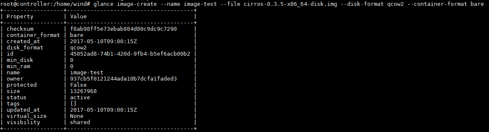
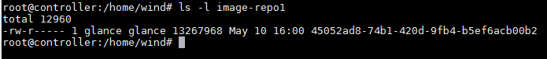

# Multiple store locations for Glance images


\- Ta có thể store images trong nhiều vị trí khác nhau.  
\- Sau đây là ví dụ về cấu hình cách lưu images trong nhiều thư mục khác nhau:  
\- Đầu tiên, ta tạo 2 thư mục:  
```
mkdir /home/wind/image-repo1
mkdir /home/wind/image-repo2
```

\- Set owner và group cho user "glance":  
```
chown glance:glance /home/wind/image-repo1
chown glance:glance /home/wind/image-repo2
```

\- Mở file `/etc/glance/glance-api.conf`  
Tìm đến section `[glance_store]` và cấu hình như sau:  
```
filesystem_store_datadir =
filesystem_store_datadirs = /var/lib/glance/images
filesystem_store_datadirs = /home/wind/image-repo1:200
filesystem_store_datadirs = /home/wind/image-repo2:100
```

Mặc định thư mục sẽ có priority bằng "0", ở đây ta đặt priority của thư mục `/home/wind/image-repo1 = 200` và thư mục `/home/wind/image-repo2 = 100`.  
\- Restart lại `service glance-api` :  
```
service glance-api restart
```

\- Tạo image:
```
glance image-create --name image-test --file cirros-0.3.5-x86_64-disk.img --disk-format qcow2 --container-format bare
```



\- Theo lý thuyết, images sẽ lưu ở trong thư mục `/home/wind/image-repo1`.Ta kiểm tra:  



Quả đúng như vậy!


