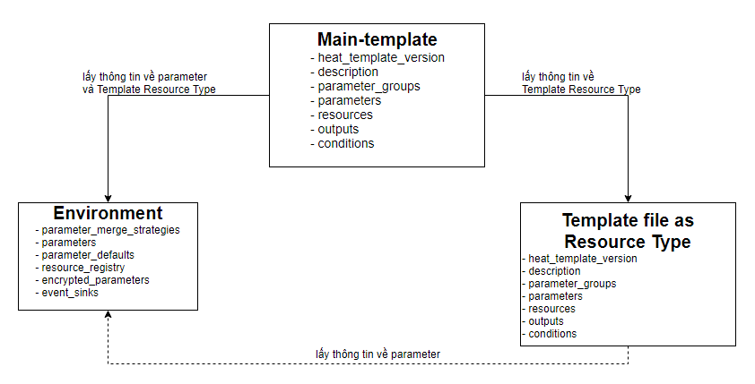

# File template sử dụng như 1 resource type

# MỤC LỤC
- [1.Giới thiệu](#1)
- [2.Sử dụng template filename như resource type](#2)
- [3.Định nghĩa resource type mới](#3)
- [4.Truy cập nested attributes](#4)
- [5.Làm cho template resource của bạn rõ ràng hơn](#5)
- [6.Global template và user template](#6)
- [7.Ghi nhớ về Template Resource Type, environment và main Template](#7)
  - [7.1.Main tempalte + environment](#7.1)
  - [7.2.Main template + environment + Template Resource Type](#7.2)
  - [7.3.Mô hình quan hệ giữa main template, environment và Template Resource Type](#7.3)


<a name="1"></a>
# 1.Giới thiệu
\- Khi viết các templates phức tạp, ta nên chia nhỏ template thành các template nhỏ hơn riêng biệt. Sau dó, ta có thể kết hợp chúng với nhau bằng cách sử dụng template resource. Đây là cơ chế để định nghĩa resource sử dụng template, do đó, ta có thể soạn thảo stack hợp lý với nhiều templates.  
\- Template resource cung cấp tính năng tương tự như `AWS::CloudFormation::Stack` resource như sau:
- Định nghĩa resource types mới  và xây dựng thư viện resource của chúng.
- Override hành vi mặc định của các resource type hiện có.

\- Khi template coi như resource type, thì parameter của template sẽ được coi là properties của resource type và output của template sẽ được coi là attribute của resource type.  

<a name="2"></a>
2.Sử dụng template filename như resource type
\- VD về template `my_nova.yaml` định nghĩa tạo VM:  
```
heat_template_version: 2015-04-30

parameters:
  key_name:
    type: string
    description: Name of a KeyPair

resources:
  server:
    type: OS::Nova::Server
    properties:
      key_name: {get_param: key_name}
      flavor: m1.small
      image: ubuntu-trusty-x86_64
```

\- Sử dụng template trên, ta tạo template mới là `vm.yaml`:  
```
heat_template_version: 2015-04-30

resources:
  my_server:
    type: my_nova.yaml
    properties:
      key_name: my_key
```

Tham số `key_name` của file `my_nova.yaml` trở thành properties`key_name` của template mới.  
\- Chú ý 1:  
Giả sử file my_nova.yaml và vm.yaml là cùng thư mục. Bạn có thể sử dụng bất kỳ định dạng nào sau đây:
Đường dẫn tương đối - đường dẫn tương đối so với file vm.yaml: (my_nova.yaml) , 
Đường dẫn tuyệt đối: (file:///home/user/templates/my_nova.yaml)
HTTP URL: (http://example.com/templates/my_nova.yaml)
HTTPS URL: (https://example.com/templates/my_nova.yaml)

\- Chú ý 2:
Đường dẫn tương đối chỉ có thể dùng với trường hợp sử dụng user environment; còn nếu sử dụng global enviroment, phải sử dụng đường dẫn tuyệt đối hoặc URL.  

<a name="3"></a>
# 3.Định nghĩa resource type mới
\- Bạn có thể gắn têm template `my_nova.yaml` trong file environment. Nếu tên đã tồn tại bởi module Orchesrtaion thì resource mới của bạn sẽ override lên phần mặc định.  
\- Trong ví dụ mới `OS::Nova::Server` resource override resource mặc định cùng tên.  
\- VD về file `env.yaml` định nghĩa resource mới:  
```
resource_registry:
  "OS::Nova::Server": my_nova.yaml
```

Bạn có thể sử dụng `OS::Nova::Server` trong template của bạn:  
```
heat_template_version: 2015-04-30

resources:
  my_server:
    type: OS::Nova::Server
    properties:
      key_name: my_key
```

Tạo stack chạy:  
```
$ openstack stack create -t main.yaml -e env.yaml example-two
```

<a name="4"></a>
# 4.Truy cập nested attributes
\- Có nhiều attribute ẩn của 1 template resource. Truy cập các nested attribute yêu cầu `heat_template_version 2014-10-16` hoặc cao hơn. Truy cập như sau:  
```
heat_template_version: 2015-04-30

resources:
  my_server:
    type: my_nova.yaml

outputs:
  test_out:
    value: {get_attr: [my_server, resource.server, first_address]}
```

<a name="5"></a>
# 5.Làm cho template resource của bạn rõ ràng hơn
\- Chú ý: Áp dụng cho phiên bản OpenStack Kilo hoặc cao hơn.  
\- Nếu bạn muốn trả lại ID của 1 inner resource thay vì định danh của nested stack, bạn có thể thêm ouput cụ thể `OS::stack_id` vào template resource của bạn:  
```
heat_template_version: 2015-04-30

resources:
  server:
    type: OS::Nova::Server

outputs:
  OS::stack_id:
    value: {get_resource: server}
```

\- Khi bạn sử dụng `get_resource` từ outer template, heat sẽ không trả không trả lại id của máy ảo.  

<a name="6"></a>
# 6.Global template và user template
\- Thư mục **global template** cho phép files được pre-loaded trong **global environment**. Global template được tạo bởi nhà điều hành cloud. 1 mục nhập trong **user template** được ưu tiên hơn **global environment**. OpenStack bao gồm global template mặc định, nhưng nhà điều hành cloud có thể thêm các template bổ sung.  
\- Nhà điều hành cloud có thể thêm các global template mới bằng cách thêm các file template trong thưc mục có thể định cấu hình bất cứ nơi nào Orchestration engine chạy. Biến cấu hình tên là `template_dir` và được tìm thấy trong section `[DEFAULT]` của file `/etc/heat/heat.conf`. Thư mục mặc định là `/etc/heat/templates`.  
```
[DEFAULT]
template_dir = /etc/heat/templates
```

Nếu file `my_tmpl.yaml` từ ví dụ dưới đây được đặt trong thư mục `template_dir`, các template khác mà bạn dùng để tạo stacks có thể bao gồm `my_tmpl.yaml` trong nó:  
```
resources:
  my_server:
    type: my_tmpl.yaml
```

\- Chú ý:  
Tại phiên bản OpenStack Pike, mình thử test dùng global template nhưng không dùng được.  

<a name="7"></a>
# 7.Ghi nhớ về Template Resource Type, environment và main Template
\- Trong 1 template (main template hoặc template reousece type), nếu muốn sử dụng hàm `get_param` thì variable parameter phải được khai báo trong template.  
\- Environment được khai báo những variable parameter không có trong template (main template hoặc template reousece type).  

<a name="7.1"></a>
## 7.1.Main tempalte + environment
\- Nếu 1 variable parameter chỉ có giá trị chỉ ở main tempalte hoặc environment thì giá trị đó sẽ là giá trị trả về của hàm `get_param`.  
Nếu 1 variable parameter đó có giá trị ở cả main tempalte và environment thì giá trị của environment sẽ là giá trị trả về của hàm `get_param`.  

<a name="7.2"></a>
## 7.2.Main template + environment + Template Resource Type
\- Description sẽ là của main tempalte.  
\- Nếu 1 variable parameter chỉ có giá trị chỉ ở main tempalte hoặc environment hoặc template reousece type thì giá trị đó sẽ là giá trị trả về của hàm `get_param`.  
Nếu 1 variable parameter đó có giá trị ở cả main template, template reousece type và environment thì giá trị của environment sẽ là giá trị trả về của hàm `get_param`.  
Variable parmeter ở main template và Template Resource Type không có tác động lẫn nhau.  
\- Khi khởi tạo giá trị properties của Template Resource Type được sử dụng trong main tempalte, thì value của properties ở main template (là parameter của trong file Template Resource Type) được ưu tiên hơn giá trị parameter của environment và  Template Resource Type.  

<a name="7.3"></a>
## 7.3.Mô hình quan hệ giữa main template, environment và Template Resource Type




