# Heat engine

# MỤC LỤC
- [1.Heat legacy engine](#1)
- [2.Heat convergence engine](#2)
- [3.So sánh legacy engine và convergence engine](#3)

Heat engine tại bản Pike có 2 loại là Heat legacy engine và Heat convergence engine.  

# 1.Heat legacy engine
\- Cơ chế của "Heat legacy engine" là xử lý mỗi stack trên một heat engine.  
\- Xem ví dụ sau để hiểu rõ hơn.  
- Giả sử mô hình có 3 heat engine như hình dưới.  
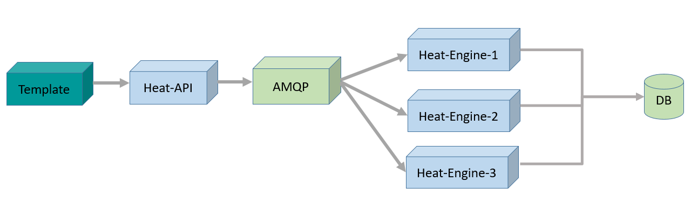

- Giả sử khi hệ thống yêu cầu thực hiện Stack-1, thì Stack-1 sẽ được đưa vào Heat Engine 1 để xử lý.  
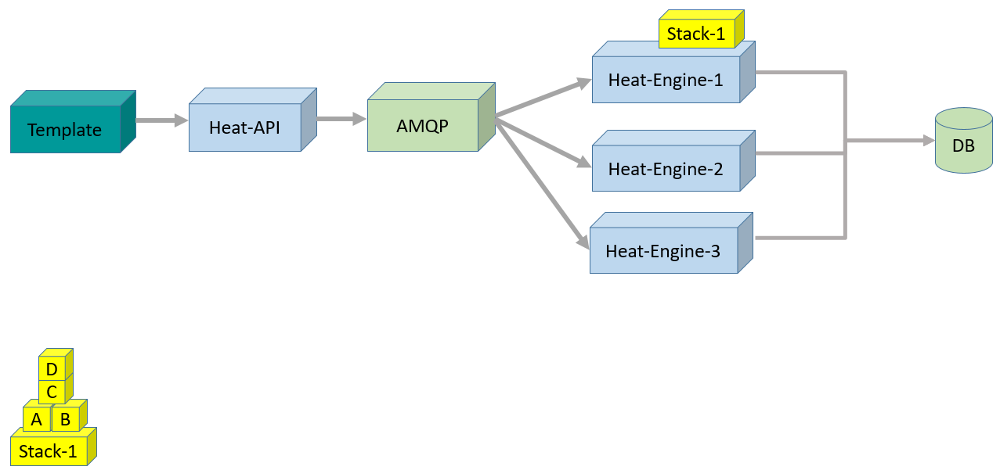

- Sau đó, hệ thống yêu cầu thực hiện Stack-2, thì Stack-2 sẽ được đưa vào Heat Engine 2 để xử lý  
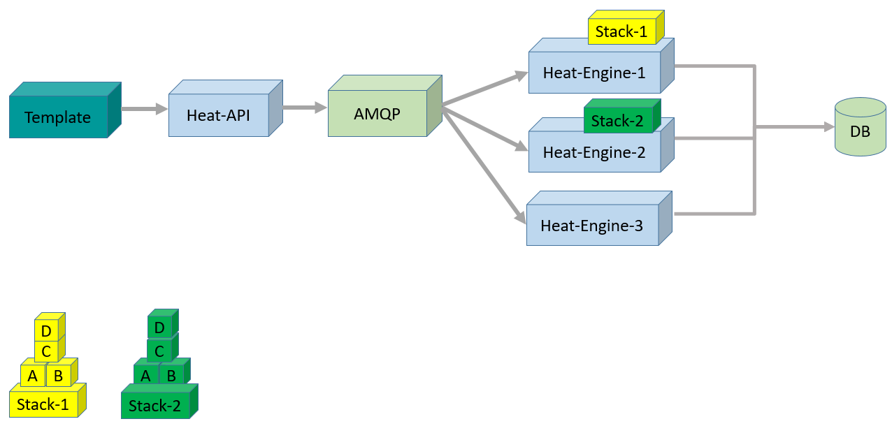

- Sau đó, hệ thống yêu cầu thực hiện Stack-3, thì Stack-3 sẽ được đưa vào Heat Engine 3 để xử lý  
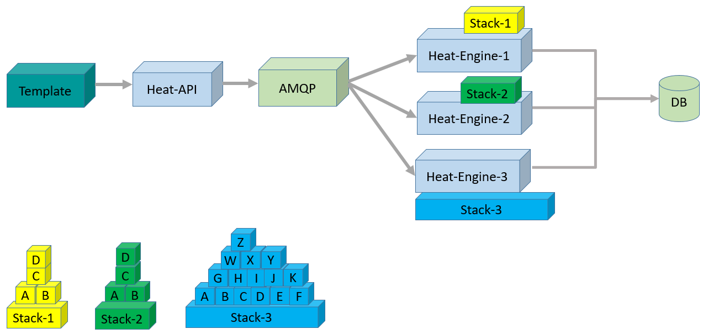

\- Kết luận:  
- Stack được phân phối cho các heat engine có sẵn xử lý.
- Mỗi stack được xử lý bởi 1 heat engine.
- Stack đang được xử lý bởi 1 heat engine sẽ không được xử lý bởi heat engine khác ngay có khi chúng đang có sẵn.  
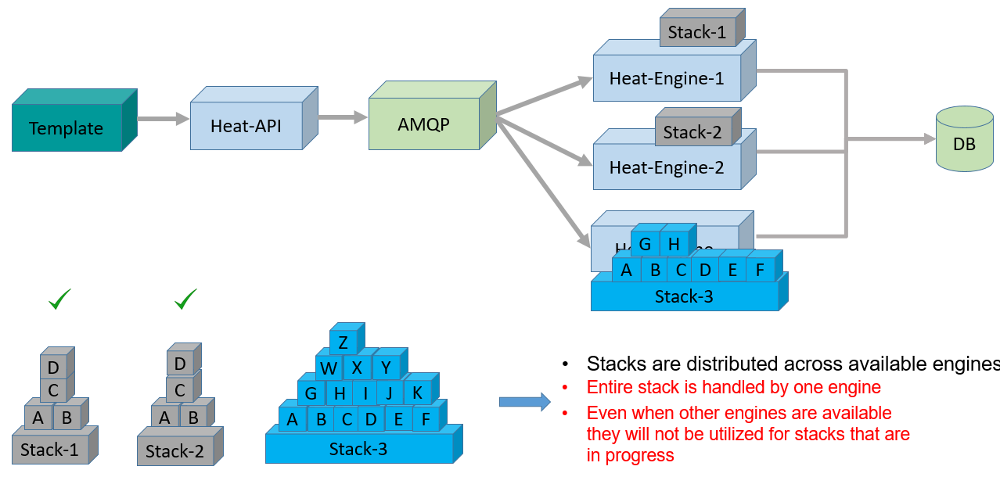

# 2.Heat convergence engine
\- Xem ví dụ sau để hiểu rõ hơn.
- Giả sử mô hình có 3 heat engine như hình dưới.  

- Heat engine luôn luôn lắng nghe xem hệ thống có yêu cầu thực hiện Stack nào không!  
Giả sử có yêu cầu thực hiện Stack-1, Stack-2 và Stack-3.  
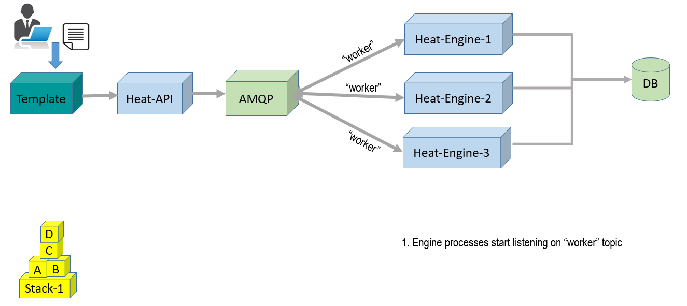

- Heat engine phân tích các template và lưu trữ graph, tài nguyên trong database, giả sử Stack-1 được phân tích như hình dưới.  
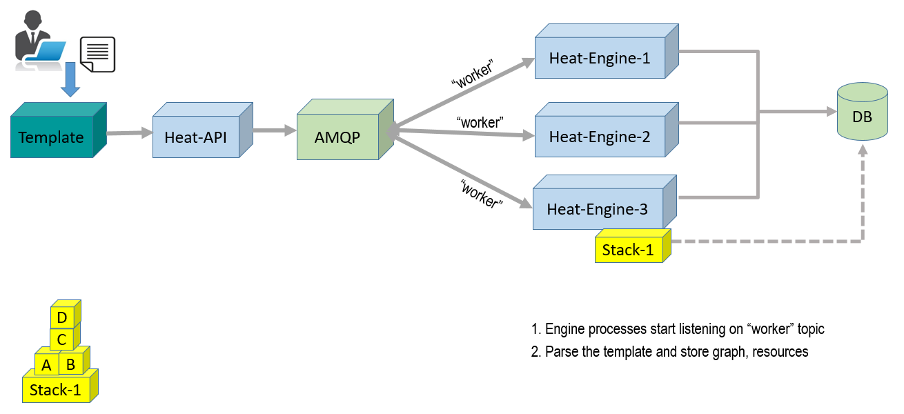

- Tài nguyên được phân bổ cho các heat engine xử lý.  
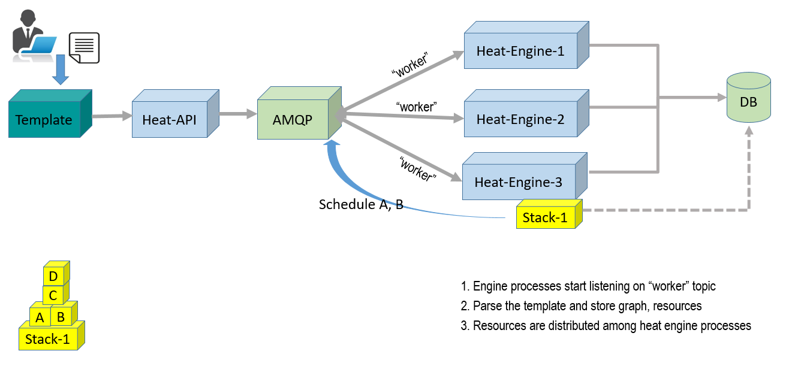

- Heat engine sẽ xử lý A, B của Stack-1 trước. A sẽ được đưa vào heat engine 1, B sẽ được đưa vào heat engine 2.  
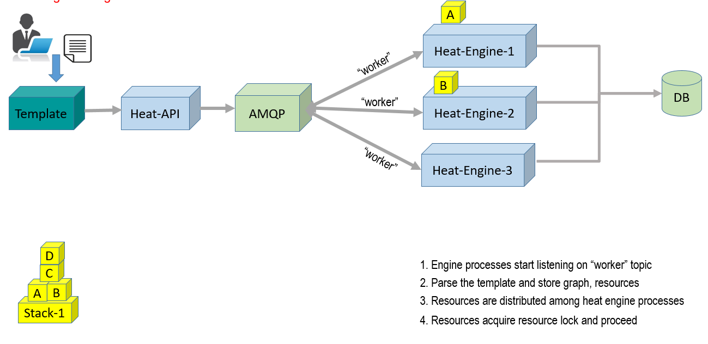

- Sau đó, tiếp tục xử lý A, B của Stack-2. A sẽ được đưa vào heat engine 3, B sẽ được đưa vào heat engine 1.  

- Sau đó, tiếp tục xử lý A, B, C, D, E, F của Stack-3. A sẽ được đưa vào heat engine 2, B sẽ được đưa vào heat engine 3, cứ như vậy sắp xếp vào vào các heat engine từ 1-3 như hình dưới.  
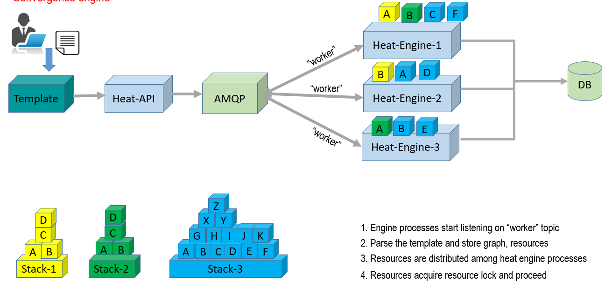

- A được heat engine 1 xử lý xong, chưa cần xử lý C.  
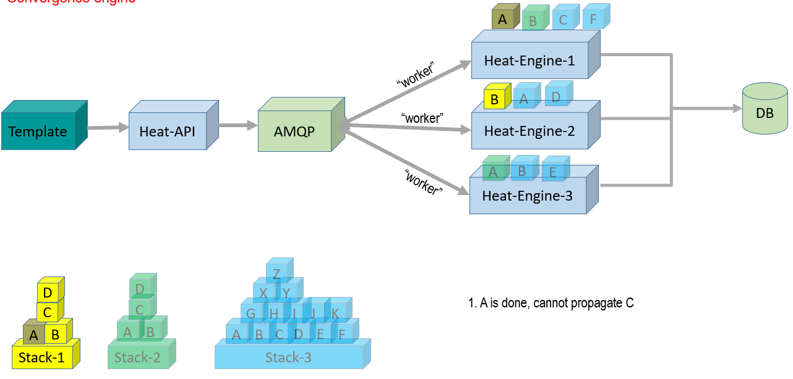

- B được heat engine 2 xử lý xong, cần xử lý C.  
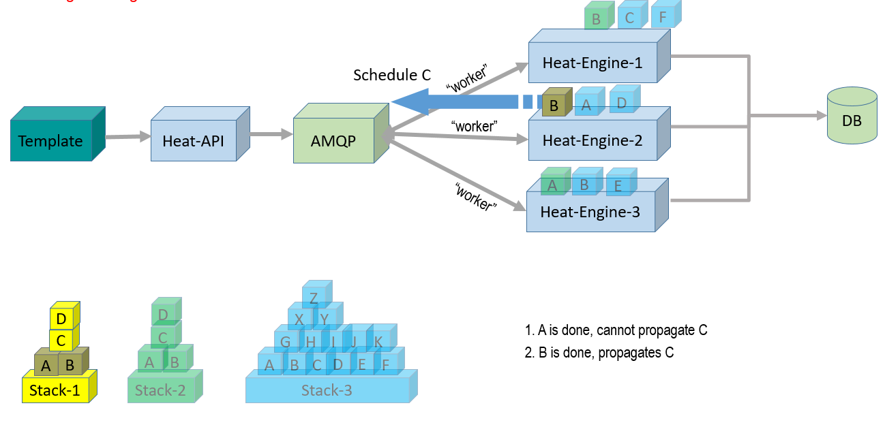

- A, B, C, D, E, F được heat engine 1,2,3 xử lý xong. Tiếp tục đưa C của Stack 1, C của Stack 2 và GHIJK của Stack 3 vào để xử lý.  
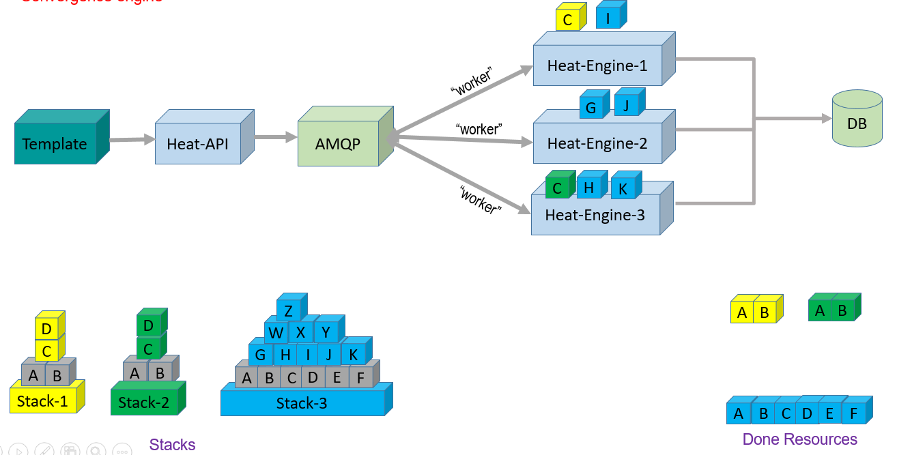

- C của Stack 1, C của Stack 2 và GHJ của Stack 3các Stack được xử lý xong, tiếp tục đưa vào để xử lý  

- Sau đó, xử lý nốt và dựa vào Database để lắp ghép thành stack được xử lý hoàn chỉnh.  
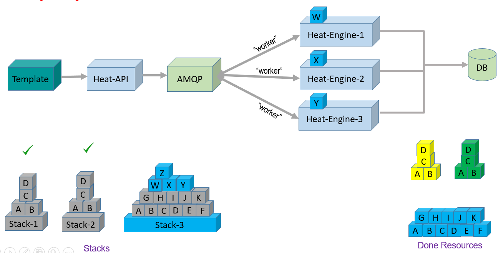  
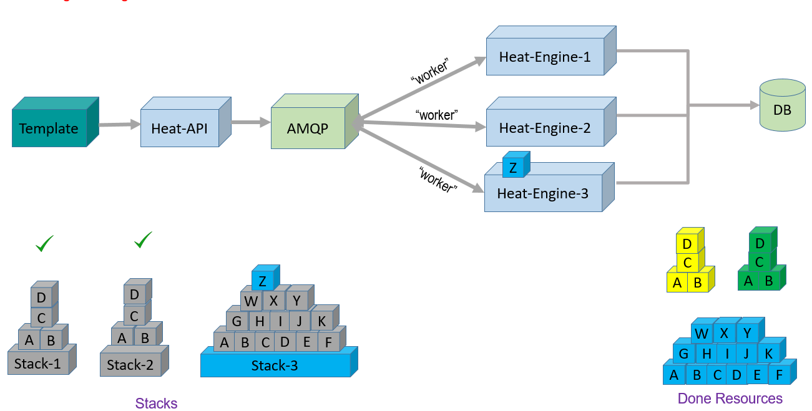
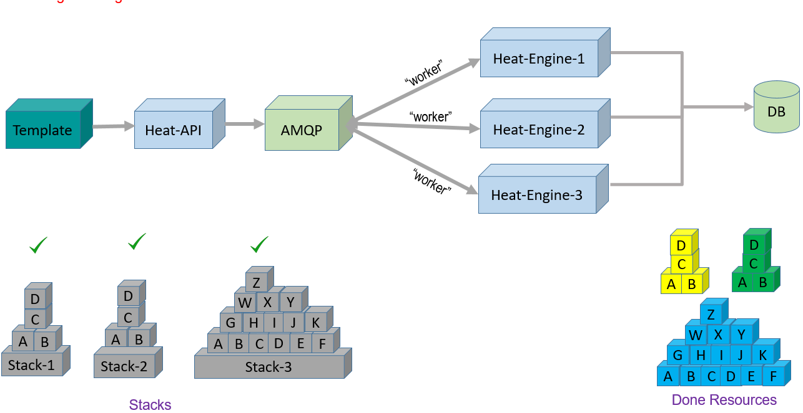

# 3.So sánh legacy engine và convergence engine
||Legacy|Convergence|
|---|---|---|
|Locking|Stack wide|More granular resource locks|
|Graph/Progress Info|Trong memory|Trong database|
|Load distribution|Stack chạy trên 1 engine|Tài nguyên stack được phân phối chạy trên nhiều engine|
|Concurrent Update|Không|Có|

