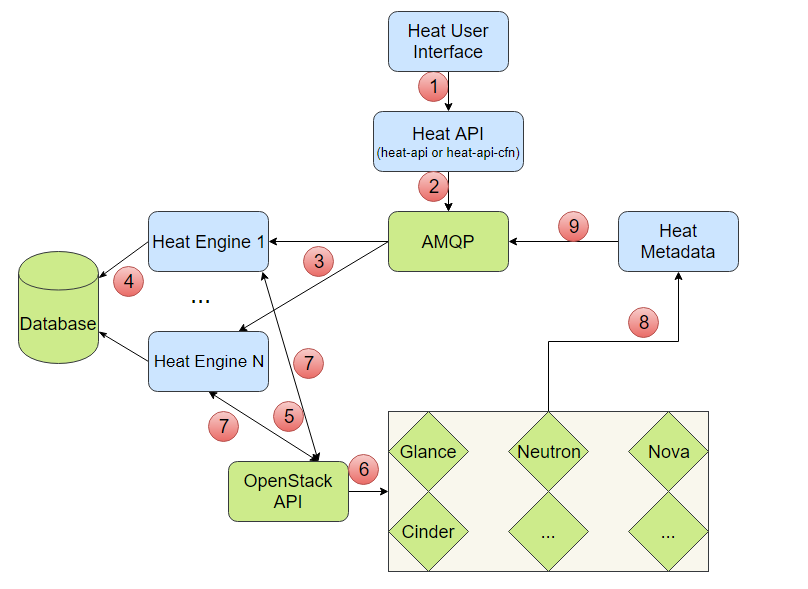

# Kiến trúc và workflow của Heat 

# MỤC LỤC
- [1.Kiến trúc của Heat](#1)
- [2.Workflow của Heat](#2)

# 1.Kiến trúc của Heat
\- Kiến trúc của Heat bao gồm các thành phần:  

|Tên|Loại|Mô tả|
|---|---|---|
|heat|CLI (command line client)|là CLI để giao tiếp với heat-api và chạy lệnh Orchestration sử dụng AWS CloudFormation APIs.|
|heat-api|thành phần|cung cấp OpenStack-native REST API  xử lý các yêu cầu API bằng cách gửi chúng đến heat-engine thông RPC.|
|heat-api-cfn|thành phần|cung cấp API truy vấn AWS tương thích với AWS CloudFormation và xử lý các yêu cầu API  bằng cách gửi chúng tới heat-engine thông qua RPC.|
|heat-engine|thành phần chính|có nhiệm vụ chính là điều phối việc khởi tạo templates và cung cấp các sự kiện cho người dùng API.|

# 2.Workflow của Heat

\- Bước 1: Người dùng sử dụng heat command hoặc dashboard để thực hiện stack từ template, ví dụ: tạo máy ảo.  
\- Bước 2: Heat API gửi yêu cầu thực hiện stack xuống AMQP.  
\- Bước 3: Heat Engine lấy yêu cầu từ AMQP để thực hiện.  
\- Bước 4: Lưu trữ thông tin stack vào Database.  
\- Bước 5: Heat Engine phân tích stack, điều phối tài nguyên để thực hiện stack và gửi yêu cầu xuống OpenStack API.  
\- Bước 6: OpenStack API tác động đến các project như Glance, Neutron, Nova, Cinder,… để thực hiện yêu cầu.  
\- Bước 7: Trả lời Heat engine thông tin về tài nguyên vừa được tạo, ví dụ: như id mạng vừa được tạo.  
\- Bước 8: Trả lời metadata (như ip của máy ảo,…) cho Heat Metadata.  
\- Bước 9: Heat Metadata gửi metadata đến AMQP.  

