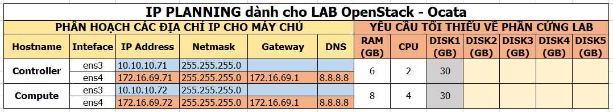

# Cài OpenStack Ocata với Linux bridge


# MỤC LỤC
- [1.Mô hình](#1)
- [2.IP Planning](#2)
- [3.Cài đặt](#3)
  - [3.1.Cài thủ công theo hướng dẫn](#3.1)
  - [3.2.Sử dụng scripts](#3.2)
    - [3.2.1.Cách 1: Thực hiện chạy scripts trên từng node Controller và Compute1](#3.2.1)
    - [3.2.2.Cách 2: Trên node Controller, chạy scripts cài đặt cho cả 2 node.](#3.2.2)

<a name="1"></a>
# 1.Mô hình
Mô hình cài đặt OpenStack Ocata gồm 2 node: Controller và Compute1.


<a name="2"></a>
# 2.IP Planning
Yêu cầu phần cứng và địa chỉ IP cho các nodes.



<a name="3"></a>
# 3.Cài đặt
<a name="3.1"></a>
## 3.1.Cài thủ công theo hướng dẫn
[Cài OpenStack Ocata với Linux bridge](docs/Install_OPS_with_Linuxbridge.md)

<a name="3.2"></a>
## 3.2.Sử dụng scripts 
Sử dụng scripts có 2 cách:  
- Cách 1: Thực hiện chạy scripts trên từng node Controller và Compute1.
- Cách 2: Trên node Controller, chạy scripts cài đặt cho cả 2 node.

<a name="3.2.1"></a>
### 3.2.1.Cách 1: Thực hiện chạy scripts trên từng node Controller và Compute1
\- Download các file shell scripts trên cả 2 node. Thực hiện các câu lệnh sau:  
```
apt-get install svn -y
svn export https://github.com/doxuanson/thuctap012017/trunk/XuanSon/OpenStack/Install%20OpenStack/Ocata/Install_OPS_with_Linuxbridge/scripts
```

\- Sau đó thực hiện các bước sau với quyền root.  
\- Set quyền 755 cho các files đó.  
```
cd scripts
chmod 755 *
```

\- Chỉnh sửa tên network card theo server của bạn trong file `config.sh`.  
\- Bạn có thể cài theo mô hình **Provider netowrk** hoặc **Self-service network**:  
- Mô hình **Provider netowrk**  
Thực thi các file bằng command như sau:  
  - Trên node **Controller**:  
  ```
  source ctl-provider-all.sh
  ```

  - Sau khi cài đặt xong node Controller, chuyển sang node **Compute1**:  
  ```
  source com-provider-all.sh
  ```

  - Sau khi cài xong trên node **Controller** và **Compute1**, thực hiện command sau trên node **Controller** để tìm kiếm các node **Compute**:  
  ```
  source ctl-4-nova_discoveryhost.sh
  ```

- Mô hình **Self-service network**  
Thực thi các file bằng command như sau:  
  - Trên node **Controller**:  
  ```
  source ctl-selfservice-all.sh
  ```

  - Sau khi cài đặt xong node Controller, chuyển sang node **Compute1**:  
  ```
  source com-selfservice-all.sh
  ```

  - Sau khi cài xong trên node **Controller** và **Compute1**, thực hiện command sau trên node **Controller** để tìm kiếm các node **Compute**:  
  ```
  source ctl-4-nova_discoveryhost.sh
  ```

<a name="3.2.2"></a>
### 3.2.2.Cách 2: Trên node Controller, chạy scripts cài đặt cho cả 2 node
\- **Ý tưởng**: Thực hiện cài Cài đặt các project trên node Controller, sau đó từ Controller, ta sử dụng scripts để cài các project trên node Compute1.  
\- **Yêu cầu**: Trên 2 node đều cài ssh server và được cấu hình cho phép ssh qua `root`.  
\- **Trên node Controller**  
  - Download các file shell scripts. Thực hiện các câu lệnh sau:  
  ```
  apt-get install svn -y
  svn export https://github.com/doxuanson/thuctap012017/trunk/XuanSon/OpenStack/Install%20OpenStack/Ocata/Install_OPS_with_Linuxbridge/scripts_ssh
  ```
  - Sau đó thực hiện các bước sau với quyền root.  
  - Set quyền 755 cho các files đó.  
  ```
  cd scripts_ssh
  chmod 755 CTL/*
  chmod 755 COM/*
  ```

  - Chỉnh sửa tên network card theo server của bạn trong file `config.sh`.  

\- **Trên code Compute1**  
  - Download các file shell scripts. Thực hiện các câu lệnh sau:  
  ```
  wget https://github.com/doxuanson/thuctap012017/blob/master/XuanSon/OpenStack/Install%20OpenStack/Ocata/Install_OPS_with_Linuxbridge/scripts_ssh/COM/ip_setup.sh
  ```

  - Thực hiện script setup địa chỉ IP cho node Compute1 theo cú pháp:  
  ```
  source ip_setup.sh <node_name> <NIC_name> <IP_address> <netmask> <gateway>
  ```

  Ví dụ trong trường hợp này:  
  ```
  source ip_setup.sh compute1 ens3 192.168.2.72 255.255.255.0 192.168.2.1
  ```

\- Bạn có thể cài theo mô hình **Provider netowrk** hoặc **Self-service network**:  
  - Mô hình **Provider netowrk**, thực thi trên node Controller  
    Cài đặt các project trên node Controller, thực hiện các lệnh sau:  
    ```
    cd CTL
    source ctl-provider-all.sh
    ```
    
    Cài đặt các project trên node Compute, thực hiện các lệnh sau:  
    ```
    cd COM
    source sshkey_setup.sh 192.168.2.72 #điền mật khẩu của user root trên node Compute1
    source com-provider-all_ssh.sh 192.168.2.72
    ```

  - Mô hình **Self-service netowrk**, thực thi trên node Controller  
    Cài đặt các project trên node Controller, thực hiện các lệnh sau:  
    ```
    cd CTL
    source ctl-selfservice-all.sh
    ```
    
    Cài đặt các project trên node Compute, thực hiện các lệnh sau:  
    ```
    cd COM
    source sshkey_setup.sh 192.168.2.72 #điền mật khẩu của user root trên node Compute1
    source com-selfservice-all_ssh.sh 192.168.2.72
    ```


