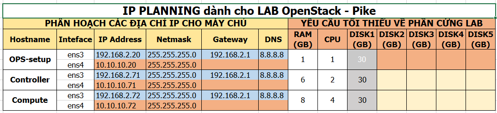

# Cài OpenStack Pike với Open vSwitch


# MỤC LỤC
- [1.Mô hình](#1)
- [2.IP Planning](#2)
- [3.Cài đặt](#3)
  - [3.1.Cài thủ công theo hướng dẫn](#3.1)
  - [3.2.Sử dụng scripts](#3.2)
    - [3.2.1.Cách 1: Thực hiện chạy scripts trên từng node Controller và Compute](#3.2.1)
    - [3.2.2.Cách 2: Tạo thêm 1 node OPS-setup, sau đó đứng trên node OPS-setup cài 2 node Controller và Compute](#3.2.2)

<a name="1"></a>
# 1.Mô hình
Mô hình cài đặt OpenStack Pike gồm 2 node: Controller và Compute.


<a name="2"></a>
# 2.IP Planning
Yêu cầu phần cứng và địa chỉ IP cho các nodes.


<a name="3"></a>
# 3.Cài đặt
\- Có 2 cách cài đặt OpenStack:  
- Cài thủ công.
- Cài sử dụng scripts.

<a name="3.1"></a>
## 3.1.Cài thủ công theo hướng dẫn
[Cài OpenStack Pike với Open vSwitch](docs/Install_OPS_with_OVS.md)

<a name="3.2"></a>
## 3.2.Sử dụng scripts 
Sử dụng scripts có 2 cách:  
- Cách 1: Thực hiện chạy scripts trên từng node Controller và Compute.
- Cách 2: Tạo thêm 1 node OPS-setup, sau đó đứng trên node OPS-setup cài 2 node Controller và Compute

> Chú ý: Thực hiện tất cả các lệnh với quyển user `root`. 
<a name="3.2.1"></a>
### 3.2.1.Cách 1: Thực hiện chạy scripts trên từng node Controller và Compute
  
\- Trên cả 2 node Controller và Compute:  
- Download các file shell scripts trên cả 2 node. Thực hiện các câu lệnh sau:  
```
apt-get install subversion -y
svn export https://github.com/doxuanson/thuctap012017/trunk/XuanSon/OpenStack/Install%20OpenStack/Pike/Install_OPS_with_OVS/scripts
```

- Set quyền 755 cho các files đó.  
```
chmod -R 755 scripts
```

- Thực hiện script setup địa chỉ IP cho **Provider Network** theo mô hình theo cú pháp:  
```
source ip_setup.sh <node_name> <NIC_name> <IP_address> <netmask> <gateway>
```

Ví dụ trên node **Controller**:  
```
source ip_setup.sh controller ens3 192.168.2.71 255.255.255.0 192.168.2.1
```

- Sau khi setup địa chỉ IP, ta sử dụng địa chỉ IP đó để ssh vào 2 node Controller và Compute để thực hiện scripts.  

\- Cấu hình mạng và mô hình cài đặt (`provider` hoặc `selfservice`) theo mô hình của bạn trong file `config.sh`.  
\- Thực thi các file bằng command như sau:  
- Trên node **Controller**:  
```
source ctl-all.sh
```

- Sau khi cài đặt xong node Controller, chuyển sang node **Compute**:  
```
source com-all.sh
```

- Sau khi cài xong trên node **Controller** và **Compute**, thực hiện command sau trên node **Controller** để tìm kiếm các node **Compute**:  
```
source ctl-4-nova_discoveryhost.sh
```


<a name="3.2.2"></a>

### 3.2.2.Cách 2: Tạo thêm 1 node OPS-setup, sau đó đứng trên node OPS-setup cài 2 node Controller và Compute

#### Mô hình


#### IP Planning



#### Cài đặt
\- **Yêu cầu**: Trên 2 node đều cài ssh server và được cấu hình cho phép ssh qua `root`.  
\- **Trên node Controller và node Compute**  
  - Download file shell script. Thực hiện các câu lệnh sau:  
  ```
  wget https://raw.githubusercontent.com/doxuanson/thuctap012017/master/XuanSon/OpenStack/Install%20OpenStack/Pike/Install_OPS_with_OVS/OPS-setup/ip_setup.sh
  ```

 - Thực hiện script setup địa chỉ IP cho **Provider Network** theo mô hình theo cú pháp:  
  ```
  source ip_setup.sh <node_name> <NIC_name> <IP_address> <netmask> <gateway>
  ```

  Ví dụ trên node **Controller**:  
  ```
  source ip_setup.sh controller ens3 192.168.2.71 255.255.255.0 192.168.2.1
  ```

  - Sau khi setup địa chỉ IP, ta sử dụng địa chỉ IP đó để ssh vào 2 node Controller và Compute để thực hiện scripts.  

\- **Trên node OPS-setup**  
  - Download các file shell scripts. Thực hiện các câu lệnh sau:  
  ```
  apt-get install subversion -y
  svn export https://github.com/doxuanson/thuctap012017/trunk/XuanSon/OpenStack/Install%20OpenStack/Pike/Install_OPS_with_OVS/OPS-setup
  ```

  - Sau đó thực hiện các bước sau với quyền root.  
  - Set quyền 755 cho các files đó. 

  ```
  chmod -R 755 OPS-setup
  ```

  - Cấu hình mạng, mô hình cài đặt (`provider` hoặc `selfservice`), password các node Controller và Compute theo mô hình của bạn trong file `OPS-setup/config.sh`.  
  - Thực thi các file bằng command như sau:  
    - Cài đặt các project trên node Controller, thực hiện các lệnh sau:  
    ```
    cd OPS-setup/CTL
    source ssh_ctl-all.sh
    ```
    
    - Cài đặt các project trên node Compute, thực hiện các lệnh sau:  
    ```
    cd OPS-setup/COM
    source ssh_com-all.sh
    ```


