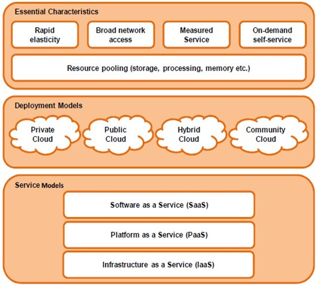
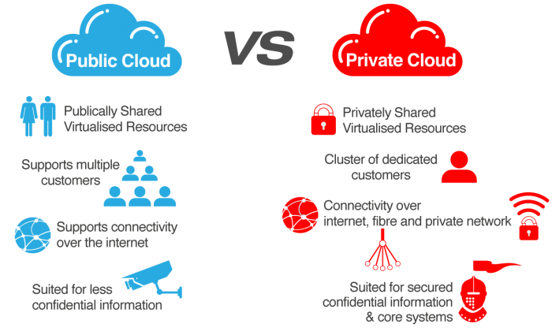
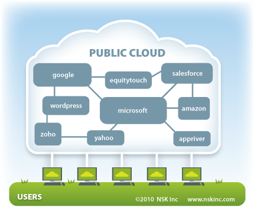
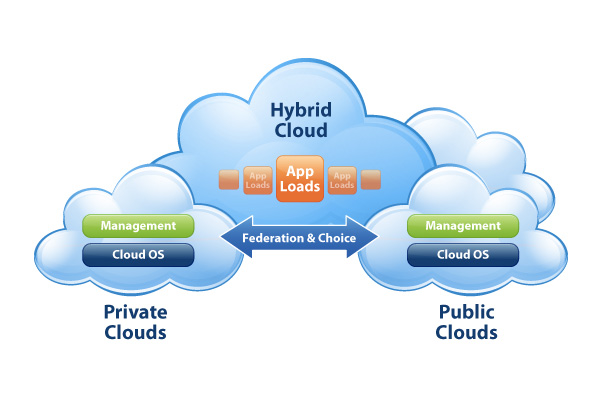
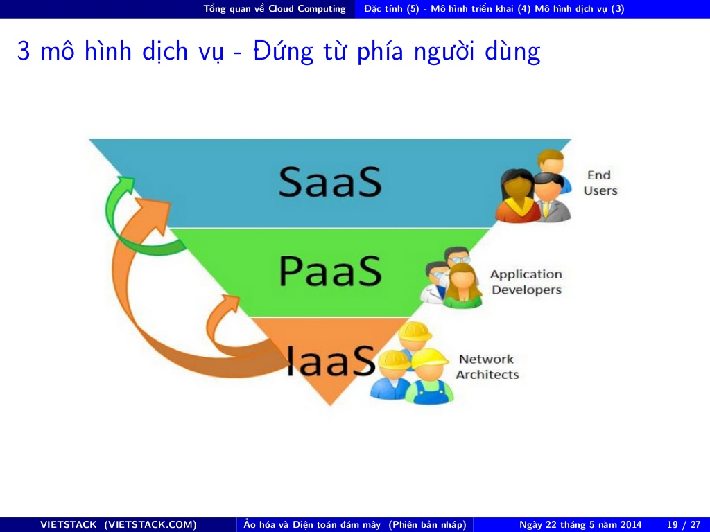
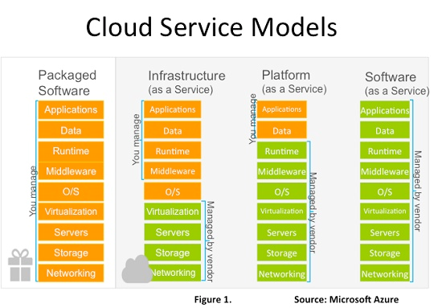
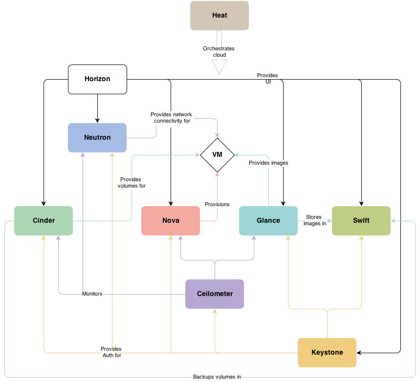
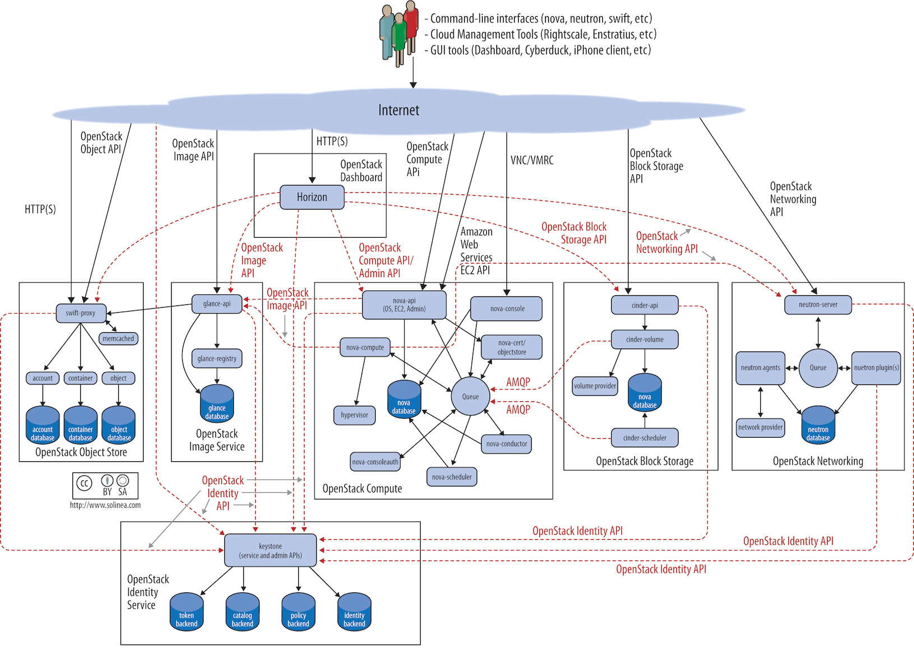
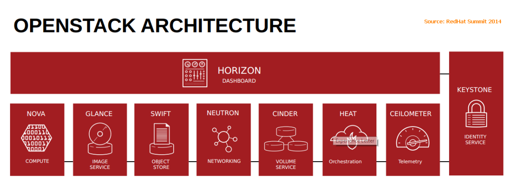

# Cloud computing and OpenStack

# MỤC LỤC

# 1.Cloud Computing

## 1.1.Virtualization
\- Virtualization (ảo hóa) đề cập đến hành động tạo ra phiên bản “virtual” của một cái gì đó, bao gồm virtual computer hardware platforms, storage devices, và computer network resource.  
\- Virtualization bắt đầu từ năm 1960, như một method logic để chia system resource được cung cấp với mainframe computer giữa các applization khác nhau. Kể từ ddos, ý nghĩa của thuật ngữ này được mở rộng.  
\- Các loại virutalization:  
- Hardware virtualization
- Server Virtualization
- Network virtualization
- Storage Virtualization
- Desktop virtualization
- etc…

## 1.2.Cloud Computing
Theo định nghĩa của NIST:  
Cloud computing là mô hình cho phép access qua network để lựa chọn và sử dụng computing resource (ví dụ: networks, servers, storage, application, và service) theo nhu cầu một cách thuận tiện và nhanh chóng; đồng thời cho phép kết thúc sử dụng dịch vụ, giải phóng tài nguyên dễ dàng, giảm thiểu các giao tiếp với nhà cung cấp”. Mô hình cloud có 5 đặc tính, 4 deployment models và 3 service models.  

## 1.3.Đặc tính (5) - Deployment models (4) và Service model (3)

### 5 đặc tính của cloud computing
\- On-demand self-service: Khả năng tự phục vụ của người dùng, chủ động khởi tạo, tạm dừng dịch vụ …  
\- Broad network access: Khả năng truy cập trên mọi nền tảng thiết bị, mọi loại hạ tầng về mạng, khu vực địa lý.  
\- Resource pooling: Khả năng gom – gộp tài nguyên vật lý – sau đó phân bổ một cách tự động cho người sử dụng – dựa vào nhu cầu.  
\- Rapid elasticity: Khả năng “co giãn và đàn hồi” tài nguyên một cách nhanh chóng và thuật tiện. Có thể cấp phát và thu hồi một cách nhanh chóng.  
\- Measured service: Khả năng đo lường dịch vụ để kiểm tra thời gian sử dụng – từ đó tính toán chi phí theo mức độ sử dụng dịch vụ.  

### 4 mô hình triển khai
\- Priave Cloud: Được cung cấp cho nội bộ tổ chức, ít nhu cầu bảo mật và tính pháp lý hơn so với Public Cloud.  
Vd: Data Center HP  
\- Public Cloud: Là dịch vụ cung cấp cho khác hàng sử dụng thông qua internet, thường là thương mại hóa.  
Vd: Amazon, Digitalocean, Rackspaces,…  
\- Hybird Cloud: Sự kết hợp giữa Public Cloud và Private Cloud.  
\- Community Cloud: Sự kết hợp của nhiều CSP – Cloud Service Provider.  

## 3 mô hình dịch vụ
\- Iaas – Infrastructure as a Services  
- Cung cấp dịch vụ về hạ tầng, các server, resource là: RAM, CPU, Storage…
- Trên đó user sẽ VM với OS, user chủ động cài đặt application:
- VD: EC2 của Amazon, Rackspace…

\- PaaS – Platform as a Services  
- Cung cấp dịch vụ của platform như: Database, môi trường để phát triển chương trình.
- Server có sẵn các môi trường để phát triển applization
- VD: Google’s AppEngine, Microsoft Azure

\- SaaS – Software as a Services  
- Cung cấp các dịch vụ về phần mềm, bán hoặc cho thuê lâu dài.
- Nhà cung cấp dịch vụ triển khai gần như toàn bộ
- Các phần mềm về ERP, Email …
- VD: SalesForce.com, Gmail, Dropbox.

# 2.OpenStack

# 2.1.Introduction
OpenStack là nền tảng mã nguồn mở, được sử dụng để xây dựng mô hình private cloud và public cloud.  

## 2.2.Lịch sử hình thành
\- Amazone Web Service là nguồn cảm hứng ra đời cho OpenStack.  
\- OpenStack được sáng lập với NASA và RACKSPACE năm 2010. NASA đóng góp Nebula project, sau có tên là NOVA như ngày nay, RACKSPACE đóng góp SWIFT project – project về lưu trữ file.  
\- Ngày nay đã có sự tham gia của nhiều “ông lớn” như : AT&T, Ubuntu, IBM, RedHat, SUSE, Mirantis, etc.  

## 2.3.Tóm tắt đặc điểm
\- Thiết kế theo hướng module. OpenStack là một project lớn là sự kết hợp của các project thành phần: nova, swift, neutron, glance, etc.  
\- Mở về: Thiết kế/ Phát triển/ Cộng đồng/ Mã nguồn.  
\- Chu kì 6 tháng một phiên bản mới.  
\- 99.99% mã nguồn được viết bằng Python 2.x  
\- Tên các phiên bản được đánh theo A, B, C (Austin, Bexar, Cactus, etc.)….  Tối đa 10 kí tự là danh từ.  
\- Tên các project: Compute – NOVA, Network – NEUTRON, ….  

## 2.4.Architecture
\- Kiến trúc mức khái niệm:  

\- Kiến trúc mức logic (kiến trúc này tham khảo từ phiên bản Grizzly)  

## 2.5.Các projects thành phần
Như đã giới thiệu ở trên, có thể coi OpenStack như một hệ điều hành cloud có nhiệm vụ kiểm soát các tài nguyên tính toán(compute), lưu trữ(storage) và networking trong hệ thống lớn datacenter, tất cả đều có thể được kiểm soát qua giao diện dòng lệnh hoặc một dashboard( do project horizon cung cấp). OpenStack có 6 core project. 6 core project của OpenStack bao gồm: NOVA, NEUTRON, SWIFT, CINDER, KEYSTONE, GLANCE. Sau đây là thông tin về một số project quan trọng của OpenStack.  

\- **Keystone – Identity Service**  
Cung cấp dịch vụ xác thực và ủy quyền cho các dịch vụ khác của OpenStack, cung cấp danh mục của các endpoints cho tất các dịch vụ trong OpenStack. Cụ thể hơn:  
- Xác thực user và vấn đề token để truy cập vào các dịch vụ
- Lưu trữ user và các tenant cho vai trò kiểm soát truy cập(cơ chế role-based access control - RBAC)
- Cung cấp catalog của các dịch vụ (và các API enpoints của chúng) trên cloud
- Tạo các policy giữa user và dịch vụ
- Mỗi chức năng của Keystone có kiến trúc pluggable backend cho phép hỗ trợ kết hợp với LDAP, PAM, SQL

\- **NOVA - Compute service**  
- Quản lí các máy ảo trong môi trường OpenStack, chịu trách nhiệm khởi tạo, lập lịch, ngừng hoạt động của các máy ảo theo yêu cầu.
- Starting, resizing, stopping và querying máy ảo
- Gán và remove public IP
- Attach và detach block storage
- Show instance consoles (VNC)
- Snapshot running instances
- Nova hỗ trợ nhiều hypervisor: KVM, VMware, Xen, Docker, etc.

\- **NEUTRON - Networking Service**  
- Các phiên bản trước Grizzly tên là Quantum, sau đổi tên thành Neutron
- Cung cấp kết nối mạng như một dịch vụ (Network-Connectivity-as-a-Service) cho các dịch vụ khác của OpenStack, thay thế cho nova-network.
- Cung cấp API cho người dùng để họ tạo các network của riêng mình và attach vào server interfaces.
- Kiến trúc pluggable hỗ trợ các công nghệ khác nhau của các nhà cung cấp networking phổ biến.
- Ngoài ra nó cũng cung cấp thêm các dịch vụ mạng khác như: FWaaS (Firewall as a service), LBaaS (Load balancing as a servie), VPNaaS (VPN as a service),...

\- **GLANCE - Image Service**  
Lưu trữ và truy xuất các disk images của các máy ảo của người dùng và các cloud services khác. OpenStack compute sẽ sử dụng chúng trong suốt quá trình dự phòng instances. Các tính năng chính:  
- Người quản trị tạo sẵn template để user có thể tạo máy ảo nhanh chóng
- Người dùng có thể tạo máy ảo từ ổ đĩa ảo có sẵn. Glance chuyển images tới Nova để vận hành instance
- Snapshot từ các instance đang chạy có thể được lưu trữ, vì vậy máy ảo đó có thể được back up.

\- **SWIFT - Object Storage Service**  
- Cung cấp giải pháp lưu trữ và thu thập quy mô lớn dữ liệu phi cấu trúc thông qua RESTful API. Không giống như máy chủ tập tin truyền thống, giải pháp lưu trữ với Swift hoàn toàn là phân tán, lưu trữ nhiều bản sao của từng đối tượng để đạt được tính sẵn sàng cao cũng như khả năng mở rộng. Cụ thể hơn, Swift cung cấp các một số chức năng như:
- Lưu trữ và thu thập các đối tượng (các files)
- Thiết lập và chỉnh sửa metadata trên đối tượng(tags)
- Đọc, ghi các đối tượng thông qua HTTP
- etc.

\- **CINDER - Block Storage Service**  
- Cung cấp các khối lưu trữ bền vững (volume) để chạy các máy ảo (instances).
- Kiến trúc pluggable driver cho phép kết nối với công nghệ Storage của các hãng khác.
- Có thể attach và detach một volume từ máy ảo này gắn sang máy ảo khác, khởi tạo instance mới
- Có thể sao lưu, mở rộng các volume

\- **HORIZON - Dashboard Service**  
Cung cấp giao diện nền web cho người dùng cuối và người quản trị cloud để tương tác với các dịch vụ khác của OpenStack, ví dụ như vận hành các instance, cấp phát địa chỉ IP và kiểm soát cấu hình truy cập các dịch vụ. HORIZON viết dựa trên python django framework. Một số thông tin mà giao diện người dùng cung cấp cho người sử dụng:  
- Thông tin về quota và cách sử dụng
- Volume Management: điều khiển khởi tạo, hủy kết nối tới các block storage
- Images and Snapshots: up load và điều khiển các virtual images, các virtual images được sử dụng để back up hoặc boot một instance mới
- Addition:
  - Flavors: định nghĩa các dịch vụ catalog yêu cầu về CPU, RAM và BOOT disk storage
  - Project: cung cấp các group logic của các user
  - User: quản trị các user
  - System Info: Hiển thị các dịch vụ đang chạy trên cloud

# THAM KHẢO
- https://github.com/hocchudong/thuctap032016/blob/master/ThaiPH/OpenStack/ThaiPH_baocaotimhieucloudcomputingvaopenstack.md
- https://www.slideshare.net/vietstack/gioithieu-cloud-computingphienbannhap
- https://www.slideshare.net/vietstack/gioithieu-open-stackphienbannhap
- http://cloudn1n3.blogspot.com/2014/11/1-openstack-series-part-1-how-do-you.html

