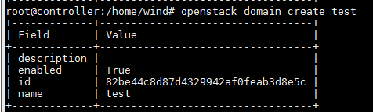
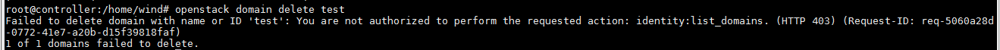

# Define Role

## MỤC LỤC
- [1.Introduction policy.json file](#1)
- [2.Cấu trúc file policy.json](#2)
- [3.Example](#3)


<a name="1"></a>
# 1.Introduction policy.json file
\- Mỗi OpenStack service, Identity, Compute, Networking, và các service khác, có policies của chúng dựa trên role. Xác định user có quyền access objects đó hay không, được defined trong service’s `policy.json` file.  
\- path của file policy.json thương là `/etc/<project>/policy.json`. (project tương ứng với từng project cụ thể)  
\- Bất cứ lúc nào API call to an OpenStack service là được thực hiện, service’s policy engine sử dụng các định nghĩa policy để xác định nếu call được chấp nhận. Bất cứ thay đổi nào trong file `policy.json` là có hiệu quả ngay lập tức, cho phép new policys thực hiện trong khi service đang running.  
\- `policy.json` file là text file in JSON format. Mỗi policy được định nghĩa bởi một dòng statement trong form `"<target>" : "<rule>"` .  
\- policy target, cũng có tên là “action”, tương ứng với một lời gọi API như “start an instance” or “attach a volume”,…etc.  
\- Action names are usually qualified. 	
For example, the Compute service features API calls to list instances, volumes, and networks. In `/etc/nova/policy.json`, these APIs are represented by `compute:get_all`, `volume:get_all`, and `network:get_all`, respectively.  

<a name="2"></a>
# 2.Cấu trúc file policy.json
\- File `policy.json` gồm có policies và aliases của form target:rule hoặc alias:definition, riêng rẽ bởi dấu phấy và đặt trong ngoặc kép.  
\- Cú pháp:  
```
{
       "alias 1" : "definition 1",
       "alias 2" : "definition 2",
       ...
       "target 1" : "rule 1",
       "target 2" : "rule 2",
       ....
}
```

Targets are APIs and are written `"service:API"` or simply `"API"`. For example, `"compute:create"` or `"add_image"`.  
- alias (rule) : đại diện cho một tập role.
- target (action) : đại diện cho lời gọi API như tạo VM, tạo router.
- rule: chỉ ra rule nào được gán

\- Ta role trong file `policy.json` có 2 cách như sau:  
Cách 1:
```
    "rule_1" : "role: role_1"
    "identity:create_user" : "rule: rule_1"
```

Cách 2:  
```
   "identity:create_user" : "role: role_1"
```

Ta có thể định nghĩa 1 hành động này thông qua alias hoặc định nghĩa trực tiếp. Việc định nghĩa thông qua alias sẽ giúp ta định nghĩa ra 1 rule bao gồm nhiều role trong đó.


\- Rules determine whether the API call is allowed.  
Rules can be:  
- always true. The action is always permitted. This can be written as `""` (empty string), `[]`, or `"@"`.
- always false. The action is never permitted. Written as `"!"`.
- a special check
- a comparison of two values
- boolean expressions based on simpler rules

\- Special checks are:  
- `<role>:<role name>`, a test whether the API credentials contain this role.
- `<rule>:<rule name>`, the definition of an alias.
- `http:<target URL>`, which delegates the check to a remote server. The API is authorized when the server returns True.

\- Two values are compared in the following way:  
```
"value1 : value2"
```

Possible values are:  
- constants: Strings, numbers, `true`, `false`
- API attributes
- target object attributes
- the flag is_admin

API attributes can be `project_id`, `user_id` or `domain_id`.  
Target object attributes là fields từ object description trong database. Ví dụ trong trường hợp của `"compute:start"` API, object là instance được started.  
Policy cho việc starting instance có thể sử dụng %(project_id)s attribute, đó là project chứa instance. Kí tự s cho biết đây là 1 string.  
Ví dụ:  
```
"os_compute_api:servers:start" : "project_id:%(project_id)s"
```

`is_admin` indicates that administrative privileges are granted via the admin token mechanism (the --os-token option of the keystone command). The admin token allows initialisation of the Identity database before the admin role exists.  

\- Boolean expressions based on simpler rules:  
Bạn có thể sử các từ `not`, `and`, `or` như ví dụ sau:  
```
"stacks:create": "not role:heat_stack_user"
```

\- The alias construct exists for convenience. An alias is short name for a complex or hard to understand rule. It is defined in the same way as a policy:  
```
alias name : alias definition
```

Once an alias is defined, use the `rule` keyword to use it in a policy rule

\- Example: Policy trong file `/etc/keystone/policy.json` :  
```
"admin_required": "role:admin or is_admin:1",
"owner" : "user_id:%(user_id)s",
"admin_or_owner": "rule:admin_required or rule:owner",
"identity:change_password": "rule:admin_or_owner"
```

The first line defines an alias for “user is an admin user”. The is_admin flag is only used when setting up the Identity service for the first time. It indicates that the user has admin privileges granted by the service token (--os-token parameter of the keystone command line client).  
The second line creates an alias for “user owns the object” by comparing the API’s user ID with the object’s user ID.  
Line 3 defines a third alias admin_or_owner, combining the two first aliases with the Boolean operator or.  
Line 4 sets up the policy that a password can only be modified by its owner or an admin user.  
\- As a final example, let’s examine a more complex rule:  
```
"identity:ec2_delete_credential": "rule:admin_required or
             (rule:owner and user_id:%(target.credential.user_id)s)"
```

This rule determines who can use the Identity API “delete EC2 credential”. Here, boolean operators and parentheses combine three simpler rules. `admin_required` and `owner` are the same aliases as in the previous example. `user_id:%(target.credential.user_id)s` compares the API user with the user ID of the credential object associated with the target.


<a name="3"></a>
# 3.Example
\- Nội dung:  
- Tạo và định nghĩa role `role-test` có quyền create domain.
- Tạo user `user-test` trên domain `default` và gán role `role-test` cho user `role-test` trên project `admin` thuộc domain `default`
- Kiểm tra xem user test có quyền tạo domain hay không?

\- Tạo role `role-test` bằng command:  
```
openstack role create role-test
```

\- Edit file `/etc/keystone/policy.json` , tìm đến dòng :  
```
"identity:create_domain": "rule:admin_required", 
```

và sử thành như sau:  
```
"identity:create_domain": "rule:admin_required or role:role-test",
```

\- Tạo user `user-test` trên domain `default`:  
```
openstack user create user-test --domain default --password test
```

\- Gán role `role-test` cho user `user-test` trên project `admin` thuộc domain `default`:  
```
openstack role add --user user-test --user-domain default --project admin --project-domain default role-test
```

\- Thiết lập environment variable của user test như sau:  
```
export OS_PROJECT_DOMAIN_NAME=Default
export OS_USER_DOMAIN_NAME=Default
export OS_PROJECT_NAME=admin
export OS_USERNAME=user-test
export OS_PASSWORD=test
export OS_AUTH_URL=http://controller:5000/v3
export OS_IDENTITY_API_VERSION=3
```

\- Thử tạo domain bằng user `user-test`:  
```
openstack domain create test
```

Kết quả:  



\- Ta thử delete domain `test`:  
```
openstack domain delete test
```



Kết quả là không thể xóa thì role “test” không quá quyền delete domain.


