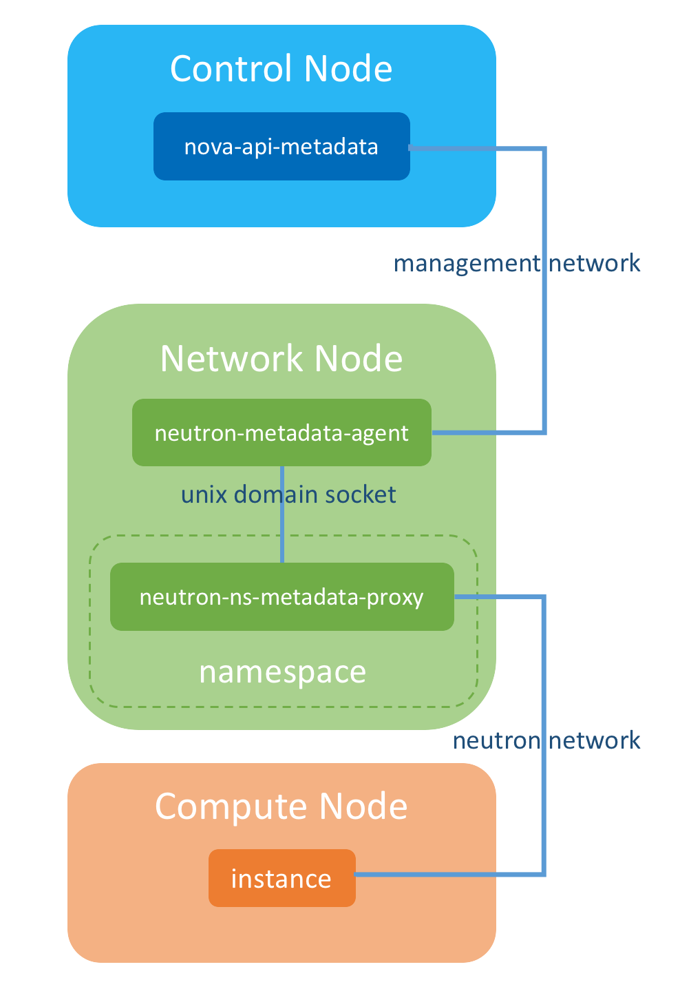

# Metadata service

# MỤC LỤC

# 1.Giới thiệu
\- Như ta đã biết, instance được triển khai thông image chứa hệ điều hành (như Ubuntu 16.04 chẳng hạn), tuy nhiên, khi tạo instance, chúng ta thường muốn cài thêm 1 số cấu hình như: cài 1 số packages, 1 vài services, thêm SSH secret key, cấu hình hostname, etc.  Có 1 vài giải pháp để thực hiện việc này:  
- **1.Đóng tất cả mọi thử vào trong image**  
Tuy nhiên mỗi người lại muốn cấu hình những thứ khác nhau trong image, nên để tạo ra 1 image chung đã được cấu hình mọi thứ cho tất cả mọi người là bất khả thi.  
- **2.Sau khi triển khai được haongf thành, cấu hình thủ công**  
Với số lượng instance từ vài cái đến vài chục cái thì không vấn đề j, nhwung nếu số lượng instances lên đến vài trăm thậm chí vài chục ngàn thì phương pháp này quá tốn thời gian và dễ gây lỗi do cấu hình sai sót.  
- **3.Cung cấp thông tin cấu hình cho mỗi instance bằng cách sử dụng `OpenStack Metadata Service`**  
Khi instance được boot, instance yêu cầu thông tin cấu hình bằng cách gửi request đến `OpenStack Metadata Service`. `OpenStack Metadata Service` sử dụng phần mềm cloud-int (hoặc cloudbase-init) để đưa metadata vào instance. 

**Trong 3 giải pháp trên thì giải pháp thứ 3 là tốt nhất và được dùng trong hệ thống OpenStack.**  
\- Metadata agent cho phép instances để truy cập **cloud-int** meta data và user data thông qua mạng.  
\- Cấu hình cho **Metadata agent** trong file cấu hình `metadata_agent.init`.  
\- Chi tiết: [Configuration Reference](https://docs.openstack.org/ocata/config-reference/networking/networking_options_reference.html#metadata-agent)  

# 2.Các phần mềm của Metadata Service

## 2.1.Nova-api-metadata
\- `Nova-api-metadata` là sub-service của nova-api, nó cung cấp metadata cho instance. Instance có thể thông qua `nova-api-metadata` REST API để lấy thông tin metadata.  
\- `Nova-api-metadata` chạy trên node controller và service port là **8775**.  

## 2.2.Neutron-metadata-agent
\- `Nova-api-metadata` chạy trên node controller,lấy `OpenStack internal management network`, instance không thể trực tiếp truy cập đến metadata service `http: // controller_ip: 8775`, bởi vì có cách rào cản mạng.  
Cấu trả lời là dùng `neutron-metadata-agent` chạy trên trên node network để giải quyết vấn đề này. Instance gửi request metadata đến `neutron-metadata-agent` và `neutron-metadata-agent` chuyển tiếp request đến `nova-api-metadata`.  
\- Vậy làm thế nào để instance gửi request đến `neutron-metadata-agent`.  
Trong thực tế, instance không thể liên lạc trực tiếp với `neutron-metadata-agent`, bởi vì `neutron-metadata-agent` cũng là trên `OpenStack internal management network`. Tuy nhiên, có 2 thành phần khác trên **node network** là `dhcp agent` và `l3 agent`, 2 agent này và instance có thể đặt cùng trong 1 **OpenStack network**, điều này đẫn đến thành phần tiếp theo được sinh ra: `neutron-ns-metadata-proxy`.  

## 2.3.Neutron-ns-metadata-proxy
\- `Neutron-ns-metadata-proxy` được tạo bởi `dhcp-agent` hoặc `l3-agent` (2 thành phần này chạy trên node network).  
\- Nếu `dhcp-agent` được tạo, `neutron-ns-metadata-proxy` chạy trong **namespace dhcp-agent**. Nếu `l3-agent` được tạo, `neutron-ns-metadata-proxy` chạy trên **namespace của neutron router**. `Neutron-ns-metadata-proxy` kết nối trực tếp đến `neutron-metadata-agent` thông qua unix domain socket.  
\- `Neutron-ns-metadata-proxy` nếu chạy trên **namespace dhcp-agent** sẽ lắng nghe trên port 80.  
`Neutron-ns-metadata-proxy` nếu chạy trên **namespace của neutron router** sẽ lắng nghe trên port 9697.  

# Tài liệu tham khảo
- Tham khảo tại: [tài liệu tham khảo](Tai-lieu-tham-khao.md)

