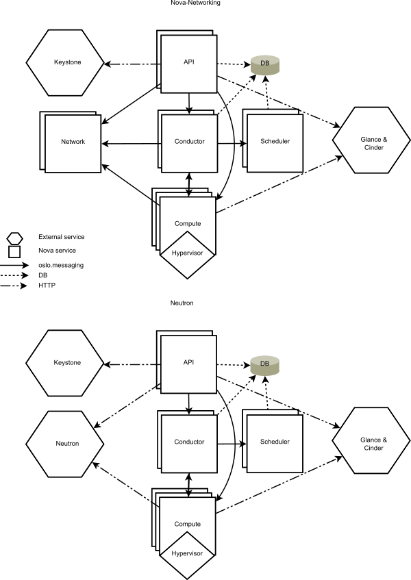

# Giới thiệu về Nova, các dịch vụ và thành phần của Nova

# MỤC LỤC
- [1.Giới thiệu về Nova](#1)
- [2.Các dịch vụ và thành phần của Nova](#2)
  - [2.1.Các dịch vụ của Nova](#2.1)
  - [2.2.Các thành phần của Nova](#2.2)

# 1.Giới thiệu về Nova
\- Nova bao gồm nhiều tiến trình trên server, mỗi tiến trình lại thực hiện một chức năng khác nhau.  
\- Nova cung cấp REST API để tương tác với user, các thành phần bên trong Nova truyền thông với nhau thông qua cơ chế truyền RPC message.  
\- API server xử lý các REST request, thường liên quan đến việc đọc/ghi databases, tùy chọn gửi RPC messages đến các Nova services khác, và tạo ra các trả lời cho REST calls. RPC message thực hiện thông qua thư viện oslo.messaging.  
\- Hầu hết các thành phần chính của Nova có thể chạy trên nhiều server, và có manager lắng nghe RPC messages. Ngoài trừ nova-compute, tiến trình duy nhất chạy trên hypervisor mà nó quản lý( ngoài trừ sử dụng VMware hoặc Ironic drivers).  
\- Nova có thể sử dụng central database được chia sẻ giữa tất các thành phần. Tuy nhiên, để hỗ trợ upgrade, DB được truy cập thông qua một object layer để đảm bảo các thành phần kiểm soát đã upgrade có thể giao tiếp với nova-compute chạy ở phiên bản trước. Để làm điều này, nova-compute ủy quyền các yêu cầu tới DB thông qua RPC tới một trình quản lý trung tâm, chính là dịch vụ nova-conductor.  

# 2.Các dịch vụ và thành phần của Nova
## 2.1.Các dịch vụ của Nova
\- **API server**    
API server là trái tim của cloud framwork, nơi thực hiện các lệnh và điều khiển hypervisor, storage và networking sẵn có đến users.  
API endpoint cơ bản là HTTP web services, xử lý authentication, authorization, và các câu lệnh cơ bản và chức năng điều khiển sử dụng API interface khác nhau của Amazon, Rackspace, và các mô hình liên quan khác. Điều này cho phép sự tương thích API với nhiều bộ tool để tương tác với các vendor khác nhau. Khả năng tương thích rộng này ngăn chặn vấn đề phụ thuộc vào nhà cung cấp dịch vụ.  
\- **Message queue**  
Messaging queue được xem như môi giới tương tác giữa các compute nodes, networking contrllers ( phần mềm điều khiển cơ sở hạ tầng network), API endpoints, scheduler (xác định physical hardware cần phân bố cho tài nguyên ảo) và thành phần tương tự.  
Giao tiếp đến và từ could controller được xử lý bởi HTTP request thông qua nhiều API endpoints.  
Một sự kiện bắt đầu với thông điệp tiêu biểu mà API server nhận được từ yêu cầu của user. API server chứng thực user và đảm bảo user được phép đưa ra lệnh đó. Nếu các object liên quan đến yêu cầu là sẵn có thì yêu cầu sẽ được chuyển đến queuing engine cho những worker liên quan. Workers liên tục lắng nghe quêu dựa trên role của họ. Khi đến lượt yêu cầu được thực hiện, worker phân conng nhiệm vụ và thực hiện yêu cầu đó. Sau khi hoàn thành, phản hồi được gửi đến queue được nhận bởi API server  và chuyển tiếp tới user. Các thao tác truy vấn, nhập và xóa là cần thiết trong quá trình.  
\- **Compute worker**  
Compute worker quản lý computing instance trên host machine. API truyền lệnh đến compute worker để hoàn thành các tác vụ:  
- Run instances
- Delete instances
- Reboot instances
- Attach volumes
- Detach volumes
- Get console output

\- **Network Controller**  
Network Controller quản lý tài quyền networking trên host machine. API server gửi các lệnh thông qua message queue, sau đó được xử lý bởi Network Controllers.  
- Cấp phát fixed IP address
- Cấu hình VLANs cho projects
- Cấu hình network cho compute node

 ## 2.2.Các thành phần của Nova

OpenStack Compute bao gồm các lĩnh vực sau và thành phần của chúng:  
/- **nova-api service:**  
Tiếp nhận và trả lời các compute API call của end user. Service hỗ trợ OpenStack Compute API, Amazon EC2 API, và Admin API đặc biệt cho user thực hiện các tác vụ quản trị. Nó thực hiện một số chính sách và khởi tạo hầu hết các hoạt động điều phối, chẳng hạn như tạo máy ảo,…  
\- **nova-api-metadata service:**  
Tiếp nhận yêu cầu lấy metadata từ instances. nova-api-metadata service được sử dụng khi bạn chạy chế độ mlti-host với nova-network  
\- **nova-compute servece:**  
Một worker daemon quản lý vòng đời máy ảo như tạo, hủy thông qua hypervisor APIs. Ví dụ:  
- XenAPI cho XenServer/XCP
- libvirt cho KVM hoặc QEMU
- VMwareAPI cho VMware

Xử lý các tiến trính là khá phức tạp. Vê cơ bản, daemon chấp nhận hành động từ queue và thwucj hiện một loạt các lệnh hệ thống như khởi tạo một KVM instance và updating trạng thái của nó trong databases.  
\- **nova-placement-api service:**  
\- **nova-scheduler service:**  
Xác virtual machine instance được yêu cầu từ queue sẽ đặt tại compute server nào.  
\- **nova-conductor module:**  
Trung gian tương tác giữa nova-compute service và databases. Nó loại bỏ truy cập trực tiếp vào cloud databases được thực hiện vởi nova-compute service nhằm mục đích bảo mật, tránh trường hợp máy ảo bị xóa mà không có chủ ý của người dùng.  
\- **nova-cert module:**  
Một server daemon phục vụ Nova Cert service cho X509 certificates. Được sử dụng khi tạo certificates cho euca-bundle-image, chỉ cần cho EC2 API.  
\- **nova-consoleauth daemon:**  
Ủy quyền token cho user mà console proxies cung cấp. Dịch vụ này phải chạy với console proxies để làm việc. Nhìn nova-novncproxy và nova-xvpvncproxy.  
\- **nova-novncproxy daemon:**  
Cung cấp proxy cho việc truy cập instance đang chạy thông kết nối VNC. Hỗ trợ browser dựa trên novnc clients.  
\- **nova-spicehtml5proxy daemon:**  
Cung cấp proxy cho việc truy cập instance đang chạy thông qua kết nối SPICE. Hỗ trợ browser dựa trên HTML5 client.  
\- **nova-xvpvncproxy daemon:**
Cung cấp proxy cho việc truy cập instance đang chạy thông qua kết nối VNC. Hỗ trợ OpenStack-specific Java client.  
\- **The queue:**  
Một trung tâm trung chuẩn các thông điệp giữa các daemons. Thường sử dụng RabbitMQ, cũng có thể thực hiện với một AMQP message queue khác là ZeroMQ.  
\- **SQL database:**  
Lưu trữ hầu hết các trạng thái tại buil-time và run-time của cloud infrastructure, bao gồm:  
- Các loại instance đang có sẵn
- Instances đang sử dụng
- Networks có sẵn
- Projects

Về mặt lý thuyết, OpenStack Compute có thể hỗ trợ bất kỳ database nào mà SQLAlchemy hỗ trợ. Database chung là SQLite3 cho công việc kiểm tra và phát triển : MSQL, MariaDB và PostgreSQL.  

