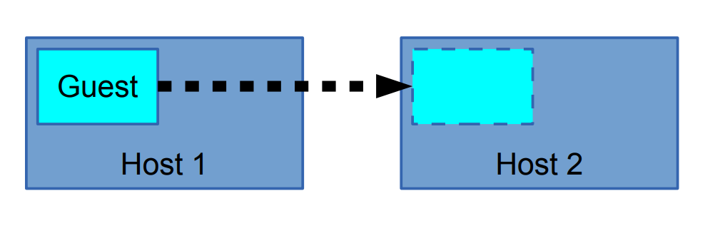
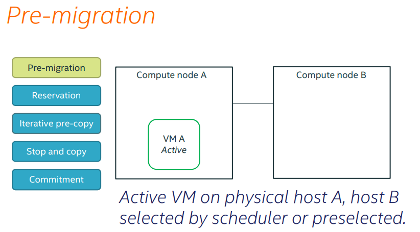
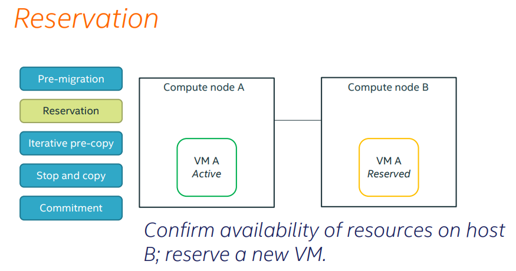
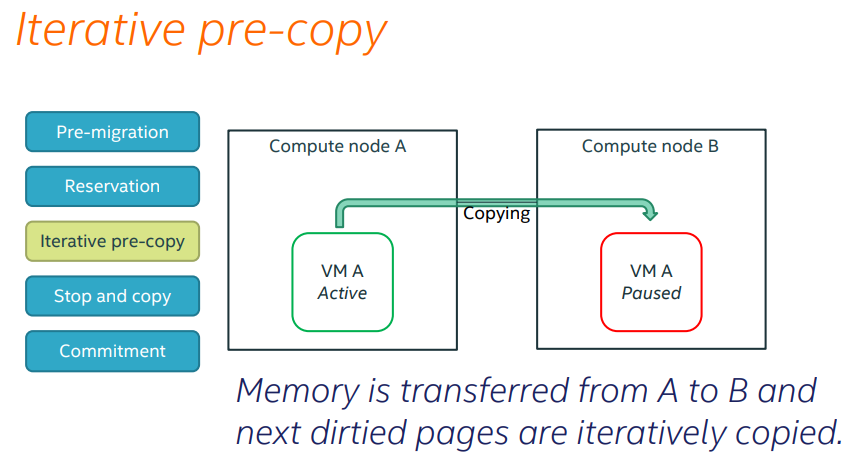
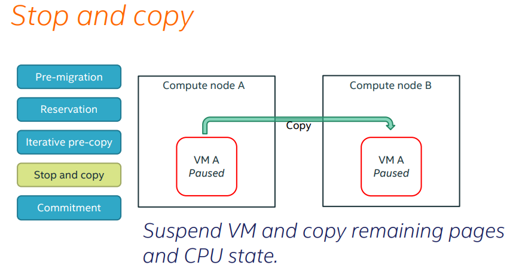
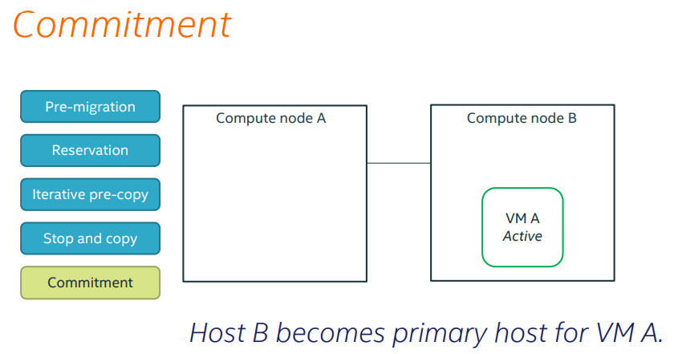
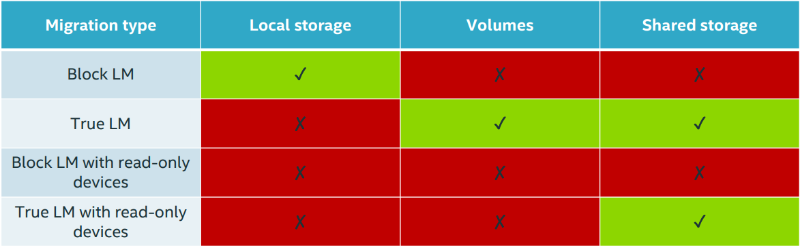
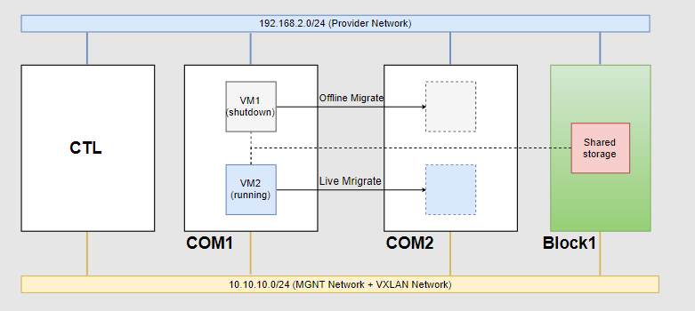

# Migration

# MỤC LỤC
- [1.Giới thiệu về migrate trong OpenStack](#1)
- [2.Các kiểu migrate hiện có trong OPS và workflow của chúng](#2)
	- [2.1.Cool Migrate ( Non-live migrate)](#2.1)
	- [2.2.Live Migration](#2.2)
	- [2.3. So sánh ưu nhược điểm giữa cold và live migrate](#2.3)
- [3.LAB](#3)
	- [3.1.Cool migarte](#3.1)
	- [3.2.Live migrate](#3.2)

<a name="1"></a>
# 1.Giới thiệu về migrate trong OpenStack


Migration là quá trình di chuyển máy ảo từ host vật lí này sang một host vật lí khác. Migration được sinh ra để làm nhiệm vụ bảo trì nâng cấp hệ thống. Ngày nay tính năng này đã được phát triển để thực hiện nhiều tác vụ hơn:  
- Cân bằng tải: Di chuyển VMs tới các host khác kh phát hiện host đang chạy có dấu hiệu quá tải.
- Bảo trì, nâng cấp hệ thống: Di chuyển các VMs ra khỏi host trước khi tắt nó đi.
- Khôi phục lại máy ảo khi host gặp lỗi: Restart máy ảo trên một host khác.

Trong OpenStack, việc migrate được thực hiện giữa các node compute với nhau hoặc giữa các project trên cùng 1 node compute.  

<a name="2"></a>
# 2.Các kiểu migrate hiện có trong OPS và workflow của chúng
OpenStack hỗ trợ 2 kiểu migration đó là:  
- Cold migration : Non-live migration
- Live migration :
  - True live migration (shared storage or volume-based)
  - Block live migration

<a name="2.1"></a>
## 2.1.Cool Migrate ( Non-live migrate)
\- Migrate khác live migrate ở chỗ nó thực hiện migration khi tắt máy ảo ( Libvirt domain không chạy)  
\- Yêu cầu SSH key pairs được triển khai cho user đang chạy nova-compute với mọi hypervisors.  
\- Migrate workflow:  
- Tắt máy ảo ( tương tự “virsh destroy” ) và disconnect các volume.
- Di chuyển thư mục hiện hành của máy ảo ra ngoài ( (instance_dir -> instance_dir_resize). Tiến trình resize instance sẽ tạo ra thư mục tạm thời.
- Nếu sử dụng QCOW2, convert image sang dạng RAW.
- Với hệ thống shared storage, di chuyển thư mục instance_dir mới vào. Nếu không, copy thông qua SCP.

<a name="2.2"></a>
## 2.2.Live Migration
\- Thực hiện bởi câu lệnh "nova live-migration [--block-migrate]"  
\- Có 2 loại live migration: normal migration và “block” migrations.  
\- Normal live migration yêu cầu cả hai source và target hypervisor phải truy cập đến data của instance ( trên hệ thống lưu trữ có chia sẻ, ví dụ: NAS, SAN)  
\- Block migration không yêu cầu đặc biệt gì đối với hệ thống storage. Instance disk được migrated như một phần của tiến trình.  
\- Live migrations là một trong những thao tác vận hành mang tính nhạy cảm nhất liên quan đến phiên bản của QEMU đang chạy trên máy chủ nguồn và đích.  
\- Live Migration Workflow:  
- Kiểm tra storage backend là thích hợp với loại migration hay không:
  - Thực hiện kiểm ta hệ thống shared storage cho normal migrations
  - Thực hiện kiểm tra các yêu cầu cho block migrations
  - Kiểm tra trên cả source và destination, điều phối thông qua RPC calls từ scheduler.
- Trên destination
  - Tạo các kết nối volume cần thiết.
  - Nếu là block migration, tạo thư mục instance, lưu lại các file bị mất từ Glance và tạo instance disk trống.
- Trên source, khởi tạo tiến trình migration.
- Khi tiến trình hoàn tất, tái sinh file Libvirt XML và define nó trên destination.

\- Dưới đây minh họa cho quá trình live migrate VM:  










<a name="2.3"></a>
## 2.3. So sánh ưu nhược điểm giữa cold và live migrate
\- Cold migrate  
- Ưu điểm:
  - Đơn giản, dễ thực hiện
  - Thực hiện được với mọi loại máy ảo
- Hạn chế:
  - Thời gian downtime lớn
  - Không thể chọn được host muốn migrate tới.
  - Quá trình migrate có thể mất một khoảng thời gian dài

\- Live migrate  
- Ưu điểm:
  - Có thể chọn host muốn migrate
  - Tiết kiệm chi phí, tăng sự linh hoạt trong khâu quản lí và vận hành.
  - Giảm thời gian downtime và gia tăng thêm khả năng "cứu hộ" khi gặp sự cố
- Nhược điểm:
  - Dù chọn được host nhưng vẫn có những giới hạn nhất định
  - Quá trình migrate có thể fails nếu host bạn chọn không có đủ tài nguyên.
  - Bạn không được can thiệp vào bất cứ tiến trình nào trong quá trình live migrate.
  - Khó migrate với những máy ảo có dung lượng bộ nhớ lớn và trường hợp hai host khác CPU.

\- Trong live-migrate, có 2 loại đó là True live migration và Block live migration. Hình dưới đây mô tả những loại storage mà 2 loại migration trên hỗ trợ:  


\- Ngữ cảnh sử dụng:  
- Nếu bạn buộc phải chọn host và giảm tối da thời gian downtime của server thì bạn nên chọn live-migrate (tùy vào loại storage sử dụng mà chọn true hoặc block migration)
- Nếu bạn không muốn chọn host hoặc đã kích hoạt configdrive (một dạng ổ lưu trữ metadata của máy ảo, thường được dùng để cung cấp cấu hình network khi không sử dụng DHCP) thì hãy lựa chọn cold migrate.

<a name="3"></a>
# 3.LAB
\- Mô hình  


VM1 có thể lưu trữ file image hoặc là volume trên Block1.  
VM2 có thể lưu trữ file image hoặc là volume trên Block1.  

\- IP Planning:  


<a name="3.1"></a>
## 3.1.Cool migarte
\- Trong OpenStack, cool migrate sử dụng SSH.  
\- Migrate khi VM1 có thể lưu trữ file image hoặc là volume trên Block1 ta làm như sau cho cả 2 trường hợp.  
\- Trên COM1 và COM2 kích hoạt tính năng đăng nhập và thiết lập passwd cho user nova:  
```
# usermod -s /bin/bash nova
# passwd nova
```

Điền passwd cho user `nova`. VD trong trường hợp này là `son123456`.  
\- Trên COM1  
- Chuyển sang user nova:  
```
# su - nova
```

- Sinh key pair:  
```
nova@compute1:~$ ssh-keygen -t rsa
Generating public/private rsa key pair.
Enter file in which to save the key (/var/lib/nova/.ssh/id_rsa): 
Created directory '/var/lib/nova/.ssh'.
Enter passphrase (empty for no passphrase): 
Enter same passphrase again: 
Your identification has been saved in /var/lib/nova/.ssh/id_rsa.
Your public key has been saved in /var/lib/nova/.ssh/id_rsa.pub.
The key fingerprint is:
SHA256:6zHZGpZfzWkowt9f+gukp968N2caJ/7HTp4YYMztZ7I nova@compute1
The key's randomart image is:
+---[RSA 2048]----+
|                 |
|                 |
|                 |
|          o .    |
|        S  = o   |
|       . =. =+ . |
|        @ o.o*B++|
|       o O +=oO@*|
|        o +o.EBOX|
+----[SHA256]-----+
```

- Cấu hình SSH không kiểm tra host khi ssh:  
```
echo 'StrictHostKeyChecking no' >> /var/lib/nova/.ssh/config
```

- Thay đổi quyền thư mục `.ssh`, các file bên trong và quyền hạn của các user đối với file `id_rsa` và `authorized_keys` :  
```
chown -R nova:nova /var/lib/nova/.ssh/
chmod 600 /var/lib/nova/.ssh/id_rsa /var/lib/nova/.ssh/authorized_keys
```

- Thực hiện copy public key sang node COM2:  
```
ssh-copy-id -i /var/lib/nova/.ssh/id_rsa nova@compute2
```

Điển password.  

- Đảm bảo user nova có thể login vào user nova node COM2 mà không sử dụng password:  
```
ssh nova@compute2
```

\- Trên cả COM1 và COM2:  
```
# systemctl restart libvirtd
# systemctl restart nova-compute
```

\- Trên COM1:  
- Shutdown VM1:  
```
openstack server stop VM1
```

- Migrate VM1 trên COM1 sang COM2:  
```
openstack server migrate VM1
```

- Chờ đến khi VM1 thay đổi trạng thái sang `VERIFY_RESIZE` (dùng `openstack server show` để xem), confirm việc migrate :  
```
openstack server resize --confirm VM1
```

- Nếu muốn migrate từ VM1 từ COM2 sang COM1, ta làm tương tự như trên trên node COM2.  
- Chú ý:  
  - Bản chất ssh, SSH sẽ mặc định thử dùng file `~/.ssh/id_rsa` ( nếu cặp key pair dụng thuật toán rsa) để ssh sang <user>@<hostname> ta muốn login. Nên khi có 2 node COM, ta có thể cấu hình dùng 2 key pair khác nhau trên mỗi COM.
Nhưng nếu có nhiều hơn 2 node COM, ta không thể làm như thế được. Lúc này, ta sẽ dùng chung 1 key pair cho tất cả các node COM.
  - Nếu VM1 đang running, ta vẫn có thể thực hiện cool migrate. (Bản chất của việc này, VM1 sẽ tự động được shutdown và di chuyển sang host mới, sau đó được start).

<a name="3.2"></a>
## 3.2.Live migrate
\- OpenStack hỗ trợ 2 loại live migrate, mỗi loại lại có yêu cầu và được sử dụng với mục đích riêng:  
- True live migration (shared storage or volume-based) : Trong trường hợp này, máy ảo sẽ được di chuyển sửa dụng storage mà cả hai máy computes đều có thể truy cập tới. Nó yêu cầu máy ảo sử dụng block storage hoặc shared storage.
- Block live migration : Mất một khoảng thời gian lâu hơn để hoàn tất quá trình migrate bởi máy ảo được chuyển từ host này sang host khác. Tuy nhiên nó lại không yêu cầu máy ảo sử dụng hệ thống lưu trữ tập trung.

\- Các yêu cầu chung:  
- Cả hai node nguồn và đích đều phải được đặt trên cùng subnet và có cùng loại CPU.
- Cả controller và compute đều phải phân giải được tên miền của nhau.

\- Trong OpenStack, live migrate sử dụng libvritd thông qua TCP port 16509.  
\- Live migrate khi VM2 có thể lưu trữ file image hoặc là volume trên Block1 ta làm như sau cho cả 2 trường hợp.  
\- Trên COM2:  
- Mở file vi `/etc/libvirt/libvirtd.conf`. Uncomment và chỉnh sửa lại các dòng với giá trị như dưới đây:  
```
[...]
listen_tls = 0
listen_tcp = 1
listen_addr = "0.0.0.0"
tcp_port = "16509"
auth_tcp = "none"
```

- Mở file vi `/etc/default/libvirtd`. Chỉnh sửa lại như sau:  
```
[...]
libvirtd_opts="-l -d"
```

- Restart lại các dịch vụ:  
```
systemctl restart libvirtd
systemctl restart nova-compute
```

\- Live migrate VM2 từ COM1 sang COM2  
- Nếu VM2 lưu trữ dạng file image:  
```
openstack server migrate --live compute2 --block-migration VM1
```

- Nếu VM2 lưu trữ dạng volume trên Block1:  
```
openstack server migrate --live compute2 VM2
```

\- Nếu muốn chuyển VM2 từ COM1 sang COM2, ta làm tương tự như trên.  


